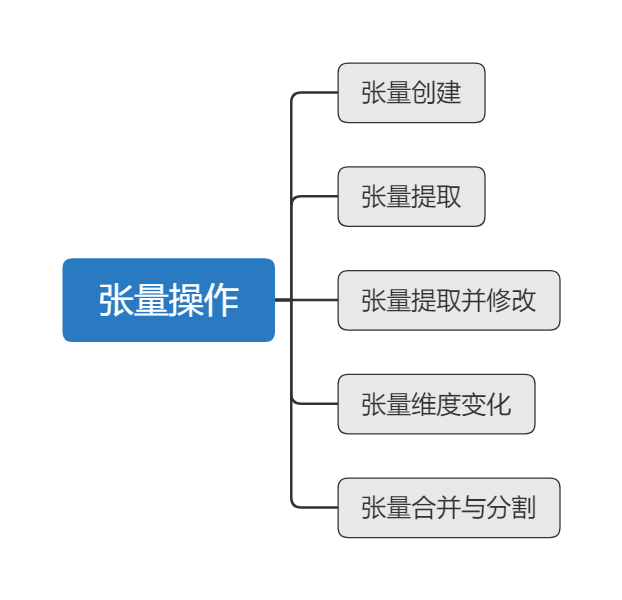

# 张量创建

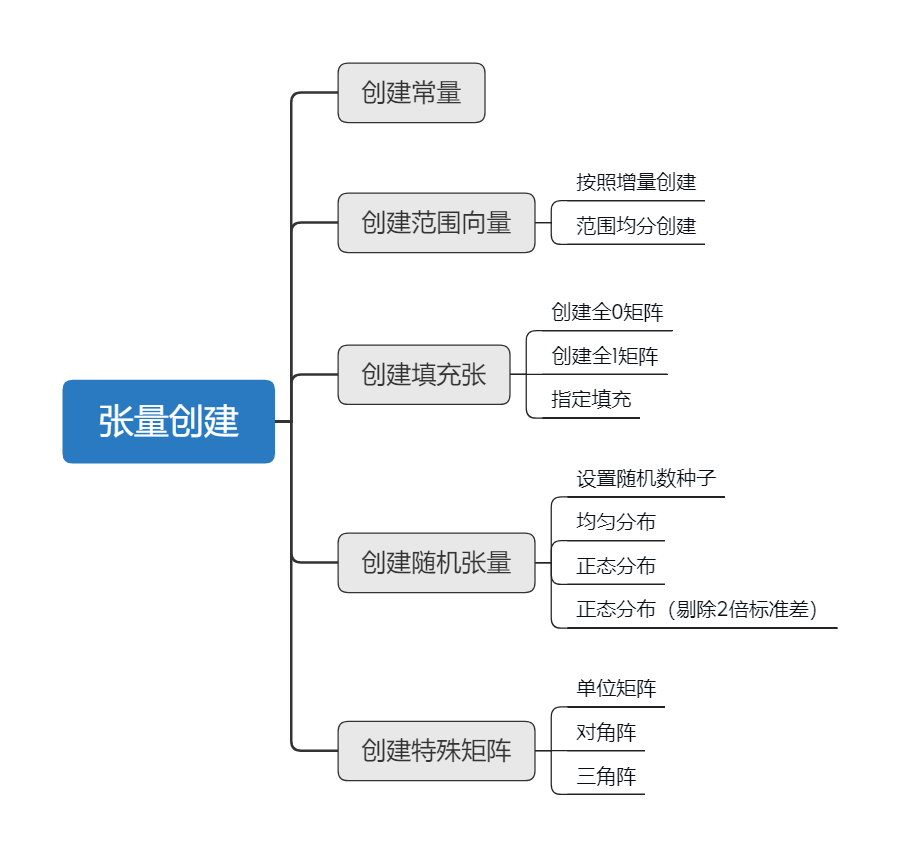

## 创建常量

```python
import tensorflow as tf
import numpy as np
```

```python
a = tf.constant([1,2,3],dtype = tf.float32)
tf.print(a)
```

```
[1 2 3]
```

## 创建范围张量

### 按照增量创建

从start开始，每次递增delta。这个函数**只能创建向量**

```python
a = tf.range(start=1, limit=10, delta=2)
tf.print(a)
```

```
[1 3 5 7 9]
```

**注意**：生成的向量**不包括**limit

```
a = tf.range(1, 3, delta=1)
tf.print(a)
```

```
[1 2]
```


### 范围均分创建

num = 3 就代表把[start, stop]分成num-1 = 2份。

会包括start和stop

```python
a = tf.linspace(start=1, stop=3, num=3)
tf.print(a)
```

```
[1 2 3]
```

还可以对多个范围同时进行均分创建

```python
tf.linspace([0., 5.], [10., 40.], 5, axis=0)
```

```
<tf.Tensor: shape=(5, 2), dtype=float32, numpy=
array([[ 0.  ,  5.  ],
       [ 2.5 , 13.75],
       [ 5.  , 22.5 ],
       [ 7.5 , 31.25],
       [10.  , 40.  ]], dtype=float32)>
```

## 创建填充张量

### 全0填充

```python
a = tf.zeros([2,3])
tf.print(a)
```

```
[[0 0 0]
 [0 0 0]]
```


### 全1填充

```python
a = tf.ones([3,2])
tf.print(a)
```

```
[[1 1]
 [1 1]
 [1 1]]
```

### 指定填充

```python
a = tf.fill([3, 3], 2)
tf.print(a)
```

```
[[2 2 2]
 [2 2 2]
 [2 2 2]]
```

## 创建随机张量

### 设置随机数种子

```python
tf.random.set_seed(2021)
```

### 均匀分布随机

shape参数必须是一个**一维列表**

```python
a = tf.random.uniform(shape=[3])
tf.print(a)
```

```
[0.786967039 0.976694584 0.180886149]
```

可以设置**上下限**

```python
a = tf.random.uniform(shape=[3], minval=2, maxval=10)
tf.print(a)
```

```
[8.14705086 5.28997421 6.93613434]
```

可以通过设置dtype参数把张量变成**整数**

```python
a = tf.random.uniform(shape=[3,2], minval=0, maxval=5, dtype="int32")
tf.print(a)
```

```
[[1 3]
 [4 1]
 [3 2]]
```

### 正态分布随机

创建一个均值为0方差为1的张量

```python
a = tf.random.normal([3,3],mean=0.0,stddev=1.0)
tf.print(a)
```

```
[[-0.581647515 1.14878035 0.206222773]
 [1.29520845 0.638148069 -1.29650426]
 [0.236176461 -0.625791073 1.29043186]]
```

### 正态分布随机（剔除2倍标准差）

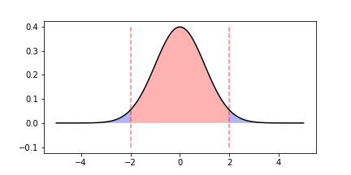

如上图，只会在中间部分产生随机数，剔除掉了2倍标准差之外的数据（标准正态分布标准差为1）

```python
a = tf.random.truncated_normal((3,3), dtype=tf.float32)
tf.print(a)
```

```
[[-0.0492457859 -1.26795757 -0.211222678]
 [-1.95127463 -0.428276658 0.273104608]
 [-1.72938526 -0.85203594 1.47672641]]
```

## 创建特殊矩阵

### 单位矩阵

```python
a = tf.eye(3, 3)
tf.print(a)
```

```
[[1 0 0]
 [0 1 0]
 [0 0 1]]
```

可以不是方阵

```python
a = tf.eye(2, 3)
tf.print(a)
```

```
[[1 0 0]
 [0 1 0]]
```

### 对角阵

```python
a = tf.linalg.diag([1,2,3]) #对角阵
tf.print(a)
```

```
[[1 0 0]
 [0 2 0]
 [0 0 3]]
```

### 三角阵

```python
a = tf.ones([3, 3])
b = tf.linalg.band_part(a, num_lower=0, num_upper=-1)
tf.print(b)
```

```
[[1 1 1]
 [0 1 1]
 [0 0 1]]
```

num_lower=0，表示下三角全都不保留（不保留的部分用0填充）

num_upper=-1，表示上三角全都保留

如果num_lower=1，会从对角线开始往下算起，保留**一条**斜对角线上的元素。

```python
a = tf.ones([3, 3])
b = tf.linalg.band_part(a, num_lower=1, num_upper=-1)
tf.print(b)
```

```
[[1 1 1]
 [1 1 1]
 [0 1 1]]
```

# 张量提取

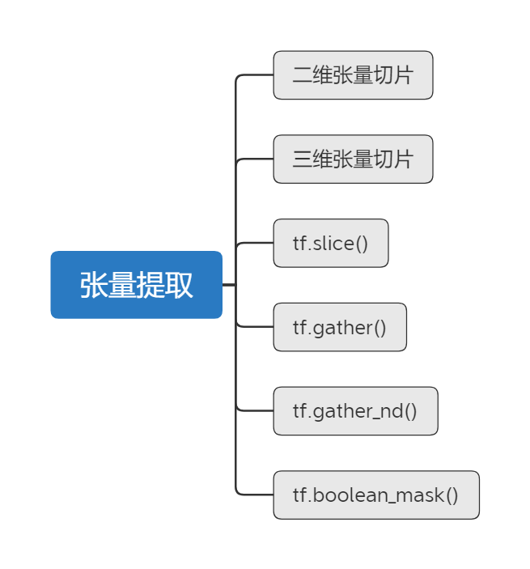

## 二维张量切片

首先先创建一个公用的2维张量，用于演示

```python
import tensorflow as tf

a = tf.constant([[ 0,  1,  2,  3],
                 [ 4,  5,  6,  7],
                 [ 8,  9, 10, 11],
                 [12, 13, 14, 15]])
```

和numpy切片方式非常接近，2维张量由行、列组成。下面分别演示

### 选择单个元素

选择第1行，第2列的元素


```python
a[1, 2]  # 效果同 a[1][2]
```

```
<tf.Tensor: shape=(), dtype=int32, numpy=6>
```

### 选择单行

选择第1行（从第0行开始算起）

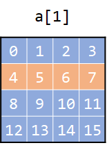

```python
a[1]
```

```
<tf.Tensor: shape=(4,), dtype=int32, numpy=
array([ 4,  5, 6, 7])>
```

### 选择多行

选择第1到第3行之间的元素（不包括第3行）


```
a[1:3]
```

```
<tf.Tensor: shape=(2, 4), dtype=int32, numpy=
array([[ 4,  5,  6,  7],
       [ 8,  9, 10, 11]])>
```

### 负数索引

选择最后一行的元素


```python
a[-1]
```

```
<tf.Tensor: shape=(4,), dtype=int32, numpy=
array([12, 13, 14, 15])>
```


### 选择单列

选择第2列


```python
a[:, 2]
```

```
<tf.Tensor: shape=(4,), dtype=int32, numpy=
array([ 2,  6, 10, 14])>
```


### 选择多列

选择第0列到第2列之间的列（不包括第2列）

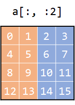

```python
a[:, :2]  # 效果同 a[:, 0:2]
```

```
<tf.Tensor: shape=(4, 2), dtype=int32, numpy=
array([[ 0,  1],
       [ 4,  5],
       [ 8,  9],
       [12, 13]])>
```

### 同时选择行列

选择第1到第3行 第0到第2列的元素

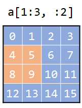

```python
a[1:3, :2]
```

```
<tf.Tensor: shape=(2, 2), dtype=int32, numpy=
array([[4, 5],
       [8, 9]])>
```

### 总结

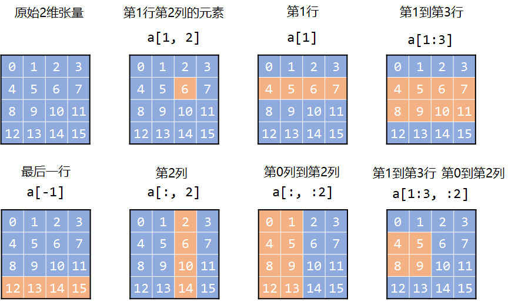

## 三维张量切片

为了方便可视化，这里以**3维张**量作为演示，其实一般用到4维已经算多的了，而且多维张量切片其实跟2维也差不多。

```python
import tensorflow as tf

a = tf.constant([[[ 0,  1,  2,  3],
                  [ 4,  5,  6,  7],
                  [ 8,  9, 10, 11]],

                 [[12, 13, 14, 15],
                  [16, 17, 18, 19],
                  [20, 21, 22, 23]],
                
                 [[24, 25, 26, 27],
                  [28, 29, 30, 31],
                  [32, 33, 34, 35]],])
```

可以把3维张量理解为多个2维张量的叠加，这里深度是3，就表示有3个2维张量叠加。

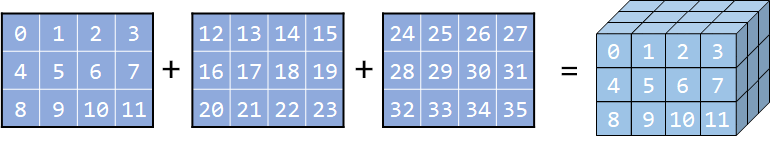

### 选择指定元素

```python
a[0][1][2]  # 同 a[0, 1, 2]
# <tf.Tensor: shape=(), dtype=int32, numpy=6>
```

```python
a[1][1][2]  # 同 a[1, 1, 2]
# <tf.Tensor: shape=(), dtype=int32, numpy=18>
```

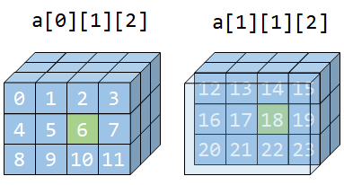

### 单轴索引

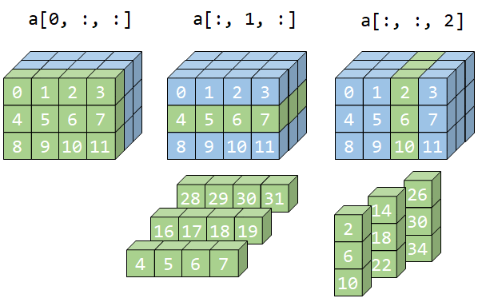

```python
# 第0轴
a[0, :, :]  # 效果同a[0]
```

```
<tf.Tensor: shape=(3, 4), dtype=int32, numpy=
array([[ 0,  1,  2,  3],
       [ 4,  5,  6,  7],
       [ 8,  9, 10, 11]])>
```

```python
# 第1轴
a[:, 1, :]  # 效果同a[0]
```

```
<tf.Tensor: shape=(3, 4), dtype=int32, numpy=
array([[ 4,  5,  6,  7],
       [16, 17, 18, 19],
       [28, 29, 30, 31]])>
```

```python
# 第2轴
a[:, :, 2]  # 效果同a[..., 2]
```

```
<tf.Tensor: shape=(3, 3), dtype=int32, numpy=
array([[ 2,  6, 10],
       [14, 18, 22],
       [26, 30, 34]])>
```

> 可以用省略号“ `...`“号表示连续的冒号“ `:` “
>
> `a[:, :, 2]`与`a[..., 2]`效果一致


### 多轴索引

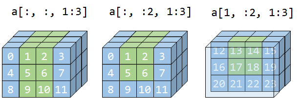

```python
a[:, :, 1:3]
```

```
<tf.Tensor: shape=(3, 3, 2), dtype=int32, numpy=
array([[[ 1,  2],
        [ 5,  6],
        [ 9, 10]],

       [[13, 14],
        [17, 18],
        [21, 22]],

       [[25, 26],
        [29, 30],
        [33, 34]]])>
```

```python
a[:, :2, 1:3]
```

```
<tf.Tensor: shape=(3, 2, 2), dtype=int32, numpy=
array([[[ 1,  2],
        [ 5,  6]],

       [[13, 14],
        [17, 18]],

       [[25, 26],
        [29, 30]]])>
```

```python
a[1, :2, 1:3]
```

```
<tf.Tensor: shape=(2, 2), dtype=int32, numpy=
array([[13, 14],
       [17, 18]])>
```

### 总结


## tf.slice()

其实跟索引切片差不多，主要理解begin 和 size 参数即可

```python
tf.slice(input_, begin, size, name=None)
```

- input_是要切片的张量
- begin 是初始定位点
- size 是从该点开始，要切片的大小

### 二维

比如，一个4 x 4的二维张量，begin=[1, 1]，size=[2, 2] 就表示从点(1, 1) 开始切出一个 2 x 2 大小的2维子张量。如图：

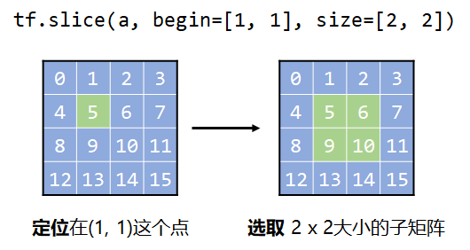

代码：

```python
import tensorflow as tf

a = tf.constant([[ 0,  1,  2,  3],
                 [ 4,  5,  6,  7],
                 [ 8,  9, 10, 11],
                 [12, 13, 14, 15]])

# 相当于 a[1:3, 1:3]
tf.slice(a, begin=[1, 1], size=[2, 2])
```

```
<tf.Tensor: shape=(2, 2), dtype=int32, numpy=
array([[ 5,  6],
       [ 9, 10]])>
```

### 三维

比如，一个3 x 3 x 4的三维张量，begin=[0, 0, 2]，size=[2, 2, 2] 就表示从点(0, 1, 1) 开始切出一个 2 x 2 x 2 大小的3维子张量。如图：

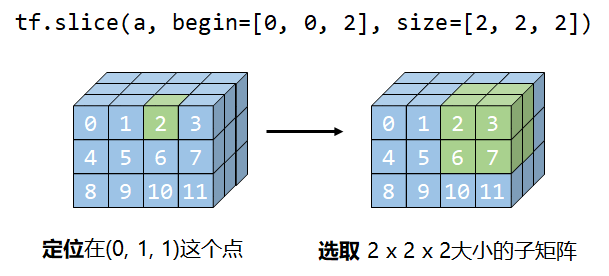

代码：

```python
import tensorflow as tf

a = tf.constant([[[ 0,  1,  2,  3],
                  [ 4,  5,  6,  7],
                  [ 8,  9, 10, 11]],

                 [[12, 13, 14, 15],
                  [16, 17, 18, 19],
                  [20, 21, 22, 23]],
                
                 [[24, 25, 26, 27],
                  [28, 29, 30, 31],
                  [32, 33, 34, 35]],])

# 相当于 a[:2, :2, 2:4]
tf.slice(a, begin=[0, 0, 2], size=[2, 2, 2])
```

```
<tf.Tensor: shape=(2, 2, 2), dtype=int32, numpy=
array([[[ 2,  3],
        [ 6,  7]],

       [[14, 15],
        [18, 19]]])>
```

## tf.gather()

```python
tf.gather(params, indices, axis=None)
```

主要就是上面3个参数，其他参数略

- params：要操作的张量tensor
- indices：填数组，一维或多维数组
- axis：根据哪个轴取数，默认为0

特点是可以**跨值取索引**，可以**重复取索引**

### 二维

先从简单的二维数组开始，axis=0代表按行取数，axis=1代表按列取数

```python
import tensorflow as tf

a = tf.constant([[ 0,  1,  2,  3],
                 [ 4,  5,  6,  7],
                 [ 8,  9, 10, 11],
                 [12, 13, 14, 15]])
```

**按行取数**

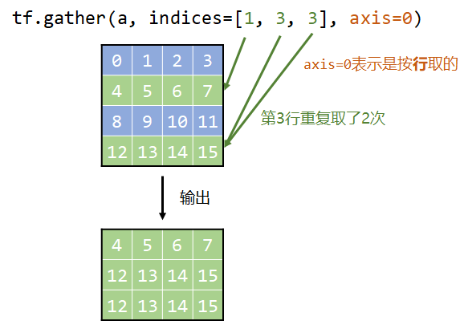

```python
tf.gather(a, indices=[1, 3, 3], axis=0)
```

```
<tf.Tensor: shape=(3, 4), dtype=int32, numpy=
array([[ 4,  5,  6,  7],
       [12, 13, 14, 15],
       [12, 13, 14, 15]])>
```

如果填写重复的索引，就会取两次

**按列取数**


```python
tf.gather(a, indices=[0, 2], axis=1)
```

```
<tf.Tensor: shape=(4, 2), dtype=int32, numpy=
array([[ 0,  2],
       [ 4,  6],
       [ 8, 10],
       [12, 14]])>
```

**indices是2维数组的情况**

indices是1维时，取出的张量维度和原张量维度一致（都是2维的）

indices是2维时，取出的张量维度会**加1**（输出变成**3维张量**）

比如下面的`tf.gather(a, indices=[[1, 3], [0, 2]], axis=0)`

相当于对原张量分别进行了`tf.gather(a, [1, 3], axis=0)`和`tf.gather(a, [0, 2], axis=0)`

然后把结果**拼接**成3维张量

> 假设原张量维度为 d，indices维度为 x，那输出的张量维度就是：d + x  - 1
>
> indices是2维以上的情况其实并不多见，实际上就是继续拼接，也比较简单，这里就不再展示了。


```python
tf.gather(a, indices=[[1, 3], [0, 2]], axis=0)
```

```
<tf.Tensor: shape=(2, 2, 4), dtype=int32, numpy=
array([[[ 4,  5,  6,  7],
        [12, 13, 14, 15]],

       [[ 0,  1,  2,  3],
        [ 8,  9, 10, 11]]])>
```

### 三维

```python
import tensorflow as tf

a = tf.constant([[[ 0,  1,  2,  3],
                  [ 4,  5,  6,  7],
                  [ 8,  9, 10, 11]],

                 [[12, 13, 14, 15],
                  [16, 17, 18, 19],
                  [20, 21, 22, 23]],
                
                 [[24, 25, 26, 27],
                  [28, 29, 30, 31],
                  [32, 33, 34, 35]]])
```

**3维张量与2维张量索引的区别**

在2维张量的例子中，一个索引对应着一个1维张量（向量），而**对于3维张量，一个索引对应一个2维张量**（矩阵）

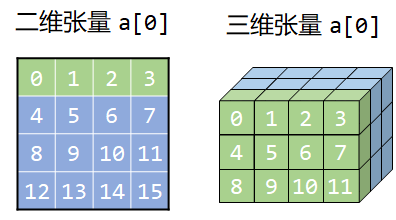

**不同axis的输出变化**


```python
tf.gather(a, indices=[0, 2], axis=0)
```

```
<tf.Tensor: shape=(1, 2, 3, 4), dtype=int32, numpy=
array([[[[ 0,  1,  2,  3],
         [ 4,  5,  6,  7],
         [ 8,  9, 10, 11]],

        [[24, 25, 26, 27],
         [28, 29, 30, 31],
         [32, 33, 34, 35]]]])>
```


```python
tf.gather(a, indices=[0, 2], axis=1)
```

```
<tf.Tensor: shape=(3, 2, 4), dtype=int32, numpy=
array([[[ 0,  1,  2,  3],
        [ 8,  9, 10, 11]],

       [[12, 13, 14, 15],
        [20, 21, 22, 23]],

       [[24, 25, 26, 27],
        [32, 33, 34, 35]]])>
```

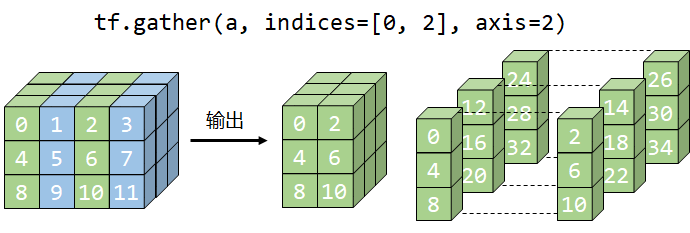

```python
tf.gather(a, indices=[0, 2], axis=2)
```

```
<tf.Tensor: shape=(3, 3, 2), dtype=int32, numpy=
array([[[ 0,  2],
        [ 4,  6],
        [ 8, 10]],

       [[12, 14],
        [16, 18],
        [20, 22]],

       [[24, 26],
        [28, 30],
        [32, 34]]])>
```

## tf.gather_nd()

```python
tf.gather_nd(params, indices)
```

与`tf.gather()`类似，也是根据indices取到的元素进行拼接。

与`tf.gather()`不同的是，indices中每个元素表示的意义不同，`tf.gather`中一个数字对应的是一个向量或一个矩阵。

而`tf.gather_nd()`中indices的一个元素代表对params取索引。先用二维的例子讲解这一点

### 二维

```python
import tensorflow as tf

a = tf.constant([[ 0,  1,  2,  3],
                 [ 4,  5,  6,  7],
                 [ 8,  9, 10, 11],
                 [12, 13, 14, 15]])
```

```python
tf.gather_nd(a, indices=[[1], [3]])
```

```
<tf.Tensor: shape=(2, 4), dtype=int32, numpy=
array([[ 4,  5,  6,  7],
       [12, 13, 14, 15]])>
```

相当于取`a[1]` 和 `a[3]` 然后再拼接到一起


```python
tf.gather_nd(a, indices=[[0, 0], [1, 1], [2, 2]])
```

```
<tf.Tensor: shape=(3,), dtype=int32, numpy=array([ 0,  5, 10])>
```

相当于取`a[0, 0]`，`a[1, 1]`，`a[2, 2]`然后拼接到一起

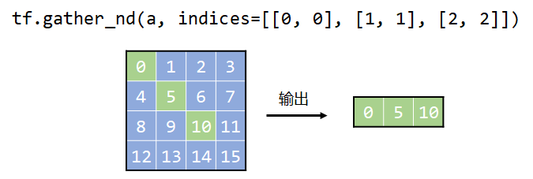

### 三维

```python
import tensorflow as tf

a = tf.constant([[[ 0,  1,  2,  3],
                  [ 4,  5,  6,  7],
                  [ 8,  9, 10, 11]],

                 [[12, 13, 14, 15],
                  [16, 17, 18, 19],
                  [20, 21, 22, 23]],
                
                 [[24, 25, 26, 27],
                  [28, 29, 30, 31],
                  [32, 33, 34, 35]]])
```

```python
tf.gather_nd(a, indices=[[0], [2]])
```

```
<tf.Tensor: shape=(2, 3, 4), dtype=int32, numpy=
array([[[ 0,  1,  2,  3],
        [ 4,  5,  6,  7],
        [ 8,  9, 10, 11]],

       [[24, 25, 26, 27],
        [28, 29, 30, 31],
        [32, 33, 34, 35]]])>
```

相当于取`a[0]`和`a[2]`然后拼接

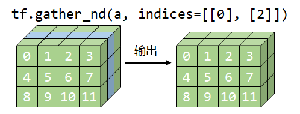

```
tf.gather_nd(a, indices=[[0, 1], [1, 2]])
```

```
<tf.Tensor: shape=(2, 4), dtype=int32, numpy=
array([[ 4,  5,  6,  7],
       [20, 21, 22, 23]])>
```

相当于取`a[0, 1, :]`和`a[1, 2, :]`然后拼接


```python
tf.gather_nd(a, indices=[[0, 0, 0], [0, 1, 0],
                         [1, 1, 2], [2, 2, 3]])
```

```
<tf.Tensor: shape=(4,), dtype=int32, numpy=
array([ 0,  4, 18, 35])>
```


## tf.boolean_mask()

```python
tf.boolean_mask(tensor, mask, axis)
```

- tensor：要取数的张量
- mask：由True和False组成的数组，维度不能超过tensor的维度
- axis：在哪个轴上操作

这个函数与`tf.gather`的功能比较相似

只不过不能取重复的索引，但是可以**跨值取索引**

### 一维

```python
import tensorflow as tf
a = tf.constant([0, 1, 2, 3])
```

```python
tf.boolean_mask(a, [0, 1, 0, 1])
```

```
<tf.Tensor: shape=(2,), dtype=int32, numpy=array([1, 3])>
```

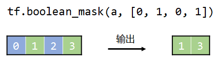

### 二维

```python
import tensorflow as tf

a = tf.constant([[ 0,  1,  2,  3],
                 [ 4,  5,  6,  7],
                 [ 8,  9, 10, 11]])
```

```python
# 按行取数
tf.boolean_mask(a, mask=[0, 1, 1], axis=0)
```

```
<tf.Tensor: shape=(2, 4), dtype=int32, numpy=
array([[ 4,  5,  6,  7],
       [ 8,  9, 10, 11]])>
```

```python
# 按列取数
tf.boolean_mask(a, mask=[0, 1, 0, 1], axis=1)
```

```
<tf.Tensor: shape=(3, 2), dtype=int32, numpy=
array([[ 1,  3],
       [ 5,  7],
       [ 9, 11]])>
```


```python
# mask是2维的情况
tf.boolean_mask(a, mask=[[1, 0, 0, 0], 
                         [0, 1, 0, 0], 
                         [0, 0, 1, 0]])
```

```
<tf.Tensor: shape=(3,), dtype=int32, numpy=
array([ 0,  5, 10])>
```


### 三维

```python
import tensorflow as tf

a = tf.constant([[[ 0,  1,  2,  3],
                  [ 4,  5,  6,  7],
                  [ 8,  9, 10, 11]],

                 [[12, 13, 14, 15],
                  [16, 17, 18, 19],
                  [20, 21, 22, 23]],
                
                 [[24, 25, 26, 27],
                  [28, 29, 30, 31],
                  [32, 33, 34, 35]]])
```

#### mask是1维

**不同的axis对应的输出**

```python
# axis=0
tf.boolean_mask(a, mask=[1, 0, 1], axis=0)
```

```
<tf.Tensor: shape=(2, 3, 4), dtype=int32, numpy=
array([[[ 0,  1,  2,  3],
        [ 4,  5,  6,  7],
        [ 8,  9, 10, 11]],

       [[24, 25, 26, 27],
        [28, 29, 30, 31],
        [32, 33, 34, 35]]])>
```


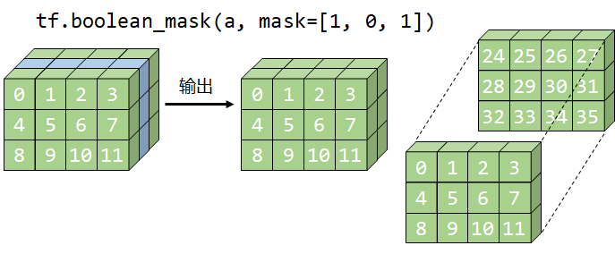


```python
# axis=1
tf.boolean_mask(a, mask=[1, 0, 1], axis=1)
```

```
<tf.Tensor: shape=(3, 2, 4), dtype=int32, numpy=
array([[[ 0,  1,  2,  3],
        [ 8,  9, 10, 11]],

       [[12, 13, 14, 15],
        [20, 21, 22, 23]],

       [[24, 25, 26, 27],
        [32, 33, 34, 35]]])>
```

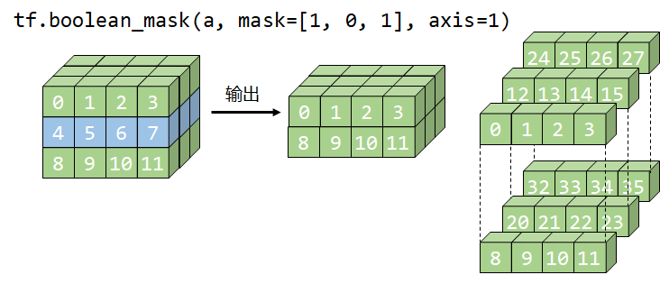

```python
# axis=2
tf.boolean_mask(a, mask=[1, 0, 1, 0], axis=2)
```

```
<tf.Tensor: shape=(3, 3, 2), dtype=int32, numpy=
array([[[ 0,  2],
        [ 4,  6],
        [ 8, 10]],

       [[12, 14],
        [16, 18],
        [20, 22]],

       [[24, 26],
        [28, 30],
        [32, 34]]])>
```

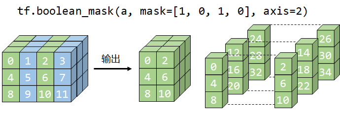

#### mask是2维

```python
# axis=0
tf.boolean_mask(a, mask=[[1, 0, 0], [0, 1, 0], [0, 0, 1]], axis=0)
```

```
<tf.Tensor: shape=(3, 4), dtype=int32, numpy=
array([[ 0,  1,  2,  3],
       [16, 17, 18, 19],
       [32, 33, 34, 35]])>
```


```python
# axis=1
tf.boolean_mask(a, mask=[[1, 0, 0, 0], [0, 1, 0, 0], [0, 0, 1, 0]], axis=1)
```

```
<tf.Tensor: shape=(3, 3), dtype=int32, numpy=
array([[ 0,  5, 10],
       [12, 17, 22],
       [24, 29, 34]])>
```

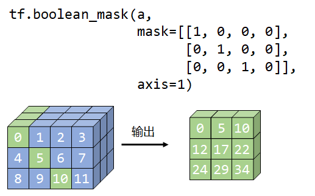

张量为3维，axis=2时，**不支持mask2维及以上**。

#### mask是3维

只有axis=0时，mask才可以是3维的

```python
tf.boolean_mask(a, mask=[[[1, 0, 0, 0],
                          [1, 0, 0, 0],
                          [0, 0, 0, 0]],

                         [[0, 0, 0, 0],
                          [0, 0, 1, 0],
                          [0, 0, 0, 0]],

                         [[0, 0, 0, 0],
                          [0, 0, 0, 0],
                          [0, 0, 0, 1]]])
```

```
<tf.Tensor: shape=(4,), dtype=int32, numpy=
array([ 0,  4, 18, 35])>
```

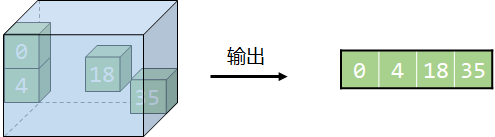

### 布尔索引

找到所有的偶数

```python
tf.boolean_mask(a, a % 2 ==0)
```

```
<tf.Tensor: shape=(18,), dtype=int32, numpy=
array([ 0,  2,  4,  6,  8, 10, 12, 14, 16, 18, 20, 22, 24, 26, 28, 30, 32,
       34])>
```

# 张量提取并修改

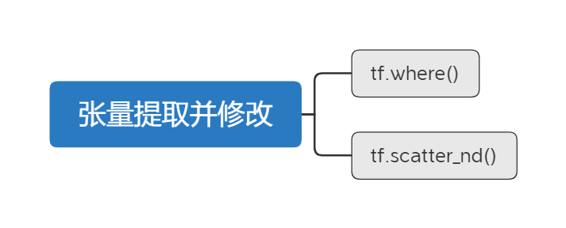

## tf.where()

```
tf.where(condition, x=None, y=None)
```

如果满足条件condition，值就为x，否则值为y

```python
import tensorflow as tf

a = tf.constant([[ 0,  1,  2,  3], 
                 [ 4,  5,  6,  7],
                 [ 8,  9, 10, 11]])
```

### x和y都是标量

所有的**偶数**替换成0，**奇数**替换为1

```python
tf.where(a % 2 == 0, 0, 1)
```

```
<tf.Tensor: shape=(3, 4), dtype=int32, numpy=
array([[0, 1, 0, 1],
       [0, 1, 0, 1],
       [0, 1, 0, 1]])>
```

### x和y中有一个是向量

所有的**偶数**替换为0，奇数每列的操作都不一样

```python
tf.where(a % 2 == 0, 0, [10, 20, 30, 40])
```

```python
<tf.Tensor: shape=(3, 4), dtype=int32, numpy=
array([[ 0, 20,  0, 40],
       [ 0, 20,  0, 40],
       [ 0, 20,  0, 40]])>
```

### x和y中有一个是矩阵

所有的**偶数**替换成0，**奇数**则不变

```python
tf.where(a % 2 == 0, 0, a)
```

```
<tf.Tensor: shape=(3, 4), dtype=int32, numpy=
array([[0, 1, 0, 1],
       [0, 1, 0, 1],
       [0, 1, 0, 1]])>
```

### 不传入x和y

返回的是满足条件的索引

```python
tf.where(a % 2 == 0)
```

```
tf.where(a % 2 == 0)

<tf.Tensor: shape=(6, 2), dtype=int64, numpy=
array([[0, 0],
       [0, 2],
       [1, 0],
       [1, 2],
       [2, 0],
       [2, 2]], dtype=int64)>
```

## tf.scatter_nd()

场景：你有红绿蓝三个小球，有 0-7号共 8 个袋子，你把红球放到4号袋子，绿球放到2号袋子，蓝球放到6号袋子。

如果袋子里没有球，则记0分，若有球，红球记1分，绿球记2分，蓝球记3分。问：把球投进袋子里后，这8个袋子的分值情况


```
tf.scatter_nd(indices, updates, shape)
```

- indices：映射后，元素的位置索引（对应袋子编号）
- updates：原始元素（对应小球分值）
- shape：新张量的shape，比如要是一个数组，比如[8]，[3, 4]


### indices是一维

现在来解决上面提出的问题，小球的分值就用balls来表示，bags表示要把小球投到哪个袋子里。n表示袋子的个数

```python
balls = [1, 2, 3]  # 红球(1分) 绿球(2分) 蓝球(3分)
bags = [[4], [2], [6]]  # 球要放到哪个袋子里
n = [8]  # 一共有8个袋子
tf.scatter_nd(bags, balls, n)
```

```
<tf.Tensor: shape=(8,), dtype=int32, numpy=
array([0, 0, 2, 0, 1, 0, 3, 0])>
```


问题延伸：现在多了一个绿球，且这个绿球也被投入到6号袋子里。

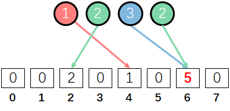

```python
balls = [1, 2, 3, 2]  # 红球(1分) 绿球(2分) 蓝球(3分)
bags = [[4], [2], [6], [6]]  # 球要放到哪个袋子里
n = [8]  # 一共有8个袋子
tf.scatter_nd(bags, balls, n)
```

```
<tf.Tensor: shape=(8,), dtype=int32, numpy=
array([0, 0, 2, 0, 1, 0, 5, 0])>
```

可见6号袋子里的分数增加了

### indices是二维

现在袋子增加了一堆，改用行列编号来指定一个袋子，要把：

1个红球投入 (1, 1) 袋子
1个绿球投入 (0, 0) 袋子
1个绿球投入 (3, 2) 袋子
1个蓝球投入 (3, 2) 袋子

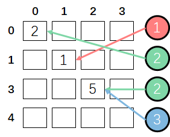

```python
indicies = [[1, 1], [0, 0], [3, 2], [3, 2]]
updates = [1, 2, 2, 3]
shape = [4, 4]
tf.scatter_nd(indicies, updates, shape)
```

```
<tf.Tensor: shape=(4, 4), dtype=int32, numpy=
array([[2, 0, 0, 0],
       [0, 1, 0, 0],
       [0, 0, 0, 0],
       [0, 0, 5, 0]])>
```

### updates是二维

之前讨论的是updates是一维的情况，实际上updates也可以是多维的

比如tensorflow官方给出的这个例子


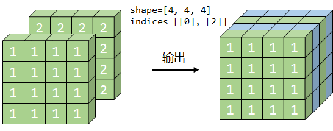

```python
indices = tf.constant([[0], [2]])
updates = tf.constant([[[1, 1, 1, 1], 
                        [1, 1, 1, 1],
                        [1, 1, 1, 1],
                        [1, 1, 1, 1]],
                       
                       [[2, 2, 2, 2],
                        [2, 2, 2, 2],
                        [2, 2, 2, 2],
                        [2, 2, 2, 2]]])

shape = tf.constant([4, 4, 4])
tf.scatter_nd(indices, updates, shape)
```

```
<tf.Tensor: shape=(4, 4, 4), dtype=int32, numpy=
array([[[1, 1, 1, 1],
        [1, 1, 1, 1],
        [1, 1, 1, 1],
        [1, 1, 1, 1]],

       [[0, 0, 0, 0],
        [0, 0, 0, 0],
        [0, 0, 0, 0],
        [0, 0, 0, 0]],

       [[2, 2, 2, 2],
        [2, 2, 2, 2],
        [2, 2, 2, 2],
        [2, 2, 2, 2]],

       [[0, 0, 0, 0],
        [0, 0, 0, 0],
        [0, 0, 0, 0],
        [0, 0, 0, 0]]])>
```

# 张量维度变化

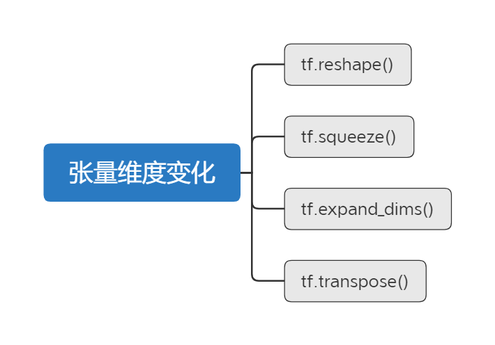

## tf.reshape()

```
tf.reshape(tensor, shape)
```


这个函数对于空间或时间的消耗成本都是很低的，本质不会改变元素的存储顺序。

```python
import tensorflow as tf
a = tf.constant([0, 1, 2, 3, 4, 5, 6, 7, 8])
a.shape
```

```
TensorShape([8])
```

```python
tf.reshape(a, [2, -1])  # 两行 *列（自动计算）
```

```
<tf.Tensor: shape=(2, 4), dtype=int32, numpy=
array([[0, 1, 2, 3],
       [4, 5, 6, 7]])>
```

```python
tf.reshape(a, [2, 2, 2])
```

```
<tf.Tensor: shape=(2, 2, 2), dtype=int32, numpy=
array([[[0, 1],
        [2, 3]],

       [[4, 5],
        [6, 7]]])>
```

## tf.squeeze()

```
tf.squeeze(input, axis=None)
```

本质上不会改变张量元素的存储顺序

例1：

```python
import tensorflow as tf
a = tf.constant([[1, 2, 3]])
a
```

```
<tf.Tensor: shape=(1, 3), dtype=int32, numpy=
array([[1, 2, 3]])>
```

```python
tf.squeeze(a)
```

```
<tf.Tensor: shape=(3,), dtype=int32, numpy=
array([1, 2, 3])>
```

例2：

```python
a = tf.constant([[[1, 2, 3]],[[4, 5, 6]]])
a
```

```
<tf.Tensor: shape=(2, 1, 3), dtype=int32, numpy=
array([[[1, 2, 3]],

       [[4, 5, 6]]])>
```

```python
tf.squeeze(a)
```

```
<tf.Tensor: shape=(2, 3), dtype=int32, numpy=
array([[1, 2, 3],
       [4, 5, 6]])>
```

例3：指定axis可以消除指定的维度

如果不指定会默认消除所有只剩1个元素的维度

```python
# 't' is a tensor of shape [1, 2, 1, 3, 1, 1]
tf.shape(tf.squeeze(t))  # [2, 3]
```

```python
# 't' is a tensor of shape [1, 2, 1, 3, 1, 1]
tf.shape(tf.squeeze(t, [2, 4]))  # [1, 2, 3, 1]
```

## tf.expand_dims()

```
tf.expand_dims(input, axis)
```

假如一张图片的维度是这样的

```python
image = tf.zeros([10, 10, 3])
```

通常训练的时候都一批一批地训练的，那就可以给image增加一个batch维度

```python
tf.expand_dims(image, axis=0).shape.as_list()
# [1, 10, 10, 3]
```

可以在指定位置插入一个新的维度

```python
tf.expand_dims(image, axis=1).shape.as_list()
# [10, 1, 10, 3]
```

用axis=-1可以在最后增加新的维度

```python
tf.expand_dims(image, axis=-1).shape.as_list()
# [10, 10, 3, 1]
```

## tf.transpose()

```
tf.transpose(a, perm)
```

维度交换

例1：2维张量的情况

```python
a = tf.zeros([3, 4])
tf.transpose(a).shape.as_list()
```

```
[4, 3]
```


例2：多维张量的情况

建议使用perm

```python
a = tf.zeros([3, 4, 5, 6])
tf.transpose(a, perm=[3, 1, 2, 0]).shape.as_list()
```

```
[6, 4, 5, 3]
```

# 张量合并与分割

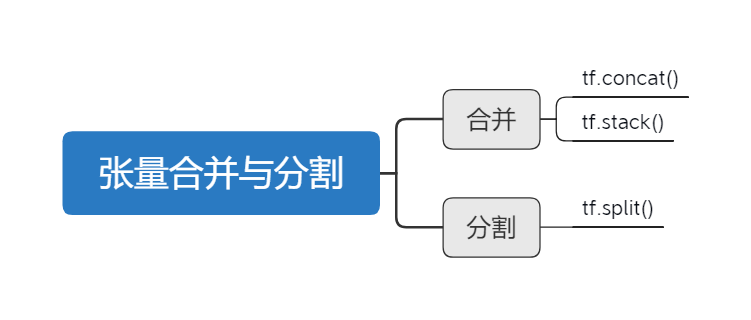

## 合并

`tf.concat()`与`tf.stack()`的区别在于，`tf.concat()`是连接，不会增加维度，`tf.stack()`是堆叠，会增加维度。

### tf.concat()

```python
import tensorflow as tf
a = tf.constant([[ 0,  1], [ 2,  3]])
b = tf.constant([[ 4,  5], [ 6,  7]])
c = tf.constant([[ 8,  9], [10, 11]])
```

```
tf.concat([a, b, c], axis=0)
```

```
<tf.Tensor: shape=(6, 2), dtype=int32, numpy=
array([[ 0,  1],
       [ 2,  3],
       [ 4,  5],
       [ 6,  7],
       [ 8,  9],
       [10, 11]])>
```

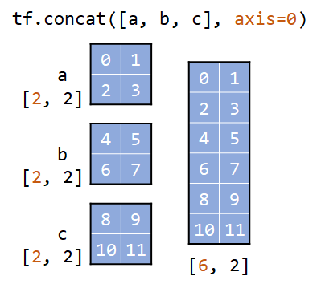

```python
tf.concat([a, b, c], axis=1)
```

```
<tf.Tensor: shape=(2, 6), dtype=int32, numpy=
array([[ 0,  1,  4,  5,  8,  9],
       [ 2,  3,  6,  7, 10, 11]])>
```


### tf.stack()

```python
tf.stack(values, axis)
```

```python
import tensorflow as tf
a = tf.constant([[ 0,  1], [ 2,  3]])
b = tf.constant([[ 4,  5], [ 6,  7]])
c = tf.constant([[ 8,  9], [10, 11]])
```

```python
tf.stack([a, b, c], axis=0)
```

```
<tf.Tensor: shape=(3, 2, 2), dtype=int32, numpy=
array([[[ 0,  1],
        [ 2,  3]],

       [[ 4,  5],
        [ 6,  7]],

       [[ 8,  9],
        [10, 11]]])>
```


```python
tf.stack([a, b, c], axis=1)
```

```
<tf.Tensor: shape=(2, 3, 2), dtype=int32, numpy=
array([[[ 0,  1],
        [ 4,  5],
        [ 8,  9]],

       [[ 2,  3],
        [ 6,  7],
        [10, 11]]])>
```


```python
tf.stack([a, b, c], axis=2)
```

```
<tf.Tensor: shape=(2, 2, 3), dtype=int32, numpy=
array([[[ 0,  4,  8],
        [ 1,  5,  9]],

       [[ 2,  6, 10],
        [ 3,  7, 11]]])>
```

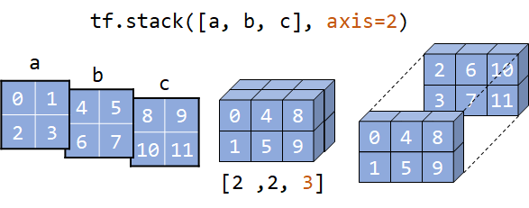

## 分割

### tf.split()

```python
tf.split(value, num_or_size_splits, axis=0)
```

- value：要分割的张量
- num_or_size_splits：如何分割
  - 如果是整数n，那就平均分成n份，如果无法平均分成n份会报错
  - 如果是列表，就按列表的值进行分割
- axis：在哪个轴上进行操作

#### 二维

```python
import tensorflow as tf
a = tf.zeros([4, 4], dtype=tf.int32)
```

```python
tf.split(a, num_or_size_splits=2, axis=0)
```

```
[<tf.Tensor: shape=(2, 4), dtype=int32, numpy=
 array([[0, 0, 0, 0],
        [0, 0, 0, 0]])>,
 <tf.Tensor: shape=(2, 4), dtype=int32, numpy=
 array([[0, 0, 0, 0],
        [0, 0, 0, 0]])>]
```


```python
tf.split(a, 2, axis=1)
```

```python
[<tf.Tensor: shape=(4, 2), dtype=int32, numpy=
 array([[0, 0],
        [0, 0],
        [0, 0],
        [0, 0]])>,
 <tf.Tensor: shape=(4, 2), dtype=int32, numpy=
 array([[0, 0],
        [0, 0],
        [0, 0],
        [0, 0]])>]
```

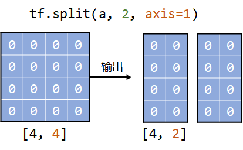

```python
tf.split(a, [1, 3], axis=0)
```

```
[<tf.Tensor: shape=(1, 4), dtype=int32, numpy=array([[0, 0, 0, 0]])>,
 <tf.Tensor: shape=(3, 4), dtype=int32, numpy=
 array([[0, 0, 0, 0],
        [0, 0, 0, 0],
        [0, 0, 0, 0]])>]
```

