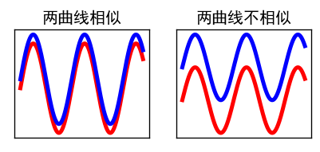
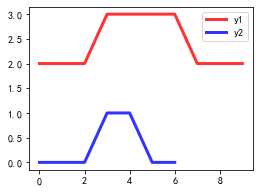
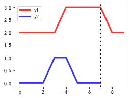
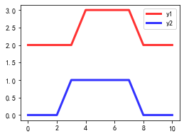

归一化的方式：不要用zscore标准化，用最大最小归一化

相当于拉长了短序列

# DTW

Dynamic Time Warping，动态时间扭曲，是一种衡量两个时间序列相似度的方法。这里的相似度指的是**距离相似度**，两个曲线越接近，它们就越相似。为避免混淆，可以用下图表示。



上面左边的图，蓝色曲线和红色曲线比较接近，因此认为两个曲线相似。

上面右边的图，虽然两个曲线的形状类似，但是由于存在一定距离，所以会判定两个曲线不相似。

如果要比较两个曲线的波形是否相似，可以进行归一化再求欧式距离。


举个例子，以下两条曲线，就不好直接计算距离。

```python
def lineplot(y1, y2):
    fig, ax = plt.subplots(figsize=(4, 3))
    ax.plot(y1, lw=3, c='r', alpha=.8, label='y1')
    ax.plot(y2, lw=3, c='b', alpha=.8, label='y2')
    plt.legend()
    return ax
```

```python
y1 = np.array([2, 2, 2, 2, 3, 3, 3, 3, 2, 2])
y2 = np.array([0, 0, 0, 1, 1, 0, 0, 0])
ax = lineplot(y1, y2)
plt.show()
```



因为y1和y2长度不同，所以不方便直接计算距离。一个简单的思路是截断y1，使得y1和y2等长，然后计算距离。

```python
ax = lineplot(y1, y2)
ax.axvline(len(y2)-1, lw=3, ls='--', c='k')
plt.show()
```



为方便起见，使用绝对距离（对应点位相减的绝对值求和）。

计算得出的平均距离为

```python
dist = abs(y1[:len(y2)] - y2).mean()
print('平均距离:', dist)
# 2.25
```

这样做有几个明显的问题：

- 忽略了曲线y1后部的下降趋势的曲线
- 两条曲线的对比不对齐，计算距离时，y2的低谷对应了y1的峰值

如果采用DTW，就可以避免这两个问题，可以把DTW理解为一种将短曲线合理拉长的方式（这个说法其实不对，因为两个曲线可能会都被拉长）。直观理解的话，就是把y1, y2变成下面这样，再用刚刚一样的方式计算距离。


```python
dist, path = dtw(y1, y2, dist='absolute', return_path=True)
print('平均距离:', dist / path.shape[1])
ax = lineplot(y1[path[0]], y2[path[1]])
plt.show()
```




但其实两条曲线的波形是比较相似的。

可以这么理解普通的距离计算方式。


# 图片

文章中涉及到的图片的绘制代码

```python
import matplotlib.pyplot as plt
plt.rcParams['font.family'] = "SimHei" 

def compare_line_plot(ax, y1, y2, title):
    ax.plot(y1, lw=3, c='r', alpha=.8)
    ax.plot(y2, lw=3, c='b', alpha=.8)
    ax.set_xticks([])
    ax.set_yticks([])
    ax.set_title(title)
    
fig, axes = plt.subplots(1, 2, figsize=(4, 1.5), dpi=120)
compare_line_plot(axes[0], y, y+0.2, '两曲线相似')
compare_line_plot(axes[1], y, y+1, '两曲线不相似')
plt.show()
```

