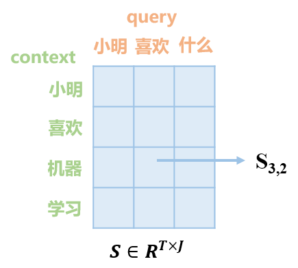
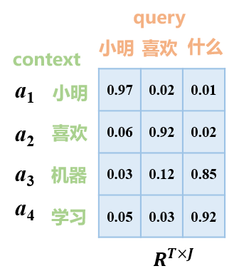
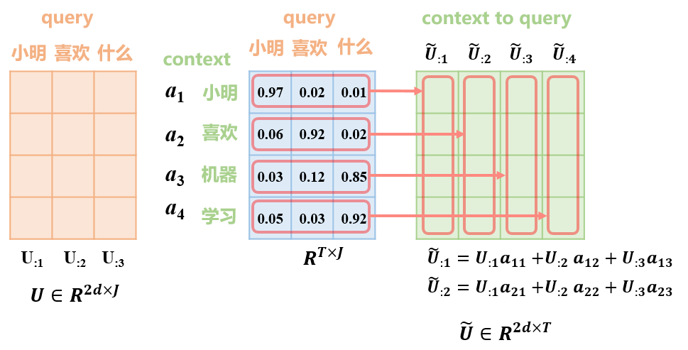

[Bidirectional Attention Flow for Machine Comprehension](https://arxiv.org/abs/1611.01603)

正式确立编码层-交互层-输出层的结构

采用了双向注意力机制

符号说明

| 符号                    | 说明                                                         |
| ----------------------- | ------------------------------------------------------------ |
| $\{x_1,...,x_T\}$       | context输入，就是文章 一共有$T$个token                  |
| $\{q_1,...,q_J\}$       | query输出，针对文章提出的问题 一共有$J$个token          |
| $X\in R^{d \times T}$   | context词向量矩阵 由char和word嵌入层的拼接，并通过Highwary Network得到 |
| $Q\in R^{d \times J}$   | query词向量矩阵                                              |
| $d$                     | 基础的词向量维度                                             |
| $H \in R^{2d \times T}$ | context的上下文编码向量 $X$通过Contextual Embedding Layer得到的 |
| $U \in R^{2d \times J}$ | query的上下文编码向量 由$Q$通过Contextual Embedding Layer得到 |
|                         |                                                              |
|                         |                                                              |
|                         |                                                              |
|                         |                                                              |

# 1. Character Embedding Layer

字符集级别的编码，就是一个词语拆成了二十六个字母。

宽度1-7，每种25-100个filter。其实就是类似TextCNN

假设最终一个词可以提取出来一个50维的词向量

# 2. Word Embedding Layer

其实就是glove词向量，假设为50维词向量

就拼接word和char的词向量

## Highway Network

传统的前馈神经网络
$$
y=g(W_gx+b_g)
$$
高速神经网络
$$
\begin{aligned}
z &= g(W_gx+b_g) \\
t &= \sigma(W_tx+b_t) \\
y &= tz + (1-t)x 
\end{aligned}
$$

就是说，$x$的一部分是直接进入到下一层的

进入下一层的比例由$t$来控制，原始的输入和变换后的输入的比例。

- $t$ 转换率
- $(1-t)$ 携带率

优点：比较深层的网络，收敛效果也会比较好

# 3. Contextual Embedding Layer

接受char与word嵌入向量，用单层双向lstm处理

# 4. Attention Flow Layer

在这一层，要通过上下文嵌入$H$(context)和$U$(query)计算出一个相似度矩阵$S\in R^{T \times J}$

$S_{tj}$就表示第$t$个context词与第$j$个query词之间的相似度。通过下式计算：
$$
\begin{aligned}
S_{tj}&=\alpha(H_{:t},U_{:j}) \\
\alpha(h,u)&=w^T_S[h;u;h\odot u]
\end{aligned}
$$

$H_:t$和$U_:j$是单独一列的向量，$[;]$表示矩阵拼接，注意因为有矩阵拼接，所以$w_S$的维度为：$w_S \in R^{6d}$

### Context-to-Query Attention(C2Q)

对于一个context词，计算所有query词与其关联程度，一对多的关系。

令$a_t\in R^J$表示，context的第t个词，与所有query词的关联程度。

$\sum_ja_{tj}=1$

可以通过$a_t=\text{softmax}(S_{t:})$得到$\alpha_t$，$S_{t:}$表示第$t$行。

$a\in R^{T\times J}$

有了这个矩阵之后：
$$
\tilde{U}_{:t}=\sum a_{tj}U_{:j}
$$

$$
\tilde{U}=U \cdot a^T
$$

### Query-to-Context Attention(Q2C)

对于一个query词，哪个context词与它最相关，一对一的关系。
$$
b=\text{softmax}(\text{max}_{col}(S))\in R^T
$$

$$
\tilde{h}=\sum_tb_tH_{:t}\in R^{2d}
$$
然后$\tilde{h}$复制$T$次形成$\tilde{H}\in R^{2d \times T}$

### 综合

最后将这些信息综合：
$$
G_{:t}=\beta(H_{:t},\tilde{U}_{:t},\tilde{H}_{:t})
$$
$\beta$可以有各种不同的设计，最终一列的维度为：$G_{:t} \in R^{8d}$。

文章给出了其中一种有较好结果的设计是：
$$
\beta(h,\tilde{u},\tilde{h})=[h;\tilde{u};h\circ \tilde{u};h \circ \tilde{h}]
$$

# 5. Modeling Layer

前面的$G\in R^{8d \times T}$通过一个双层双向的lstm。

这一层与第3层不同的是，还融合了query的信息。

最终获得$M\in R^{2d \times T}$

# 6. Output Layer

这一层可以根据任务的不同，设计也可以发生变化，对于squad数据集，是要寻找一个开始索引和结束索引。

对于开始token：
$$
p^1=\text{softmax}(w^T_{p^1}[G;M])
$$
将$M$通过另一个双向lstm层，得到$M^2 \in R^{2d \times T}$用$M^2$来预测结尾索引：
$$
p^1=\text{softmax}(w^T_{p^1}[G;M^2])
$$

# 训练

损失函数：
$$
L(\theta)=-\frac{1}{N}\sum_i^N\text{log}(p^1_{y_i^1})+\text{log}(p^2_{y_i^2})
$$

- $\theta$为模型的可训练权重，包括CNN filters的参数、LSTM单元的参数、$w_{(S)}, w_{(p^1)}, w_{(p^2)}$
- $N$为样本总数
- $y_i^1,y_i^2$分别是第$i$个样本的真实起始和结尾索引。
- $p_k$为向量$p$的第k个值。