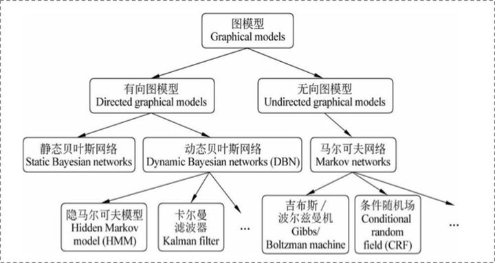
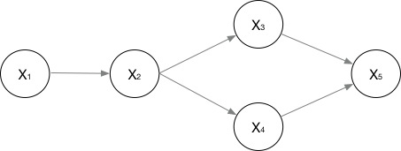

https://zhuanlan.zhihu.com/p/119254570

https://kexue.fm/archives/5542

https://zhuanlan.zhihu.com/p/28465510

# 前置知识

## 概率图

概率图的体系结构




主要关注HMM和CRF，两个有向图和无向图的代表


概率图模型中，数据（样本）由公式$G=(V,E)$建模表示

- $V$代表结点，即随机变量，用$Y=(y_1,...,y_n)$表示为随机变量建模。
- $E$表示边，即概率依赖关系

可以先这么理解，在词性标注任务中：

```
o   t   k
我 今天 开心
```

> o t k是随便写的，以后再改

otk作为词性，也就是标签，也就是$y_1,y_2,y_3$


### 2.1.1 有向图与无向图

贝叶斯网络（有向图）适合为有**单向依赖**的数据建模，马尔科夫网络（无向图）适合实体之间**互相依赖**的建模。

> 这里单向依赖和互相依赖要是能举出一个具体例子就好了

它们的差异在于如何求$P=(Y)$

**有向图**

数据间的依赖关系由下面那张图所示



那如何建模求联合概率 $P(X) = P(x1,x2,x3,x4,x5)$ 呢
$$
P(X) = P(x_1)P(x_2|x_1)P(x_3|x_2)P(x_4|x_2)P(x_3|x_3,x_4)
$$
用一个比较通用的公式表示就是：
$$
P(x1,...,x_n)=\prod_{i=1}^n P(x_i|\pi(x_i))
$$
说实话这里还是要用实际例子比较好。


**无向图**

如果无向图太大，就把这个大图分成数个小团，小团要求是 **最大团**。

> 团：就是两两结点之间都有边的图
>
> 最大团：顶点最多，而且这个团不被任何其他团包围
>
> 下面左1是一个比较复杂的无向图，剩下3个就是它的小团，而且都是最大团


以下面这张图为例，该如何建模呢？


首先可以把它分成左右2个最大团。

然后假设有一个公式$\psi(*)$可以计算出一个最大团上随机变量的联合概率，则
$$
P(X) = \frac{1}{Z(x)}(\psi_{1}\left(x_{2}, x_{3}, x_{4}\right) \cdot  \psi_{2}\left(X_{1}, X_{3}, X_{4}\right))
$$
一般用指数函数表示$\psi()$，$\psi()$称为势函数

> 这部分作者说的不清不楚的，之后再看

### 2.1.2 马尔科夫假设和马尔科夫性

**马尔科夫假设**

马尔科夫链$(x_{1}, ..., x_{n})$中的 $x_i$只受$x_{i-1}$的影响

马尔科夫过程：在一个过程中，每个状态的转移只依赖于前n个状态，并且只是个n阶的模型。最简单的马尔科夫过程是一阶的，即只依赖于前一个状态。

**马尔可夫性**

马尔科夫性是是保证或者判断概率图是否为概率无向图的条件。

三点内容：a. 成对，b. 局部，c. 全局。

## 判别式模型与生成式模型

常见的判别式模型

> 神经网络、SVM、LR、DT

常见生成式模型

> NB、LDA

**判别式模型**

以逻辑回归为例，它建的模直接就是这个$P(y|x)$


判别式模型的特点：

- 观测到输入什么特征，就预测最可能的label
- 对所有的样本只构建一个模型，确认总体判别边界

判别式模型的优点：

简单，数据量小的时候也准确


**生成式模型**

以朴素贝叶斯为例，它建的模是这个：$P(Y|X)=P(X,Y) / P(X)$

即，训练阶段对$P(X,Y)$建模

先把联合概率分布摸透，确定好一个分布，这个有个好处就是，给定 $Y$ 的情况下可以模拟出 $X$ 的分布


**殊途同归**

生成模型和判别模型最终都是要求给定$X$的情况下，$Y$的分布

# 无向图

- 团和极大团的概念

要对一个无向图建立联合概率模型$P(\mathbf{x})$，要先把这个无向图拆成数个极大团。
$$
P(\mathbf{x})= \frac{1}{Z}\prod_{Q \in C}\psi_Q(\mathbf{x}_Q)
$$
$Q$表示一个极大团，$C$是所有极大团构成的集合


比如对于上图，就可以写为：
$$
P(\mathbf{x}) = \frac{1}{Z}(\psi_{1}(\mathbf{x}_{1}) \cdot  \psi_{2}(\mathbf{x}_{2}))
$$
其中$\mathbf{x}_{1}=\{x_2,x_3,x_4\}$，$\mathbf{x}_{2}=\{x_1,x_3,x_4\}$

$Z$为规范化因子，保证$P(\mathbf{x})$算出来是一个概率值。
$$
Z=\sum_{\mathbf{x}}\prod_{Q \in C} \psi_Q(\mathbf{x}_Q)
$$
因为Z比较难计算，一般不需要获得Z的精确值


通常用指数函数定义势函数：
$$
\psi_Q(\mathbf{x}_Q)=\text{exp}(-H_Q(\mathbf{x}_Q))
$$
$H_Q(\mathbf{x}_Q)$ 是一个定义在变量$\mathbf{x}_Q$上的实值函数，常见形式为：
$$
H_Q(\mathbf{x}_Q) = \sum_{u,v \in Q, u\neq v}\alpha_{uv}x_ux_v+\sum_{v\in Q}\beta_vx_v
$$
$\alpha_{uv}$和$\beta{v}$是参数，上式第二项只考虑单结点，第一项考虑每一对结点之间的关系

# CRF

给定观测序列$\mathbf{x}=\{x_1,...,x_n\}$，求标记序列$\mathbf{y}=\{y_1,...,y_n\}$的过程


$$
P(\mathbf{y}|\mathbf{x})=\frac{1}{Z}\text{exp}(\sum_j\sum_{i=1}^{n-1}\lambda_jf_j(y_{i+1},y_i,\mathbf{x},i)+\sum_k\sum_{i=1}^n\mu_kg_k(y_i,\mathbf{x},i))
$$
$f_j(y_{i+1},y_i,\mathbf{x},i)$是定义在观测序列的两个相邻标记位置上的转移特征函数。

刻画相邻标记变量之间的相关关系，以及观测序列对它们的影响

$g_k(y_i,\mathbf{x},i)$是状态特征函数，用于刻画观测序列对标记变量的影响。$\lambda$和$\mu$是参数

我的理解是，这两个函数用lstm来表示


我看网上有些博客上舍弃了上式的第二项。

那CRF模型主要就是求参数$\lambda$


关键我不理解的是$f$这个函数是啥，它到底长啥样。

> 我的猜测是，可以用一个dense层表示这个函数，输出是一个标量。

还有一个问题是$\lambda$怎么优化

> 貌似可以完美融入梯度下降体系

因为：
$$
\sum_{i=1}^nw_ix_i=\mathbf{w}^T\mathbf{x}
$$
可以把$\lambda$看做是可训练参数$\mathbf{w}$

# 代码

我打算先实现BiLSTM + CRF

```python
import tensorflow_addons as tfa
import numpy as np

layer = tfa.layers.CRF(7)  # 表示序列有多少种标注
inputs = np.random.rand(2, 4, 8).astype(np.float32)
decoded_sequence, potentials, sequence_length, chain_kernel = layer(inputs)
print(decoded_sequence.shape)
# (2, 4)
print(potentials.shape)
# (2, 4, 7)
print(sequence_length)
# tf.Tensor([4 4], shape=(2,), dtype=int64)
print(chain_kernel.shape)
# (7, 7)

```

- inputs是每个标签的分数吗？好像不是的
- potentials 好像是每个标签的分数
- chain_kernel 貌似是状态转移矩阵

BiLSTM输出的是每个标签的分数

比如如果有3个标签 B I O，一句话有5个词

那输出的就是 5 × 3 的矩阵

对于第一个词$w_i$，输出可能是 [0.7, 1.6, 0.2]

**CRF层可以从训练数据中学到约束**

# 问题

CRF的损失函数怎么搞