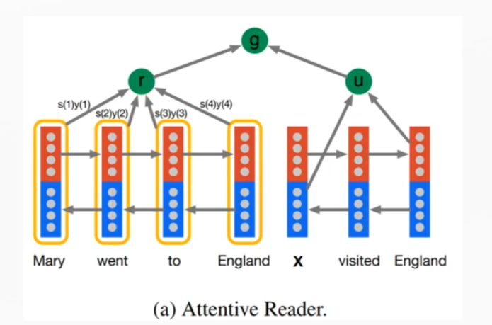

## 什么是Multi-Hop机制

Multi-Hop的思想是来自于人的re-read做法-带着问题反复的读文章，从而更准确找到答案，而在阅读理解中就是反复的attention机制。

多次提取充足信息

像之前讲过的Attentive Reader，其实就是one-hop，这里的g是用于最后输出的，one-hop指的是只提取了一次。

越往深层次去走，语义越抽象。

Multi-Hop的方式

句子Attention的layer推进
$$
\begin{aligned}
M^{(k)}&=F(S(k-1)) \qquad k=1,2,...,T \\
S^{(k)}&=Att(M^{(k)},P^{(k)})
\end{aligned}
$$
$M$——context

$P$——query

TimeStep状态推进，与主序列维度一致
$$
\begin{aligned}
h_t^P=GRU(h_{t-1}^P,c_t) \\
c_t=f(p_t,Q,h_{t-1}) \\
e.g. \ c_t=att(Q,[p_t,h_{t-1}])
\end{aligned}
$$
 