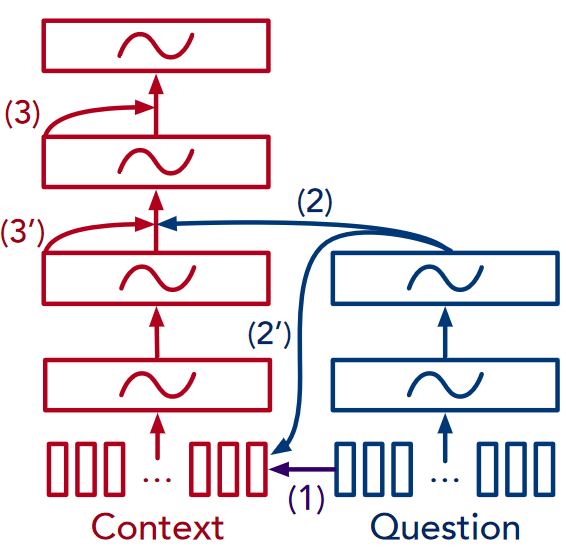

Fusionnet: Fusing

https://arxiv.org/pdf/1711.07341.pdf

把所有之前的模型做了一点变化。单词历史、全关注注意力

- 输入向量
- 集成组件
- 融合过程

(1)词级融合：单词是否出现

(2)高层融合：更新高层次表示

(2’)高层融合（可选择的）：高层次融合到上下文单词

(3)自我加强融合：上下文高层次表示本身self-attention

(3’)自我加强融合（可选择的）：融合前进行自我融合

## 单词历史 history-of-word

一个单词从低层次到高层次的所有表示向量一起称为该词的”**历史**“。

方法：将所有层拼接

可以更好地理解语义（把底层和高层的信息都包括了），但是会降低效率，可以通过某种方式对其进行降维。