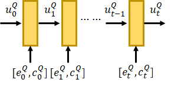

R-NET：MACHINE READING COMPREHENSION WITH SELF-MATCHING NETWORKS

在Attention计算中加入了门机制

https://www.microsoft.com/en-us/research/wp-content/uploads/2017/05/r-net.pdf

https://www.yuque.com/clskmw/uh23d9/10690900

在预测P(Begin) 和 P(End) 时，引入了$r^Q$，一起预测最终的结果

## Question And Passage Encoder

不管什么模型，一开始总是从词语入手，对于阅读理解问题，给定：

- 问题（question）$Q=\{w_t^Q\}_{t=1}^m$
- 文章（passage）$P=\{w_t^P\}_{t=1}^n$

$t$表示是第几个词语，$m$和$n$表示问题和文章分别由多少个词组成。

对于每个词，分别有**字级别**和**词级别**的编码：

- 词级别（word-level）：$\{e_t^Q\}_{t=1}^m$ 和 $\{e_t^P\}_{t=1}^n$
- 字级别（character-level）：$\{c_t^Q\}_{t=1}^m$ 和 $\{c_t^P\}_{t=1}^n$

字级别的词嵌入由双向RNN的最后一个**隐藏层**得到。可以帮助处理OOV词。最后将字、词向量融合到一个双向RNN以产生新的词向量表示。
$$
u_t^Q=\text{BiRNN}_Q(u_{t-1}^Q,[e_t^Q,c_t^Q]) \label{1}
$$

$$
u_t^P=\text{BiRNN}_P(u_{t-1}^P,[e_t^P,c_t^P]) \label{2}
$$

这里的RNN使用的是**GRU**，GRU与LSTM的区别，GRU是LSTM的简化版，参数更少。

## Gated Attention-Based Recurrent Networks

基于门控注意力的循环网络，文章使用此网络来合并问题信息和文章信息。本质上还是循环神经网络，不过添加了一个门控单元，让这个门控单元来判断：文章中的哪部分对于问题来说更重要。
$$
v_t^P=\text{RNN}(v_{t-1}^P,c_t) \label{3}
$$
对于整个问题($u^Q$)，$c_t=att(u^Q,[u_t^P,v_{t-1}^P])$
$$
\begin{equation}\begin{aligned}
s_j^t&=\mathbf{v}^\mathbf{T}\text{tanh}(W_u^Qu_j^Q+W_u^Pu_t^P+W_v^Pv^P_{t-1}) \\
a^t_i&=\frac{\text{exp}(s_i^t)}{\sum_{j=1}^m\text{exp}(s_j^t)} \\
c_t&=\sum_{i=1}^ma_i^tu_i^Q
\end{aligned}\end{equation}
$$
$a_i^t$对于第$t$个段落词，第$i$个问题词的重要度。

每个文章表示 $v_t^P$ 都动态聚合了来自问题的信息。与式 $\eqref{3}$ 不同的是，下式多加入了 $u_t^P$ 的信息：
$$
v_t^P=\text{RNN}(v_{t-1}^P,[u_t^P,c_t]) \label{5}
$$
加入了一个门$g_t$来判断对于某个问题，文章的哪部分更重要
$$

\label{6}\begin{equation}\begin{aligned}
g_t=\text{sigmoid}(W_g[u_t^P,c_t]) \\
[u_t^P,c_t]^*=g_t\odot[u_t^P,c_t]
\end{aligned}\end{equation}
$$

与LSTM或GRU的“门”不同，附加的“门”是基于当前的段落词及其问题的注意力集中向量，它关注的是问题和当前段落单词之间的关系。“门”有效地模拟了阅读理解和回答问题时，只有部分通道与问题相关的现象

## Self-Matching Attention

之前已经带着问题看文章了，这一步做的就是带着问题看文章的同时，找出文章中那些个词更重要。

上面几层得到了问题+文章的词表示$\{v_t^P\}_{t=1}^n$，但这个表示存在一个问题就是它捕获到的上下文信息比较少。文章的上下文对回答问题还是比较关键的。

为了解决这个问题，问题提出了自匹配方法。

根据上下文推断答案是必要的。为了解决这个问题，我们建议直接匹配问题意识的段落表示本身。它动态地从整篇文章中收集词语的证据，并将与当前词语相关的证据及其匹配的问题信息编码到文章表示中
$$
h_t^P=\text{BiRNN}(h_{t-1}^P,[v_t^P,c_t])
$$
其中$c_t=att(v_P,v_t^P)$，is an attention-pooling vector of the whole passage$(v^P)$
$$
\begin{equation}\begin{aligned}
s_t^j&=\mathbf{v^T}\text{tanh}(W_v^Pv_j^P+W_v^{\tilde{P}}v_t^P) \\
a_i^t&=\frac{\text{exp}(s_i^t)}{\sum_{j=1}^n\text{exp}(s^t_j)} \\
c_t&=\sum_{i=1}^na_i^tv_i^P
\end{aligned}\end{equation}
$$
与基于门控注意力的递归网络一样，我们还在$[v^P_t,c_t]$中增加了一个门来自适应控制RNN的输入

自匹配根据当前文章单词和问题的信息，从整篇文章中提取证据，应该就是类似于式(6)

## Output Layer

使用指针网络来预测答案的起始的结束位置，此外，我们在问题表示上使用注意池来生成指针网络的初始隐藏向量。

给定文章表示$\{h_t^P\}_{t=1}^n$，利用注意力机制作为指针选择文章的起始位置$(p^1)$和结束位置$(p^2)$
$$
\begin{equation}\begin{aligned}
s_j^t&=\mathbf{v}^\mathbf{T}\text{tanh}(W_h^Ph_j^P+W_h^ah_{t-1}^a) \\
a^t_i&=\frac{\text{exp}(s_i^t)}{\sum_{i=1}^m s_j^t} \\
p^t&=\text{argmax}(a^t_1,...,a^t_n)
\end{aligned}\end{equation}
$$
此处$t \in \{1, 2\}$，只有两个选择，对于$t=1$，要计算出文章词是答案的起始词的概率。

其中$h_{t-1}^a$表示答案循环网络（指针网络）的最后一个隐藏状态。答案递归网络的输入是基于当前预测概率的注意力池向量$a^t$。
$$
\begin{equation}\begin{aligned}
c_t&=\sum_{i=1}^na_i^t h_i^P \\
h_t^a&=\text{RNN}(h_{t-1}^a,c_t)
\end{aligned}\end{equation}
$$
在预测其实位置时，$h_{t-1}^a$表示答案循环网络的初始隐藏状态，使用问题向量$r^Q$作为问题循环网络的初始状态。$r^Q=att(u^Q,V_r^Q)$是基于参数$V_r^Q$的问题的注意力集中向量，$V_r^Q$也是一个参数
$$
\begin{equation}\begin{aligned}
s_j&=\mathbf{v}^\mathbf{T}\text{tanh}(W_u^Qu_j^Q+W_v^QV_r^Q) \\
a_i&=\frac{\text{exp}(s_i)}{\sum_{i=1}^m s_j} \\
r^Q&=\sum_{i=1}^ma_iu_i^Q
\end{aligned}\end{equation}
$$
$h_0^a=r^Q$，$r^Q$作为最后一层输出层的初始化向量

为了训练网络，我们将预测分布的真值起始位置和结束位置的负对数概率之和最小化。

## 其他讨论

sentence ranking

syntax infomation

multi-hop inference

question generation

前两个比较常见，而且一般情况下是有效的。

## 总结

改进了RNN在机器阅读理解中的应用

将注意力机制融入RNN

门控循环神经网络

 