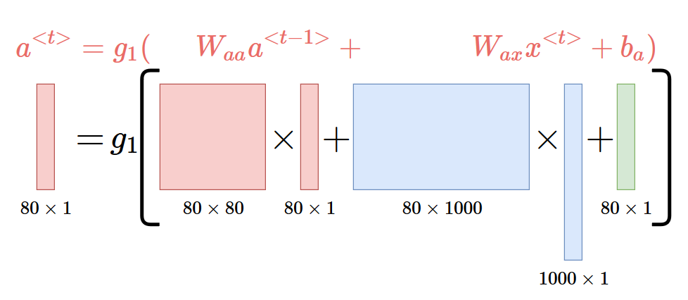
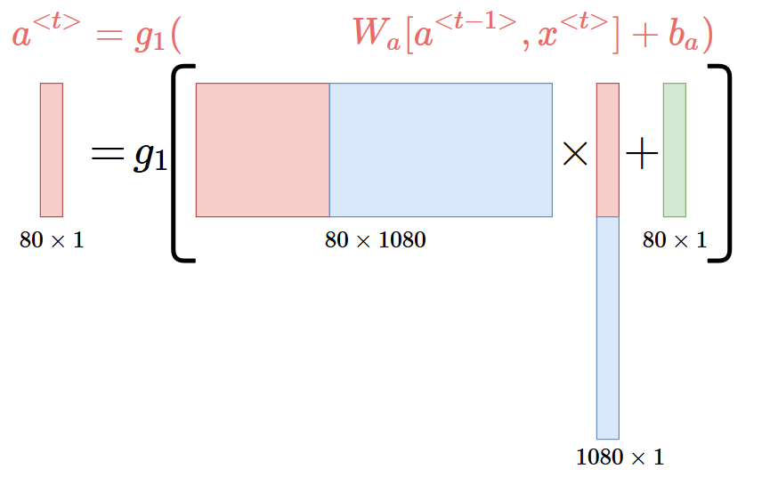

$$
\begin{align}
a^{<1>}      = & g_1(w_{aa}a^{<0>}+w_{ax}x^{<1>}+b_{a})\\
\hat{y}^{<1>}= & g_2(w_{ya}a^{<1>}+b_{y})
\end{align}
$$

$g$是激活函数，取决于任务，如果是二分类的话$g_2$可以用sigmoid，多分类用softmax。

$g_1$一般用$tanh$
$$
\begin{align}
a^{<t>}      = & g_1(W_{aa}a^{<t-1>}+W_{ax}x^{<t>}+b_{a})\\
\hat{y}^{<t>}= & g_2(W_{ya}a^{<t>}+b_{y})
\end{align}
$$

$$
a^{<t>}      = g_1(W_{a}[a^{<t-1>},x^{<t>}]+b_{a})
$$

