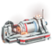

[产量计算器](https://bysz71.github.io/DysonCuoQiuAssistant/)

https://factoriolab.github.io/list?p=&s=dsp&v=1

| 产物                                                         | 原料1                                                    | 原料2                                                        | 原料3                                                        | 原料4                                                        |
| ------------------------------------------------------------ | -------------------------------------------------------- | ------------------------------------------------------------ | ------------------------------------------------------------ | ------------------------------------------------------------ |
|           |                  |  |           |      |
|  |                  | `         |                      |                                                              |
|                         |                  |           |                      |      |
|                                       |                  |           |           |      |
|  |  |           |  |      |
|  |  |      |                      |           |
|                                |                  |           |                      |                                                              |
|  |                  |  |                      |                                                              |
|  |                  |      |                                                              |                                                              |
|           |  |      |      |                                                              |
|           |                  |      |           |      |
|  |                  |      |           |  |
|  |                  |      |           |  |
|           |                  |      |           |                      |
|  |                  |      |                                                              |                                                              |
|  |                  |  |           |                                                              |
|                                                              |                                                          |                                                              |                                                              |                                                              |
|                                                              |                                                          |                                                              |                                                              |                                                              |
|                                                              |                                                          |                                                              |                                                              |                                                              |


```
磁铁|-------------------
铁|---------------------
  齿轮工厂->齿轮|---------
  工厂==================
玻璃|--------------------
芯片|--------------------
石材|--------------------
工厂======================
钢材|---------------------
电浆|
```

