## 安装

https://docs.streamlit.io/library/get-started/installation

创建虚拟环境

```
conda create -n streamlit python=3.9
```

安装

```
pip install streamlit
```

测试是否安装完成

```
streamlit hello
```

运行你自己的脚本

```
# 用python运行
python -m streamlit run your_script.py

# 更长久的用法
streamlit run your_script.py
```

甚至可以直接运行Github的项目

```
streamlit run https://raw.githubusercontent.com/streamlit/demo-uber-nyc-pickups/master/streamlit_app.py
```

## 基本知识

streamlit的策略是这样的，当你触发一些交互时，Streamlit会从上到下重新运行整个Python脚本。

比如下面的情况：

- 修改APP的源代码后
- 与应用程序中的小组件交互后。例如，点击按钮、拖动滑块、在输入框中输入文本。

此外，每当通过 `on_change` （或 `on_click` ）参数将回调传递给小部件时，回调将始终在脚本的其余部分之前运行。有关回调 API 的详细信息，参考：[Session State API Reference Guide](https://docs.streamlit.io/library/api-reference/session-state#use-callbacks-to-update-session-state).

## 基本绘图

[Main concepts - Streamlit Docs](https://docs.streamlit.io/library/get-started/main-concepts)

创建这个脚本

```python
# first_demo.py
import streamlit as st
import pandas as pd

st.write("Here's our first attempt at using data to create a table:")
st.write(pd.DataFrame({
    'first column': [1, 2, 3, 4],
    'second column': [10, 20, 30, 40]
}))
```

运行就能看到结果

```
streamlit run first_demo.py
```

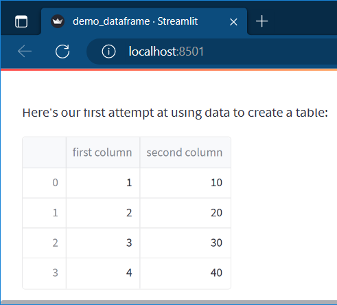

### 绘制表格

可以带格式

```python
# 
import streamlit as st
import numpy as np
import pandas as pd

dataframe = pd.DataFrame(
    np.random.randn(10, 20),
    columns=('col %d' % i for i in range(20)))

st.dataframe(dataframe.style.highlight_max(axis=0))
```


### 绘制折线图

```python
import streamlit as st
import numpy as np
import pandas as pd

chart_data = pd.DataFrame(
     np.random.randn(20, 3),
     columns=['a', 'b', 'c'])

st.line_chart(chart_data)
```


### 绘制散点图

地图散点图

```python
import streamlit as st
import numpy as np
import pandas as pd

map_data = pd.DataFrame(
    np.random.randn(1000, 2) / [50, 50] + [37.76, -122.4],
    columns=['lat', 'lon'])

st.map(map_data)
```


## 基本部件

比如滑条、按钮、下拉选择框

- [`st.slider()`](https://docs.streamlit.io/library/api-reference/widgets/st.slider)
-  [`st.button()`](https://docs.streamlit.io/library/api-reference/widgets/st.button) 
-  [`st.selectbox()`](https://docs.streamlit.io/library/api-reference/widgets/st.selectbox)

```python
import streamlit as st
import numpy as np
import pandas as pd

# 滑条
x = st.slider('x')  # 👈 this is a widget
st.write(x, 'squared is', x * x)

# 文本输入框
st.text_input("Your name", key="name")
st.write(st.session_state.name)

# 复选框(演示显示或不显示的效果)
if st.checkbox('Show dataframe'):
    chart_data = pd.DataFrame(
       np.random.randn(20, 3),
       columns=['a', 'b', 'c'])

    st.write(chart_data)

# 选项选择框
df = pd.DataFrame({
    'first column': [1, 2, 3, 4],
    'second column': [10, 20, 30, 40]
    })

option = st.selectbox(
    'Which number do you like best?',
     df['first column'])

st.write('You selected: ', option)
```


```python
import streamlit as st
st.text_input("Your name", key="name")

# You can access the value at any point with:
st.session_state.name
```


```python
import streamlit as st
import numpy as np
import pandas as pd

if st.checkbox('Show dataframe'):
    chart_data = pd.DataFrame(
       np.random.randn(20, 3),
       columns=['a', 'b', 'c'])

    chart_data
```


可以切换是否显示数据

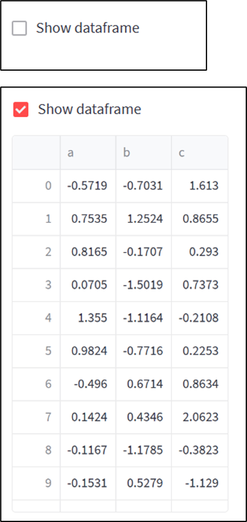

```python
import streamlit as st
import pandas as pd

df = pd.DataFrame({
    'first column': [1, 2, 3, 4],
    'second column': [10, 20, 30, 40]
    })

option = st.selectbox(
    'Which number do you like best?',
     df['first column'])

'You selected: ', option
```

### st.number_input

[st.number_input - Streamlit Docs](https://docs.streamlit.io/library/api-reference/widgets/st.number_input)

```python
import streamlit as st
st.subheader("数字输入框")

number = st.number_input("Insert a number")
st.write("The current number is ", round(number, 4))
```

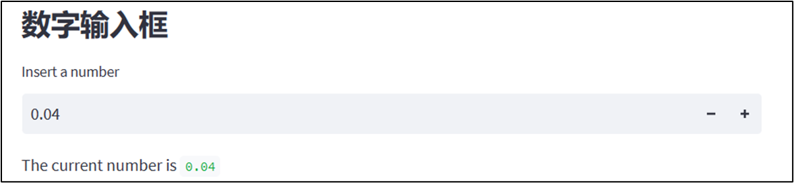

可以设置数字输入框的最大最小值、每次点击按钮的步长

```python
# 注意: 设置min_value, max_value, value, step时
# 数据类型要一致，要么全是浮点型，要么全是整型，否则会报错

# 浮点
st.number_input("输入数字", min_value=0.0, max_value=10.0, value=1.0, step=2.5)
# 整数
st.number_input("输入数字", min_value=2, max_value=8, value=3, step=1)
```


### st.selectbox

下拉选项框

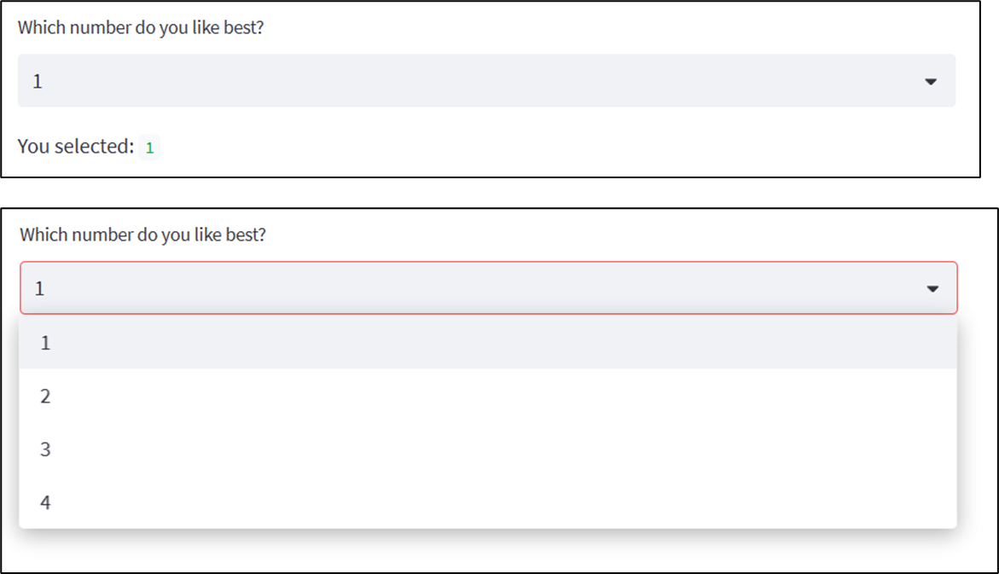

[`st.selectbox()`](https://docs.streamlit.io/library/api-reference/widgets/st.selectbox)

```python
import streamlit as st
import pandas as pd

df = pd.DataFrame({
    'first column': [1, 2, 3, 4],
    'second column': [10, 20, 30, 40]
    })

option = st.selectbox(
    'Which number do you like best?',
     df['first column'])

'You selected: ', option
```

### st.checkbox

勾选检查框后，会显示下面的内容

```python
import streamlit as st

agree = st.checkbox('I agree')
if agree:
    st.write("Great! the checkbox's return value is ", agree)
```

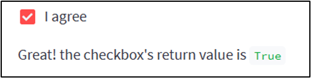

### st.radio

```python
import streamlit as st

genre = st.radio(
    "What\'s your favorite movie genre",
    ('Comedy', 'Drama', 'Documentary'))

if genre == 'Comedy':
    st.write('You selected comedy.')
else:
    st.write("You didn\'t select comedy.")
```

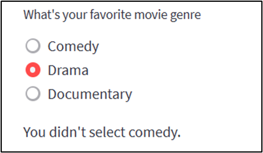

### 多选框

[`st.multiselect()`](https://docs.streamlit.io/library/api-reference/widgets/st.multiselect)

```python
import streamlit as st

options = st.multiselect(
    'What are your favorite colors',
    ['Green', 'Yellow', 'Red', 'Blue'],
    ['Yellow', 'Red'])

st.write('You selected:', options)
```

如何遍历多选框里的东西

```python
```


### 文件上传

[st.file_uploader - Streamlit Docs](https://docs.streamlit.io/library/api-reference/widgets/st.file_uploader)

```python
import streamlit as st
import pandas as pd
from io import StringIO

uploaded_file = st.file_uploader("Choose a file")
if uploaded_file is not None:
    # To read file as bytes:
    bytes_data = uploaded_file.getvalue()
    st.write(bytes_data)

    # To convert to a string based IO:
    stringio = StringIO(uploaded_file.getvalue().decode("utf-8"))
    st.write(stringio)

    # To read file as string:
    string_data = stringio.read()
    st.write(string_data)

    # Can be used wherever a "file-like" object is accepted:
    dataframe = pd.read_csv(uploaded_file)
    st.write(dataframe)
```

同时选择多个文件

```python
import streamlit as st

uploaded_files = st.file_uploader("Choose a CSV file", accept_multiple_files=True)
for uploaded_file in uploaded_files:
    bytes_data = uploaded_file.read()
    st.write("filename:", uploaded_file.name)
    st.write(bytes_data)
```

常用的读取为pandas.DataFrame

```python
import streamlit as st
import pandas as pd

uploaded_file = st.file_uploader("上传CSV文件")
if uploaded_file is not None:
    df = pd.read_csv(uploaded_file)
    st.table(df.head())
```

展示上传的文件的相关信息

[How do you retrieve the filename of a file uploaded with st.file_uploader? - Streamlit Docs](https://docs.streamlit.io/knowledge-base/using-streamlit/retrieve-filename-uploaded)

```python
st.write("Filename: ", uploaded_file.name)
```

### 文件下载

## 部件的特性

### key

> 每个部件都可以设置一个 key，用于标记唯一的部件。

通过key查看值

```python
st.session_state[key]
```

### 多个按钮

如果设置多个按钮，当按下第二个按钮时，第一个按钮的值就变成False了

```python
import streamlit as st

btn1 = st.button("btn1", key="btn1")
btn2 = st.button("btn2", key="btn2")
btn3 = st.button("btn3", key="btn3")

st.text(f"btn1: {btn1} \nbtn2: {btn2} \nbtn3: {btn3}")
```

如果希望点击按钮执行相关操作的话，建议使用`st.checkbox`

### on_change的用法

`on_change` 参数在 Streamlit 中用于定义一个回调函数，当输入框的内容发生变化时，该函数将被调用。这个参数的使用场景包括但不限于：根据用户的输入实时地更新其他部分的界面，或者根据输入的内容进行某些实时的校验等。

```python
import streamlit as st

container = st.container()
container.write("this is container")


def text_changed():
    new_text = st.session_state["new_text"]
    container.write(f"Text has changed to: {new_text}")


st.text_input("Type here", on_change=text_changed, key="new_text")
```

可以使用 `on_change` 创建一个实时的文本校验系统，例如，如果我们希望用户在输入框中输入邮箱，我们可以用 `on_change` 进行实时的邮箱格式校验：

```python
import streamlit as st
import re

def validate_email():
    email = st.session_state["email"]
    email_regex = r"^\b[A-Za-z0-9._%+-]+@[A-Za-z0-9.-]+\.[A-Z|a-z]{2,}\b"
    with container:
        if not re.match(email_regex, email):
            st.error("Invalid email address")
        else:
            st.success("Valid email address")

container = st.container()
with container:
    st.text_input("Enter your email", on_change=validate_email, key="email")

st.write("out of container")

```

### 如何改变文本标签内容

```python
import time
import streamlit as st

greeting = st.text("你好")
with st.spinner("加载中..."):
    time.sleep(2)
greeting.markdown("**:blue[再见]**")
```


## 数据元素

### st.metric

[st.metric - Streamlit Docs](https://docs.streamlit.io/library/api-reference/data/st.metric)

```python
import streamlit as st

col1, col2, col3 = st.columns(3)
col1.metric("温度", "30 ℃", "1.2 ℃")
col2.metric("风速", "9 mph", "-8%")
col3.metric("湿度", "86%", "4%")
```


## 状态元素


等待

```python
with st.spinner("加载中..."):
    time.sleep(2)
```


## 布局

### st.siderbar

```python
import streamlit as st
import time
# Add a selectbox to the sidebar:
add_selectbox = st.sidebar.selectbox(
    'How would you like to be contacted?',
    ('Email', 'Home phone', 'Mobile phone')
)

# 滑条
# Add a slider to the sidebar:
add_slider = st.sidebar.slider(
    'Select a range of values',
    0.0, 100.0, (25.0, 75.0)
)

# 单选框
with st.sidebar:
    add_radio = st.radio(
        "Choose a shipping method",
        ("Standard (5-15 days)", "Express (2-5 days)")
    )


# 代码片段和加载按钮
with st.sidebar:
    with st.echo():
        st.write("This code will be printed to the sidebar.")

    with st.spinner("Loading..."):
        time.sleep(5)
    st.success("Done!")

```

滑条

```python
# Add a slider to the sidebar:
add_slider = st.sidebar.slider(
    'Select a range of values',
    0.0, 100.0, (25.0, 75.0)
)
```


单选框

```python
with st.sidebar:
    add_radio = st.radio(
        "Choose a shipping method",
        ("Standard (5-15 days)", "Express (2-5 days)")
    )
```

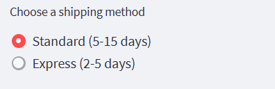

### st.columns

可以把streamlit的页面变成分列布局

```python
import streamlit as st

left_column, right_column = st.columns(2)
# You can use a column just like st.sidebar:
left_column.button("Press me!")

# Or even better, call Streamlit functions inside a "with" block:
with right_column:
    chosen = st.radio(
        "Sorting hat", ("Gryffindor", "Ravenclaw", "Hufflepuff", "Slytherin")
    )
    st.write(f"You are in {chosen} house!")

# 分完列再回归正常
add_slider = st.slider("Select a range of values", 0.0, 100.0, (25.0, 75.0))

# 然后再分列
left_column2, right_column2 = st.columns(2)
with left_column2:
    st.write("this is left")

with right_column2:
    st.write("this is right")

```

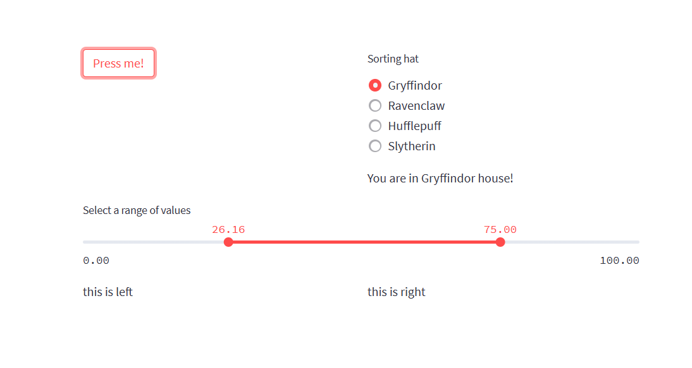

按比例分列

```python
import streamlit as st

left_column, right_column = st.columns([3, 1])
left_column.write("x" * 300)
right_column.write("x" * 100)
```

### st.tabs

[st.tabs - Streamlit Docs](https://docs.streamlit.io/library/api-reference/layout/st.tabs)

```python
import streamlit as st

tab1, tab2, tab3 = st.tabs(["Cat", "Dog", "Owl"])

with tab1:
   st.header("A cat")
   st.image("https://static.streamlit.io/examples/cat.jpg", width=200)

with tab2:
   st.header("A dog")
   st.image("https://static.streamlit.io/examples/dog.jpg", width=200)

with tab3:
   st.header("An owl")
   st.image("https://static.streamlit.io/examples/owl.jpg", width=200)
```

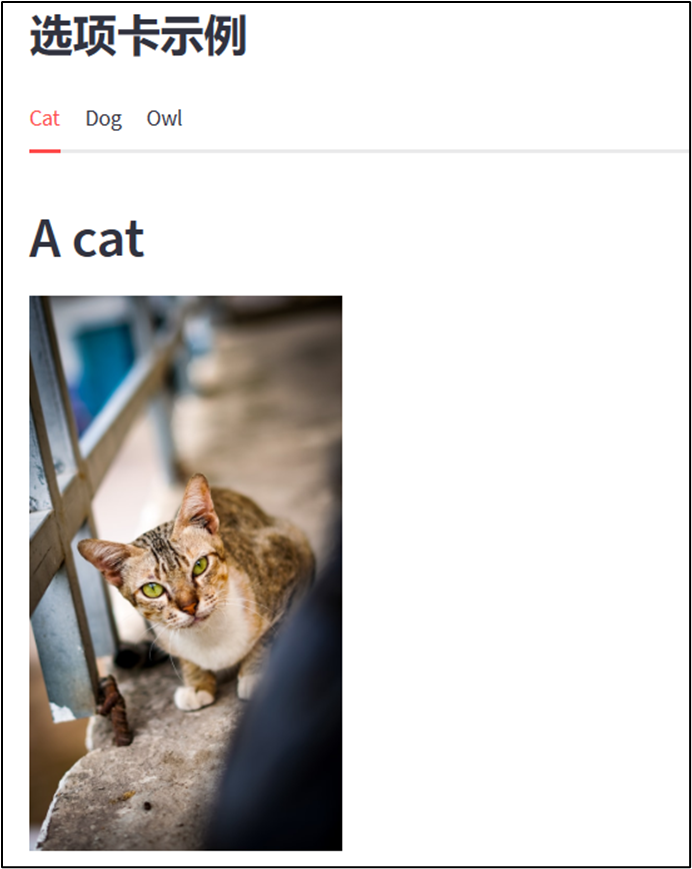

如何判断当前在哪个标签底下

### st.expander

[st.expander - Streamlit Docs](https://docs.streamlit.io/library/api-reference/layout/st.expander)

```python
import streamlit as st

st.bar_chart({"data": [1, 5, 2, 6, 2, 1]})

with st.expander("See explanation"):
    st.write(\"\"\"
        The chart above shows some numbers I picked for you.
        I rolled actual dice for these, so they're *guaranteed* to
        be random.
    \"\"\")
```

点击**See explanation** 即可展开折叠内容

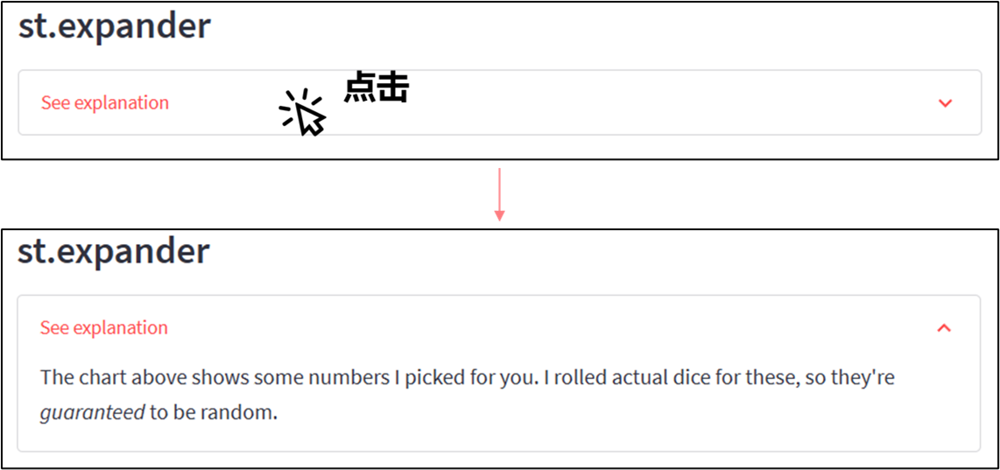

expander有点类似于container，可以在之后往expander内添加新的东西。

```python
import streamlit as st


expander = st.expander("##### example", expanded=True)

with expander:
    st.info("inner expander")

st.success("out of expander")

with expander:
    st.info("new inner expander")
```

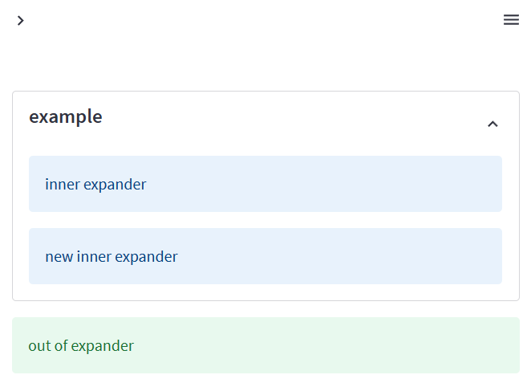


## 文本

大多数需求都可以用`st.markdown()`实现

```python
# 分隔线
st.markdown("---")

# 标题，效果同 st.subheader("标题")
st.markdown("### 标题")
```

文本标题

```python
st.markdown("### ")
```

显示代码

```python
code = """
def hello():
    print("Hello, Streamlit!")
"""
st.code(code, language='python')
```

​	显示颜色

```python
# 颜色
st.markdown(":red[提示]: 如何使用颜色")

# 颜色 + 加粗
st.markdown("**:red[提示]**: 如何使用颜色")
```


## 数据缓存

缓存的思想是存储耗时较长的函数调用结果。

当下次出现相同的输入时，直接返回缓存的结果，而不用重新调用函数。


使用`st.cache_data`装饰器或`st.cache_resource`

例：

```python
@st.cache_data
def foo(a, b):
    print(a, b)
```

当调用函数`foo()`时，streamlit会检查：

- 输入参数的值（a，b）
- 函数中的代码

如果这是 Streamlit 第一次看到这些参数值和函数代码，它将运行函数并将返回值存储在缓存中。

下次使用相同的参数和代码调用函数时（例如，当用户与应用程序交互时），Streamlit 将完全跳过执行函数并返回缓存的值。

在开发过程中，缓存会随着函数代码的更改而自动更新，从而确保最新的更改反映在缓存中。

`st.cache_data` 是缓存返回数据的计算的推荐方法：从 CSV 加载数据帧、转换 NumPy 数组、查询 API 或任何其他返回可序列化数据对象的函数（str、int、float、DataFrame、array、list等）。


`st.cache_resource` 是缓存全局资源（如 ML 模型或数据库连接）的推荐方法，这些资源是你不想多次加载的不可序列化对象。使用它，您可以在应用的所有重新运行和会话之间共享这些资源，而无需复制或重复加载。


示例

```python
import time

import pandas as pd
import streamlit as st


@st.cache_data  # 👈 Add the caching decorator
def load_data():
    time.sleep(3)
    df = pd.DataFrame([[1, 2, 3], [3, 4, 5]])
    return df


loading_text = st.markdown("data loading!")
df = load_data()
loading_text.text("success")

st.dataframe(df)

st.button("Rerun")

```

## 数据共享

使用[`st.session_state`](https://docs.streamlit.io/library/api-reference/session-state)进行页面间的数据传递

在主页中

```python
# main_page.py
if "value" not in st.session_state:
    st.session_state["value"] = 0

st.write("value", st.session_state["value"])

# session 与 部件关联
st.text_input("Your name", key="name")

# This exists now:
st.session_state.name
```

在子页面中

```python
import streamlit as st
import time

with st.empty():
    while st.session_state["value"] < 60:
        st.session_state["value"] += 1
        st.write(f'⏳ {st.session_state["value"]} have passed')
        time.sleep(0.1)
    st.write("✔️ over!")
```

当在子页面运行一段时间后，切换到其他页面，子页面的进度也仍然保留。

## 分页

[Multipage apps - Streamlit Docs📖](https://docs.streamlit.io/library/get-started/multipage-apps)


利用侧边栏可以切换页面

创建这样的目录结构

```
├── example
   ├── pages/
   │  ├── page_2.py
   │  └── page_3.py
   └── main_page.py
```

填入代码

`main_page.py`

```python
import streamlit as st

st.markdown("# Main page 🎈")
st.sidebar.markdown("# Main page 🎈")
```

`page_2.py`

```python
import streamlit as st

st.markdown("# Page 2 ❄️")
st.sidebar.markdown("# Page 2 ❄️")
```

`page_3.py`

```python
import streamlit as st

st.markdown("# Page 3 🎉")
st.sidebar.markdown("# Page 3 🎉")
```

运行

```
streamlit run main_page.py
```

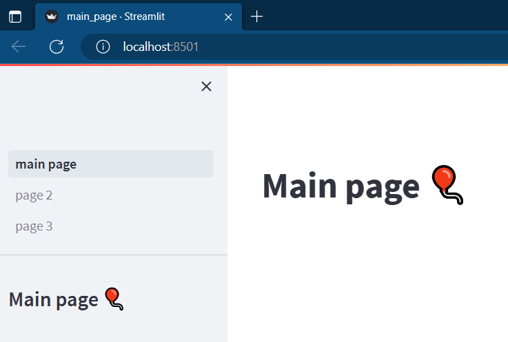

