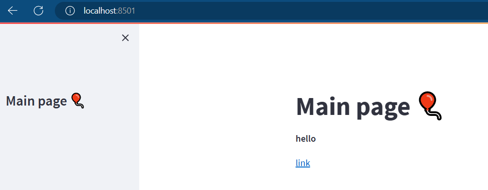

我希望实现一个学习案例，页面的右侧是各种测试案例，点进去可以实现我的测试

- 分隔线，类似Markdown的`---`怎么绘制
- 侧边栏怎么设置
- 文本字体怎么设置，比如想加粗或者设为标题`<H1>`
- 如何显示代码

副标题的设置

```python
st.subheader("sub header example")
```

显示代码文件

```python
import streamlit as st

code = '''def hello():
    print("Hello, Streamlit!")'''
st.code(code, language='python')
```


对于文本字体，可以直接

```python
import streamlit as st
st.markdown("# Main page 🎈")
st.sidebar.markdown("# Main page 🎈")

st.markdown("**hello**")
st.markdown("[link](https://docs.streamlit.io/library)")
```



配合bokeh

```python
import streamlit as st
from bokeh.plotting import figure

x = [1, 2, 3, 4, 5]
y = [6, 7, 2, 4, 5]

p = figure(
    title='simple line example',
    x_axis_label='x',
    y_axis_label='y')

p.line(x, y, legend_label='Trend', line_width=2)

st.bokeh_chart(p, use_container_width=True)
```

## 展示代码

比如现在有一个代码`demo.py`，然后要展示这个代码，以及它的结果。

怎么做？

### 数据传输

我在数据处理模块把数据处理完毕了，怎么传送到下一个模块？
