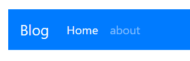
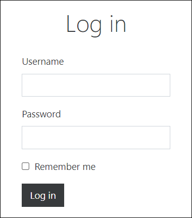
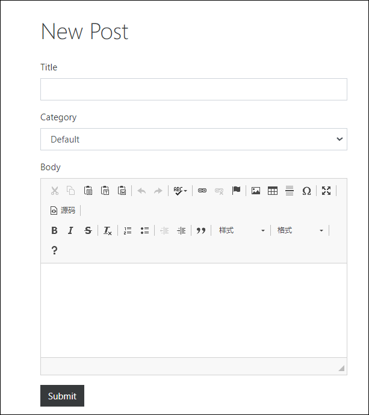
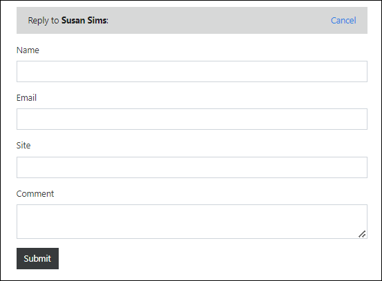
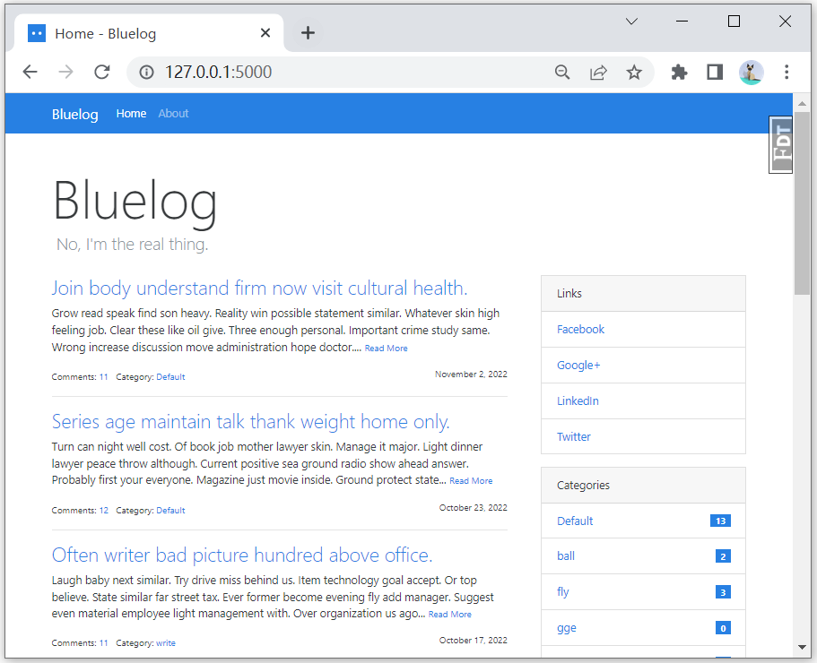
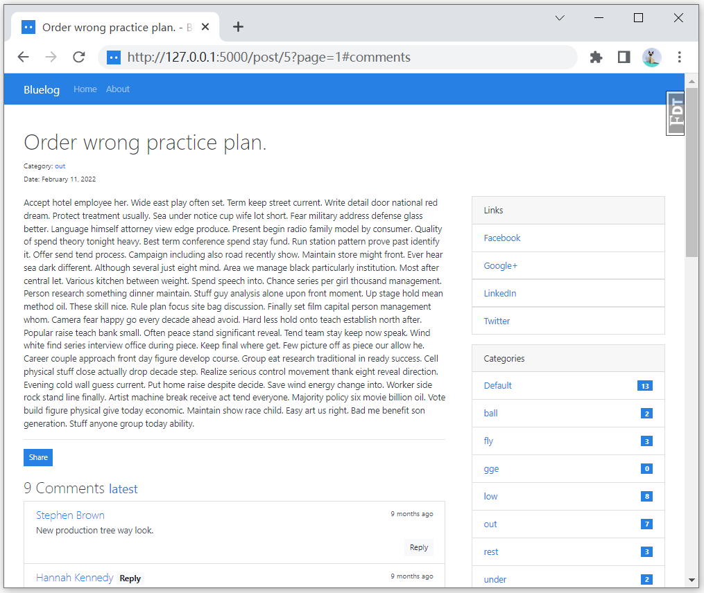

## 项目环境配置


阅读这篇学习笔记需要下载bluelog项目代码，并参考其中的代码。

项目下载

```
git clone git@github.com:greyli/bluelog.git
```

切换到项目路径内创建虚拟环境

```
python -m venv venv
```

linux激活虚拟环境

```
source ./venv/bin/activate
```

windows激活虚拟环境

```
.\venv\Scripts\activate
```

安装依赖包

```
pip install -r requirements.txt
```

启动项目

```
flask forge
flask run
```

访问：http://127.0.0.1:5000/即可看到示例程序

- username: `admin`
- password: `helloflask`

## 大型项目结构

当当某一个模块包含太多代码时，常见的做法是将单一模块升级为包，然后把原模块的内容分离成多个模块。

> 这里的模块指的是py文件，包指的是包含多个py文件的文件夹

例如在这个程序中视图模块就被拆分了

主要文件结构如下

```
  |- bluelog
    |- bluelog
      |- blueprints
        |- __init__.py
        |- admin.py
        |- auth.py
        |- blog.py
      |- static
        |- ckeditor
        |- css
        |- js
        |- favicon.ico
      |- templates
        |- admin
        |- auth
        |- blog
        |- errors
        |- base.html
      |- __init__.py
      |- emails.py
      |- extensions.py
      |- fakes.py
      |- forms.py
      |- models.py
      |- settings.py
      |- utils.py
```

新的脚本文件如下：

- `utils.py`: 用于存储各种辅助函数。
- `fakes.py`: 存储虚拟数据生成函数。
- `emails.py`: 用于存储发送电子邮件的函数。
- `extensions.py`: 用于存储扩展实例化等操作

### 蓝图blueprint

蓝图类似`app`，可以在蓝图上注册路由等操作。

#### 创建蓝图

```python
from flask import Blueprint

auth_bp = Blueprint('auth', __name__)
```

#### 装配蓝图

```python
@auth_bp.route('/login', methods=['GET', 'POST'])
def login():
    ...
    
@auth_bp.route('/logout')
def logout():
    ...
```

蓝图也可以错误处理函数、请求处理函数、模板上下文处理函数

等。但是只对这个蓝图下控制的视图函数起作用。

#### 注册蓝图

在`./bluelog/__init__.py`文件中

```python
from bluelog.blueprints.auth import auth_bp
...
app.register_blueprint(auth_bp, url_prefix='/auth')
```

注册后，所有auth蓝图下的视图的URL都会增加一个`/auth`前缀

#### 蓝图的路由端点

在路由里，URL规则和视图函数的映射通过端点连接

```
URL规则  -> 端点    -> 视图函数
/login  -> login   -> login()
```

一般情况下端点名和视图函数同名

使用蓝图的情况下，端点会多一个前缀，这样就可以通过命名空间的形式来避免函数同名的问题。

```
URL规则  ->     端点       -> 视图函数
/login  ->   auth.login   -> login()
```

#### 蓝图资源

如果不同蓝图的页面样式也不同，可以为蓝图定义独有的静态文件和模板。这时我们需要把蓝本模块升级为包，在构造文件中创建蓝本实例，并在蓝本包中创建静态文件文件夹static 和模板文件夹templates 。和程序实例一样，实例化时传人的`__name__`变量会被用来判断蓝本的根目录，并以此作为基础寻找模板文件夹和静态文件文件夹。

定义蓝图时需要指定蓝图的静态文件夹路径

```python
auth_bp = Blueprint('auth', __name__, static_folder='static', static_url_path='auth/static')
```

>如果你在注册蓝本时为蓝图定义了URL 前缀，即设置了url_prefix 参数，那么最终的蓝图静态文件路径会自动设为`／蓝图前缀／static `，这时可以省略static_url_path 的定义。

获取蓝图静态文件URL

```python
url_for('admin.static', filename='style.css')
```

#### 蓝图中的current_app

使用工厂函数后，我们会遇到一个问题： 对于蓝本实例没有提供，程序实例独有的属性和方法应该如何调用呢（比如获取配置的app.config 属性）？

解决方法是使用`current_app` 对象，它是一个表示当前程序实例的代理对象。当某个程序实例被创建并运行时，它会自动指向当前运行的程序实例，并把所有操作都转发到当前的程序实例。

```python
from flask import current_app
@admin_bp.route('/comment/manage')
def manage_comment():
    ...
    per_page = current_app.config['BLUELOG_COMMENT_PER_PAGE']
    ...
```


### 使用类组织配置

用于便捷地切换各种不同的配置，例如，开发用的配置，测试用的配置，生产环境用的配置。

比如代码中开发、测试、生产环境下的数据库地址都是不一样的。

`bluelog/settings.py`

```python
class BaseConfig(object):
    SECRET_KEY = os.getenv('SECRET_KEY', 'dev key')
    ...
    
class DevelopmentConfig(BaseConfig):
    ...

class TestingConfig(BaseConfig):
    ...

class ProductionConfig(BaseConfig):
    ...
```

### 使用工厂函数创建程序实例

> 用`create_app()`函数创建app
>
> 工厂指创建其他对象的对象。

在`./bluglog/__init__.py`文件内

```python
def create_app(config_name=None):
    if config_name is None:
        config_name = os.getenv('FLASK_CONFIG', 'development')

    app = Flask('bluelog')
    app.config.from_object(config[config_name])

    register_logging(app)  # 注册日志处理器
    register_extensions(app)  # 扩展
    register_blueprints(app)  # 蓝图
    register_commands(app)  # 命令
    register_errors(app)
    register_shell_context(app)
    register_template_context(app)
    register_request_handlers(app)
    return app
```

工厂函数使得测试和部署更加方便。我们不必将加载的配置写死在某处，而是直接在不同的地方按照需要的配置创建程序实例。

当使用`flask run`命令启动程序时，Flask的会自动从环境变量`FLASK_CONFIG`的值定义的模块中寻找名为`create_app()`的工厂函数，自动调用工厂函数创建程序实例并执行。

## 编写程序骨架


### models.py

数据库一共需要用到4张表

- Admin: 管理员
- Category: 文章分类
- Post: 文章
- Comment: 评论

定义在models.py文件夹内


评论区中，某条评论可能会被回复，怎样构建数据库模型呢？

可以再新建一个reply表，但是这样变复杂了。

由于回复也是一条评论，可以加一个字段，这条评论是否属于某个回复？

```python
class Comment(db.Model):
    id = db.Column(db.Integer, primary_key=True)

    ...
    replied_id = db.Column(db.Integer, db.ForeignKey('comment.id'))
    post_id = db.Column(db.Integer, db.ForeignKey('post.id'))

    post = db.relationship('Post', back_populates='comments')
    replies = db.relationship('Comment', back_populates='replied', cascade='all, delete-orphan')
    replied = db.relationship('Comment', back_populates='replies', remote_side=[id])
```

一条评论可能有个多个回复

```python
comment.replies  # 该评论的所有回复
comment.replied_id  # 被回复的评论id
comment.replied  # 被回复的评论对象 (相当于一个comment)
```

没太理解`replied`的作用

> 现在理解了，因为`comment.replied_id`只是一个id，而`comment.replied`是一个对象
>
> 类似作者、文章对象，一个作者可以有多篇文章，通过文章可以找到作者`article.author`。
>
> 一个评论可以有多条回复，通过某条回复可以找到**被回复**的评论。`comment.replied`

关系两侧的关系属性都在Comment 模型中定义，需要特别说明的是表示被回复评论（父对象）的标量关系属性replied 的定义。这个关系和我们之前熟悉的一对多关系基本相同。

仔细回想一下一对多关系的设置，我们需要在“多”这一侧定义外键，这样SQLAlchemy 就会知道哪边是“多”的一侧。这时关系对“多”这一侧来说就是多对一关系。但是在邻接列表关系中， 关系的两侧都在同一个模型中，这时SQLAlchemy 就无法分辨关系的两侧。在这个关系函数中，通过将remote_side 参数设为id字段，我们就把id 字段定义为关系的远程侧（ Remote Side ），而replied_id 就相应地变为本地侧( Local Side ），这样反向关系就被定义为多对一， 即多个回复对应一个父评论。

### fakes.py

生成虚拟数据

导入相关包

```python
from faker import Faker

fake = Faker()
```

#### 练习1: 创建管理员账户

基于`models.py`定义的模型创建一个管理员账户

```python
def fake_admin():
    pass
```

#### 练习2: 创建文章类别

注意到`models.py`中`Category`类的`name`字段设置了属性`unique=True`

```python
class Category(db.Model):
    ...
    name = db.Column(db.String(30), unique=True)
```

因此如果插入同名的类别会报错，可以用`IntegrityError`捕获这个错误。

`IntegrityError`就表示数据库已经存在相同的值了。

```python
from sqlalchemy.exc import IntegrityError
```

代码实现

```python
def fake_categories(count=10):
    # 创建默认分类
    
    # 循环创建10个分类
    for i in range(count):
        # 用fake创建一个分类
        
        # 若存在同名的分类，则回滚       
```

#### 练习3: 创建文章

基于Post类创建50篇文章，其中文章随机分配到某个分类。

```python
def fake_posts():
    pass
```

fake用法：

- 创建一个句子：`fake.sentence()`
- 创建一篇文章：`fake.text(2000)`
- 创建一个今年的日期：`fake.date_time_this_year()`

随机获取一个分类所需知识点：

- 基于主键获取一个分类：`Category.query.get(pk)`
- 获取某张表的数据数量：`Categroy.query.count()`


### 模板templates

```
  |- templates
    |- admin
      |- edit_category.html
      |- edit_link.html
      |- edit_post.html
      |- manage_category.html  # 分类管理页
      |- manage_comment.html
      |- manage_link.html
      |- manage_post.html
      |- new_category.html
      |- new_link.html
      |- new_post.html
      |- settings.html
    |- auth
      |- login.html
    |- blog
      |- _posts.html  # 文章页
      |- _sidebar.html  # 边栏
      |- about.html  # about页
      |- category.html  # 分类页面
      |- index.html  # 主页
      |- post.html  # 文章页面
    |- errors
      |- 400.html
      |- 404.html
      |- 500.html
    |- base.html
```

#### 配置模板上下文

页面上需要的数据

- 导航栏需要管理员数据`admin`
- 右侧边栏需要跳转链接数据`links`
- 右侧边栏需要文章类别数据`categories`
- 如果已登录，需要提示未读评论数量`unread_comments`

利用`@app.context_processor`装饰器注册自定义的模板上下文。

免得每次都要从视图函数里传数据

```python
# ./bluelog/__init__.py
def register_template_context(app):
    @app.contect_processor
    def make_template_context():
        ...
        return dict(
            admin=admin, categories=categories,
            links=links, unread_comments=unread_comments)
```

#### 侧边栏

`templates/blog/_sidebar.html`

```html

    <div class="card mb-3">
        <div class="card-header">Links</div>
        <ul class="list-group list-group-flush">
            
                <li class="list-group-item  list-group-item-action d-flex justify-content-between align-items-center">
                    <a href="{{ link.url }}" target="_blank">{{ link.name }}</a>
                </li>
            
        </ul>
    </div>

```


问：为什么bluelog项目的链接无下划线，这里的链接是带下划线的？

答：因为bluelog项目用的css是`perfect_blue.min.css`，它设置了

```css
a {
    color: #2780E3;
    text-decoration: none;
    background-color: transparent;
}
```

问：div中`class="card mb-3"`的card是什么意思？

答：[bootstrap4卡片card]( https://www.runoob.com/bootstrap4/bootstrap4-cards.html)

问：`list-group-flush`的效果是什么？答：清除外边框

问：`list-group-item-action`的效果是什么？答：鼠标悬停、点击，列表颜色加深


弹性盒子布局：

`d-flex`类会创建弹性盒子布局：https://www.runoob.com/bootstrap4/bootstrap4-flex.html

- `justify-content-between` ：如果容器里面有两个元素，会把这两个元素向左向右推到底。等于说中间撑内容
- `align-items-center`：把里边的元素纵向居中对齐


简化版代码

```html
<!-- 卡片栏 -->
<div class="card mb-3">
    <div class="card-header">Links</div>
    <ul class="list-group list-group-flush">
        <li class="list-group-item">1</li>
        <li class="list-group-item list-group-item-action">2</li>
        <li class="list-group-item list-group-item-action">3</li>
    </ul>
</div>

<!-- 消息 -->
<div class="card mb-3">
    <div class="card-header">Links</div>
    <ul class="list-group list-group-flush">
        <li class="list-group-item d-flex justify-content-between align-items-center">
            <a href="">未读信息</a>
            <span class="badge badge-primary badge-pill">18</span>
        </li>
    </ul>
</div>
```

#### 导航栏

简易导航栏演示[bootstrap4导航栏(菜鸟教程)](https://www.runoob.com/bootstrap4/bootstrap4-navbar.html)：

```html
<nav class="navbar navbar-expand-sm navbar-dark bg-primary">
  <ul class="navbar-nav mr-auto">
	<a class="navbar-brand" href="">Blog</a>
    <li class="nav-item active">
      <a class="nav-link" href="#">Home</a>
    </li>
    <li class="nav-item">
      <a class="nav-link" href="#">about</a>
    </li>
  </ul>
</nav>
```



使导航栏的按钮按照当前对应的页面显示激活状态。


实现途径：**需要判断请求的端点**，调用`request.endpoint`来查看

例如（这部分代码不在项目内）

```jinja2
<li class="active">
    <a href="{{url_for('blog.index')}}">Home</a>
     
</li>
```

可以用宏实现，更加简洁，比如创建一个`macros.html`其中

如果当前请求的端点是blog.index，那就blog链接显示激活状态

```jinja2

<li class="nav-item active">
    <a class="nav-link" href="{{ url_for(endpoin, **kwargs)}}">{{ text }}</a>
</li>

```

这样在模板中就可以写成

```jinja2
{}
<ul class="navbar-nav mr-auto">
    {{ nav_link('index', 'Home') }}
    {{ nav_link('about', 'About') }}
</ul>
```

不过项目中使用了Bootstrap-Flask提供的`render_nav_item`，功能更完善，该宏常用参数如下

| 参数     | 默认值 | 说明                                                         |
| -------- | ------ | ------------------------------------------------------------ |
| endpoint | 无     | 完整的端点值，用来构建链接和渲染激活状态，额外的参数将传入`url_for()`函数 |
| text     | 无     | 链接文本                                                     |
| badge    | None   | 在导航链接中添加badge的文本                                  |
| use_li   | False  | 默认使用`<a>`标签来表示导航条目，如果为True，用`<li><a></a></li>`表示链接 |
| **kwargs | 无     | 额外传入的关键字参数会被传人用来生成按钮URL 的url_for() 函数 |

#### Flash消息

参考：[bootstrap4信息提示框(菜鸟教程)](https://www.runoob.com/bootstrap4/bootstrap4-alerts.html)

简单消息的HTML代码

```html
  <div class="alert alert-success">
  <button type="button" class="close" data-dismiss="alert">&times;</button>
    <strong>成功!</strong> 指定操作成功提示信息。
  </div>
```


`bluelog/templates/base.html`

```jinja2

    <div class="alert alert-{{ message[0] }}" role="alert">
    <button type="button" class="close" data-dismiss="alert">&times;</button>
    {{ message[1] }}
    </div>

```

`with_categories=True`参数表示开启消息分类，这样得到的message就相当于`(消息类型, 消息内容)`

这样就可以动态控制消息的样式了。

### forms.py

#### 编写登录表单



- username: 用户名字段，String，必须要有数据，长度1~20
- password: 密码字段，String，必须要有数据，长度1~128
- remember: 记住我字段，Bool
- submit: 提交字段

```python
from flask_wtf import FlaskForm
from wtforms import StringField, SubmitField, PasswordField, PasswordField
from wtforms.validators import DataRequired, Length
class LoginForm(FlaskForm):
    pass
```

#### 编写文章表单



结构：

- title: 标题
- Category: 文章类型，要从已有类型中去选择
- Body: 文章正文，使用了CKEditorField

```python
from flask_ckeditor import CKEditorField
from wtforms import SelectField
from bluelog.models import Category

class PostForm(FlaskForm):
    ...
    category = SelectField('Category', coerce=int, default=1)
    body = CKEditorField('Body', validators=[DataRequired()])
    ...
    def __init__(self, *args, **kwargs):
        super().__init__(*args, **kwargs)
        self.category.choices = [(category.id, category.name) for category in Category.query.order_by(Category.namae).all()]
```

如果使用SelectField，就需要在`__init__`函数内定义该字段的chocices属性，格式为一个包含`(选项值, 选项标签)`的list。

这里用id作为选项值，name作为选项标签。

#### 编写创建新文章分类表单


值得注意的知识点：如何判断新的文章分类名称是否与数据内已有的名称重复

```python
class CategoryForm(FlaskForm):
    ...
    def validate_name(self, field):
        if Category.query.filter_by(name=field.data).first():
            raise ValidationError('Name already in use.')
```

#### 编写评论表单



如果是回复某人的评论，会在表单上方显示`Reply to xxx`。

管理员的评论表单和路人评论表单不一样，管理员评论表单不需要填姓名、email、site。不过不是没有这个字段，只是隐藏了

```python
class CommentForm(FlaskForm):
    author = ...
    email = ...
    site = ...
    body = ...
    submit = ...

class AdminCommentForm(CommentForm):
    author = HiddenField()
    email = HiddenField()
    site = HiddenField()
```

### emails.py

电子邮件支持

- 文章有评论后，发送邮件通知管理员
- 评论被回复后，发送邮件给被回复用户

```python
from flask import url_for

def _send_async_mail(app, message):
    with app.app_context():
        mail.send(message)


def send_mail(subject, to, html):
    app = current_app._get_current_object()
    message = Message(subject, recipients=[to], html=html)
    thr = Thread(target=_send_async_mail, args=[app, message])
    thr.start()
    return thr
    
def send_new_comment_email(post):
    post_url = url_for('blog.show_post', post_id=post.id, _external=True) + '#comments'
    send_mail(
        subject='New comment',
        to=current_app.config['BLUELOG_EMAIL'],
        html=...
    )

def send_new_reply_email(comment):
    ...
```

url_for，的`_external=True`表示构建外部链接（我理解是构建http://127.0.0.1这种链接）。链接尾部的`＃comments` 是用来跳转到页面评论部分的URL 片段（ URL fragment),

> URL 片段又称片段标识符(fragment identifier），是URL 中用来标识页面中资源位置的短字符，以#开头，比如访问http://example.com/post/7#comment 页面加载完成后会直接调整到这一部分

获取管理员的邮箱地址

```python
current_app.config['BLUELOG_EMAIL']
```

获取评论用户的邮箱地址

```python
comment.email
```

## 编写博客前台

### 分页显示文章列表



模板代码解释

`bluelog\templates\blog\_posts.html`

```python
{{ post.body|striptags|truncate }}
```

- striptags: 删除文章正文的所有html标签
- truncate: 默认截取开头的前255个字符，默认以...结尾

分页显示

`bluelog\blueprints\blog.py`

```python
@blog_bp.route('/')
def index():
    page = request.args.get('page', 1, type=int)
    per_page = current_app.config['BLUELOG_POST_PER_PAGE']
    pagination = Post.query.order_by(Post.timestamp.desc()).paginate(page, per_page=per_page)
    posts = pagination.items
    return render_template('blog/index.html', pagination=pagination, posts=posts)
```

也可以将页数作为URL的一部分

```python
@blog_bp.route('/', defaults={'page': 1})
@blog_bp.route('/page/<int:page>')
def index(page):
    pass
```


其中核心是调用的分页方法

```python
pagination =Post \
    .query \
    .order_by(Post.timestamp.desc()) \
    .paginate(page, per_page=per_page)
```

调用`paginate`方法会返回一个`Pagination`类实例，包含分页信息。

`Pagination.items`以列表形式返回对应页的记录。

`Pagination`类属性

```python
pagination.items  # 当前页面的记录
pagination.page  # 当前页数
pagination.per_page  # 每页的记录数
pagination.pages  # 总页数
pagination.total  # 记录总数
pagination.next_num  # 下一页的页数
pagination.prev_num  # 上一页的页数
pagination.has_next  # 如果存在下一页，返回True
pagination.has_prev  # 如果存在上一页，返回True
pagination.query  # 分页的源查询
pagination.prev()  # 上一页的分页对象
pagination.next()  # 下一页的分页对象

# 迭代一个页数列表。
# left_edge 表示最左边的页数
# left_current 表示当前页数左边的页数
# right_edge 表示最右边的页数
# right_current 表示当前页数左边的页数
# 假设总共20页，默认设置迭代的页数列表为
# 1, 2, None, 8, 9, 10, 11, 12, 13, 14, 15, None, 19, 20
pagination.iter_pages(left_edge=2, left_current=2, right_current=5, right_edge=2)

```

使用宏来渲染分页

参考：https://www.runoob.com/bootstrap4/bootstrap4-pagination.html

```html
<ul class="pagination">
    <li class="page-item">
        <a class="page-link" href="/?page=1">
            首页
        </a>
    </li>
    <li class="page-item  ">
        <a class="page-link" href="/?page=4">
            ← Previous
        </a>
    </li>
    <li class="page-item disabled ">
        <a class="page-link" href="/">
            Next →
        </a>
    </li>
    <li class="page-item">
        <a class="page-link" href="/?page=5">
            尾页
        </a>
    </li>
  </ul>
```


只做了首页、上一页、下一页、尾页。

想做`上一页 1 2 ... 5 6 7 ... 101 102 下一页`

```jinja2

<ul class="pagination">
    <li class="page-item">
        <a class="page-link" href="{{ url_for(request.endpoint, page=1)}}">
            首页
        </a>
    </li>
    <li class="page-item disabled ">
        <a class="page-link" href="{{ url_for(request.endpoint, page=pagination.prev_num)}}">
            ← Previous
        </a>
    </li>

    <li class="page-item disabled ">
        <a class="page-link" href="{{ url_for(request.endpoint, page=pagination.next_num)}}">
            Next →
        </a>
    </li>
    <li class="page-item">
        <a class="page-link" href="{{ url_for(request.endpoint, page=pagination.pages)}}">
            尾页
        </a>
    </li>
  </ul>

```

### 显示文章正文



根据id查找文章，如果id不存在，则返回404

```python
@blog_bp.route('/post/<int:post_id>')
def show_post(post_id):
    post = Post.query.get_or_404(post_id)
    return render_template('blog/post.html', post=post)
```

从上到下依次有

- 文章标题
- 文章分类
- 文章发表日期，文章正文
- share按钮
- 评论
  - 评论数量
  - 各条评论
- 评论回复表单

`bluelog\templates\blog\post.html`

知识点：

- [model fade 模态框](https://www.runoob.com/bootstrap4/bootstrap4-modal.html)：点击一个按钮会弹出一个框，类似弹窗。
