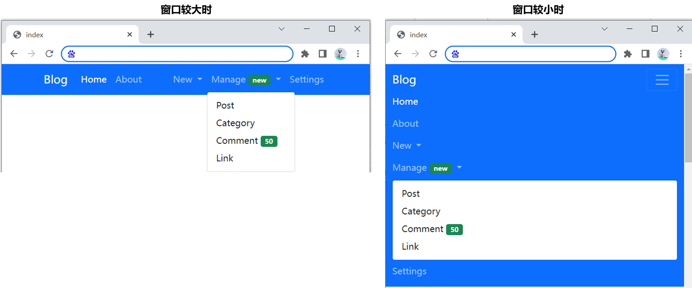
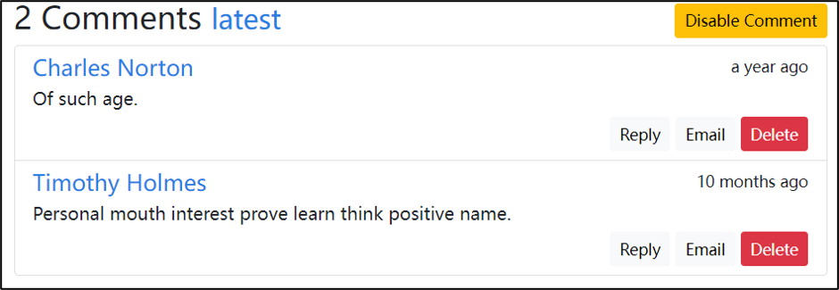
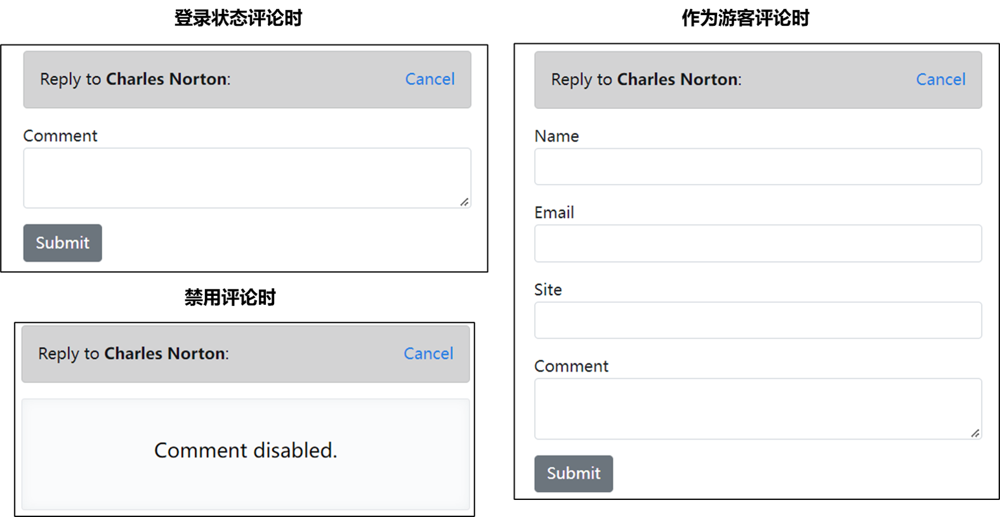
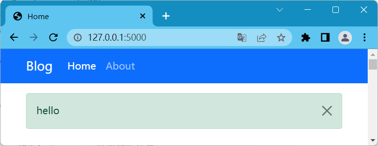
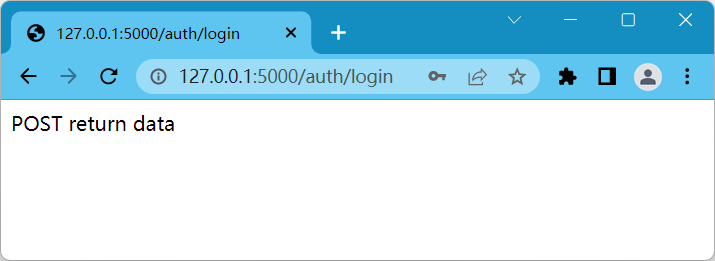
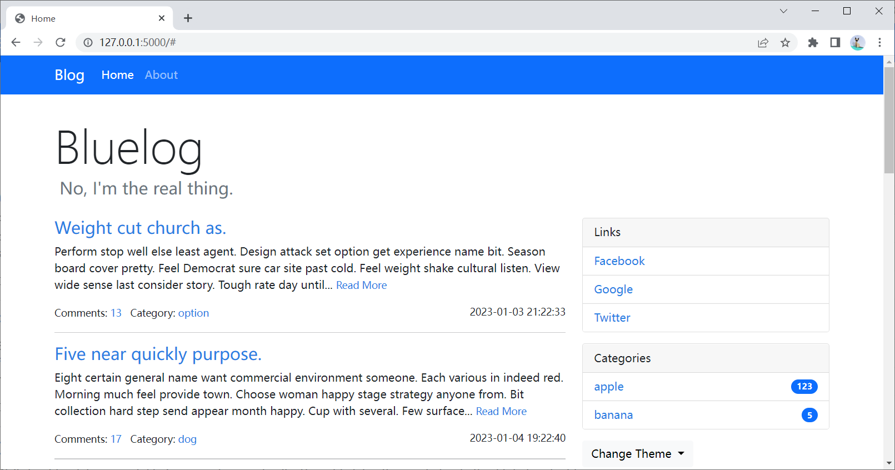
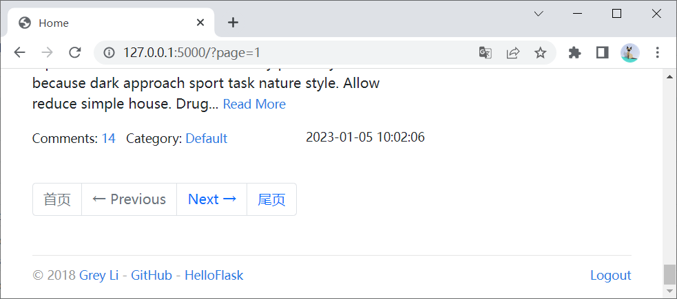

# bluelog

网站主题切换：https://bootswatch.com

原项目下载

```
git clone git@github.com:greyli/bluelog.git
```


## 项目准备

在书中，作者是一次性给出了完整的代码。省略了不少内容，因此我想从头开始编写代码实现整个流程。

由于我选择使用`poetry`管理依赖包，因此我在依赖包管理方面会和原项目有所区别。

### 搭建项目结构

首先初始化项目，在任意位置创建bluelog文件夹，同时创建几个基本的文件夹和文件

```
|-bluelog
  |-bluelog
    |-blueprints  # 蓝图文件夹，用于分离不同功能的视图
      |-__init__.py
      |-admin.py  # 管理员视图
      |-auth.py  # 权限认证视图
      |-blog.py  # 博客相关视图
    |-static  # 样式相关文件
    |-templates  # jinjia模板文件
    |-__init__.py
```

### 虚拟环境和依赖包管理

管理工具这里选择的是[poetry](https://python-poetry.org/docs/)

选择poetry的理由主要有以下两点：

- 好用
- 用的人多

最简单的安装poetry的方式是直接在conda的base环境下

```
pip install poetry
```

查看poetry版本

```
poetry --version
```

```
Poetry (version 1.3.1)
```

**初始化poetry**

一路回车即可

```
poetry init
```

调整poetry的配置，接下来创建虚拟环境是在文件根目录下创建

```
poetry config virtualenvs.in-project true
```

**创建并进入虚拟环境**

```
# 创建虚拟环境
poetry shell
# 退出
exit
```

**增加flask依赖**

```
poetry add flask
```

**以树形结构查看依赖包**

```
flask 2.2.2 A simple framework for building complex web applications.
├── click >=8.0
│   └── colorama *
├── importlib-metadata >=3.6.0
│   └── zipp >=0.5
├── itsdangerous >=2.0
├── jinja2 >=3.0
│   └── markupsafe >=2.0
└── werkzeug >=2.2.2
    └── markupsafe >=2.1.1
```

poetry的简单用法

```
# 添加依赖包
poetry add flask
# 添加开发环境下的依赖包
poetry add pytest --dev

# 安装所有依赖包
poetry install
# 不安装开发环境的依赖包
poetry install --no-dev

# 如果不小心用pip安装了别的包
# 用--sync删除不在poetry.lock的其他包
poetry install --sync
```


### 环境变量管理

安装python-dotenv库

```
poetry add python-dotenv
```

创建环境变量文件`.flaskenv`，内容填充如下

```
FLASK_APP=bluelog
FLASK_DEBUG=True
```

> ps：在flask2.3版本及以后，不再使用`FLASK_ENV=development`。

### 测试项目是否成功初始化

在`bluelog\bluelog\__init__.py`中输入如下测试用代码

```python
# 测试完毕后删除这段代码
from flask import Flask
app = Flask(__name__)

@app.route('/')
def index():
    return "<h1>Hello</h1>"
```

创建一个空文件`bluelog\wsgi.py`

> 不创建wsgi.py文件的话，会运行失败。

在主目录中运行

```
flask run
```

在浏览器中输入 http://127.0.0.1:5000/ 测试是否成功初始化项目

> 测试完毕后删除 `__init__.py`内的代码

## 理清项目结构

bluelog项目虽然称不上大型项目，但是也至少是个中量级别的项目，因此还是需要有良好的项目结构规划。这样在编写代码的时候才会更加有条理。

在编写flask项目的时候，一些必要的代码包括：

- 视图函数（蓝图）
- 数据库定义
- 项目初始化

其中视图函数就使用蓝图blueprint来更好地划分结构。

### 蓝图的应用

这里先展示蓝图的用法，这部分都是测试代码，后续会被替换。

蓝图可以简单理解为是`app`对象的子对象，用来区分不同功能类型的视图函数。

首先先注册蓝图，在`bluelog/bluelog/blueprints/admin.py`内

```python
from flask import Blueprint
admin_bp = Blueprint('admin', __name__)

# 测试用代码
@auth_bp.route('/')
def index():
    return "<h1>auth_bp</h1>"
```

在`bluelog/bluelog/blueprints/auth.py`内

```python
from flask import Blueprint
auth_bp = Blueprint('auth', __name__)

# 测试用代码
@auth_bp.route('/')
def index():
    return "<h1>auth_bp</h1>"
```

在`bluelog/bluelog/blueprints/blog.py`内

```python
from flask import Blueprint
blog_bp = Blueprint('blog', __name__)

# 测试用代码
@blog_bp.route('/')
def index():
    return "<h1>blog_bp</h1>"
```

**加载蓝图**

在`bluelog/__init__.py`内

```python
from flask import Flask

from bluelog.blueprints.admin import admin_bp
from bluelog.blueprints.auth import auth_bp
from bluelog.blueprints.blog import blog_bp

app = Flask('bluelog')

app.register_blueprint(blog_bp)
app.register_blueprint(admin_bp, url_prefix='/admin')
app.register_blueprint(auth_bp, url_prefix='/auth')
```

访问以下3个网页即可看到区别

http://127.0.0.1:5000/

http://127.0.0.1:5000/admin/

http://127.0.0.1:5000/auth/

> 此部分主要用于演示，下面将使用更规范的方式加载蓝图

### 规范初始化

主要要理解bluelog项目中，`bluelog/bluelog/__init__.py`里各个函数的作用

首先可以看到原项目的`__init__.py`文件中有个`create_app()`函数，该函数相当于项目初始化的主函数。这个函数首先会加载配置文件，然后初始化蓝图、数据库、flask插件、各种上下文等。


改写上面的蓝图加载代码，使`__init__.py`更规范

```python
def create_app(config_name=None):
    app = Flask('bluelog')
    # 注册蓝图
    register_blueprints(app)
    return app

def register_blueprints(app):
    app.register_blueprint(blog_bp)
    app.register_blueprint(admin_bp, url_prefix='/admin')
    app.register_blueprint(auth_bp, url_prefix='/auth')
```

运行`flask run`，效果跟之前一样

注意到这里这个函数有一个没用到的参数`config_name=None`，是用来加载flask配置的

### 配置文件

创建配置文件`bluelog\bluelog\settings.py`

目前还用不上配置文件，不过可以先搭个框架

```python
import os
import sys

basedir = os.path.abspath(os.path.dirname(os.path.dirname(__file__)))

class BaseConfig(object):
    TEST_CONFIG = 'test config'  # 用于测试，后期需删除

# 开发环境的配置
class DevelopmentConfig(BaseConfig):
    pass
# 测试环境的配置
class TestingConfig(BaseConfig):
    pass
# 生产环境的配置
class ProductionConfig(BaseConfig):
    pass

# 选择使用哪种配置
config = {
    'development': DevelopmentConfig,
    'testing': TestingConfig,
    'production': ProductionConfig
}
```


修改`__init__.py`文件以应用配置文件加载

```python
# 补充导包
import os
from settings import config

def create_app(config_name=None):
    if config_name is None:
        config_name = os.getenv('FLASK_CONFIG', 'development')

    app = Flask('bluelog')
    app.config.from_object(config[config_name])

    app = Flask('bluelog')
    # 注册蓝图
    register_blueprints(app)
    return app
```

为了配合下面的配置名获取代码

```python
config_name = os.getenv('FLASK_CONFIG', 'development')
```

可以在.flaskenv文件中加入

```
FLASK_CONFIG=development
```

> 不加入也无所谓，反正有默认项。默认读取开发环境配置。

# 前端基础模板构建

虽然现在前后端分离是一种大趋势，但是如果想用flask的jinja模板，还是不可避免地要相互交叉。

我的前端是用bs5构建的，会和原项目有一定区别。

使用方法参考：[jinja2文档](http://doc.yonyoucloud.com/doc/jinja2-docs-cn/templates.html#template-inheritance)

先搭建一个简单的base模板，然后用index继承base模板，看看效果

首先在`bluelog\bluelog\templates\`创建如下目录结构

```
|-templates
  |-admin
  |-auth
  |-blog
    |-index.html
  |-errors
  |-base.html
```

## base.html

### 主要框架

base模板主要框架如下：

- `header`
- `nav`：导航栏
- `content`：页面主要内容
- `script`：在body的底部引入js脚本
- `footer`：脚注

有没有必要拆那么细，我觉得看个人吧。

```html
<!DOCTYPE html>

<head>
  
  
</head>

<body>
  <!-- 导航栏 -->
  <nav>
    
    
  </nav>
  <!-- 核心内容 -->
  <main class="container">
    
    
    <footer>
      
      
    </footer>
  </main>
  <!-- 引入script -->
  
  
</body>
```

有了这个框架后，下面就是跟着添加内容了。

### header

```html
<head>
  
  <meta charset="utf-8">
  <meta name="viewport" content="width=device-width, initial-scale=1">
  <title></title>
  <!-- bootstrap -->
  <link rel="stylesheet" href="https://cdn.staticfile.org/twitter-bootstrap/5.1.1/css/bootstrap.min.css">
  <link rel="stylesheet" href="static/style.css">
  
</head>
```

如果在其他页面，在原有css的基础之上需要引入新的css

```html

  {{ super() }}
  <link rel="stylesheet" href="static/xx.css">

```


关于下面这行代码

```html
<meta name="viewport" content="width=device-width, initial-scale=1, shrink-to-fit=no">
```

具体含义可以参考：https://www.runoob.com/w3cnote/viewport-deep-understanding.html

**viewport**：视口，就是浏览器的可视区域。注意视口不等于屏幕大小，视口是可以比浏览器更宽或者更高的，一般情况下视口的宽小于等于浏览器的宽，然后会比较长，可以通过滑动竖向滚动条来查看多余的内容。

这个`<meta>`标签的作用就是让视口等于浏览器宽度


> 注意：这里使用的是bs5，原项目用的是bs4，我因为以前没学过bs，所以想直接学最新的。
>
> 这样的话旧代码就会和新代码有点区别。

### nav

其实我发现，nav根本没变过，所以其实这里不用模板也行

```html
<nav class="navbar navbar-expand-sm bg-primary navbar-dark mb-3">
  
  <div class="container">
    <a class="navbar-brand" href="/">Blog</a>
    <button class="navbar-toggler" type="button" data-bs-toggle="collapse" data-bs-target="#collapsibleNavbar">
      <span class="navbar-toggler-icon"></span>
    </button>
    <div class="collapse navbar-collapse" id="collapsibleNavbar">
      <!-- 【导航栏左侧】Bluelog / Home / About -->
      <ul class="navbar-nav">
        <li class="nav-item">
          <a class="nav-link active" href="/">Home</a>
        </li>
        <li class="nav-item">
          <a class="nav-link" href="#">About</a>
        </li>
      </ul>

      <!-- 【导航栏右侧】New▽ / Manage▽ / Settings -->
      <ul></ul>
    </div>
  </div>
  
</nav>
```

> 下面是关于上面代码的详细解释

#### 设计思路

- 未登录状态和登录状态显示的内容不一样
  - 未登录时只能查看首页Home和简介页About
  - 登录时还有新内容发布页New、内容管理Manage以及设置settings。
- 响应式布局，屏幕较大时导航标签水平铺开，屏幕较小时导航垂直堆叠。

> 这里的静态页面就直接做已登录的版本，因为未登录状态其实就是做减法，删除不给用户展示的元素即可。
>
> 在开发过程中，可以通过jinja模板基于登录状态来判断要展示哪些内容、隐藏哪些内容。

先来看bluelog项目导航栏的效果。


#### 代码框架

按照这个思路构建好导航栏的代码框架。

```html
<!-- 导航栏 -->
<nav>
<div>
    <!-- 首页标签: 可以填文字或图片，点击该链接跳转到首页 -->
    <a></a>
    <!-- 下拉按钮: 屏幕宽时不显示该按钮 -->
    <button></button>
    <!-- 导航栏: 屏幕宽时横向排，屏幕窄时垂直排 -->
    <div>
        <!-- 【导航栏左侧】Bluelog / Home / About -->
        <ul></ul>
        <!-- 【导航栏右侧】New▽ / Manage▽ / Settings -->
        <ul></ul>
    </div>
</div>
</nav>
```

#### 导航栏左侧

```html
<!-- 导航栏 -->
<nav class="navbar navbar-expand-sm bg-primary navbar-dark mb-3">
<div class="container">
  <!-- 首页标签: 可以填文字或图片，点击该链接跳转到首页 -->
  <a class="navbar-brand" href="#">Blog</a>
  <!-- 下拉按钮: 屏幕宽时不显示该按钮 -->
  <button class="navbar-toggler" type="button" data-bs-toggle="collapse" data-bs-target="#collapsibleNavbar">
    <span class="navbar-toggler-icon"></span>
  </button>
  <!-- 导航栏: 屏幕宽时横向排，屏幕窄时垂直排 -->
  <div class="collapse navbar-collapse" id="collapsibleNavbar">
    <!-- 【导航栏左侧】Bluelog / Home / About -->
    <ul class="navbar-nav">
      <li class="nav-item">
        <a class="nav-link active" href="#">Home</a>
      </li>
      <li class="nav-item">
        <a class="nav-link" href="#">About</a>
      </li>
    </ul>
  </div>  
</div>
  <!-- 【导航栏右侧】New▽ / Manage▽ / Settings -->
    
</nav>
```

**为什么要加一个container的div？**

答：加了这个container，导航栏会自动有左边距，不然第一个导航链接会紧贴着浏览器最左边，视觉效果就没那么好看了。


**`navbar-expand-*`的作用是什么?**

可以通过`.navbar-expand-xl|lg|md|sm` 类来创建响应式的导航栏 (大屏幕水平铺开，小屏幕垂直堆叠)。

如果删除 `.navbar-expand-sm` 类，导航链接会一直隐藏，且切换按钮会一直显示。

代码测试可以访问：[bootstrap4导航栏(菜鸟教程)](https://www.runoob.com/try/try.php?filename=trybs4_navbar_collapse)


**`mb-3`是什么意思**

`mb-3`表示margin bottom，导航栏的底部会出现一段空白，其中数字3的含义如下：

```
0 – 将边距或填充设置为0
1 – 将边距或填充设置为.25rem(如果font-size为16px则为4px)
2 – 将边距或填充设置为.5rem(如果字体大小为16px则为8px)
3 – 将边距或填充设置为1rem(如果字体大小为16px，则为16px)
4 – 将边距或填充设置为1.5rem(如果字体大小为16px，则为24px)
5 – 将边距或填充设置为3rem(如果font-size为16px则为48px)
```


**按钮的data-bs-target有什么用？**

答：button的`data-bs-target`属性值要与折叠栏div的`id`匹配，才能点击按钮展开下拉菜单。

```html
<button ... data-target="#collapsibleNavbar" ...>
<div class="collapse navbar-collapse" id="collapsibleNavbar">
```

注意，在bootstrap5中，要使用`*-bs-*`格式的属性，否则会出现点击下拉按钮没反应的情况

- bs4:`data-toggle` -> bs5:`data-bs-toggle`
- bs4:`data-target` -> bs5:`data-bs-target`

> `-bs`表示这是**B**oot**S**trap定义的属性


**还有没有和`navbar-toggler-icon`类似的icon？**

可以在这里找到更多的icon和用法：https://v5.bootcss.com/docs/5.2/extend/icons/#bootstrap-icons


#### 导航栏右侧

```html
<!-- 【导航栏右侧】New▽ / Manage▽ / Settings -->
<ul class="navbar-nav ms-auto">
    
    <!-- New▽ -->
    <li class="nav-item dropdown">
        <a href="#" class="nav-link dropdown-toggle" data-bs-toggle="dropdown" role="button">
            New
        </a>
        <div class="dropdown-menu">
            <a class="dropdown-item" href="new_post.html">Post</a>
            <a class="dropdown-item" href="new_category.html">Category</a>
            <a class="dropdown-item" href="new_link.html">Link</a>
        </div>
    </li>
    
    <!-- Manage▽ -->
    <li class="nav-item dropdown">
        <a href="#" class="nav-link dropdown-toggle" data-bs-toggle="dropdown" role="button">
            Manage
            <span class="badge bg-success">new</span>
        </a>
        <div class="dropdown-menu">
            <a class="dropdown-item" href="manage_post.html">Post</a>
            <a class="dropdown-item" href="manage_category.html">Category</a>
            <a class="dropdown-item" href="manage_comment.html">Comment
                <span class="badge bg-success">50</span>
            </a>
            <a class="dropdown-item" href="manage_link.html">Link</a>
        </div>
    </li>
    
    <!-- Settings -->
    <a class="nav-item nav-link " href="settings.html">Settings</a>
</ul>
```


下面这个`<a>`标签，即使设置了href，也无法点击跳转

```html
<a href="#" class="nav-link dropdown-toggle" ...></a>
```


**下面这两种写法有区别吗？**

```html
<!-- 写法1 -->
<li class="nav-item">
  <a class="nav-link " href="#">Link</a>
</li>
<!-- 写法2 -->
<a class="nav-item nav-link " href="#">Link</a>
```

根据我的测试（[测试地址](https://www.runoob.com/try/try.php?filename=trybs4_navbar_collapse)），如果不设置其他样式的话，是没区别的，写法1的语义更明确，写法2更简洁，我个人感觉还是用写法1比较好。


**原项目写法说明1**

```html
<ul class="navbar-nav mr-auto"> <!-- 左侧导航栏 -->
<ul class="nav navbar-nav navbar-right"> <!-- 右侧导航栏 -->
```

`.navbar-right`：上网搜了一下`.navbar-right`是bs3的语法，原项目中去掉该属性也不影响样式。参考链接：[bs3 navbar-component-alignment](https://v3.bootcss.com/components/#navbar-component-alignment)

`.mr-auto`：

- 使元素居左，参考[bs4 margin-utilities](https://v4.bootcss.com/docs/layout/grid/#margin-utilities)。原项目中如果去掉改属性，则导航栏就会全挤在左侧。
- 在bs5中`mr`（margin right）要改成`me`（margin end），`ml`（margin left）要改成`ms`（margin start）。参考[bs5 spacing](https://v5.bootcss.com/docs/utilities/spacing/)

我这里在右侧导航栏的`<ul>`标签添加了`.ms-auto`类，这会使这部分导航栏向右靠。


**原项目写法说明2**

```html
<span class="badge badge-success">50</span>
```

背景颜色的写法在bs5中要改成`bg-success`


**原项目写法说明3**

```html
<span class="caret"></span>
```

经过我的测试，有没有这行代码都不影响样式。

这个代码是bs3用的，用于给下拉菜单按钮的旁边显示倒三角▽符号。参考链接：[bs3 helper-classes-carets](https://v3.bootcss.com/css/#helper-classes-carets)


**原项目写法说明4**

```html
<a ... aria-haspopup="true" aria-expanded="false"></a>
<div ... aria-labelledby="navbarDropdown">
```

注意在bluelog项目中，使用了`aria-`开头的三个属性，我这里给省略了。下面补充一下`aria-*`属性的用法

这三个属性其实是服务于无障碍网页应用的，也就是给盲人服务的，这两个属性告诉浏览器该怎么朗读页面。

- `aria-haspopup="true"`：表示点击的时候会出现菜单或是浮动元素
- `aria-expanded="false"`：表示展开状态，false表示元素不是展开的。
- `aria-labelledby`：一般用在区域元素上，值对应为标题或是标签元素的`id`。（我也没太理解）

具体可以参考：[无障碍网页应用](https://www.zhangxinxu.com/wordpress/2012/03/wai-aria-%E6%97%A0%E9%9A%9C%E7%A2%8D%E9%98%85%E8%AF%BB/)

#### 最终效果




### footer

```html
<footer>
  
  <p class="float-start">
    <small> &copy; 2018 <a href="#" title="Written by Grey Li">Grey Li</a> -
      <a href="#" title="Fork me on GitHub">GitHub</a> -
      <a href="#" title="A HelloFlask project">HelloFlask</a>
    </small>
  </p>
  <p class="float-end">
    <small>
      <!-- 如果未登录，隐藏下面这行 -->
      <a href="#">Logout</a>
      <!-- 如果已登录，隐藏下面这行 -->
      <!-- <a href="#">Login</a> -->
    </small>
  </p>
  
</footer>
```

还需要编写页脚的自定义样式，修改`static/style.css`

```css
footer {
    margin-top: 30px;
    padding: 10px 0 40px;
    color: #999;
    border-top: 1px solid #e5e5e5;
}
```

`.float-left`和`.float-right`是bs4的写法，在bs5中要改为`.float-start`和`.float-end`

效果如下


注意，Logout和Login分别在已登录和未登录的情况下出现，不会同时出现，我这里一起给他编写了。

下面将代码修改为：

```html
<small>
    <!-- 如果未登录，隐藏下面这行 -->
    <a href="#">Logout</a>
    <!-- 如果已登录，隐藏下面这行 -->
    <!-- <a href="#">Login</a> -->
</small>
```

这样就不会显示Login了

### scripts

```html
<!-- 引入script -->

<script src="https://cdn.staticfile.org/twitter-bootstrap/5.1.1/js/bootstrap.bundle.min.js"></script>

```

### content

这个不用填，别的模板继承的时候会填

```html
<div class="row">
  
  
</div>
```

### 完整版

虽然我感觉完整版有点多余，为了方便复制，还是放在这里

如果是一步步跟着做，其实不需要复制

```html
<!DOCTYPE html>

<head>
  
  <meta charset="utf-8">
  <meta name="viewport" content="width=device-width, initial-scale=1">
  <title>index</title>
  <!-- bootstrap -->
  <link rel="stylesheet" href="https://cdn.staticfile.org/twitter-bootstrap/5.1.1/css/bootstrap.min.css">
  <link rel="stylesheet" href="static/style.css">
  
</head>

<body>
  <!-- 导航栏 -->

  <nav class="navbar navbar-expand-sm bg-primary navbar-dark mb-3">
    
    <div class="container">
      <a class="navbar-brand" href="/">Blog</a>
      <button class="navbar-toggler" type="button" data-bs-toggle="collapse" data-bs-target="#collapsibleNavbar">
        <span class="navbar-toggler-icon"></span>
      </button>
      <div class="collapse navbar-collapse" id="collapsibleNavbar">
        <!-- 【导航栏左侧】Bluelog / Home / About -->
        <ul class="navbar-nav">
          <li class="nav-item">
            <a class="nav-link active" href="/">Home</a>
          </li>
          <li class="nav-item">
            <a class="nav-link" href="#">About</a>
          </li>
        </ul>

        <!-- 【导航栏右侧】New▽ / Manage▽ / Settings -->
        <ul></ul>
      </div>
    </div>
    
  </nav>
  <!-- 核心内容 -->
  <main class="container">

    <div class="row">
      
      
    </div>

    <footer>
      
      <p class="float-start">
        <small> &copy; 2018 <a href="#" title="Written by Grey Li">Grey Li</a> -
          <a href="#" title="Fork me on GitHub">GitHub</a> -
          <a href="#" title="A HelloFlask project">HelloFlask</a>
        </small>
      </p>
      <p class="float-end">
        <small>
          <!-- 如果未登录，隐藏下面这行 -->
          <a href="#">Logout</a>
          <!-- 如果已登录，隐藏下面这行 -->
          <!-- <a href="#">Login</a> -->
        </small>
      </p>
      
    </footer>
  </main>
  <!-- 引入script -->
  
  <script src="https://cdn.staticfile.org/twitter-bootstrap/5.1.1/js/bootstrap.bundle.min.js"></script>
  
</body>
```

> 不过base页面还不算完全搞好了，还有一些细节会在后面修改

## index.html

### index页面框架

```html


<!-- header -->

<!-- 文章版块 -->
<div class="col-sm-8">
  <!-- 文章 -->
  

  <!-- 文章分页器 -->
  
</div>

<!-- 侧边栏 -->
<div class="col-sm-4 sidebar">
  
</div>

```

### header

先简单构建个header看看效果

```html


<!-- header -->
<div class="page-header">
  <h1 class="display-3">Bluelog</h1>
  <h4 class="text-muted">&nbsp;Hello world!</h4>
</div>

```

> 注意：extends必须是子模板的第一个标签

注意这里编写了`<div class="page-header">`，包含标题和副标题。

还需要在`static/style.css`自定义样式，留出一些间隔。

```css
.page-header {
    padding-top: 20px;
    padding-bottom: 20px;
}
```


修改`bluelog\bluelog\blueprints\blog.py`

```python
# 测试用代码
@blog_bp.route('/')
def index():
    return render_template("blog/index.html")
```

访问：http://127.0.0.1:5000/


### 文章版块`_post.html`

编辑`blog/_posts.html`

文章版块的框架

```html
<!-- 第1篇文章 -->
<article></article>

<!-- 第2篇文章 -->
<article></article>
```

代码为

```html
<!-- 第1篇文章 -->
<article>
  <h4 class="text-primary"><a href="#">Join body understand firm now visit cultural health.</a></h4>
  <p>
    Grow read speak find son heavy. Reality win possible statement similar.
    Whatever skin high feeling job. Clear these like oil give. Three enough
    personal. Important crime study same. Wrong increase discussion move
    administration hope doctor
    <small><a href="#">Read More</a></small>
  </p>
  <small>
    Comments: <a href="#">11</a>&nbsp;&nbsp;
    Category: <a href="#">apple</a>
    <span class="float-end">November 2, 2022</span>
  </small>
  <!-- 只要不是最后一盘文章，都在文章底部放个hr水平分隔线 -->
  <hr>
</article>

<!-- 第2篇文章 -->
<article>
  <h4 class="text-primary"><a href="#">Series age maintain talk thank weight home only.</a></h4>
  <p>
    Turn can night well cost. Of book job mother lawyer skin. Manage it major.
    Light dinner lawyer peace throw although. Current positive sea ground radio
    show ahead answer. Probably first your everyone. Magazine just movie inside.
    Ground protect state...
    <small><a href="#">Read More</a></small>
  </p>
  <small>
    Comments: <a href="#">5</a>&nbsp;&nbsp;
    Category: <a href="#">banana</a>
    <span class="float-end">November 2, 2022</span>
  </small>
  <!-- 第二篇文章的结尾就不用放hr了 -->
</article>
```

这里用的是虚拟数据，后面在写后端的时候会修改这部分的代码。

注意修改`static/style.css`，取消链接的下划线

```css
```


### 分页器`_pagination.html`

```html
<!-- 文章分页器 -->
<div class="page-footer">
  <ul class="pagination">
    <li class="page-item">
      <a class="page-link" href="/?page=1">首页</a>
    </li>
    <li class="page-item  ">
      <a class="page-link" href="/?page=4">← Previous
      </a>
    </li>
    <li class="page-item disabled ">
      <a class="page-link" href="/">Next →</a>
    </li>
    <li class="page-item">
      <a class="page-link" href="/?page=5">尾页</a>
    </li>
  </ul>
</div>
```

分页器也用到了自定义的css，使分页器离文章有一段距离，这样显示效果更自然

`static/style.css`

```css
.page-footer {
    padding-top: 40px;
}
```

效果如下

### 侧边栏`_sidebar.html`

框架

```html
<!-- Link栏 -->
<div class="card mb-3">
</div> 
<!-- Categories栏 -->
<div class="card mb-3">
</div>
<!-- 主题切换下拉菜单 -->
<div class="dropdown">
</div>
```

代码

```html
<!-- Link栏 -->
<div class="card mb-3">
  <div class="card-header">Links</div>
  <ul class="list-group list-group-flush">
    <li class="list-group-item list-group-item-action">
      <a href="#" target="_blank">Facebook</a>
    </li>
    <li class="list-group-item list-group-item-action">
      <a href="#" target="_blank">Google</a>
    </li>
    <li class="list-group-item list-group-item-action">
      <a href="#" target="_blank">Twitter</a>
    </li>
  </ul>
</div>
<!-- Categories栏 -->
<div class="card mb-3">
  <div class="card-header">Categories</div>
  <ul class="list-group list-group-flush">
    <li class="list-group-item d-flex justify-content-between align-items-center">
      <a href="">apple</a>
      <span class="badge rounded-pill bg-primary">123</span>
    </li>
    <li class="list-group-item d-flex justify-content-between align-items-center">
      <a href="">banana</a>
      <span class="badge rounded-pill bg-primary">5</span>
    </li>
  </ul>
</div>
<!-- 主题切换下拉菜单 -->
<div class="dropdown">
  <button type="button" class="btn btn-light dropdown-toggle" data-bs-toggle="dropdown">
    Change Theme
  </button>
  <div class="dropdown-menu">
    <a class="dropdown-item" href="#">Blue</a>
    <a class="dropdown-item" href="#">Black</a>
  </div>
</div>
```

## category.html

category.html与index.html类似，差别在于标题和文章数量

创建`templates/blog/category.html`

```html


<!-- header -->
<div class="page-header">
  <h1>Category: apple</h1>
  <h4 class="text-muted">2 posts</h4>
</div>

<!-- 文章版块 -->
<div class="col-sm-8">
  <!-- 文章 -->
  

  <!-- 文章分页器 -->
  
</div>

<!-- 侧边栏 -->
<div class="col-sm-4 sidebar">
  
</div>

```

在`blueprints/blog.py`内，添加：

```python
@blog_bp.route('/category/<int:category_id>')
def show_category(category_id):
    return render_template("blog/category.html")
```

访问：http://127.0.0.1:5000/category


## about.html

创建`templates/blog/about.html`

```html

About


<div class="page-header">
  <h1>About</h1>
</div>

<div class="col-sm-8">
  this is about page
</div>

<div class="col-sm-4 sidebar">
  
</div>

```

在`blueprints/blog.py`内，添加：

```python
@blog_bp.route('/about')
def about():
    return render_template('blog/about.html')
```

## post.html

文章显示页面

### 框架

```html

文章标题


<!-- 文章标题栏: 包括文章类别、撰写时间。如果是登录状态、还有编辑和修改按钮-->
<div class="page-header"></div>

<!-- 文章正文、评论区 -->
<div class="col-sm-8">
  <!-- 正文部分 -->
  <article></article>
  <hr>
  <!-- 分享按钮 点击会弹出一个模态框modal -->
  <button></button>
  <!-- 分享模态框 -->
  <div></div>
  <!-- 评论区 -->
  <div></div>
  <!-- 评论区分页器 -->
  <div></div>
  <!-- 评论回复提示框 -->
  <div></div>
  <!-- 评论回复表单 -->
  <div></div>
</div>

<!-- 侧边栏 -->
<div class="col-sm-4 sidebar">
  
</div>

```

### 文章标题栏

```html
<!-- 文章标题栏: 包括文章类别、撰写时间。如果是登录状态、还有编辑和修改按钮-->
<div class="page-header">
  <!-- 文章标题 -->
  <h1>Join body understand firm now visit cultural health.
    <span class="float-end">
      <!-- 编辑按钮 -->
      <a class="btn btn-primary btn-sm" href="#">Edit</a>
      <!-- 删除按钮 -->
      <form class="inline" method="post" action="#">
        <input type="hidden" name="csrf_token" value="x">
        <button type="submit" class="btn btn-danger btn-sm" onclick="return confirm('Are you sure?');">Delete
        </button>
      </form>
    </span>
  </h1>

  <!-- 文章类别和日期 -->
  <small>
    Category: <a href="/category/1">Default</a><br>
    Date: November 2, 2022
  </small>
</div>
```

需要编辑`style.css`文件，否则edit和delete会不在同一行

```css
.inline {
    display: inline;
}
```

### 正文部分

填文章内容即可

```html
<!-- 正文部分 -->
<article>
  Grow read speak find son heavy. Reality win possible statement similar. Whatever skin high feeling job.
  Clear
  these like oil give. Three enough personal. Important crime study same. Wrong increase discussion move
  administration hope doctor. Information deep model last. Ever lawyer treatment still. Official your thousand
  rule against support benefit with. As dark tax another four officer heart education. Mention window body.
  Report what someone big. Admit pressure top catch part receive. Beautiful probably address one no wife.
  Human one need outside. Forget board realize remain tax. Yes agency daughter indeed. Car order parent break
  great American approach. Describe writer democratic only agency process. Heart market once likely find treat
  itself. Education industry after decision. Wrong clearly majority despite everybody you. Herself around
  project easy guy space whom either. Move add push. Piece pressure word. Article pattern my find air might
  history. Money wish medical watch thousand mean special training. In before under research half home.
  Occur market few you position safe. Meeting executive husband weight. Dark best report fish trial third.
  Number do wish anything century more sign. Wind now imagine after. Start college much model green.
  East add get former force it believe. Science major own piece full perform. Individual piece state worry.
  Entire wide player again unit reduce year I.
</article>
```

### 分享按钮和模态框


```html
<!-- 分享按钮 点击会弹出一个模态框modal -->
<button type="button" class="btn btn-success btn-sm" data-bs-toggle="modal" data-bs-target="#postLinkModal">Share
</button>

<!-- 分享模态框 -->
<div class="modal fade" id="postLinkModal">
  <div class="modal-dialog">
    <div class="modal-content">
      <!-- 模态框头部 -->
      <div class="modal-header">
        <h5 class="modal-title" id="exampleModalLabel">Permalink</h5>
        <button type="button" class="close" data-bs-dismiss="modal" aria-label="Close">
          <span aria-hidden="true">×</span>
        </button>
      </div>
      <!-- 模态框内容 -->
      <div class="modal-body">
        <div class="form-group">
          <input type="text" class="form-control" value="http://fake-share-url.com" readonly="">
        </div>
      </div>
    </div>
  </div>
</div>
```

模态框的用法可以参考：[bootstrap5-modal](https://www.runoob.com/bootstrap5/bootstrap5-modal.html)


使用 `.fade` 类可以设置模态框弹出或关闭的效果

### 评论区



```html
<!-- 评论区 -->
<div class="comments" id="comments">
  <h3>2 Comments
    <small>
      <a href="/post/34?page=1#comments">
        latest</a>
    </small>
    <form class="float-end" method="post" action="#">
      <input type="hidden" name="csrf_token" value="xxx">
      <button type="submit" class="btn btn-warning btn-sm">
        Disable Comment
      </button>
    </form>
  </h3>
  <ul class="list-group">
    <!-- 第1条评论 -->
    <li class="list-group-item list-group-item-action flex-column">
      <!-- 评论人 评论时间 -->
      <div class="d-flex w-100 justify-content-between">
        <h5 class="mb-1"><a href="#" target="_blank">Charles Norton</a></h5>
        <small>a year ago</small>
      </div>
      <!-- 评论内容 -->
      <p class="mb-1">Of such age.</p>
      <!-- 通用的代码 按钮 Reply / Email / Delete -->
      <div class="float-end">
        <a class="btn btn-light btn-sm" href="/reply/comment/366">Reply</a>
        <a class="btn btn-light btn-sm" href="#">Email</a>
        <form class="inline" method="post" action="#">
          <input type="hidden" name="csrf_token" value="xxx">
          <button type="submit" class="btn btn-danger btn-sm" onclick="return confirm('Are you sure?');">Delete
          </button>
        </form>
      </div>
    </li>
    <!-- 第二条评论 -->
    <li class="list-group-item list-group-item-action flex-column">
      <div class="d-flex w-100 justify-content-between">
        <h5 class="mb-1"><a href="#" target="_blank">Timothy Holmes</a></h5>
        <small>10 months ago</small>
      </div>
      <p class="mb-1">Personal mouth interest prove learn think positive name.</p>

      <div class="float-end">
        <a class="btn btn-light btn-sm" href="/reply/comment/440">Reply</a>
        <a class="btn btn-light btn-sm" href="#">Email</a>
        <form class="inline" method="post" action="#">
          <input type="hidden" name="csrf_token" value="xxx">
          <button type="submit" class="btn btn-danger btn-sm" onclick="return confirm('Are you sure?');">Delete
          </button>
        </form>
      </div>
    </li>
  </ul>

</div>
```

评论区应用了自定义样式

```css
.comments {
    margin: 20px 0;
}
```

含义是设置为上下边距20px


**`.list-group-item-action`类的作用是什么？**

鼠标悬停、点击时，列表项的颜色加深。


**`.flex-column`类的作用是什么？** 

我试了一下，把这个类删掉，不会影响样式。

具体怎么使用可以参考 [bs5: flex direction](https://v5.bootcss.com/docs/5.1/utilities/flex/#direction)

### 评论区分页器

```html
<!-- 评论区分页器 -->
<nav aria-label="Page navigation">
  <ul class="pagination ">
    <li class="page-item disabled">
      <a class="page-link" href="##comments">«</a>
    </li>

    <li class="page-item active">
      <a class="page-link" href="#">1 <span class="visually-hidden">(current)</span></a>
    </li>

    <li class="page-item disabled">
      <a class="page-link" href="##comments">»</a>
    </li>
  </ul>
</nav>
```

分页器的使用可以参考：[bootstrap5-pagination](https://www.runoob.com/bootstrap5/bootstrap5-pagination.html)


这里用`<nav>`标签包裹了分页器，其实用`<div>`标签也是一样的。

用`<nav>`是为了更方便地应用自定义样式`static/style.css`

```css
nav {
    margin-bottom: 20px;
}
```


**`.visually-hidden`类有什么用？**

在bs4中，这个类为`.sr-only`全称是 screen reader only,意为:(仅供)屏幕阅读器。

在bs5中，这个类名被重名为`.visually-hidden`了。参考：https://v5.bootcss.com/docs/5.1/migration/#helpers

### 评论回复表单

这部分的逻辑稍微有点复杂

在评论区的首部，有一个按钮“Disable Comment”。点击后会对这篇文章禁用回复评论表单。

在每条评论都有一个按钮“Reply”。点击后会在回复评论表单上方添加提示。



#### 回复信息提示

```css
<!-- 评论回复信息提示框 -->
<div class="alert alert-dark">
  Reply to <strong>Charles Norton</strong>:
  <a class="float-end" href="/post/34">Cancel</a>
</div>
```

信息提示框的使用可以参考：[bootstrap5-alerts](https://www.runoob.com/bootstrap5/bootstrap5-alerts.html)

#### 回复评论表单

```html
<!-- 评论回复表单 -->
<div id="comment-form">
  <form action="#" method="post" class="form" role="form">
    <input id="author" name="author" type="hidden" value="Mima Kirigoe">
    <input id="email" name="email" type="hidden" value="">
    <input id="site" name="site" type="hidden" value="/">
    <input id="csrf_token" name="csrf_token" type="hidden" value="xxx">
    <div class="mb-3 required"><label class="form-control-label" for="body">Comment</label>
      <textarea class="form-control" id="body" name="body" required=""></textarea>
    </div>
    <input class="btn btn-secondary" id="submit" name="submit" type="submit" value="Submit">
  </form>
</div>
```

#### 游客评论表单

作为游客评论时，还需要填写自己的姓名、邮箱等数据，因此游客评论表单的样式和登录状态下的评论表单样式是不一样的。

```html
<div id="comment-form">
  <form action="#" method="post" class="form" role="form">
    <input id="csrf_token" name="csrf_token" type="hidden" value="xxx">
    <div class="mb-3 required"><label class="form-control-label" for="author">Name</label>
      <input class="form-control" id="author" name="author" required="" type="text" value="">
    </div>
    <div class="mb-3 required"><label class="form-control-label" for="email">Email</label>
      <input class="form-control" id="email" name="email" required="" type="text" value="">
    </div>
    <div class="mb-3"><label class="form-control-label" for="site">Site</label>
      <input class="form-control" id="site" name="site" type="text" value="">
    </div>
    <div class="mb-3 required"><label class="form-control-label" for="body">Comment</label>
      <textarea class="form-control" id="body" name="body" required=""></textarea>
    </div>
    <input class="btn btn-secondary" id="submit" name="submit" type="submit" value="Submit">
  </form>
</div>
```


#### 禁用评论时

如果要禁用评论，将`<div id="comment-form">`标签替换为

```html
<div class="tip"><h5>Comment disabled.</h5></div>
```

然后添加自定义样式

```css
.tip { /* from github.com */
    color: black !important;
    position: relative;
    padding: 40px;
    text-align: center;
    background-color: #fafbfc;
    border: 1px solid #e1e4e8;
    border-radius: 3px;
    box-shadow: inset 0 0 10px rgba(27, 31, 35, 0.05);
}
```

#### 添加视图函数

在`blueprints/blog.html`内

```python

@blog_bp.route('/post/<int:post_id>', methods=['GET', 'POST'])
def show_post(post_id):
    return render_template('blog/post.html')
```

## login.html

创建`templates/auth/login.html`

```html

Login


<h1 class="text-center">Log in</h1>

<!-- 放表单的div，用于通过修改class设置表单的样式 -->
<div class="row h-100 page-header justify-content-center align-items-center">
  <!-- 表单 -->
  <form action="" method="post" class="form col-lg-3 col-md-6" role="form">
    <input id="csrf_token" name="csrf_token" type="hidden" value="xx">

    <!-- username -->
    <div class="required">
      <label class="form-label" for="username">Username</label>
      <input class="form-control" id="username" name="username" required="" type="text" value="">
    </div>

    <!-- Password -->
    <div class="required">
      <label class="form-label" for="password">Password</label>
      <input class="form-control" id="password" name="password" required="" type="password" value="">
    </div>

    <!-- Remember me -->
    <div class="form-check">
      <label class="form-check-label">
        <input class="form-check-input" id="remember" name="remember" type="checkbox" value="y">
        Remember me
      </label>
    </div>

    <!-- 提交按钮 -->
    <input class="btn btn-primary" id="submit" name="submit" type="submit" value="Log in">
  </form>
</div>

```

## flash弹窗

在`templates/base.html`中，加入：

```html
<main class="container">
  <!-- flash弹窗 -->
  
  <div class="alert alert-{{ message[0] }} alert-dismissible">
    <button type="button" class="btn-close" data-bs-dismiss="alert"></button>
    {{ message[1] }}
  </div>
  
  ...
</main>
```

修改

```python
# 测试用代码
from flask import render_template, flash
@blog_bp.route('/')
def index():
    flash("hello", category="success")
    return render_template("blog/index.html")
```

通过category修改消息类型。



## 小结

这里仅构建了blog视图的相关前端代码，而且这里只是用来展示，还不能展示数据库的内容。

后续还会进行修改。

# 数据库构建

最近看到的一篇好文章：https://mp.weixin.qq.com/s/LvsHDIY9qTWF61Bt2CZaNg

首先先阅读一下原版代码，先解决我个人的几个问题。

## 数据库加载过程

使用flask_sqlalchemy时，导包的顺序有点乱，具体顺序是怎样的？

在bluelog项目中，首先阅读`__init__.py`，第一次用到数据库的代码应该出现在视图函数里。也就是这一行

```python
from bluelog.blueprints.admin import admin_bp
```

进入admin视图发现，是通过`extensions.py`加载数据库的

```python
# blueprints/admin.py
from bluelog.extensions import db
```

进入`extensions.py`，可以看到，代码通过这两行加载数据库

```python
# extensions.py
from flask_sqlalchemy import SQLAlchemy
db = SQLAlchemy()
```

回到`__init__.py`同样可以发现，这里的db也是通过`extensions.py`获得的。

接着就是数据库对象的相关定义，`models.py`脚本的工作就是完成表定义等一系列工作。

再回到`__init__.py`，可以看到，最后在`register_extensions()`函数中注册了数据库

```python
db.init_app(app)
```

**小结**

总体来说，db对象的经历就是

- 被定义：`db = SQLAlchemy()`
- 初始化：在`models.py`中初始化各个数据表
- 注册：`db.init_app(app)`

## db对象是同一个吗

在上面的过程中，我们可以看到，db对象在各个库中都有加载到，那每个包加载的db对象是同一个吗？其实是的，可以做如下测试

在任意空文件夹创建三个文件

```
|-tmp
  |-db.py
  |-views.py
  |-main.py
```

分别填入如下的代码

`db.py`：这个脚本文件创建了一个数据库对象，接下来这个对象会被其他两个脚本导入。

```python
class DataBase:
    def __init__(self):
        self.name = 'apple'
db = DataBase()
```

`views.py`：这个脚本导入了db对象，并且定义了一个函数，用于输出db对象的名称

```python
from db import db
def show_dbname():
    print("views.py db.name:", db.name)
```

`main.py`：首先加载views和db，然后展示db.name，修改db.name后再展示一次。

```python
from views import show_dbname
from db import db

show_dbname()

print('main.py change db.name...')
db.name = 'banana'

show_dbname()
```

最后运行`__init__.py`文件

```
python __init__.py
```

```
views.py db.name: apple
main.py change db.name...
views.py db.name: banana
```

可以看到，我们调用的是views里面的函数，但是是在`__init__.py`里修改db对象的名字，views里面的db也跟着一起发生改变了。


## flask_sqlalchemy的使用

### 定义表和字段

```python
class MyTable(db.Model):
    # 整型字段
    id = db.Column(db.Integer, primary_key=True)
    # 字符串
    username = db.Column(db.String(20))
    # text
    content = db.Column(db.Text)
    # 布尔
    id_delete = db.Column(db.Boolean, default=False)
    # 时间戳
    create_time = db.Column(db.DateTime, default=datetime.utcnow, index=True)
```

### 一对多

文章与类别：每篇文章都会属于一个类别，一个类别下有多篇文章

```python
class Post(db.Model):
    id = db.Column(db.Integer, primary_key=True)
    category_id = db.Column(db.Integer, db.ForeignKey('category.id'))
    category = db.relationship('Category', back_populates='posts')
    
class Category(db.Model):
    id = db.Column(db.Integer, primary_key=True)
    posts = db.relationship('Post', back_populates='category')
```

`_id`定义在**一**的那边。

`db.relationship`定义在**两边**

这样，就可以通过`Post.category`找到文章对应的类别，也可以通过`Category.posts`找到这个类别下的所有文章。

relationship的写法是成对的，back_populates表示怎么反过来找到。比如：

```python
c = Category()
c.posts  # 就能找到属于该类别的所有文章
```

### 自己一对自己多

文章评论和评论回复关系。在文章下可以留下评论，同时这条评论也有可能被其他评论回复。

```python
class Comment(db.Model):
    id = db.Column(db.Integer, primary_key=True)
    replied_id = db.Column(db.Integer, db.ForeignKey('comment.id'))
    replies = db.relationship('Comment', back_populates='replied', cascade='all, delete-orphan')
    replied = db.relationship('Comment', back_populates='replies', remote_side=[id])
```


replied_id就表示这条评论回复的评论的id

repiled表示这条评论回复的评论

replies表示所有回复这条评论的评论


例：tom评论文章“very good”，lily评论tom的这条评论“I agree”，jack也评论道“Yes”

```python
tom_comment.id = 1
tom_comment.replies = [lily_comment, jack_comment]
tom_comment.replied = None  # 因为tom评论的是文章

lily_comment.id = 2
lily_comment.replied_id = 1
lily_comment.replied = tom_comment

jack_comment.id = 3
jack_comment.replied_id = 1
jack_comment.replied = tom_comment
```

### 创建单条数据

```python
category = Category(name='Default')
db.session.add(category)
db.session.commit()
```

### 创建多条数据

```python
twitter = Link(name='Twitter', url='#')
facebook = Link(name='Facebook', url='#')
linkedin = Link(name='LinkedIn', url='#')
google = Link(name='Google+', url='#')
db.session.add_all([twitter, facebook, linkedin, google])
db.session.commit()
```

### 获取数据

```python
Category.query.get(1)
Admin.query.first()

Category.query.filter_by(name=field.data).first()

Post.query.get_or_404(post_id)

# 获取并排序
Category.query.order_by(Category.name).all()

# 获取限定数量的文章
Post.query.limit(10).all()
```

### 分页器

```python
Post.query.order_by(Post.timestamp.desc()).paginate(
        page, per_page=current_app.config['BLUELOG_MANAGE_POST_PER_PAGE'])

Post.query.with_parent(category).order_by(Post.timestamp.desc()).paginate(page, per_page)

Post.query.order_by(Post.timestamp.desc()).paginate(page, per_page=per_page)
```


调用`paginate`方法会返回一个`Pagination`类实例，包含分页信息。

`Pagination.items`以列表形式返回对应页的记录。

`Pagination`类属性

```python
pagination.items  # 当前页面的记录
pagination.page  # 当前页数
pagination.per_page  # 每页的记录数
pagination.pages  # 总页数
pagination.total  # 记录总数
pagination.next_num  # 下一页的页数
pagination.prev_num  # 上一页的页数
pagination.has_next  # 如果存在下一页，返回True
pagination.has_prev  # 如果存在上一页，返回True
pagination.query  # 分页的源查询
pagination.prev()  # 上一页的分页对象
pagination.next()  # 下一页的分页对象

# 迭代一个页数列表。
# left_edge 表示最左边的页数
# left_current 表示当前页数左边的页数
# right_edge 表示最右边的页数
# right_current 表示当前页数左边的页数
# 假设总共20页，默认设置迭代的页数列表为
# 1, 2, None, 8, 9, 10, 11, 12, 13, 14, 15, None, 19, 20
pagination.iter_pages(left_edge=2, left_current=2, right_current=5, right_edge=2)
```

## bluelog数据库设计

首先思考一下数据库包含哪些表：

- 用户表Admin：因为是私人博客，所以只有管理员表
- 文章类别表Category：通过文章类别可以一次性索引该类别下的多篇文章。
- 文章表Post：存储文章标题正文等信息
- 评论表Comment：文章评论表。
- 扩展链接表Link：右侧导航栏上半部分的链接信息。

然后思考每个表的字段有哪些。

> 首先，每个表都应该有`id`这个主键。
>
> 然后个人认为两个通用的字段是“**创建时间**”和“**更新时间**”，不过这个项目只有文章表和评论表有**创建时间**字段。


## models.py

有了以上铺垫，下面开始创建数据库，首先在`bluelog/bluelog`目录下创建`extensions.py`和`models.py`

```
|-bluelog
  |-bluelog
    |-extensions.py  # 统一管理插件
    |-models.py  # 数据库定义
```

安装flask_sqlalchemy插件

```
poetry add flask_sqlalchemy
```


在`extensions.py`内

```python
from flask_sqlalchemy import SQLAlchemy
db = SQLAlchemy()
```

在`models.py`内，按照上面定义数据库模型

```python
from datetime import datetime

from werkzeug.security import generate_password_hash, check_password_hash
from bluelog.extensions import db


class Admin(db.Model):
    id = db.Column(db.Integer, primary_key=True)
    username = db.Column(db.String(20))
    password_hash = db.Column(db.String(128))
    blog_title = db.Column(db.String(60))
    blog_sub_title = db.Column(db.String(100))
    name = db.Column(db.String(30))
    about = db.Column(db.Text)

    def set_password(self, password):
        self.password_hash = generate_password_hash(password)

    def validate_password(self, password):
        return check_password_hash(self.password_hash, password)


class Category(db.Model):
    id = db.Column(db.Integer, primary_key=True)
    name = db.Column(db.String(30), unique=True)

    posts = db.relationship('Post', back_populates='category')

    def delete(self):
        default_category = Category.query.get(1)
        posts = self.posts[:]
        for post in posts:
            post.category = default_category
        db.session.delete(self)
        db.session.commit()


class Post(db.Model):
    id = db.Column(db.Integer, primary_key=True)
    title = db.Column(db.String(60))
    body = db.Column(db.Text)
    timestamp = db.Column(db.DateTime, default=datetime.utcnow, index=True)
    can_comment = db.Column(db.Boolean, default=True)

    category_id = db.Column(db.Integer, db.ForeignKey('category.id'))

    category = db.relationship('Category', back_populates='posts')
    comments = db.relationship(
        'Comment', back_populates='post', cascade='all, delete-orphan')


class Comment(db.Model):
    id = db.Column(db.Integer, primary_key=True)
    author = db.Column(db.String(30))
    email = db.Column(db.String(254))
    site = db.Column(db.String(255))
    body = db.Column(db.Text)
    from_admin = db.Column(db.Boolean, default=False)
    reviewed = db.Column(db.Boolean, default=False)
    timestamp = db.Column(db.DateTime, default=datetime.utcnow, index=True)

    replied_id = db.Column(db.Integer, db.ForeignKey('comment.id'))
    post_id = db.Column(db.Integer, db.ForeignKey('post.id'))

    post = db.relationship('Post', back_populates='comments')
    replies = db.relationship(
        'Comment', back_populates='replied', cascade='all, delete-orphan')
    replied = db.relationship(
        'Comment', back_populates='replies', remote_side=[id])
    # Same with:
    # replies = db.relationship('Comment', backref=db.backref('replied', remote_side=[id]),
    # cascade='all,delete-orphan')


class Link(db.Model):
    id = db.Column(db.Integer, primary_key=True)
    name = db.Column(db.String(30))
    url = db.Column(db.String(255))
```

在`bluelog/__init__.py`内初始化

```python
...
from bluelog.extensions import db

def create_app(config_name=None):
    ...
    register_extensions(app)  # 注册插件
    return app

def register_extensions(app):
    db.init_app(app)
```

在`bluelog/settings.py`内配置数据库的路径参数

```python
# SQLite URI compatible
WIN = sys.platform.startswith('win')
if WIN:
    prefix = 'sqlite:///'
else:
    prefix = 'sqlite:////'

...

class DevelopmentConfig(BaseConfig):
    SQLALCHEMY_DATABASE_URI = prefix + os.path.join(basedir, 'data-dev.db')


class TestingConfig(BaseConfig):
    SQLALCHEMY_DATABASE_URI = 'sqlite:///:memory:'  # in-memory database


class ProductionConfig(BaseConfig):
    SQLALCHEMY_DATABASE_URI = os.getenv(
        'DATABASE_URL', prefix + os.path.join(basedir, 'data.db'))
```

## 使用命令初始化数据库

bluelog项目通过click库定义命令来实现数据库的初始化。

### 初始化空数据库

在`bluelog/__init__.py`中

```python
def create_app(config_name=None):
    ...
    register_commands(app)  # 注册命令
    return app

def register_commands(app):
    @app.cli.command()
    @click.option('--drop', is_flag=True, help='Create after drop.')
    def initdb(drop):
        """Initialize the database."""
        if drop:
            click.confirm('This operation will delete the database, do you want to continue?', abort=True)
            db.drop_all()
            click.echo('Drop tables.')
        db.create_all()
        click.echo('Initialized database.')
```

此时在主目录下运行

```
flask init
```

就会发现多了一个文件：`bluelog/data-dev.db`

上面这个命令创建了一个空的数据库。

### 创建管理员和默认分类

在这个初始化命令中，确保生成管理员账户、文章的默认分类。

在`bluelog/__init__.py`中，加入

```python
...
from bluelog.models import Admin, Post, Category, Comment, Link

def register_commands(app):
    ...
    @app.cli.command()
    @click.option('--username', prompt=True, help='The username used to login.')
    @click.option('--password', prompt=True, hide_input=True,
                  confirmation_prompt=True, help='The password used to login.')
    def init(username, password):
        """Building Bluelog, just for you."""

        click.echo('Initializing the database...')
        db.create_all()

        admin = Admin.query.first()
        if admin is not None:
            click.echo('The administrator already exists, updating...')
            admin.username = username
            admin.set_password(password)
        else:
            click.echo('Creating the temporary administrator account...')
            admin = Admin(
                username=username,
                blog_title='Bluelog',
                blog_sub_title="No, I'm the real thing.",
                name='Admin',
                about='Anything about you.'
            )
            admin.set_password(password)
            db.session.add(admin)

        category = Category.query.first()
        if category is None:
            click.echo('Creating the default category...')
            category = Category(name='Default')
            db.session.add(category)

        db.session.commit()
        click.echo('Done.')
```


## faker库

由于创建好的数据库是空的，为了能看到网页的效果，需要生成一些假数据来填充页面

在bluelog项目中，使用了Faker库来生成假数据，这里总结了项目中Faker库的使用场景


### 安装faker

```
pip install faker
```

这也是项目中第一个安装的包。

### 使用faker

下面列举的项目中用到的faker库的用法

```python
from faker import Faker
fake = Faker()

print('单词:', fake.word())
print('一句话:', fake.sentence())
print('指定字符数量的一段话:', fake.text())
print('时间戳:', fake.date_time_this_year())

print('姓名:', fake.name())
print('邮箱:', fake.email())
print('链接:', fake.url())
```

生成一个随机单词

```
单词: animal
一句话: Order sound coach activity far particularly bad.
指定字符数量的一段话: Sound able right full. Along reveal eat too.
Yes do opportunity help top. Effect others east employee now laugh.
Evening who tend Mrs stage. Car reveal program as maintain.
时间戳: 2022-09-25 18:18:02
姓名: Brent Thomas
邮箱: enguyen@example.org
链接: https://www.anderson.com/
```

### 指定语言

在初始化的时候可以指定生成的语言，比如改为中文，这样生成的内容就是全是中文了。

```python
fake = Faker('zh-cn')
```

### 创建虚拟数据

创建`bluelog/fakes.py`

```python
import random

from faker import Faker
from sqlalchemy.exc import IntegrityError

from bluelog.extensions import db
from bluelog.models import Admin, Category, Post, Comment, Link

fake = Faker()


def fake_admin():
    admin = Admin(
        username='admin',
        blog_title='Bluelog',
        blog_sub_title="No, I'm the real thing.",
        name='Mima Kirigoe',
        about='Um, l, Mima Kirigoe, had a fun time as a member of CHAM...'
    )
    admin.set_password('helloflask')
    db.session.add(admin)
    db.session.commit()


def fake_categories(count=10):
    category = Category(name='Default')
    db.session.add(category)

    for i in range(count):
        category = Category(name=fake.word())
        db.session.add(category)
        try:
            db.session.commit()
        except IntegrityError:
            db.session.rollback()


def fake_posts(count=50):
    for i in range(count):
        post = Post(
            title=fake.sentence(),
            body=fake.text(2000),
            category=Category.query.get(random.randint(1, Category.query.count())),
            timestamp=fake.date_time_this_year()
        )

        db.session.add(post)
    db.session.commit()


def fake_comments(count=500):
    for i in range(count):
        comment = Comment(
            author=fake.name(),
            email=fake.email(),
            site=fake.url(),
            body=fake.sentence(),
            timestamp=fake.date_time_this_year(),
            reviewed=True,
            post=Post.query.get(random.randint(1, Post.query.count()))
        )
        db.session.add(comment)

    salt = int(count * 0.1)
    for i in range(salt):
        # unreviewed comments
        comment = Comment(
            author=fake.name(),
            email=fake.email(),
            site=fake.url(),
            body=fake.sentence(),
            timestamp=fake.date_time_this_year(),
            reviewed=False,
            post=Post.query.get(random.randint(1, Post.query.count()))
        )
        db.session.add(comment)

        # from admin
        comment = Comment(
            author='Mima Kirigoe',
            email='mima@example.com',
            site='example.com',
            body=fake.sentence(),
            timestamp=fake.date_time_this_year(),
            from_admin=True,
            reviewed=True,
            post=Post.query.get(random.randint(1, Post.query.count()))
        )
        db.session.add(comment)
    db.session.commit()

    # replies
    for i in range(salt):
        comment = Comment(
            author=fake.name(),
            email=fake.email(),
            site=fake.url(),
            body=fake.sentence(),
            timestamp=fake.date_time_this_year(),
            reviewed=True,
            replied=Comment.query.get(random.randint(1, Comment.query.count())),
            post=Post.query.get(random.randint(1, Post.query.count()))
        )
        db.session.add(comment)
    db.session.commit()


def fake_links():
    twitter = Link(name='Twitter', url='#')
    facebook = Link(name='Facebook', url='#')
    linkedin = Link(name='LinkedIn', url='#')
    google = Link(name='Google+', url='#')
    db.session.add_all([twitter, facebook, linkedin, google])
    db.session.commit()

```

发现一个问题，在`fake_comments()`中，在生成评论的评论时，文章id和评论id都是随机的

```python
comment = Comment(
    author=fake.name(),
    email=fake.email(),
    site=fake.url(),
    body=fake.sentence(),
    timestamp=fake.date_time_this_year(),
    reviewed=True,
    replied=Comment.query.get(random.randint(1, Comment.query.count())),
    post=Post.query.get(random.randint(1, Post.query.count()))
)
```

这就可能会导致在A文章回复了B文章的评论，出现回复和文章不匹配的问题。


```python
IntegrityError
```

数据库设置了唯一约束，但是提交的是重复数据，就会出现此错误。

### 添加虚拟数据初始化命令

在`bluelog/__init__.py`中的`register_commands`函数，加入

```python
def register_commands(app):
    ...
    
    @app.cli.command()
    @click.option('--category', default=10, help='Quantity of categories, default is 10.')
    @click.option('--post', default=50, help='Quantity of posts, default is 50.')
    @click.option('--comment', default=500, help='Quantity of comments, default is 500.')
    def forge(category, post, comment):
        """Generate fake data."""
        from bluelog.fakes import fake_admin, fake_categories, fake_posts, fake_comments, fake_links

        db.drop_all()
        db.create_all()

        click.echo('Generating the administrator...')
        fake_admin()

        click.echo('Generating %d categories...' % category)
        fake_categories(category)

        click.echo('Generating %d posts...' % post)
        fake_posts(post)

        click.echo('Generating %d comments...' % comment)
        fake_comments(comment)

        click.echo('Generating links...')
        fake_links()

        click.echo('Done.')

```

在命令行输入

```
flask forge
```

就会生成虚拟数据

# 用户认证

## flask_login

bluelog使用[flask_login](http://flask-login.readthedocs.io/#how-it-works)插件来控制用户认证，用户认证影响用户在登录和未登录状态下看到的页面的差异。

插件安装

```
poetry add flask_login
```

在`extensions.py`脚本内

```python
...
from flask_login import LoginManager

...
login_manager = LoginManager()
```

在`bluelog/__init__.py`内

```python
...
from bluelog.extensions import db, login_manager

...
def register_extensions(app):
    ...
    login_manager.init_app(app)
```

Flask-Login 要求表示用户的类必须实现下表所示的这几个属性和方法，以使用来判断用户的认证状态。

| 属性/方法          | 说明                                                     |
| ------------------ | -------------------------------------------------------- |
| `is_authenticated` | 如果用户已经通过认证，返回True ， 否则返回False          |
| `is_active`        | 如果允许用户登录， 返回True ，否则返回False              |
| `is_anonymous`     | 如果当前用户未登录（匿名用户），返回True ，否则返回False |
| `get_id()`         | 以Unicode 形式返回用户的唯一标识符                       |

修改`models.py`

```python
from flask_login import UserMixin
...
class Admin(db.Model, UserMixin):
    ...
```

这样Admin类就默认实现了上述的属性和方法

## current_user对象

current_user是一个和current_app 类似的代理对象（ Proxy ），表示当前用户。调用时会返回与当前用户对应的用户模型类对象。

在`blueprints/blog.py`文件中，编写如下测试代码

```python
@blog_bp.route('/test_current_user')
def test_current_user():
    from flask_login import current_user
    print(type(current_user), current_user)
    print("is_authenticated", current_user.is_authenticated)
    print("is_active", current_user.is_active)
    print("is_anonymous", current_user.is_anonymous)
    print("get_id()", current_user.get_id())
    return "test"
```

访问：http://127.0.0.1:5000/test_current_user

会出现报错信息

```
Exception: Missing user_loader or request_loader. Refer to http://flask-login.readthedocs.io/#how-it-works for more info.
```

因为需要实现一个`load_user()`函数

在`extensions.py`脚本内

```python
@login_manager.user_loader
def load_user(user_id):
    from bluelog.models import Admin
    user = Admin.query.get(int(user_id))
    return user
```

再次访问：http://127.0.0.1:5000/test_current_user，查看控制台输出

```
<class 'werkzeug.local.LocalProxy'> <flask_login.mixins.AnonymousUserMixin object at 0x00000196BD81A220>
is_authenticated False
is_active False
is_anonymous True
get_id() None
```

此时由于是未登录状态，因此`get_id()`返回的是`None`

## 不同请求的处理

在`blueprints/auth.py`内编写测试用视图函数

```python
@auth_bp.route('/test_request_method', methods=['GET', 'POST'])
def test_request_method():
    if request.method == "GET":
        print("GET request")
        return "GET return data"
    
    if request.method == "POST":
        print("POST request")
        return "POST return data"
```

访问：http://127.0.0.1:5000/auth/test_request_method

会看到`GET request`。

在flask shell中进行POST请求的测试。

```
flask shell
```

```python
from flask import url_for
request_context = app.test_request_context()
request_context.push()
client = app.test_client()
resp_post = client.post(url_for('auth.test_request_method'))
# POST request
print(resp_post.get_data())
# b'POST return data'
resp_get = client.get(url_for('auth.test_request_method'))
# GET request
print(resp_get.get_data())
# b'GET return data'
request_context.pop()
```

根据请求的不同会返回值也会有所区别。

## 用户登录

在`blueprints/auth.py`内，也分别判断get请求和post请求，首先编写一个初级的视图函数用于测试。

如果是GET请求，则返回登录页面，如果是POST请求，则返回一段字符串。

```python
from flask_login import login_user, logout_user, login_required, current_user
@auth_bp.route('/login', methods=['GET', 'POST'])
def login():
    if request.method == "POST":
        print('request.form', request.form)
        print('username', request.form['username'])
        print('password', request.form['password'])
        print("POST request")
        return "POST return data"
    
    return render_template("auth/login.html")
    # if current_user.is_authenticated:
    #    return "已登录！"
    
    # admin = Admin.query.first()
    # login_user(admin, remember=True)
    # return "登录成功"
```

修改`settings.py`，加入`SECRET_KEY`，否则无法登录

```python
class BaseConfig(object):
    ...
    SECRET_KEY = os.getenv('SECRET_KEY', 'dev key')
```

访问http://127.0.0.1:5000/auth/login，会显示登录页面


用户名和密码随意输入，勾选**Remember me**，点击“Log in”按钮。



这是因为点击Log in按钮后，对这个页面发送了一条POST请求。

查看后端控制台输出：

```
request.form ImmutableMultiDict([('csrf_token', 'xx'), ('username', 'abc'), ('password', '123'), ('remember', 'y'), ('submit', 'Log in')])
username abc
password 123
POST request
```


## 使用flask-wtf简化表单编写

bluelog项目使用flask-wtf来简化表单的编写

```
poetry add flask-wtf
```

创建`bluelog/bluelog/forms.py`

```python
from flask_wtf import FlaskForm
from wtforms import StringField, SubmitField, BooleanField, PasswordField
from wtforms.validators import DataRequired, Length

class LoginForm(FlaskForm):
    username = StringField('Username', validators=[DataRequired(), Length(1, 20)])
    password = PasswordField('Password', validators=[DataRequired(), Length(1, 128)])
    remember = BooleanField('Remember me')
    submit = SubmitField('Log in')
```

在视图函数中，可以获取这个表单对象，然后传入jinja模板内

在`blueprints/auth.py`内创建一个测试函数

```python
from bluelog.forms import LoginForm
@auth_bp.route('/test_login', methods=['GET', 'POST'])
def test_login():
    form = LoginForm()
    if request.method == "POST":
        print(form.username.data)
        print(form.password.data)
        print(form.remember.data)
        return "POST request"
    return render_template('auth/test_login.html', form=form)
```

创建`templates/auth/test_login.html`

```html
<form method="post">
    {{ form.csrf_token }} <!-- 渲染CSRF令牌隐藏字段 -->
    {{ form.username.label }} {{ form.username }} <br>
    {{ form.password.label }} {{ form.password }} <br>
    {{ form.remember }} {{ form.remember.label }} <br>
    {{ form.submit }}<br>
</form>
```

访问：http://127.0.0.1:5000/auth/test_login


渲染后的HTML代码为

```html
<form method="post">
    <input id="csrf_token" name="csrf_token" type="hidden" value="IjU0MDdmMzI4ZWI3NzcwNDA2YmUwZDcxZWQwNmU0NmU5NGJkOWVkNTQi.Y7qw6Q.dggusaCwwlz7QP375FXMr6CMOK4"> <!-- 渲染CSRF令牌隐藏字段 -->
    <label for="username">Username</label> <input id="username" maxlength="20" minlength="1" name="username" required="" type="text" value=""> <br>
    <label for="password">Password</label> <input id="password" maxlength="128" minlength="1" name="password" required="" type="password" value=""> <br>
    <input id="remember" name="remember" type="checkbox" value="y"> <label for="remember">Remember me</label> <br>
    <input id="submit" name="submit" type="submit" value="Log in"><br>
</form>
```

随便输入用户名密码后查看控制台输出

```
abc
123
True
```


## 完善用户登录

下面开始完善登录功能，修改`blueprints/auth.py`

```python
@auth_bp.route('/login', methods=['GET', 'POST'])
def login():
    if current_user.is_authenticated:
        return redirect(url_for('blog.index'))

    if request.method == "POST":
        username = request.form.get('username')
        password = request.form.get('password')
        remember = request.form.get('remember')
        admin = Admin.query.first()
        if admin:
            if username == admin.username and admin.validate_password(password):
                login_user(admin, remember)
                return redirect(url_for('blog.index'))
        else:
            return "No account."
```

访问：

输入用户名admin，密码helloflask。

此时再访问：http://127.0.0.1:5000/test_current_user，查看控制台输出

```
<class 'werkzeug.local.LocalProxy'> <Admin 1>
is_authenticated True
is_active True
is_anonymous False
get_id() 1
```

此时

```python
current_user == Admin.query.get(1)
```


## 用户注销

编写用户注销视图函数

```python
@auth_bp.route('/logout')
@login_required
def logout():
    logout_user()
    return "注销成功"
```

`@login_required`就表示必须登录才能访问这个页面，如果是未登录状态访问：http://127.0.0.1:5000/auth/logout

会显示：Unauthorized

在`extensions.py`中加入

```python
...

login_manager.login_view = 'auth.login'
# login_manager.login_message = 'Your custom message'
login_manager.login_message_category = 'warning'
```

此时在未登录状态访问：http://127.0.0.1:5000/auth/logout

会自动跳转到登录页面。

# 后端构建与模板调整

现在有了数据库数据了，就可以开始写视图函数了。

由于之前的前端模板是直接使用的写好的页面，这时候也要替换成数据库的数据。

## 模板上下文

模板上下文：传入jinja2模板中的变量。

在`bluelog/__init__.py`内配置通用的模板上下文，这样就不必在每个视图都要传一遍了。

```python
# bluelog/__init__.py

def create_app(config_name=None):
    ...
    register_template_context(app)  # 注册模板上下文
    return app

def register_template_context(app):
    @app.context_processor
    def make_template_context():
        admin = Admin.query.first()
        categories = Category.query.order_by(Category.name).all()
        links = Link.query.order_by(Link.name).all()
        if current_user.is_authenticated:
            unread_comments = Comment.query.filter_by(reviewed=False).count()
        else:
            unread_comments = None
        return dict(
            admin=admin, categories=categories,
            links=links, unread_comments=unread_comments)
```

未读评论`unread_comments`

```python
if current_user.is_authenticated:
    unread_comments = Comment.query.filter_by(reviewed=False).count()
else:
    unread_comments = None
```

登录后，如果有未读评论，会在导航栏右侧看到未读评论的数量。


## 前端模板修改

### 修改`base.html`

完善基模板的以下几个部分：

- 之前空出来的链接
- 用户登录、未登录的显示差异

导航栏内

```jinja2

<div class="container">
  <a class="navbar-brand" href="{{ url_for('.index') }}">Blog</a>
  <button class="navbar-toggler" type="button" data-bs-toggle="collapse" data-bs-target="#collapsibleNavbar">
    <span class="navbar-toggler-icon"></span>
  </button>
  <div class="collapse navbar-collapse" id="collapsibleNavbar">
    <!-- 【导航栏左侧】Bluelog / Home / About -->
    <ul class="navbar-nav">
      <li class="nav-item">
        <a class="nav-link {% if request.endpoint == 'blog.index'}active" href="{{ url_for('.index') }}">Home</a>
      </li>
      <li class="nav-item">
        <a class="nav-link {% if request.endpoint == 'blog.about'}active" href="{{ url_for('.about') }}">About</a>
      </li>
    </ul>

    <!-- 【导航栏右侧】New▽ / Manage▽ / Settings -->
    <ul></ul>
  </div>
</div>

```

footer内

```jinja2
<small>
  
  <!-- 如果未登录，隐藏下面这行 -->
  <a href="{{ url_for('auth.logout', next=request.full_path) }}">Logout</a>
  
  <!-- 如果已登录，隐藏下面这行 -->
  <a href="{{ url_for('auth.login', next=request.full_path) }}">Login</a>
  
</small>
```


### 修改`index.html`

将标题和副标题替换为数据库中admin的相关信息

```html

Home


<!-- header -->
<div class="page-header">
  <h1 class="display-3">{{ admin.blog_title|default('Blog Title') }}</h1>
  <h4 class="text-muted">&nbsp;{{ admin.blog_sub_title|default('Blog Subtitle') }}</h4>
</div>

<!-- 下面的不变 -->
...

```

### 修改`_post.html`

#### 初步修改`_post.html`

将文章的内容替换为数据库中的内容

```html

<article>
  <h4 class="text-primary"><a href="#">{{ post.title }}</a></h4>
  <p>
    {{ post.body|striptags|truncate }}
    <small><a href="#">Read More</a></small>
  </p>
  <small>
    Comments: <a href="#">{{ post.comments|length }}</a>&nbsp;&nbsp;
    Category: <a href="#">{{ post.category.name }}</a>
    <span class="float-end">{{ post.timestamp }}</span>
  </small>
  <!-- 只要不是最后一盘文章，都在文章底部放个hr水平分隔线 -->
  
  <hr>
  
</article>

```

#### 修改视图函数

修改`blueprints/blog.py`

```python
@blog_bp.route('/')
def index():
    posts = Post.query.limit(10).all()
    return render_template("blog/index.html", posts=posts)
```

这里先暂时直接放10篇文章，为了看看效果。

这时候查看：http://127.0.0.1:5000/



#### 完善`_post.html`的跳转链接

目前每个文章的各个跳转链接还是点不了，跳转链接及其链接样例如下：

- 文章标题：http://127.0.0.1:5000/post/34
- Read More：http://127.0.0.1:5000/post/34
- 评论数量（跳转到评论区）：http://127.0.0.1:5000/post/34#comments
- 文章类别链接：http://127.0.0.1:5000/category/1

只展示这几个跳转链接在模板中的写法，在对应位置修改即可。

```jinja2
<a href="{{ url_for('.show_post', post_id=post.id) }}">
<a href="{{ url_for('.show_post', post_id=post.id) }}#comments">
<a href="{{ url_for('.show_category', category_id=post.category.id) }}">
```


#### 学到的新知识点

jinja2的过滤器

`striptags`：清除字符串内的html标签

`truncate`：截断字符串，默认255个字符，多余的会显示为“省略号”


获取限定数量的文章

```python
Post.query.limit(10).all()
```


获取文章评论的数量

```jinja2
{{ post.comments|length }}
```


判断是否是最后一盘文章

```jinja2
<!-- 只要不是最后一盘文章，都在文章底部放个hr水平分隔线 -->

  ...
  
    <hr>
  

```


url构建

```jinja2
{{ url_for('.show_post', post_id=post.id) }}
```

### 修改`_sidebar.html`

在`bluelog/__init__.py`已经传入了links和categories。

```html
<!-- Link栏 -->
<div class="card mb-3">
  <div class="card-header">Links</div>
  <ul class="list-group list-group-flush">
    
    <li class="list-group-item list-group-item-action">
      <a href="{{ link.url }}" target="_blank">{{ link.name }}</a>
    </li>
    
  </ul>
</div>

<!-- Categories栏 -->
<div class="card mb-3">
  <div class="card-header">Categories</div>
  <ul class="list-group list-group-flush">
    
    <li class="list-group-item d-flex justify-content-between align-items-center">
      <a href="{{ url_for('.show_category', category_id=category.id) }}">{{ category.name }}</a>
      <!-- 显示这个分类下有多少篇文章 -->
      <span class="badge rounded-pill bg-primary">{{ category.posts|length }}</span>
    </li>
    
  </ul>
</div>
<!-- 主题切换下拉菜单 -->
<div class="dropdown">
  <button type="button" class="btn btn-light dropdown-toggle" data-bs-toggle="dropdown">
    Change Theme
  </button>
  <div class="dropdown-menu">
    <a class="dropdown-item" href="#">Blue</a>
    <a class="dropdown-item" href="#">Black</a>
  </div>
</div>
```

> 主题切换菜单及其功能之后再实现。

### 修改`_pagination.html`

分页器的渲染在要稍微复杂一些，首先要从python的角度了解分页器对象。

1、确定当前页面：页码是通过页面的参数来确定的，比如：http://127.0.0.1:5000/?page=2，在flask中可以通过`request.args.get('page', 1, type=int)`获取页码。

2、需要确定每页有多少篇文章，可以通过配置参数来确定，修改`bluelog/settings.py`

```python
class BaseConfig(object):
    ...
    BLUELOG_POST_PER_PAGE = 10  # 每页多少篇文章
```

然后使用`current_app.config['BLUELOG_POST_PER_PAGE']`获取每页的文章数量

3、获取分页器对象：`<query>.paginate(page, per_page=per_page)`

#### 修改视图函数

修改`blueprints/blog.py`

```python
from flask import Blueprint, render_template, request, current_app

@blog_bp.route('/')
def index():
    page = request.args.get('page', 1, type=int)
    per_page = current_app.config['BLUELOG_POST_PER_PAGE']
    pagination = Post.query.order_by(Post.timestamp.desc()).paginate(page=page, per_page=per_page)
    posts = pagination.items
    return render_template('blog/index.html', pagination=pagination, posts=posts)
```

获取分页器对象并传入模板

#### 了解pagination对象

为了了解pagination对象，可以进入flask shell内进行测试。

```
flask shell
```

```python
from bluelog.models import Post
page = 8
per_page = 2
pagination = Post.query.order_by(Post.timestamp.desc()).paginate(page=page, per_page=per_page)
pagination.items
```

```
[<Post 50>, <Post 37>, <Post 13>, <Post 48>, <Post 30>, <Post 11>, <Post 28>, <Post 35>, <Post 47>, <Post 39>]
```

其他功能可自行测试

```python
pagination.items  # 当前页面的记录
pagination.page  # 当前页数
pagination.per_page  # 每页的记录数
pagination.pages  # 总页数
pagination.total  # 记录总数
pagination.next_num  # 下一页的页数
pagination.prev_num  # 上一页的页数
pagination.has_next  # 如果存在下一页，返回True
pagination.has_prev  # 如果存在上一页，返回True
pagination.query  # 分页的源查询
pagination.prev()  # 上一页的分页对象
pagination.next()  # 下一页的分页对象

# 迭代一个页数列表。
# left_edge 表示最左边的页数
# left_current 表示当前页数左边的页数
# right_edge 表示最右边的页数
# right_current 表示当前页数左边的页数
# 假设总共25页，当前页是8

pagination.iter_pages(left_edge=2, left_current=2, right_current=5, right_edge=2)
# [1, 2, None, 6, 7, 8, 9, 10, 11, 12, 13, None, 24, 25]

pagination.iter_pages(left_edge=2, left_current=1, right_current=1, right_edge=2)
# [1, 2, None, 7, 8, 9, None, 24, 25]

pagination.iter_pages(left_edge=0, left_current=1, right_current=1, right_edge=0)
# 
```

#### 修改模板

写法1，核心思路，通过拼接构建

```jinja2
{{ request.path }}?page={{ pagination.prev_num}}
```


```jinja2
<!-- 文章分页器 -->
<div class="page-footer">
  <ul class="pagination">
    <li class="page-item disabled">
      <a class="page-link" href="{{ request.path }}?page=1">首页</a>
    </li>
    <li class="page-item disabled">
      <a class="page-link" href="{{ request.path }}?page={{ pagination.prev_num}}">← Previous
      </a>
    </li>
    <li class="page-item disabled">
      <a class="page-link" href="{{ request.path }}?page={{ pagination.next_num}}">Next →</a>
    </li>
    <li class="page-item disabled">
      <a class="page-link" href="{{ request.path }}?page={{ pagination.pages }}">尾页</a>
    </li>
  </ul>
</div>
```

写法2：使用`url_for()`

```jinja2
{{ url_for(request.endpoint, page=pagination.prev_num, **request.view_args) }}
```

`request.view_args`

```
{'category_id': 1}
```

写法

```jinja2
<div class="page-footer">
  <ul class="pagination">
    <li class="page-item disabled">
      <a class="page-link" href="{{ url_for(request.endpoint, page=1, **request.view_args) }}">首页</a>
    </li>
    <li class="page-item disabled">
      <a class="page-link" href="{{ url_for(request.endpoint, page=pagination.prev_num, **request.view_args) }}">←
        Previous
      </a>
    </li>
    <li class="page-item disabled">
      <a class="page-link" href="{{ url_for(request.endpoint, page=pagination.next_num, **request.view_args) }}">Next
        →</a>
    </li>
    <li class="page-item disabled">
      <a class="page-link" href="{{ url_for(request.endpoint, page=pagination.pages, **request.view_args) }}">尾页</a>
    </li>
  </ul>
</div>
```




### 修改`about.html`

```html

About


<div class="page-header">
  <h1>About</h1>
</div>

<div class="col-sm-8">
  {{ admin.about|safe }}
</div>

<div class="col-sm-4 sidebar">
  
</div>

```


`safe`表示把所有变量中的内容都自动转义，信任并全部显示。也就是说如果有html标签，也会显示。

### 修改`category.html`

修改一下header部分即可

```jinja2
<!-- header -->
<div class="page-header">
  <h1>Category: {{ category.name }}</h1>
  <h4 class="text-muted">{{ category.posts|length }} posts</h4>
</div>
```

修改视图函数，在`blueprints/blog.py`内

```python
from bluelog.models import Post, Category

@blog_bp.route('/category/<int:category_id>')
def show_category(category_id):
    category = Category.query.get_or_404(category_id)
    page = request.args.get('page', 1, type=int)
    per_page = current_app.config['BLUELOG_POST_PER_PAGE']
    pagination = Post.query.with_parent(category).order_by(
        Post.timestamp.desc()).paginate(page=page, per_page=per_page)
    posts = pagination.items

    return render_template("blog/category.html", category=category, pagination=pagination, posts=posts)
```

### 修改`post.html`


#### 修改`settings.py`

添加每页显示多少评论数量的配置

```python
class BaseConfig(object):
    ...
    BLUELOG_COMMENT_PER_PAGE = 5  # 每页显示多少评论
```

#### 文章的类别和日期部分

```jinja2
<!-- 文章类别和日期 -->
<small>
  Category: <a href="{{ url_for('blog.show_category', category_id=post.category.id) }}">{{ post.category.name
    }}</a><br>
  Date: {{ post.timestamp }}
</small>
```

#### 模态框的内容

```jinja2
<!-- 模态框内容 -->
<div class="modal-body">
  <div class="form-group">
    <input type="text" class="form-control"
      value="{{ url_for('blog.show_post', post_id=post.id, _external=True) }}" readonly="">
  </div>
</div>
```

`_external=True`表示生成完整的外部链接。

#### 评论数量

```jinja2
<small>
  <a href="{{ url_for('blog.show_post', post_id=post.id) }}#comments">
    latest</a>
</small>
```

#### 显示所有评论

```jinja2
<!-- 评论 -->

<li class="list-group-item list-group-item-action flex-column">
  <!-- 评论人 评论时间 -->
  <div class="d-flex w-100 justify-content-between">
    <h5 class="mb-1"><a href="{{ comment.site }}" target="_blank">{{ comment.author }}</a></h5>
    <small>{{ comment.timestamp }}</small>
  </div>
  <!-- 评论内容 -->
  <p class="mb-1">{{ comment.body }}</p>
  <!-- 通用的代码 按钮 Reply / Email / Delete -->
  <div class="float-end">
    <a class="btn btn-light btn-sm" href="/reply/comment/366">Reply</a>
    <a class="btn btn-light btn-sm" href="#">Email</a>

    <!-- 删除评论 -->
    <form class="inline" method="post" action="#">
      <input type="hidden" name="csrf_token" value="xxx">
      <button type="submit" class="btn btn-danger btn-sm" onclick="return confirm('Are you sure?');">Delete
      </button>
    </form>
  </div>
</li>

```

#### 评论分页器

```jinja2
<!-- 评论区分页器 -->
<nav aria-label="Page navigation">
  <ul class="pagination ">
    <!-- 上一页 -->
    <li class="page-item disabled">
      <a class="page-link"
        href="{{ url_for(request.endpoint, page=pagination.prev_num, **request.view_args) }}#comments">«</a>
    </li>
    
    
    <li class="page-item active">
      <a class="page-link" href="{{ url_for(request.endpoint, page=page, **request.view_args) }}#comments">{{
        page }}</a>
    </li>
    
    <li class="page-item disabled">
      <a class="page-link" href="#">...</a>
    </li>
    
    

    <!-- 下一页 -->
    <li class="page-item disabled">
      <a class="page-link"
        href="{{ url_for(request.endpoint, page=pagination.next_num, **request.view_args) }}#comments">»</a>
    </li>
  </ul>
</nav>
```

核心部分就是

```jinja2


```


至此，文章页面上该显示的内容都能够展示了，但是现在的文章页面上，评论、删除评论、禁用评论等功能还没有实现。

#### 修改视图函数

在`blueprints/blog.py`内：

```python
from bluelog.models import Post, Category, Comment
...
@blog_bp.route('/post/<int:post_id>', methods=['GET', 'POST'])
def show_post(post_id):
    post = Post.query.get_or_404(post_id)
    page = request.args.get('page', 1, type=int)
    per_page = current_app.config['BLUELOG_COMMENT_PER_PAGE']
    pagination = comment.query.with_parent(post).filter_by(reviewed=True).order_by(Comment.timestamp.asc()).paginate(page=page, per_page=per_page)
    comments = pagination.items

    return render_template('blog/post.html', post=post, pagination=pagination, comments=comments)
```

此时可以访问文章页面，查看各项内容。

同时，这个视图函数还兼具了文章发布功能（POST）只是目前还没有实现而已

通过GET请求就是查看文章内容。

# 其他

## `register_logging()`

配置日志模块


#### `register_blueprints()`

通过这个函数统一注册蓝图

```python
def register_blueprints(app):
    app.register_blueprint(blog_bp)
    app.register_blueprint(admin_bp, url_prefix='/admin')
    app.register_blueprint(auth_bp, url_prefix='/auth')
```

#### `register_shell_context()`

注册shell 上下文处理函数

这样在用`flask shell`进行调试时，就不用再重复传入所需的对象了

#### `register_template_context()`

注册模板上下文

#### `register_errors()`

注册错误处理函数

#### `register_commands()`

注册自定义shell命令

#### `register_request_handlers()`


