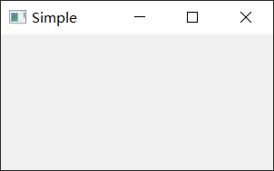
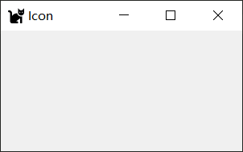
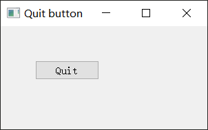
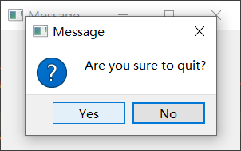
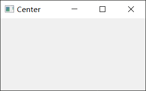

# Hello World

https://maicss.gitbook.io/pyqt-chinese-tutoral/pyqt5/hello_world

:book:[官方文档](https://doc.qt.io/qtforpython/)

## 最简单的小窗口

```python
import sys
from PyQt5.QtWidgets import QApplication, QMainWindow, QWidget, QLabel, QFrame

class Example(QMainWindow):
    def __init__(self):
        super().__init__()
        # (left, top, width, height)
        self.setGeometry(200, 200, 300, 200)
        self.show()

if __name__ == "__main__":
    app = QApplication(sys.argv)
    ex = Example()
    sys.exit(app.exec_())
```



像这个示例，我感觉可以根据以下整个流程把代码背下来。这是一切的基础。

整个流程：

- 导入模块库的app和widget组件。
- 创建一个app
- 创建窗口
- 调整窗口大小为 300x150
- 以左上角为起始坐标`(0, 0)`，移动窗口到坐标`(300, 300)`的位置
- 设置窗口标题
- 显示控件
- 设置安全退出主循环

## 带图标的窗口

和上一个例子的区别在于，这里使用了更加规范的语法。

同时导入了一个新的库`QIcon`

```python
import sys
from PyQt5.QtWidgets import QApplication, QWidget
from PyQt5.QtGui import QIcon

class Example(QWidget):
    def __init__(self):
        super().__init__()
        self.initUI()

    def initUI(self):
        # (left, top, width, height)
        self.setGeometry(300, 300, 300, 150)
        self.setWindowTitle('Icon')
        self.setWindowIcon(QIcon('cat.png'))
        self.show()

if __name__ == '__main__':
    app = QApplication(sys.argv)
    ex = Example()
    sys.exit(app.exec_())
```



## 按钮与提示

鼠标移动到按钮上，会显示提示，移动到窗体上也会显示提示。

知识点：

- 如何设置提示？`widget.setToolTip()`
- 如何设置提示的字体样式？
- 如何创建一个按钮？
- `btn.sizeHint()`表示设置默认的按钮大小。

```python
import sys
from PyQt5.QtWidgets import (QWidget, QToolTip, QPushButton, QApplication)
from PyQt5.QtGui import QFont

class Example(QWidget):
    def __init__(self):
        super().__init__()
        self.initUI()

    def initUI(self):
        QToolTip.setFont(QFont('Microsoft YaHei', 10))

        self.setToolTip('This is a <b>QWidget</b> widget')

        btn = QPushButton('Button', self)
        btn.setToolTip('This is a <b>QPushButton</b> widget')
        btn.resize(btn.sizeHint())
        btn.move(50, 50)

        self.setGeometry(300, 300, 300, 200)
        self.setWindowTitle('Tooltips')
        self.show()

if __name__ == '__main__':
    app = QApplication(sys.argv)
    ex = Example()
    sys.exit(app.exec_())
```

## 关闭窗口

使用程序来关闭窗口，并学习一点single和slots的知识

```python
import sys
from PyQt5.QtWidgets import QWidget, QPushButton, QApplication
from PyQt5.QtCore import QCoreApplication

class Example(QWidget):
    def __init__(self):
        super().__init__()
        self.initUI()

    def initUI(self):
        qbtn = QPushButton('Quit', self)
        qbtn.clicked.connect(QCoreApplication.instance().quit)
        qbtn.resize(qbtn.sizeHint())
        qbtn.move(50, 50)

        self.setGeometry(300, 300, 300, 150)
        self.setWindowTitle('Quit button')
        self.show()

if __name__ == '__main__':
    app = QApplication(sys.argv)
    ex = Example()
    sys.exit(app.exec_())
```

核心语句：

```python
qbtn.clicked.connect(QCoreApplication.instance().quit)
```

事件传递系统：点击按钮之后，信号会被捕捉并给出既定的反应。

`QCoreApplication`包含了事件的主循环，它能添加和删除所有的事件，`instance()`创建了一个它的实例。

`QCoreApplication`是在`QApplication`里创建的。

 点击事件和能终止进程并退出应用的quit函数绑定在了一起。(点击=调用quit函数)

在发送者和接受者之间建立了通讯，**发送者**就是按钮，**接受者**就是应用对象。



## 消息盒子

点击右上角的X时，弹出一个消息窗，让用户确认一下。

```python
import sys
from PyQt5.QtWidgets import QWidget, QMessageBox, QApplication

class Example(QWidget):
    def __init__(self):
        super().__init__()
        self.initUI()

    def initUI(self):
        self.setGeometry(300, 300, 300, 150)
        self.setWindowTitle('Message box')
        self.show()


    def closeEvent(self, event):
        reply = QMessageBox.question(self, 'Message',
            "Are you sure to quit?", QMessageBox.Yes |
            QMessageBox.No, QMessageBox.No)

        if reply == QMessageBox.Yes:
            event.accept()
        else:
            event.ignore()

if __name__ == '__main__':
    app = QApplication(sys.argv)
    ex = Example()
    sys.exit(app.exec_())
```

主要关注这句话

```python
reply = QMessageBox.question(
    self, 'Message',
    "Are you sure to quit?", QMessageBox.Yes |
    QMessageBox.No, QMessageBox.No
)
```

各个参数的解释：

- `self`：父级窗口
- `'Message'`：消息框的标题
- `"Are you sure to quit?"`：消息框的提示信息。
- `QMessageBox.Yes | QMessageBox.No`：消息框的两个按钮
- `QMessageBox.No`：默认的按钮，按Enter会默认执行No



疑惑：

- `|`的作用是什么？
- 还有没有其他的按钮，或者说能不能自己定义一个按钮。

## 窗口居中

```python
import sys
from PyQt5.QtWidgets import QWidget, QDesktopWidget, QApplication

class Example(QWidget):
    def __init__(self):
        super().__init__()
        self.initUI()

    def initUI(self):
        self.resize(300, 150)
        self.center()
        self.setWindowTitle('Center')
        self.show()

    def center(self):
        qr = self.frameGeometry()
        cp = QDesktopWidget().availableGeometry().center()
        qr.moveCenter(cp)
        self.move(qr.topLeft())

if __name__ == '__main__':
    app = QApplication(sys.argv)
    ex = Example()
    sys.exit(app.exec_())
```

关键语句解释

```python
qr = self.frameGeometry()
```

获得主窗口所在的框架对象。

```python
cp = QDesktopWidget().availableGeometry().center()
```

`QDesktopWidget`提供了用户的桌面信息，包括屏幕的大小。

获取显示器的分辨率，然后得到屏幕中间点的位置。

```python
qr.moveCenter(cp)
```

把主窗口框架的中心点放置到屏幕的中心位置。

```python
self.move(qr.topLeft())
```

通过move函数把主窗口的左上角移动到其框架的左上角，这样就把窗口居中了。

```python
def initUI(self):
    self.resize(300, 150)
    self.center()
    ...
```

在`initUI`函数中调用`self.center()`方法以执行上述函数。

