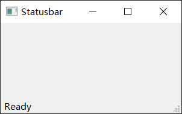
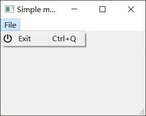
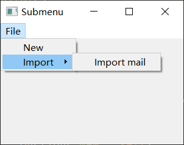
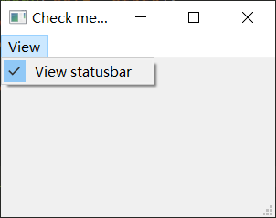
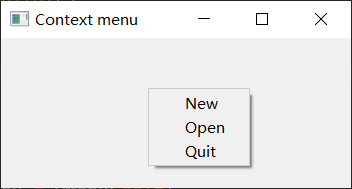
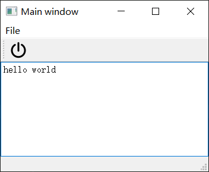

# 菜单和工具栏

https://maicss.gitbook.io/pyqt-chinese-tutoral/pyqt5/cai-dan-he-gong-ju-lan

## 状态栏

```python
import sys
from PyQt5.QtWidgets import QMainWindow, QApplication

class Example(QMainWindow):
    def __init__(self):
        super().__init__()
        self.initUI()

    def initUI(self):
        self.statusBar().showMessage('Ready')

        self.setGeometry(300, 300, 300, 150)
        self.setWindowTitle('Statusbar')
        self.show()

if __name__ == '__main__':
    app = QApplication(sys.argv)
    ex = Example()
    sys.exit(app.exec_())
```



核心就这一句

调用`QtGui.QMainWindow`类的`statusBar()`方法，创建状态栏。

**第一次**调用会创建一个状态栏，而再次调用会返回一个状态栏对象。

`showMessage()`方法在状态栏上显示一条信息。

```python
self.statusBar().showMessage('Ready')
```


## 菜单栏

菜单栏是非常常用的。是一组命令的集合（Mac OS下状态栏的显示不一样，为得到最相似的外观，我们可以增加一行语句`menubar.setNativeMenuBar(False)`)。

```python
import sys
from PyQt5.QtWidgets import QMainWindow, QAction, qApp, QApplication
from PyQt5.QtGui import QIcon

class Example(QMainWindow):
    def __init__(self):
        super().__init__()
        self.initUI()

    def initUI(self):
        exitAct = QAction(QIcon('exit.png'), '&Exit', self)
        exitAct.setShortcut('Ctrl+Q')
        exitAct.setStatusTip('Exit application')
        exitAct.triggered.connect(qApp.quit)

        self.statusBar()

        menubar = self.menuBar()
        fileMenu = menubar.addMenu('&File')
        fileMenu.addAction(exitAct)

        self.setGeometry(300, 300, 300, 200)
        self.setWindowTitle('Simple menu')
        self.show()

if __name__ == '__main__':
    app = QApplication(sys.argv)
    ex = Example()
    sys.exit(app.exec_())
```



## 子菜单

```python
import sys
from PyQt5.QtWidgets import QMainWindow, QAction, QMenu, QApplication

class Example(QMainWindow):
    def __init__(self):
        super().__init__()
        self.initUI()

    def initUI(self):
        menubar = self.menuBar()
        fileMenu = menubar.addMenu('File')

        impMenu = QMenu('Import', self)
        impAct = QAction('Import mail', self)
        impMenu.addAction(impAct)

        newAct = QAction('New', self)

        fileMenu.addAction(newAct)
        fileMenu.addMenu(impMenu)

        self.setGeometry(300, 300, 300, 200)
        self.setWindowTitle('Submenu')
        self.show()

if __name__ == '__main__':
    app = QApplication(sys.argv)
    ex = Example()
    sys.exit(app.exec_())
```



## 勾选菜单

```python
import sys
from PyQt5.QtWidgets import QMainWindow, QAction, QApplication

class Example(QMainWindow):
    def __init__(self):
        super().__init__()
        self.initUI()

    def initUI(self):
        self.statusbar = self.statusBar()
        self.statusbar.showMessage('Ready')

        menubar = self.menuBar()
        viewMenu = menubar.addMenu('View')

        viewStatAct = QAction('View statusbar', self, checkable=True)
        viewStatAct.setStatusTip('View statusbar')
        viewStatAct.setChecked(True)
        viewStatAct.triggered.connect(self.toggleMenu)

        viewMenu.addAction(viewStatAct)

        self.setGeometry(300, 300, 300, 200)
        self.setWindowTitle('Check menu')
        self.show()

    def toggleMenu(self, state):
        if state:
            self.statusbar.show()
        else:
            self.statusbar.hide()

if __name__ == '__main__':
    app = QApplication(sys.argv)
    ex = Example()
    sys.exit(app.exec_())
```



效果是可以切换是否显示左下角的状态提示文字

## 右键菜单

```python
import sys
from PyQt5.QtWidgets import QMainWindow, qApp, QMenu, QApplication

class Example(QMainWindow):
    def __init__(self):
        super().__init__()
        self.initUI()

    def initUI(self):
        self.setGeometry(300, 300, 350, 150)
        self.setWindowTitle('Context menu')
        self.show()

    def contextMenuEvent(self, event):
        cmenu = QMenu(self)

        newAct = cmenu.addAction("New")
        opnAct = cmenu.addAction("Open")
        quitAct = cmenu.addAction("Quit")
        action = cmenu.exec_(self.mapToGlobal(event.pos()))

        if action == quitAct:
            qApp.quit()

if __name__ == '__main__':
    app = QApplication(sys.argv)
    ex = Example()
    sys.exit(app.exec_())
```



```python
action = cmenu.exec_(self.mapToGlobal(event.pos()))
```

使用`exec_()`方法显示菜单。从鼠标右键事件对象中获得当前坐标。`mapToGlobal()`方法把当前组件的相对坐标转换为窗口（window）的绝对坐标。

## 工具栏

菜单栏包含了所有的命令，工具栏就是常用的命令的集合。

```python
import sys
from PyQt5.QtWidgets import QMainWindow, QAction, qApp, QApplication
from PyQt5.QtGui import QIcon

class Example(QMainWindow):
    def __init__(self):
        super().__init__()
        self.initUI()

    def initUI(self):
        exitAct = QAction(QIcon('exit.png'), 'Exit', self)
        exitAct.setShortcut('Ctrl+Q')
        exitAct.triggered.connect(qApp.quit)

        self.toolbar = self.addToolBar('Exit')
        self.toolbar.addAction(exitAct)

        self.setGeometry(300, 300, 300, 200)
        self.setWindowTitle('Toolbar')
        self.show()

if __name__ == '__main__':
    app = QApplication(sys.argv)
    ex = Example()
    sys.exit(app.exec_())
```


```python
self.toolbar = self.addToolBar('Exit')
self.toolbar.addAction(exitAct)
```

用`addToolBar()`创建工具栏，并用`addAction()`将动作对象添加到工具栏。

## 主窗口

主窗口就是状态栏、菜单栏、工具栏的总称，现在我们把上面的三种栏在一个应用里展示出来。

```python
import sys
from PyQt5.QtWidgets import QMainWindow, QTextEdit, QAction, QApplication
from PyQt5.QtGui import QIcon

class Example(QMainWindow):
    def __init__(self):
        super().__init__()
        self.initUI()

    def initUI(self):

        textEdit = QTextEdit()
        self.setCentralWidget(textEdit)

        exitAct = QAction(QIcon('exit24.png'), 'Exit', self)
        exitAct.setShortcut('Ctrl+Q')
        exitAct.setStatusTip('Exit application')
        exitAct.triggered.connect(self.close)

        self.statusBar()

        menubar = self.menuBar()
        fileMenu = menubar.addMenu('&File')
        fileMenu.addAction(exitAct)

        toolbar = self.addToolBar('Exit')
        toolbar.addAction(exitAct)

        self.setGeometry(300, 300, 350, 250)
        self.setWindowTitle('Main window')
        self.show()

if __name__ == '__main__':
    app = QApplication(sys.argv)
    ex = Example()
    sys.exit(app.exec_())
```



```python
textEdit = QTextEdit()
self.setCentralWidget(textEdit)
```

这里创建了一个文本编辑区域，并把它放在`QMainWindow`的中间区域。这个组件会占满所有剩余的区域。