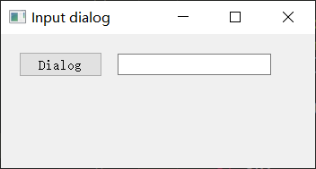

# 对话框

https://maicss.gitbook.io/pyqt-chinese-tutoral/pyqt5/dui-hua-kuang

## 输入文字

`QInputDialog`提供了一个简单方便的对话框，可以输入字符串，数字或列表。

```python
from PyQt5.QtWidgets import (QWidget, QPushButton, QLineEdit, 
    QInputDialog, QApplication)
import sys

class Example(QWidget):
    def __init__(self):
        super().__init__()
        self.initUI()

    def initUI(self):
        self.btn = QPushButton('Dialog', self)
        self.btn.move(20, 20)
        self.btn.clicked.connect(self.showDialog)

        self.le = QLineEdit(self)
        self.le.move(130, 22)

        self.setGeometry(300, 300, 350, 150)
        self.setWindowTitle('Input dialog')
        self.show()

    def showDialog(self):
        text, ok = QInputDialog.getText(self, 'Input Dialog', 
            'Enter your name:')
        if ok:
            self.le.setText(str(text))

if __name__ == '__main__':
    app = QApplication(sys.argv)
    ex = Example()
    sys.exit(app.exec_())
```



## 选择文件

```python
from PyQt5.QtWidgets import (QMainWindow, QTextEdit,
    QAction, QFileDialog, QApplication)
from PyQt5.QtGui import QIcon
import sys

class Example(QMainWindow):
    def __init__(self):
        super().__init__()
        self.initUI()

    def initUI(self):
        self.textEdit = QTextEdit()
        self.setCentralWidget(self.textEdit)
        self.statusBar()

        openFile = QAction(QIcon('open.png'), 'Open', self)
        openFile.setShortcut('Ctrl+O')
        openFile.setStatusTip('Open new File')
        openFile.triggered.connect(self.showDialog)

        menubar = self.menuBar()
        fileMenu = menubar.addMenu('&File')
        fileMenu.addAction(openFile)

        self.setGeometry(300, 300, 350, 300)
        self.setWindowTitle('File dialog')
        self.show()

    def showDialog(self):
        fname = QFileDialog.getOpenFileName(self, 'Open file', '/home')

        if fname[0]:
            f = open(fname[0], 'r')
            with f:
                data = f.read()
                self.textEdit.setText(data)

if __name__ == '__main__':
    app = QApplication(sys.argv)
    ex = Example()
    sys.exit(app.exec_())
```

## 选取颜色

```python
#!/usr/bin/python3
# -*- coding: utf-8 -*-

"""
ZetCode PyQt5 tutorial 

In this example, we select a color value
from the QColorDialog and change the background
color of a QFrame widget. 

Author: Jan Bodnar
Website: zetcode.com 
Last edited: August 2017
"""

from PyQt5.QtWidgets import (QWidget, QPushButton, QFrame, 
    QColorDialog, QApplication)
from PyQt5.QtGui import QColor
import sys

class Example(QWidget):

    def __init__(self):
        super().__init__()

        self.initUI()


    def initUI(self):      

        col = QColor(0, 0, 0) 

        self.btn = QPushButton('Dialog', self)
        self.btn.move(20, 20)

        self.btn.clicked.connect(self.showDialog)

        self.frm = QFrame(self)
        self.frm.setStyleSheet("QWidget { background-color: %s }" 
            % col.name())
        self.frm.setGeometry(130, 22, 100, 100)            

        self.setGeometry(300, 300, 250, 180)
        self.setWindowTitle('Color dialog')
        self.show()


    def showDialog(self):

        col = QColorDialog.getColor()

        if col.isValid():
            self.frm.setStyleSheet("QWidget { background-color: %s }"
                % col.name())


if __name__ == '__main__':

    app = QApplication(sys.argv)
    ex = Example()
    sys.exit(app.exec_())
```

## 选择字体

```python
from PyQt5.QtWidgets import (QWidget, QVBoxLayout, QPushButton,
    QSizePolicy, QLabel, QFontDialog, QApplication)
import sys

class Example(QWidget):
    def __init__(self):
        super().__init__()
        self.initUI()

    def initUI(self):
        vbox = QVBoxLayout()

        btn = QPushButton('Dialog', self)
        btn.setSizePolicy(QSizePolicy.Fixed,
            QSizePolicy.Fixed)

        btn.move(20, 20)

        vbox.addWidget(btn)

        btn.clicked.connect(self.showDialog)

        self.lbl = QLabel('Knowledge only matters', self)
        self.lbl.move(130, 20)

        vbox.addWidget(self.lbl)
        self.setLayout(vbox)

        self.setGeometry(300, 300, 250, 180)
        self.setWindowTitle('Font dialog')
        self.show()

    def showDialog(self):
        font, ok = QFontDialog.getFont()
        if ok:
            self.lbl.setFont(font)

if __name__ == '__main__':
    app = QApplication(sys.argv)
    ex = Example()
    sys.exit(app.exec_())
```


