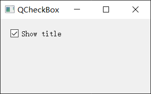
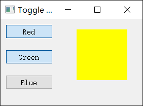
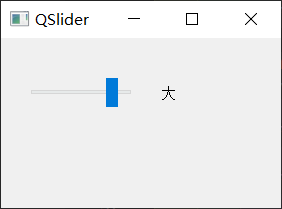
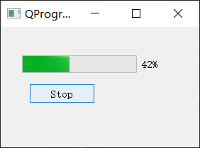
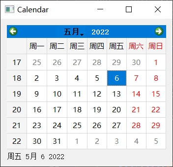
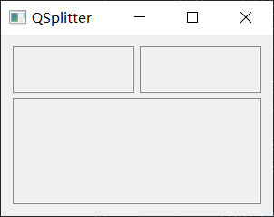

# 常用控件

https://www.riverbankcomputing.com/static/Docs/PyQt5/sip-classes.html

:book:[官方文档](https://doc.qt.io/qtforpython/)

https://www.riverbankcomputing.com/static/Docs/PyQt5/sip-classes.html

https://maicss.gitbook.io/pyqt-chinese-tutoral/pyqt5/kong-jian-1

https://maicss.gitbook.io/pyqt-chinese-tutoral/pyqt5/kong-jian-2

控件就像是应用这座房子的一块块砖。PyQt5有很多的控件，比如按钮，单选框，滑动条，复选框等等。在本章，我们将介绍一些很有用的控件：

- `QCheckBox`：选择框，勾选或取消
- `ToggleButton`：切换按钮，按下或未按下
- `QSlider`：滑条
- `QProgressBar`：进度条 
-  `QCalendarWidget`：日历
- `QPixmap`：图片显示器
- `QLineEdit`：行文本编辑器
- `QSplitter`：分割器，可以自由调整组件大小
- `QComboBox`：下拉选框

## QLabel


## QPushButton

禁用按钮

```python
btn.
```


## QCheckBox

开和关。通常跟标签一起使用，用在激活和关闭一些选项的场景。

```python
from PyQt5.QtWidgets import QWidget, QCheckBox, QApplication
from PyQt5.QtCore import Qt
import sys

class Example(QWidget):
    def __init__(self):
        super().__init__()
        self.initUI()

    def initUI(self):
        cb = QCheckBox('Show title', self)
        cb.move(20, 20)
        cb.toggle()
        cb.stateChanged.connect(self.changeTitle)

        self.setGeometry(300, 300, 300, 150)
        self.setWindowTitle('QCheckBox')
        self.show()

    def changeTitle(self, state):
        if state == Qt.Checked:
            self.setWindowTitle('QCheckBox')
        else:
            self.setWindowTitle(' ')

if __name__ == '__main__':
    app = QApplication(sys.argv)
    ex = Example()
    sys.exit(app.exec_())
```



## ToggleButton

切换按钮就是`QPushButton`的一种特殊模式。 它只有两种状态：按下和未按下。我们在点击的时候切换两种状态，有很多场景会使用到这个功能。

```python
from PyQt5.QtWidgets import (QWidget, QPushButton,
    QFrame, QApplication)
from PyQt5.QtGui import QColor
import sys

class Example(QWidget):
    def __init__(self):
        super().__init__()
        self.initUI()

    def initUI(self):
        self.col = QColor(0, 0, 0)

        redb = QPushButton('Red', self)
        redb.setCheckable(True)
        redb.move(10, 10)

        redb.clicked[bool].connect(self.setColor)

        greenb = QPushButton('Green', self)
        greenb.setCheckable(True)
        greenb.move(10, 60)

        greenb.clicked[bool].connect(self.setColor)

        blueb = QPushButton('Blue', self)
        blueb.setCheckable(True)
        blueb.move(10, 110)

        blueb.clicked[bool].connect(self.setColor)

        self.square = QFrame(self)
        self.square.setGeometry(150, 20, 100, 100)
        self.square.setStyleSheet("QWidget { background-color: %s }" %
            self.col.name())

        self.setGeometry(300, 300, 280, 170)
        self.setWindowTitle('Toggle button')
        self.show()

    def setColor(self, pressed):
        source = self.sender()

        if pressed:
            val = 255
        else: val = 0

        if source.text() == "Red":
            self.col.setRed(val)
        elif source.text() == "Green":
            self.col.setGreen(val)
        else:
            self.col.setBlue(val)

        self.square.setStyleSheet("QFrame { background-color: %s }" %
            self.col.name())

if __name__ == '__main__':
    app = QApplication(sys.argv)
    ex = Example()
    sys.exit(app.exec_())
```



```python
redb.setCheckable(True)
redb.clicked[bool].connect(self.setColor)
```

核心就是这两句，先把这个按钮设置成了切换按钮，然后将点击信号装换成布尔值，并与定义好的函数进行关联。

## QSlider

https://doc.qt.io/qtforpython/PySide6/QtWidgets/QSlider.html?highlight=qslider#PySide6.QtWidgets.PySide6.QtWidgets.QSlider

`QSlider`是个有一个小滑块的组件，这个小滑块能拖着前后滑动，这个经常用于修改一些具有范围的数值，比文本框或者点击增加减少的文本框（spin box）方便。

需要准备几张分别表示静音、小音量、中音量、大音量的图标，文件名分别叫mute.png, min.png, med.png, max.png。

```python
from PyQt5.QtWidgets import (QWidget, QSlider, 
    QLabel, QApplication)
from PyQt5.QtCore import Qt
from PyQt5.QtGui import QPixmap
import sys

class Example(QWidget):
    def __init__(self):
        super().__init__()
        self.initUI()

    def initUI(self):
        sld = QSlider(Qt.Horizontal, self)
        sld.setFocusPolicy(Qt.NoFocus)
        sld.setGeometry(30, 40, 100, 30)
        sld.valueChanged[int].connect(self.changeValue)

        self.label = QLabel(self)
        self.label.setPixmap(QPixmap('mute.png'))
        self.label.setGeometry(160, 40, 80, 30)

        self.setGeometry(300, 300, 280, 170)
        self.setWindowTitle('QSlider')
        self.show()

    def changeValue(self, value):
        if value == 0:
            self.label.setText('静音')
        elif value > 0 and value <= 30:
            self.label.setText('小')
        elif value > 30 and value < 80:
            self.label.setText('中')
        else:
            self.label.setText('大')
            # self.label.setPixmap(QPixmap('max.png'))

if __name__ == '__main__':
    app = QApplication(sys.argv)
    ex = Example()
    sys.exit(app.exec_())
```



```python
sld.valueChanged[int].connect(self.changeValue)
```

把`valueChanged`信号跟`changeValue()`方法关联起来。

常用设置：

```python
sld.setOrientation()  # 设置slider的方向Qt.Horizontal，或者Qt.Vertical
sld.orientation()  # 获取slider的方向
sld.setMaximum(int)  # 设置最大值
sld.Maximum()  # 获取最大值

sld.setMinimum(int)
sld.setPageStep(int)  # 设置每页的步长  一次最长能拖多少
sld.setSingleStep(int)  # 设置单步移动的步长
sld.setSliderPosition(int)  # 设置slider位置
sld.setValue(int)  # 设置slider 的值，与setSliderPosition(int)一致

# 设置 slider 的值进行反转： 即如果是水平方向的 slider，默认情况下，最小值在最左边，最大值在最右边，但是设置 slider 的值进行反转后，最小值变到了最右边，最大值改到了最左边
sld.setInvertedAppearance(int)
# 设置是否启动滑块追踪：true 表示启动追踪；false 表示禁用追踪；
# 如果启用了滑块追踪，则滑块在拖动过程中会一直触发 valueChanged 信号；
# 如果禁用了滑块追踪，则滑块在拖动过程中不会触发 valueChanged 信号，只有在用户释放滑块时，才触发 valueChanged 信号

sld.setTracking(True/False)
```


## QProgressBar

`QProgressBar`组件提供了水平和垂直两种进度条，进度条可以设置最大值和最小值，默认情况是0~99。

```python
from PyQt5.QtWidgets import (QWidget, QProgressBar,
    QPushButton, QApplication)
from PyQt5.QtCore import QBasicTimer
import sys

class Example(QWidget):
    def __init__(self):
        super().__init__()
        self.initUI()

    def initUI(self):
        self.pbar = QProgressBar(self)
        self.pbar.setGeometry(30, 40, 200, 25)

        self.btn = QPushButton('Start', self)
        self.btn.move(40, 80)
        self.btn.clicked.connect(self.doAction)

        self.timer = QBasicTimer()
        self.step = 0

        self.setGeometry(300, 300, 280, 170)
        self.setWindowTitle('QProgressBar')
        self.show()

    def timerEvent(self, e):
        if self.step >= 100:
            self.timer.stop()
            self.btn.setText('Finished')
            return
        self.step = self.step + 1
        self.pbar.setValue(self.step)

    def doAction(self):
        if self.timer.isActive():
            self.timer.stop()
            self.btn.setText('Start')
        else:
            self.timer.start(100, self)
            self.btn.setText('Stop')

if __name__ == '__main__':
    app = QApplication(sys.argv)
    ex = Example()
    sys.exit(app.exec_())
```



```python
self.btn.clicked.connect(self.doAction)
```

按钮与`doAction`绑定，用于控制计时器的运行和停止状态。

```python
self.timer.start(100, self)
```

调用`start()`方法加载一个时间事件。这个方法有两个参数：过期时间和事件接收者。

这里表示每100毫秒触发一次事件接受者的`timerEvent`函数。

```python
def timerEvent(self, e):
    if self.step >= 100:
        self.timer.stop()
        self.btn.setText('Finished')
        return
    self.step = self.step + 1
    self.pbar.setValue(self.step)
```

每个`QObject`和继承它的对象都有一个`timerEvent()`事件处理函数。

为了触发事件，需要重载这个方法。

## QCalendarWidget

```python
from PyQt5.QtWidgets import (QWidget, QCalendarWidget,
    QLabel, QApplication, QVBoxLayout)
from PyQt5.QtCore import QDate
import sys

class Example(QWidget):
    def __init__(self):
        super().__init__()
        self.initUI()

    def initUI(self):
        vbox = QVBoxLayout(self)
        cal = QCalendarWidget(self)
        cal.setGridVisible(True)
        cal.clicked[QDate].connect(self.showDate)

        vbox.addWidget(cal)

        self.lbl = QLabel(self)
        date = cal.selectedDate()
        self.lbl.setText(date.toString())

        vbox.addWidget(self.lbl)

        self.setLayout(vbox)

        self.setGeometry(300, 300, 350, 300)
        self.setWindowTitle('Calendar')
        self.show()

    def showDate(self, date):
        self.lbl.setText(date.toString())

if __name__ == '__main__':
    app = QApplication(sys.argv)
    ex = Example()
    sys.exit(app.exec_())
```



## QDateTimeEdit


https://doc.qt.io/qtforpython/PySide6/QtWidgets/QDateTimeEdit.html

常用信号

```python
def dateChanged (date)
def dateTimeChanged (dateTime)
def timeChanged (time)
```


日期时间下拉

https://blog.csdn.net/weixin_44593822/article/details/112892204

```python
import sys
from PyQt5.QtWidgets import QWidget, QApplication, QDateTimeEdit, QVBoxLayout
from PyQt5.QtCore import QDateTime

class Example(QWidget):
    def __init__(self):
        super().__init__()
        self.initUI()

    def initUI(self):
        # 日期时间编辑框
        self.datetime_edit = QDateTimeEdit(QDateTime.currentDateTimeUtc())
        self.datetime_edit.setCalendarPopup(True)  # 日历下拉菜单
        self.datetime_edit.setDisplayFormat("yyyy-MM-dd HH:mm:ss")

        vbox = QVBoxLayout()
        vbox.addWidget(self.datetime_edit)
        self.setLayout(vbox)

        self.datetime_edit.dateTimeChanged.connect(self.show_dt)
        self.show()
    def show_dt(self, event):
        print(type(event))
        # PyQt5QtCore.QDateTime
        print(event)
        # PyQt5.QtCore.QDateTime(2020, 2, 7, 22, 4, 15, 9)

if __name__ == '__main__':
    app = QApplication(sys.argv)
    ex = Example()
    sys.exit(app.exec_())
 
```


## QPixmap

`QPixmap`是处理图片的组件。本例中，我们使用`QPixmap`在窗口里显示一张图片。

```python
from PyQt5.QtWidgets import (QWidget, QHBoxLayout,
    QLabel, QApplication)
from PyQt5.QtGui import QPixmap
import sys
import os
print(os.getcwd())

class Example(QWidget):
    def __init__(self):
        super().__init__()
        self.initUI()

    def initUI(self):
        hbox = QHBoxLayout(self)
        pixmap = QPixmap("redrock.png")

        lbl = QLabel(self)
        lbl.setPixmap(pixmap)

        hbox.addWidget(lbl)
        self.setLayout(hbox)

        self.setGeometry(300, 300, 280, 170)
        self.setWindowTitle('Red Rock')
        self.show()

if __name__ == '__main__':
    app = QApplication(sys.argv)
    ex = Example()
    sys.exit(app.exec_())
```

## QLineEdit

自带了撤销、重做、剪切、粘贴、拖拽等功能。

```python
import sys
from PyQt5.QtWidgets import (QWidget, QLabel,
    QLineEdit, QApplication)

class Example(QWidget):
    def __init__(self):
        super().__init__()
        self.initUI()

    def initUI(self):
        self.lbl = QLabel(self)
        qle = QLineEdit(self)

        qle.move(60, 100)
        self.lbl.move(60, 40)

        qle.textChanged[str].connect(self.onChanged)

        self.setGeometry(300, 300, 280, 170)
        self.setWindowTitle('QLineEdit')
        self.show()

    def onChanged(self, text):
        self.lbl.setText(text)
        self.lbl.adjustSize()

if __name__ == '__main__':
    app = QApplication(sys.argv)
    ex = Example()
    sys.exit(app.exec_())
```

## QSplitter

`QSplitter`组件能让用户通过拖拽分割线的方式改变子窗口大小的组件。本例中我们展示用两个分割线隔开的三个`QFrame`组件。

```python
from PyQt5.QtWidgets import (QWidget, QHBoxLayout, QFrame, 
    QSplitter, QStyleFactory, QApplication)
from PyQt5.QtCore import Qt
import sys

class Example(QWidget):
    def __init__(self):
        super().__init__()
        self.initUI()

    def initUI(self):      
        hbox = QHBoxLayout(self)

        topleft = QFrame(self)
        topleft.setFrameShape(QFrame.StyledPanel)

        topright = QFrame(self)
        topright.setFrameShape(QFrame.StyledPanel)

        bottom = QFrame(self)
        bottom.setFrameShape(QFrame.StyledPanel)

        splitter1 = QSplitter(Qt.Horizontal)
        splitter1.addWidget(topleft)
        splitter1.addWidget(topright)

        splitter2 = QSplitter(Qt.Vertical)
        splitter2.addWidget(splitter1)
        splitter2.addWidget(bottom)

        hbox.addWidget(splitter2)
        self.setLayout(hbox)

        self.setGeometry(300, 300, 300, 200)
        self.setWindowTitle('QSplitter')
        self.show()

    def onChanged(self, text):
        self.lbl.setText(text)
        self.lbl.adjustSize()        

if __name__ == '__main__':
    app = QApplication(sys.argv)
    ex = Example()
    sys.exit(app.exec_())
```



```python
topleft = QFrame(self)
topleft.setFrameShape(QFrame.StyledPanel)
```

为了更清楚的看到分割线，我们使用了设置好的子窗口样式。

```python
splitter1 = QSplitter(Qt.Horizontal)
splitter1.addWidget(topleft)
splitter1.addWidget(topright)
```

创建一个`QSplitter`组件，并在里面添加了两个框架。实现了左右分割

```python
splitter2 = QSplitter(Qt.Vertical)
splitter2.addWidget(splitter1)
splitter2.addWidget(bottom)
```

实现了上下分割。

## QComboBox

`QComboBox`组件就是下拉选框。

```python
from PyQt5.QtWidgets import (QWidget, QLabel,
    QComboBox, QApplication)
import sys

class Example(QWidget):
    def __init__(self):
        super().__init__()
        self.initUI()

    def initUI(self):
        self.lbl = QLabel("Ubuntu", self)
        combo = QComboBox(self)
        combo.addItem("Ubuntu")
        combo.addItem("Mandriva")
        combo.addItem("Fedora")
        combo.addItem("Arch")
        combo.addItem("Gentoo")

        combo.move(50, 50)
        self.lbl.move(50, 150)

        combo.activated[str].connect(self.onActivated)

        self.setGeometry(300, 300, 300, 200)
        self.setWindowTitle('QComboBox')
        self.show()

    def onActivated(self, text):
        self.lbl.setText(text)
        self.lbl.adjustSize() 

if __name__ == '__main__':
    app = QApplication(sys.argv)
    ex = Example()
    sys.exit(app.exec_())
```

