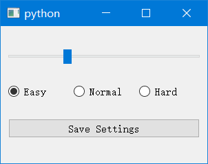

在Qt应用中，有多种方式来保存和加载配置设置。其中一种常用的方式是使用 `QSettings` 类，它提供了一种存储和恢复应用程序设置的方法。下面是一个使用Python和PyQt5编写的简单示例：

[doc.qt.io/qt-5/qsettings.html](https://doc.qt.io/qt-5/qsettings.html)

### 保存和加载配置的示例

```python
import sys
from PyQt5.QtWidgets import (
    QApplication,
    QMainWindow,
    QSlider,
    QVBoxLayout,
    QWidget,
    QPushButton,
    QRadioButton,
    QHBoxLayout,
    QButtonGroup,
)
from PyQt5.QtCore import Qt, QSettings


class Example(QMainWindow):
    def __init__(self):
        super().__init__()

        # 加载设置
        self.settings = QSettings("./settings.ini", QSettings.IniFormat)
        self.slider_value = self.settings.value("sliderValue", 0, int)
        self.difficulty = self.settings.value("difficulty", 1, int)

        self.init_ui()

    def init_ui(self):
        self.slider = QSlider(Qt.Horizontal)
        self.slider.setValue(self.slider_value)

        self.easy_radio = QRadioButton("Easy")
        self.normal_radio = QRadioButton("Normal")
        self.hard_radio = QRadioButton("Hard")

        # 创建一个按钮组并添加单选按钮
        self.button_group = QButtonGroup()
        self.button_group.addButton(self.easy_radio, 0)
        self.button_group.addButton(self.normal_radio, 1)
        self.button_group.addButton(self.hard_radio, 2)

        self.button_group.button(self.difficulty).setChecked(True)

        radio_layout = QHBoxLayout()
        radio_layout.addWidget(self.easy_radio)
        radio_layout.addWidget(self.normal_radio)
        radio_layout.addWidget(self.hard_radio)

        self.save_btn = QPushButton("Save Settings")
        self.save_btn.clicked.connect(self.save_settings)

        layout = QVBoxLayout()
        layout.addWidget(self.slider)
        layout.addLayout(radio_layout)
        layout.addWidget(self.save_btn)

        central_widget = QWidget()
        central_widget.setLayout(layout)
        self.setCentralWidget(central_widget)

        self.setGeometry(200, 200, 300, 200)
        self.show()

    def save_settings(self):
        # 保存设置
        self.settings.setValue("sliderValue", self.slider.value())
        self.settings.setValue("difficulty", self.button_group.checkedId())


if __name__ == "__main__":
    app = QApplication(sys.argv)
    ex = Example()
    sys.exit(app.exec_())

```



在这个示例中，创建了一个滑条和一个radio单选框组。

```python
self.settings = QSettings("./settings.ini", QSettings.IniFormat)
```

这样设置可以读取指定文件路径的ini配置文件。

同时也可以设置为

```python
self.settings = QSettings("YourCompany", "YourApp")
```

使用这种方式时，`QSettings` 会使用一个平台特定的方式来存储应用程序设置。例如，在Windows上，设置通常会保存在注册表中，而在macOS上，通常会保存在一个 `.plist` 文件中。

这种方式的好处是它更“原生”，并且不需要你明确指定存储位置。它也允许用户在他们的系统设置中看到和修改这些设置（尽管通常不推荐这样做）。

