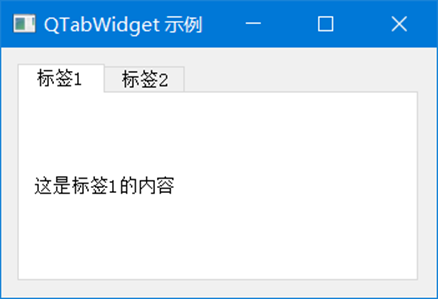

```python
import sys
from PyQt5.QtWidgets import QApplication, QWidget, QVBoxLayout, QLabel, QTabWidget


class TabDemo(QWidget):
    def __init__(self):
        super().__init__()
        self.init_ui()

    def init_ui(self):
        layout = QVBoxLayout(self)
        tab_widget = QTabWidget()

        # 第一个标签页
        tab1 = QWidget()
        tab1_layout = QVBoxLayout(tab1)
        tab1_layout.addWidget(QLabel("这是标签1的内容"))
        tab_widget.addTab(tab1, "标签1")

        # 第二个标签页
        tab2 = QWidget()
        tab2_layout = QVBoxLayout(tab2)
        tab2_layout.addWidget(QLabel("这是标签2的内容"))
        tab_widget.addTab(tab2, "标签2")

        layout.addWidget(tab_widget)
        self.setLayout(layout)

        self.setWindowTitle("QTabWidget 示例")
        self.setGeometry(300, 300, 300, 200)


if __name__ == "__main__":
    app = QApplication(sys.argv)
    demo = TabDemo()
    demo.show()
    sys.exit(app.exec_())

```

