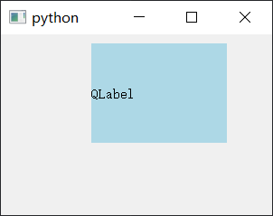
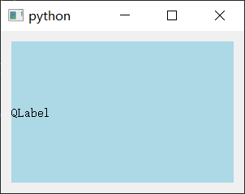
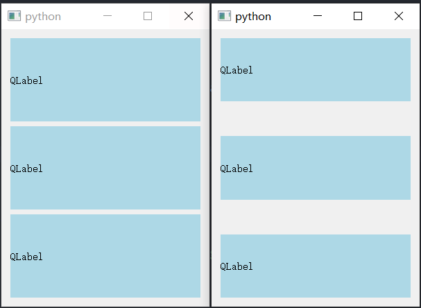

默认情况下layout都是有内边距和元素间隔的。如果设置成

```python
layout.setContentsMargins(0, 0, 0, 0)
layout.setSpacing(0)
```

则既没有内边距也没有外边距

### 边距

使用`setContentsMargins`来设置布局的边距。

```python
import sys
from PyQt5 import QtWidgets


class Example(QtWidgets.QWidget):
    def __init__(self):
        super().__init__()
        self.initUI()

    def initUI(self):

        label = QtWidgets.QLabel("QLabel", self)
        label.setStyleSheet("background-color: lightblue;")
        label.setText("This is a QLabel with padding.")

        layout = QtWidgets.QVBoxLayout(self)
        layout.setContentsMargins(100, 10, 50, 80)
        layout.addWidget(label)

        self.setGeometry(300, 300, 300, 200)
        self.show()


if __name__ == "__main__":
    app = QtWidgets.QApplication(sys.argv)
    ex = Example()
    sys.exit(app.exec_())

```



如果删除这下面这行代码，不设置布局的边距，效果为：

```python
# layout.setContentsMargins(100, 10, 50, 80)
```



### 间距

```python
import sys
from PyQt5 import QtWidgets


class Example(QtWidgets.QWidget):
    def __init__(self):
        super().__init__()
        self.initUI()

    def initUI(self):

        label1 = self.get_label()
        label2 = self.get_label()
        label3 = self.get_label()

        layout = QtWidgets.QVBoxLayout(self)
        layout.addWidget(label1)
        layout.addWidget(label2)
        layout.addWidget(label3)
        
        layout.setSpacing(50)
        self.setGeometry(300, 300, 300, 400)
        self.show()

    def get_label(self):
        label = QtWidgets.QLabel("QLabel", self)
        label.setStyleSheet("background-color: lightblue;")
        return label


if __name__ == "__main__":
    app = QtWidgets.QApplication(sys.argv)
    ex = Example()
    sys.exit(app.exec_())
	
```



注释掉下面的代码则不设置间距

```python
# layout.setSpacing(50)
```

