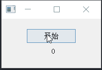

https://doc.qt.io/qtforpython-5/PySide2/QtCore/QTimer.html#qtimer

QTimer常用槽

```python
def start()  # 启动定时器
def start(msec)  # 启动定时器，并设置到期时间
def stop()
```

QTimer常用方法

```python
def isActive()  # 定时器是否在运行
def setInterval()  # 定时器设置到期时间(毫秒)
def setSingleShot(True)  # 设置为一次性定时器（时间到期就停了不再触发timeout）
```

QTimer常用信号

好像只有这一个信号，时间到期就触发连接的时间

```python
timer.timeout.connect(self.processOneThing)
```


定时器停止与启动

```python
import sys
from PyQt5.QtCore import QTimer
from PyQt5.QtWidgets import QApplication, QMainWindow, QPushButton, QLabel


class Example(QMainWindow):
    def __init__(self, parent=None):
        super().__init__(parent)
        self.btn = QPushButton("开始", self)
        self.number = 0
        self.label = QLabel(f"{self.number}", self)

        self.btn.move(50, 20)
        self.label.move(100, 50)

        self.timer = QTimer()
        self.timer.setInterval(50)
        self.timer.timeout.connect(self.set_label)
        self.btn.clicked.connect(self.shift_timer)
        self.show()

    def set_label(self):
        self.label.setText(f"{self.number}")
        self.number += 1

    def shift_timer(self):
        if self.timer.isActive():
            self.timer.stop()
            self.btn.setText("开始")
        else:
            self.timer.start()
            self.btn.setText("暂停")


if __name__ == "__main__":
    app = QApplication(sys.argv)
    ex = Example()
    sys.exit(app.exec_())

```

