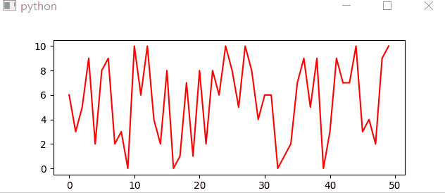

https://www.pythonguis.com/tutorials/plotting-matplotlib/

https://www.jb51.net/article/163579.htm

## 一个简单的例子

使用了matplotlib的canvas `FigureCanvasQTAgg`来创建图片。该对象也属于`QWidget`。

可以直接添加到Qt内

```python
import sys
import matplotlib
matplotlib.use('Qt5Agg')

from PyQt5 import QtCore, QtWidgets

from matplotlib.backends.backend_qt5agg import FigureCanvasQTAgg
from matplotlib.figure import Figure


class MplCanvas(FigureCanvasQTAgg):

    def __init__(self, parent=None, width=5, height=4, dpi=100):
        fig = Figure(figsize=(width, height), dpi=dpi)
        self.axes = fig.add_subplot(111)
        super(MplCanvas, self).__init__(fig)


class MainWindow(QtWidgets.QMainWindow):

    def __init__(self, *args, **kwargs):
        super(MainWindow, self).__init__(*args, **kwargs)

        # Create the maptlotlib FigureCanvas object,
        # which defines a single set of axes as self.axes.
        sc = MplCanvas(self, width=5, height=4, dpi=100)
        sc.axes.plot([0,1,2,3,4], [10,1,20,3,40])
        self.setCentralWidget(sc)

        self.show()


app = QtWidgets.QApplication(sys.argv)
w = MainWindow()
app.exec_()
```

## 绘图控制工具条

```python
import sys
import matplotlib

matplotlib.use("Qt5Agg")

from PyQt5 import QtCore, QtGui, QtWidgets

from matplotlib.backends.backend_qt5agg import (
    FigureCanvasQTAgg,
    NavigationToolbar2QT as NavigationToolbar,
)
from matplotlib.figure import Figure


class MplCanvas(FigureCanvasQTAgg):
    def __init__(self, parent=None, width=5, height=4, dpi=100):
        fig = Figure(figsize=(width, height), dpi=dpi)
        self.axes = fig.add_subplot(111)
        super(MplCanvas, self).__init__(fig)


class MainWindow(QtWidgets.QMainWindow):
    def __init__(self, *args, **kwargs):
        super(MainWindow, self).__init__(*args, **kwargs)

        sc = MplCanvas(self, width=5, height=4, dpi=100)
        sc.axes.plot([0, 1, 2, 3, 4], [10, 1, 20, 3, 40])

        # Create toolbar, passing canvas as first parament, parent (self, the MainWindow) as second.
        toolbar = NavigationToolbar(sc, self)

        layout = QtWidgets.QVBoxLayout()
        layout.addWidget(toolbar)
        layout.addWidget(sc)

        # Create a placeholder widget to hold our toolbar and canvas.
        widget = QtWidgets.QWidget()
        widget.setLayout(layout)
        self.setCentralWidget(widget)

        self.show()


app = QtWidgets.QApplication(sys.argv)
w = MainWindow()
app.exec_()

```

`matplotlib.backends.backend_qt5agg.NavigationToolbar2QT`

这是matplotlib图像的工具条，可以用来修改图像显示的范围、坐标轴等。

通过下面的代码创建了一个工具条

```python
toolbar = NavigationToolbar(sc, self)
```

关于工具条的配置可以查看[Matplotlib toolbar documentation](https://matplotlib.org/3.1.1/users/navigation_toolbar.html).

## 更新绘图

更新绘图的方案有两种：

- 清理画布，重新再画布上绘图（简单，但是效率低）
- 保持对绘制线条的引用并更新数据

### 清理并重新绘制

```python
import sys
import random
import matplotlib
matplotlib.use('Qt5Agg')

from PyQt5 import QtCore, QtWidgets

from matplotlib.backends.backend_qt5agg import FigureCanvasQTAgg as FigureCanvas
from matplotlib.figure import Figure


class MplCanvas(FigureCanvas):

    def __init__(self, parent=None, width=5, height=4, dpi=100):
        fig = Figure(figsize=(width, height), dpi=dpi)
        self.axes = fig.add_subplot(111)
        super(MplCanvas, self).__init__(fig)


class MainWindow(QtWidgets.QMainWindow):

    def __init__(self, *args, **kwargs):
        super(MainWindow, self).__init__(*args, **kwargs)

        self.canvas = MplCanvas(self, width=5, height=4, dpi=100)
        self.setCentralWidget(self.canvas)

        n_data = 50
        self.xdata = list(range(n_data))
        self.ydata = [random.randint(0, 10) for i in range(n_data)]
        self.update_plot()

        self.show()

        # Setup a timer to trigger the redraw by calling update_plot.
        self.timer = QtCore.QTimer()
        self.timer.setInterval(100)
        self.timer.timeout.connect(self.update_plot)
        self.timer.start()

    def update_plot(self):
        # Drop off the first y element, append a new one.
        self.ydata = self.ydata[1:] + [random.randint(0, 10)]
        self.canvas.axes.cla()  # Clear the canvas.
        self.canvas.axes.plot(self.xdata, self.ydata, 'r')
        # Trigger the canvas to update and redraw.
        self.canvas.draw()


app = QtWidgets.QApplication(sys.argv)
w = MainWindow()
app.exec_()
```



清理画布并重新绘图

```python
self.canvas.axes.cla()
self.canvas.axes.plot(self.xdata, self.ydata, 'r')
```

使画布更新

```python
self.canvas.draw()
```

### 直接更新

```python
class MainWindow(QtWidgets.QMainWindow):

    def __init__(self, *args, **kwargs):
        super(MainWindow, self).__init__(*args, **kwargs)

        self.canvas = MplCanvas(self, width=5, height=4, dpi=100)
        self.setCentralWidget(self.canvas)

        n_data = 50
        self.xdata = list(range(n_data))
        self.ydata = [random.randint(0, 10) for i in range(n_data)]

        # We need to store a reference to the plotted line
        # somewhere, so we can apply the new data to it.
        self._plot_ref = None
        self.update_plot()

        self.show()

        # Setup a timer to trigger the redraw by calling update_plot.
        self.timer = QtCore.QTimer()
        self.timer.setInterval(100)
        self.timer.timeout.connect(self.update_plot)
        self.timer.start()

    def update_plot(self):
        # Drop off the first y element, append a new one.
        self.ydata = self.ydata[1:] + [random.randint(0, 10)]

        # Note: we no longer need to clear the axis.
        if self._plot_ref is None:
            # First time we have no plot reference, so do a normal plot.
            # .plot returns a list of line <reference>s, as we're
            # only getting one we can take the first element.
            plot_refs = self.canvas.axes.plot(self.xdata, self.ydata, 'r')
            self._plot_ref = plot_refs[0]
        else:
            # We have a reference, we can use it to update the data for that line.
            self._plot_ref.set_ydata(self.ydata)

        # Trigger the canvas to update and redraw.
        self.canvas.draw()

```

