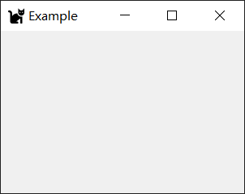
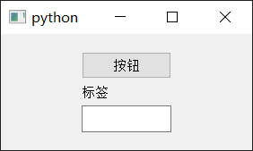
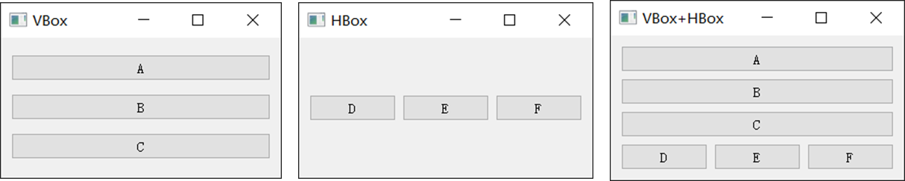
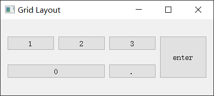
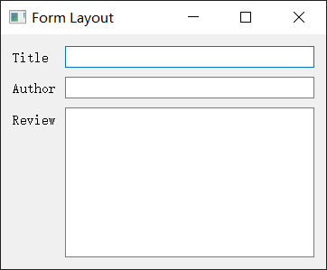
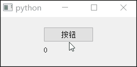
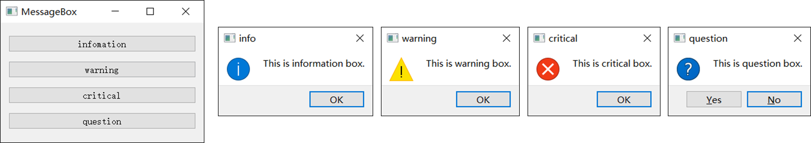

[📖PyQt5文档](https://doc.qt.io/qtforpython-5/)


## 第一个窗口

用PyQt5写一个最简单的空窗口：

- 设置窗口位置和宽高
- 设置窗口标题为 Example
- 设置窗口图标（需要图标文件）



文件结构

```
└── examples
  ├── 1_first_gui.py
  └── cat.png
```


第一个应用是一个空窗口，也可以作为大部分PyQt项目的模板。

```python
import sys
from PyQt5.QtWidgets import QApplication, QMainWindow
from PyQt5.QtGui import QIcon


class Example(QMainWindow):
    def __init__(self, parent=None):
        super().__init__(parent=parent)
        # 设置窗口位置和宽高
        self.setGeometry(200, 200, 300, 200)
        # 设置窗口标题
        self.setWindowTitle("Example")
        # 设置窗口图标
        img_path = "cat.png"
        self.setWindowIcon(QIcon(img_path))
        self.show()


if __name__ == "__main__":
    app = QApplication(sys.argv)
    ex = Example()
    sys.exit(app.exec_())

```

### 设置窗口位置和宽高

```python
self.setGeometry(200, 200, 300, 200)
```

### 设置窗口标题

```python
self.setWindowTitle("Example")
```

### 设置窗口图标

需要导入`QIcon`

```python
from PyQt5.QtGui import QIcon
```

设置窗口图标

```python
img_path = "icon.png"
self.setWindowIcon(QIcon(img_path))
```

## 常用组件

[📖QtWidgets.QWidget](https://doc.qt.io/qtforpython-5/PySide2/QtWidgets/QWidget.html)

创建一个窗口，并在窗口中加入以下组件

- 创建一个按钮（button）
- 创建一个标签（label）
- 创建一个单行的文本编辑框（text line edit）



```python
import sys
from PyQt5.QtWidgets import (
    QApplication,
    QMainWindow,
    QPushButton,
    QLabel,
    QLineEdit,
)


class Example(QMainWindow):
    def __init__(self, parent=None):
        super().__init__(parent=parent)
        btn = QPushButton("按钮", self)
        label = QLabel("标签", self)
        line_edit = QLineEdit(self)

        btn.move(90, 20)
        label.move(90, 50)
        line_edit.move(90, 80)

        self.setGeometry(300, 300, 280, 130)
        self.show()


if __name__ == "__main__":
    app = QApplication(sys.argv)
    ex = Example()
    sys.exit(app.exec_())

```

### QLabel

[📖QtWidgets.QLabel](https://doc.qt.io/qtforpython-5/PySide2/QtWidgets/QLabel.html#qlabel) 

第一个参数填这个标签显示的文本，第二个参数填它的父对象。

```python
label = QLabel("标签", self)
label.move(90, 50)  # 相对于父对象移动标签
```

### QPushButton

[📖QtWidgets.QPushButton](https://doc.qt.io/qtforpython-5/PySide2/QtWidgets/QPushButton.html)

```python
btn = QPushButton("按钮", self)
```

### QLineEdit

[📖QtWidgets.QLineEdit](https://doc.qt.io/qtforpython-5/PySide2/QtWidgets/QLineEdit.html)

```python
line_edit = QLineEdit(self)
```

## 常用布局

### 绝对定位

上一个案例演示的就是绝对定位，直接操作组件移动到相对其父窗口的指定位置。

```python
label.move(90, 50)
```

### 盒布局

盒布局是比较常用的布局，主要分为水平盒布局和垂直盒布局，两者也可以嵌套。



#### 水平盒布局

```python
import sys
from PyQt5.QtWidgets import QApplication, QWidget, QHBoxLayout, QPushButton


class Example(QWidget):
    def __init__(self, parent=None):
        super().__init__(parent=parent)
        self.setGeometry(200, 200, 300, 150)
        self.setWindowTitle("HBox")

        hbox = QHBoxLayout()

        btn1 = QPushButton("D", self)
        btn2 = QPushButton("E", self)
        btn3 = QPushButton("F", self)

        hbox.addWidget(btn1)
        hbox.addWidget(btn2)
        hbox.addWidget(btn3)

        w = QWidget()
        self.setCentralWidget(w)
        w.setLayout(hbox)
        self.show()


if __name__ == "__main__":
    app = QApplication(sys.argv)
    ex = Example()
    sys.exit(app.exec_())

```

#### 垂直盒布局

```python
import sys
from PyQt5.QtWidgets import QApplication, QMainWindow, QWidget, QVBoxLayout, QPushButton


class Example(QMainWindow):
    def __init__(self, parent=None):
        super().__init__(parent=parent)
        self.setGeometry(200, 200, 300, 150)
        self.setWindowTitle("VBox")
        vbox = QVBoxLayout()

        btn1 = QPushButton("A", self)
        btn2 = QPushButton("B", self)
        btn3 = QPushButton("C", self)

        vbox.addWidget(btn1)
        vbox.addWidget(btn2)
        vbox.addWidget(btn3)

        w = QWidget()
        self.setCentralWidget(w)
        w.setLayout(vbox)
        self.show()


if __name__ == "__main__":
    app = QApplication(sys.argv)
    ex = Example()
    sys.exit(app.exec_())

```

#### 相互嵌套

```python
import sys
from PyQt5.QtWidgets import QApplication, QMainWindow, QWidget, QVBoxLayout, QHBoxLayout, QPushButton


class Example(QMainWindow):
    def __init__(self, parent=None):
        super().__init__(parent=parent)
        self.setGeometry(200, 200, 300, 150)
        self.setWindowTitle("VBox")

        vbox = QVBoxLayout()
        btn1 = QPushButton("A", self)
        btn2 = QPushButton("B", self)
        btn3 = QPushButton("C", self)
        vbox.addWidget(btn1)
        vbox.addWidget(btn2)
        vbox.addWidget(btn3)
        
        hbox = QHBoxLayout()
        btn4 = QPushButton("D", self)
        btn5 = QPushButton("E", self)
        btn6 = QPushButton("F", self)
        hbox.addWidget(btn4)
        hbox.addWidget(btn5)
        hbox.addWidget(btn6)
        
        vbox.addLayout(hbox)

        w = QWidget()
        self.setCentralWidget(w)
        w.setLayout(vbox)
        self.show()


if __name__ == "__main__":
    app = QApplication(sys.argv)
    ex = Example()
    sys.exit(app.exec_())

```

### 网格布局

以键盘右侧的数字小键盘（部分）为例



```python
import sys
from PyQt5.QtWidgets import QWidget, QGridLayout, QPushButton, QApplication


class Example(QWidget):
    def __init__(self):
        super().__init__()
        self.init_ui()
        self.show()

    def init_ui(self):
        grid = QGridLayout()
        self.setLayout(grid)

        button1 = QPushButton("1", self)
        button2 = QPushButton("2", self)
        button3 = QPushButton("3", self)
        button4 = QPushButton("0", self)
        button5 = QPushButton(".", self)
        button6 = QPushButton("enter", self)

        grid.addWidget(button1, 0, 0)
        grid.addWidget(button2, 0, 1)
        grid.addWidget(button3, 0, 2)
        # 跨2列
        grid.addWidget(button4, 1, 0, 1, 2)
        grid.addWidget(button5, 1, 2)
        # 跨2行
        grid.addWidget(button6, 0, 3, 2, 1)

        # 调整按钮组件的高度
        for btn in [button1, button2, button3, button4, button5, button6]:
            btn.setMaximumHeight(200)

        self.setGeometry(300, 300, 300, 150)
        self.setWindowTitle("Grid Layout")


if __name__ == "__main__":
    app = QApplication(sys.argv)
    ex = Example()
    sys.exit(app.exec_())

```

#### 跨行跨列

`grid.addWidget()`后面的四个参数分别为：行、列、跨行、跨列。默认跨行跨列都是1

```python
# 跨2列
grid.addWidget(button4, 1, 0, 1, 2)
# 跨2行
grid.addWidget(button6, 0, 3, 2, 1)
```

#### 调整按钮的最大高度

默认情况下，`QPushButton`的高度是固定的，为了能更好地显示按钮的跨行效果，把`button6`的最大高度调高。

```python
button6.setMaximumHeight(200)
```

### 表单布局



```python
import sys

from PyQt5.QtWidgets import (
    QApplication,
    QWidget,
    QLabel,
    QLineEdit,
    QTextEdit,
    QFormLayout,
)


class Example(QWidget):
    def __init__(self):
        super().__init__()
        self.init_ui()
        self.show()

    def init_ui(self):
        # 设置定位和左上角坐标
        self.setGeometry(300, 300, 360, 260)
        self.setWindowTitle("Form Layout")
        title = QLabel("Title")
        author = QLabel("Author")
        review = QLabel("Review")

        title_edit = QLineEdit()
        author_edit = QLineEdit()
        review_edit = QTextEdit()

        layout = QFormLayout()
        layout.setSpacing(10)

        layout.addRow(title, title_edit)
        layout.addRow(author, author_edit)
        layout.addRow(review, review_edit)

        self.setLayout(layout)


if __name__ == "__main__":
    app = QApplication(sys.argv)
    w = Example()
    sys.exit(app.exec_())

```

核心语句：

```python
layout = QFormLayout()
layout.addRow(title, title_edit)
```


### 说明

为什么不继承`QMainWindow`了？

如果想把继承`QWidget`改成`QMainWindow`，由于`QMainWindow`不支持直接设置Layout，需要创建一个 QWidget 对象作为 QMainWindow 的中心窗口，然后再设置布局，比如：

```python
# 在init_ui()内
# 创建一个 QWidget 对象
w = QWidget()

# 将 QWidget 对象设置为 QMainWindow 的中心窗口
self.setCentralWidget(central_widget)

# 将布局设置到 QWidget 对象上
w.setLayout(layout)
```

## 信号与槽

signal and slot

比如说当按钮按下时，会发出一个**信号（signal）**，信号连接到事件处理函数，函数开始进行相应的操作，比如让QLabel改变文字。**槽（slot）**就可以理解为信号处理函数。

流程大概就是：按钮按下 -> 发送信号 -> 信号处理函数（槽）

主要在代码中做的就是：**把信号和槽连接起来**。

下面实现一个简单的例子，按下按钮，标签+1。



```python
import sys
from PyQt5.QtWidgets import (
    QApplication,
    QMainWindow,
    QPushButton,
    QLabel,
    QLineEdit,
)


class Example(QMainWindow):
    def __init__(self, parent=None):
        super().__init__(parent=parent)
        self.number = 0
        btn = QPushButton("按钮", self)
        self.label = QLabel(str(self.number), self)

        btn.move(90, 20)
        self.label.move(90, 50)
        btn.clicked.connect(self.add_number)

        self.setGeometry(300, 300, 280, 100)
        self.show()

    def add_number(self):
        self.number += 1
        self.label.setText(str(self.number))


if __name__ == "__main__":
    app = QApplication(sys.argv)
    ex = Example()
    sys.exit(app.exec_())

```

核心的代码就是

```python
# 连接信号与事件处理函数(槽)
btn.clicked.connect(self.add_number)

# 定义事件处理函数
def add_number(self):
    self.number += 1
    self.label.setText(str(self.number))
```

## 消息盒子



```python
import sys
from PyQt5.QtWidgets import QApplication, QWidget, QMessageBox, QVBoxLayout, QPushButton


class Example(QWidget):
    def __init__(self, parent=None):
        super().__init__(parent=parent)
        self.setGeometry(200, 200, 300, 200)
        self.setWindowTitle("MessageBox")
        vbox = QVBoxLayout()
        self.setLayout(vbox)

        btn1 = QPushButton("infomation", self)
        btn2 = QPushButton("warning", self)
        btn3 = QPushButton("critical", self)
        btn4 = QPushButton("question", self)

        vbox.addWidget(btn1)
        vbox.addWidget(btn2)
        vbox.addWidget(btn3)
        vbox.addWidget(btn4)

        btn1.clicked.connect(self.show_information)
        btn2.clicked.connect(self.show_warning)
        btn3.clicked.connect(self.show_critical)
        btn4.clicked.connect(self.show_question)
        # self.btn4.clicked.connect(self.show_question)
        self.show()

    def show_information(self):
        QMessageBox.information(self, "info", "This is information box.")

    def show_warning(self):
        QMessageBox.warning(self, "info", "This is warning box.")

    def show_critical(self):
        QMessageBox.critical(self, "info", "This is critical box.")

    def show_question(self):
        QMessageBox.question(
            self,
            "question",  # 窗口标题
            "This is question box.",  # 窗口内容
            QMessageBox.Yes | QMessageBox.No,  # 按钮
            QMessageBox.No,  # 默认按钮
        )


if __name__ == "__main__":
    app = QApplication(sys.argv)
    ex = Example()
    sys.exit(app.exec_())

```

