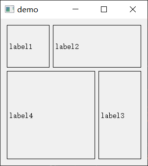

## 输入框

### 获取当前值

```python
edit = QLineEdit()
edit.text()
```

### 输入框设置为不能修改

```python
from pyqt5 import QtCore
edit = QLineEdit()
edit.setFocusPolicy(QtCore.Qt.NoFocus) 
```

### 设置输入框固定宽度

单位是像素点

```python
edit = QLineEdit()
edit.setMaximumWidth(200)
```


## 下拉框

### 获取下拉框当前值

```python
combo = QComboBox(self)
combo.currentText()
```

### 切换下拉框的值

首先获取当前的索引和总索引，然后计算下一个索引的值

```python
combo = QComboBox(self)
curr_idx = combo.currentIndex()
total_idx = combo.count()
next_idx = (curr_idx + 1) % total_idx
combo.setCurrentIndex(next_idx)
```


```python

```


## 文件读取

https://blog.csdn.net/humanking7/article/details/80546728


选取文件夹 `QFileDialog.getExistingDirectory()`
选择文件 `QFileDialog.getOpenFileName()`
选择多个文件 `QFileDialog.getOpenFileNames()`
选择保存文件 `QFileDialog.getSaveFileName()`

### 读取文件名

[PyQt5.QtWidgets.QFileDialog](https://doc.qt.io/qtforpython/PySide6/QtWidgets/QFileDialog.html)

```python
def get_file_name(self):
    fname, ftype = QFileDialog.getOpenFileName(
        self, 'Open file', '/home'
    )
    
    print('fname:', fname)
    print('ftype:', ftype)
```

```
fname: E:/work/test.py
ftype: All Files (*)
```

输入参数解释：

- `open file`表示打开的文件读取窗口左上角的标题
- `/home`表示默认打开的路径，可以把这个参数改成`./`，那就是默认以当前文件夹作为起始。

输出参数解释：

- `fname`，str，选择的文件的绝对路径字符串
- `ftype`，str，可选择的文件的后缀名，默认是都能选择。

如果要读取多个文件名，就改成`getOpenFileNames`，此时`fname`变成包含多个文件路径的List列表。


### 限定读取文件的后缀

如果要使用多个过滤器，将每个过滤器与两个分号分开

```python
fname, ftype = QFileDialog.getOpenFileName(
    self, 'Open file', "Images (*.png *.xpm *.jpg);;Text files (*.txt);;XML files (*.xml)"
)
```

## 布局

### 网格布局的参数含义

```python
grid = QGridLayout()
label = QLabel('demo')

grid.addWidget(label, 1, 1)  # 默认占1格
grid.addWidget(label, 1, 1, 2, 1)  # 跨两行
grid.addWidget(label, 1, 1, 1, 2)  # 跨两列
grid.addWidget(label, 1, 1, 2, 2)  # 跨两行两列
```

前两个参数为坐标。(1, 1)表示第一行第一列的格子。

后两个参数为跨行、列的数量，默认都是1。

案例：

```python
import sys
from PyQt5.QtWidgets import (QWidget, QGridLayout,
    QPushButton, QApplication)

class Example(QWidget):
    def __init__(self):
        super().__init__()
        self.initUI()

    def initUI(self):
        grid = QGridLayout()
        self.setLayout(grid)
		
        # 默认占1格
        label1 = QLabel('label1')
        grid.addWidget(label1, 1, 1)

        # 跨两列
        label2 = QLabel('label2')
        grid.addWidget(label2, 1, 2, 1, 2)
        
        # 跨两行
        label3 = QLabel('label3')
        grid.addWidget(label3, 2, 3, 2, 1)
        
        # 跨两行两列
        label4 = QLabel('label4')
        grid.addWidget(label3, 2, 1, 2, 2)
        
        self.move(300, 150)
        self.setWindowTitle('demo')
        self.show()

if __name__ == '__main__':
    app = QApplication(sys.argv)
    ex = Example()
    sys.exit(app.exec_())
```

