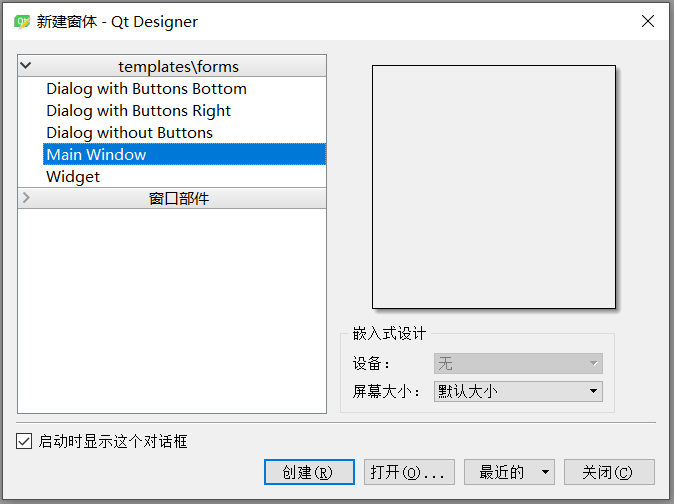
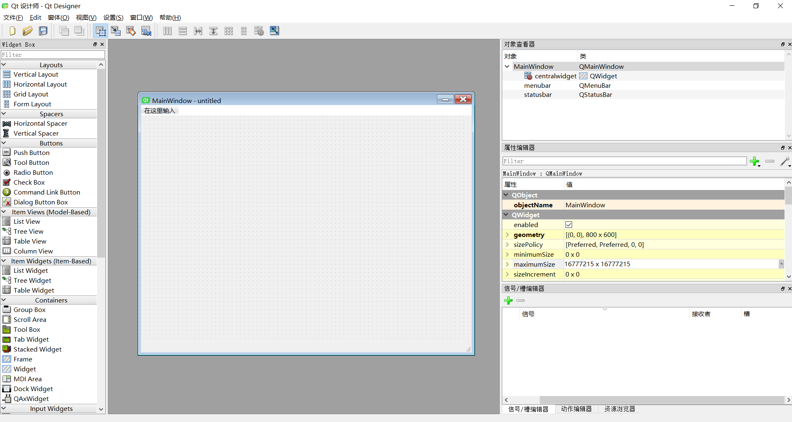
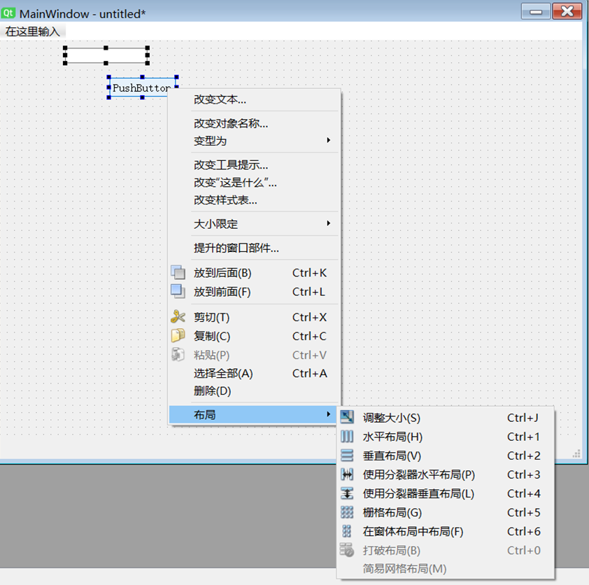

## 快速使用

一般安装了PyQt5就会自带Qt Designer

我的安装在`D:\Software\Anaconda\Library\bin\designer.exe`



最常用的是Widget（通用窗口）和Main Window（主窗口）这里选着Main Window并点击创建



Ctrl+R预览窗口

```xml
<?xml version="1.0" encoding="UTF-8"?>
<ui version="4.0">
 <class>MainWindow</class>
 <widget class="QMainWindow" name="MainWindow">
  <property name="geometry">
   <rect>
    <x>0</x>
    <y>0</y>
    <width>304</width>
    <height>188</height>
   </rect>
  </property>
  <property name="windowTitle">
   <string>MainWindow</string>
  </property>
  <widget class="QWidget" name="centralwidget">
   <widget class="QPushButton" name="pushButton">
    <property name="geometry">
     <rect>
      <x>100</x>
      <y>60</y>
      <width>93</width>
      <height>28</height>
     </rect>
    </property>
    <property name="text">
     <string>PushButton</string>
    </property>
   </widget>
  </widget>
  <widget class="QMenuBar" name="menubar">
   <property name="geometry">
    <rect>
     <x>0</x>
     <y>0</y>
     <width>304</width>
     <height>26</height>
    </rect>
   </property>
  </widget>
  <widget class="QStatusBar" name="statusbar"/>
 </widget>
 <resources/>
 <connections/>
</ui>

```


使用pyuic5将QtDesigner的ui文件转换为py文件。

```
pyuic5 -o demo.py demo.ui
```

得到demo.py文件

```python
# -*- coding: utf-8 -*-

# Form implementation generated from reading ui file 'demo.ui'
#
# Created by: PyQt5 UI code generator 5.9.2
#
# WARNING! All changes made in this file will be lost!

from PyQt5 import QtCore, QtGui, QtWidgets

class Ui_MainWindow(object):
    def setupUi(self, MainWindow):
        MainWindow.setObjectName("MainWindow")
        MainWindow.resize(304, 188)
        self.centralwidget = QtWidgets.QWidget(MainWindow)
        self.centralwidget.setObjectName("centralwidget")
        self.pushButton = QtWidgets.QPushButton(self.centralwidget)
        self.pushButton.setGeometry(QtCore.QRect(100, 60, 93, 28))
        self.pushButton.setObjectName("pushButton")
        MainWindow.setCentralWidget(self.centralwidget)
        self.menubar = QtWidgets.QMenuBar(MainWindow)
        self.menubar.setGeometry(QtCore.QRect(0, 0, 304, 26))
        self.menubar.setObjectName("menubar")
        MainWindow.setMenuBar(self.menubar)
        self.statusbar = QtWidgets.QStatusBar(MainWindow)
        self.statusbar.setObjectName("statusbar")
        MainWindow.setStatusBar(self.statusbar)

        self.retranslateUi(MainWindow)
        QtCore.QMetaObject.connectSlotsByName(MainWindow)

    def retranslateUi(self, MainWindow):
        _translate = QtCore.QCoreApplication.translate
        MainWindow.setWindowTitle(_translate("MainWindow", "MainWindow"))
        self.pushButton.setText(_translate("MainWindow", "PushButton"))


```


界面与逻辑分离

编写新的python文件 `main.py`

```python
import sys
from PyQt5.QtWidgets import QApplication, QMainWindow
from demo import Ui_MainWindow

class Example(QMainWindow, Ui_MainWindow):
    def __init__(self, parent=None):
        super().__init__(parent)
        self.setupUi(self)
        
if __name__ == "__main__":
    app = QApplication(sys.argv)
    ex = Example()
    ex.show()
    sys.exit(app.exec_())
     
```

## 布局管理

选中两个控件右键可以快速选择布局方式



快捷键

```
ctrl + 1 水平布局
ctrl + 2 垂直布局
```


## 技巧积累

在主窗口（里面有一两个部件）直接点右键选择布局。效果类似于

```python
class Example(QMainwindow):
    def __init__(self):
        ...
        self.setLayout(layout)
        ...
```

