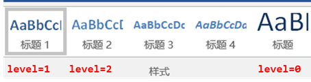
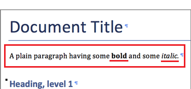

https://python-docx.readthedocs.io/en/latest/index.html

https://gitchat.csdn.net/activity/5eae400be90db13e2ff6f56e

查看所有的样式

```python
from docx.enum.style import WD_STYLE_TYPE
styles = document.styles
paragraph_styles = [
     s for s in styles if s.type == WD_STYLE_TYPE.PARAGRAPH
]
for style in paragraph_styles:
    print(style.name)
```

将DataFrame数据输出到word

```python
from docx import Document

# 将dataframe格式的文件转换为word
def df_to_word(df, template_path=config.word_template, file_path='tmp.docx'):
    document = Document(template_path)
    table = document.add_table(rows=1, cols=df.shape[1])

    for header_cell, header in zip(table.rows[0].cells, df.columns):
        header_cell.text = header
        header_cell.paragraphs[0].style = 'No Spacing'

    for _, row in df.iterrows():
        row_cells = table.add_row().cells
        for i, (_, value) in enumerate(row.iteritems()):
            row_cells[i].text = str(value)
            row_cells[i].paragraphs[0].style = 'No Spacing'

    table.style = "三线表"
    document.save(file_path)


def test_df_to_word():
    import pandas as pd
    import os
    df = pd.DataFrame([[1, 2, 3, 4],
                       [2, 3, 4, 5],
                       [3, 4, 5, 6]], columns=['apple', 'pear', 'banana', 'orange'])

    df_to_word(df, template_path=config.word_template, file_path='tmp.docx')
    assert os.path.isfile('tmp.docx')
    os.remove('tmp.docx')


if __name__ == '__main__':
    test_df_to_word()
```

图片插入

```python
from docx.shared import Cm
document.add_picture('demo.png', width=Inches(5.76))
```

若想插入最大不超过页边距的宽度，则需要额外设置一些东西

首先要获得最大页面宽度

页面宽度 - 左边距 - 右边距

如果纸张大小是A4 21cm × 29.7cm，左右边距都是3.18。

最大宽度就是：

```python
from docx.shared import Cm
max_width = Cm(14.64)
```

插入一张图片，如果图片宽度大于最大宽度，自动缩放

```python
def add_picture(pic_path, max_width=Cm(14.64)):
    pic = document.add_picture(pic_path)
    
    # 自动缩放
    if pic.width > max_width:
        ratio = max_width / pic.width  # 缩放比例
        pic.width = int(pic.width * ratio)
        pic.height = int(pic.height * ratio)
    # 居中
    
```

顺便自动居中、再插入一个图片名称在下方

```python
def add_picture(pic_path, max_width=Cm(14.64), title=None):
    pic = document.add_picture(pic_path)
    if pic.width > max_width:
        ratio = max_width / pic.width  # 缩放比例
        pic.width = int(pic.width * ratio)
        pic.height = int(pic.height * ratio)
        
    # 居中刚刚插入的图片
    last_paragraph = document.paragraphs[-1]
    last_paragraph.alignment = docx.enum.text.WD_ALIGN_PARAGRAPH.CENTER
    
    # 插入标题
    if title:
        document.add_paragraph(title, style='表图题')
```

# python-docx

官方文档：https://python-docx.readthedocs.io/en/latest/index.html

参考教程：https://gitchat.csdn.net/activity/5eae400be90db13e2ff6f56e

## 官方案例详解

官方的样例代码基本涵盖了python-docx的常用方法

首先创建一个名为demo的文件夹，然后打开这个链接https://movie.douban.com/photos/photo/2158653283/ 把里面的海报图片保存到demo文件夹内，命名为`monty-truth.png`。这个图片就是官网用到的那张图片，也可以直接保存下面这张图片。


创建demo.py文件，把下面的代码复制到里面。

```python
from docx import Document
from docx.shared import Inches

document = Document()

document.add_heading('Document Title', 0)

p = document.add_paragraph('A plain paragraph having some ')
p.add_run('bold').bold = True
p.add_run(' and some ')
p.add_run('italic.').italic = True

document.add_heading('Heading, level 1', level=1)
document.add_paragraph('Intense quote', style='Intense Quote')

document.add_paragraph(
    'first item in unordered list', style='List Bullet'
)
document.add_paragraph(
    'first item in ordered list', style='List Number'
)

document.add_picture('monty-truth.png', width=Inches(1.25))

records = (
    (3, '101', 'Spam'),
    (7, '422', 'Eggs'),
    (4, '631', 'Spam, spam, eggs, and spam')
)

table = document.add_table(rows=1, cols=3)
hdr_cells = table.rows[0].cells
hdr_cells[0].text = 'Qty'
hdr_cells[1].text = 'Id'
hdr_cells[2].text = 'Desc'
for qty, id, desc in records:
    row_cells = table.add_row().cells
    row_cells[0].text = str(qty)
    row_cells[1].text = id
    row_cells[2].text = desc

document.add_page_break()

document.save('demo.docx')
```

以上都完成了以后，你的项目文件结构应该是

```
|-demo
  |-demo.py
  |-monty-truth.png
```

然后运行demo.py，这里运行就随意了，可以用pycharm，也可以用命令行。

使用命令行的话，cd进入文件夹目录，在命令行输入：

```
python demo.py
```

就会生成一个名为`demo.docx`的文件。项目文件结构也变成

```
|-demo
  |-demo.py
  |-monty-truth.png
  |-demo.docx
```

打开`demo.docx`能看到如下效果的文档


但是直接看这个例子可能还是不够直观，下面会拆解官网的这个例子以达到更好的入门效果

### 文档的加载和保存

文档加载的时候如果不传入任何参数，会自动加载内置的模板文档。内置模板文档的样式如上面的官方案例图所示。

```python
# 文档加载
document = Document()
# 文档保存
document.save('demo.docx')
```

建议是自己创建一个模板文档，这样可以很方便地使用自己自定义的文档的样式。

如果想加载自己的文档模板，传入一个word文件的路径即可。

```python
document = Document('template.docx')
```

### 增加标题

```python
document.add_heading('Document Title', level=0)
document.add_heading('Heading, level 1', level=1)
```

对应如下两个标题。


注意，这里的`level=1`是一级标题，`level=0`是大标题，样式会自动对应word中的样式表。如下图



### 增加段落

用`document.add_paragraph()`方法把一段文字写到word中，这个方法会返回一个段落对象，如果不想换行并继续增加不同格式的文字的话，可以用这个对象的add_run方法来继续添加文字。

```python
p = document.add_paragraph('A plain paragraph having some ')
p.add_run('bold').bold = True
p.add_run(' and some ')
p.add_run('italic.').italic = True
```



以下是应用了不同格式的段落

```python
document.add_paragraph('Intense quote', style='Intense Quote')
document.add_paragraph(
    'first item in unordered list', style='List Bullet'
)
document.add_paragraph(
    'first item in ordered list', style='List Number'
)
```


Intense Quote就是样式表中的**明显引用**样式

List Bullet 和 List Number就是项目符号和项目编号


### 插入图片

插入图片还是比较简单的

```python
document.add_picture('monty-truth.png', width=Inches(1.25))
```

`Inches(1.25)`表示这张图片的宽度。

英寸不符合我们的使用习惯，可以改成厘米单位，下面的代码就是插入了一张图片，宽度设为10厘米，图片会等比例缩放到宽度为10厘米，如果传入高度，图片就不会等比例缩放了。

```python
from docx.shared import Cm
document.add_picture('monty-truth.png', width=Cm(10))
```

### 插入表格

```python
records = (
    (3, '101', 'Spam'),
    (7, '422', 'Eggs'),
    (4, '631', 'Spam, spam, eggs, and spam')
)

table = document.add_table(rows=1, cols=3)
hdr_cells = table.rows[0].cells
hdr_cells[0].text = 'Qty'
hdr_cells[1].text = 'Id'
hdr_cells[2].text = 'Desc'
for qty, id, desc in records:
    row_cells = table.add_row().cells
    row_cells[0].text = str(qty)
    row_cells[1].text = id
    row_cells[2].text = desc
```


插入表格稍微复杂一丢丢，主要掌握：

- 表格创建`table = document.add_table(rows=1, cols=3)`
- 添加行：`table.add_row()`
- 添加列：`table.add_column()`
- 提取某列单元格：`cell = table.rows[1].cells`
- 写入单元格：`cell.text = '苹果'`

# 其他

数据分析报告的特点：图片 + 表格 + 描述文字

比较花时间的部分就是绘图


