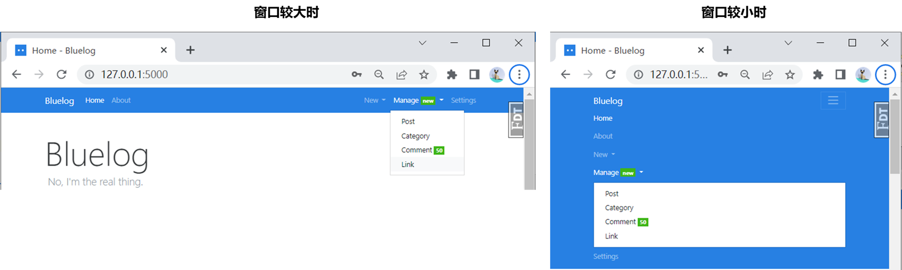
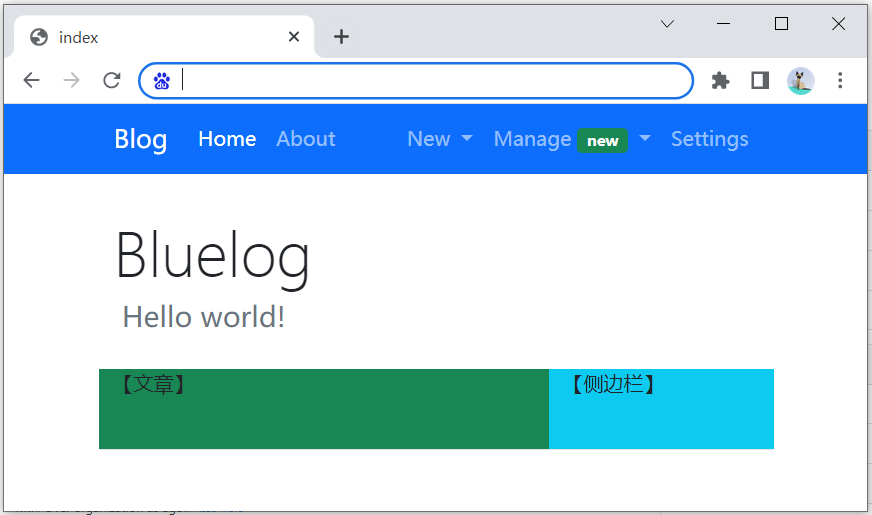
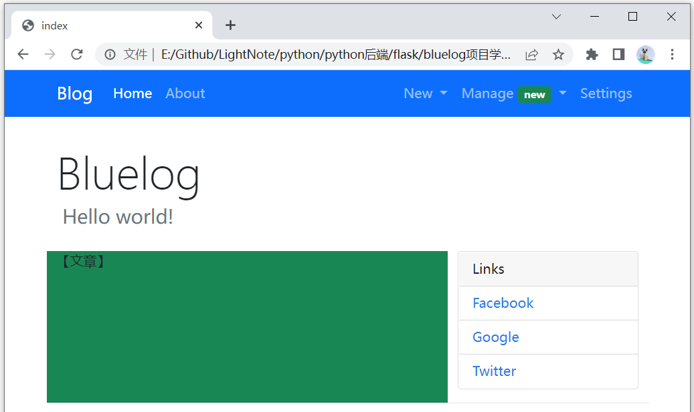
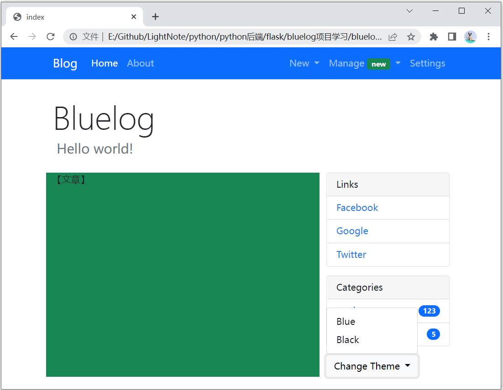
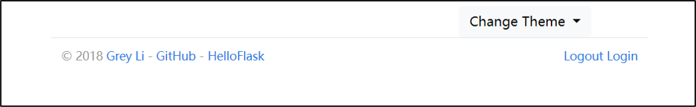

直接结合教材阅读源码固然是一种方法，但是这样对我来说容易找不着方向，难点表现于：

- 较枯燥
- 对代码不熟悉，读代码理解有点困难


我想按照自己的方式，逐步去拆解整个页面，慢慢增加功能。

个人认为需要先实现前端页面的搭建，有了视觉再去添加后端的内容。

在Flask中，可以用模板来简化前端页面的编写。

但我觉得先不用模板，先搭建一个框架再说。


项目地址：https://github.com/greyli/bluelog

代码下载：

```
git clone git@github.com:greyli/bluelog.git
```


## html模板

项目的结构为

```
|- static
  |- style.css  # 自定义样式文件
|- index.html  
|- login.html
|- ...  # 各种单页面
```


首先是HTML页面骨架

```html
<!DOCTYPE html>
<html lang="en">
<head>
  <meta charset="utf-8">
  <meta name="viewport" content="width=device-width, initial-scale=1">
  <title>index</title>
  <link rel="stylesheet" href="https://cdn.staticfile.org/twitter-bootstrap/5.1.1/css/bootstrap.min.css">

  <!-- 最新的 Bootstrap5 核心 JavaScript 文件 -->
  <script src="https://cdn.staticfile.org/twitter-bootstrap/5.1.1/js/bootstrap.bundle.min.js"></script>
  <!-- 自定义的样式，有时候bs不好实现的样式就在这里实现 -->
  <link rel="stylesheet" href="static/style.css">
</head>
<body>
  <h1>Hello</h1>
</body>
</html>
```

关于下面这行代码

```html
<meta name="viewport" content="width=device-width, initial-scale=1, shrink-to-fit=no">
```

具体含义可以参考：https://www.runoob.com/w3cnote/viewport-deep-understanding.html

**viewport**：视口，就是浏览器的可视区域。注意视口不等于屏幕大小，视口是可以比浏览器更宽或者更高的，一般情况下视口的宽小于等于浏览器的宽，然后会比较长，可以通过滑动竖向滚动条来查看多余的内容。

这个`<meta>`标签的作用就是让视口等于浏览器宽度


> 注意：这里使用的是bs5，原项目用的是bs4，我因为以前没学过bs，所以想直接学最新的。
>
> 这样的话旧代码就会和新代码有点区别。


## index.html

观察bluelog项目的首页可以发现页面上的一些元素

- 导航栏
- 标题
- 侧边栏
- 正文，正文还包括底部的分页器
- 页脚

此外，页面的登录和未登录状态是不一样的。由于登录状态下，页面的内容会更多，因此笔记里直接展示登录状态的代码。要做未登录的页面直接做减法即可。


### 导航栏

#### 设计思路

- 未登录状态和登录状态显示的内容不一样
  - 未登录时只能查看首页Home和简介页About
  - 登录时还有新内容发布页New、内容管理Manage以及设置settings。
- 响应式布局，屏幕较大时导航标签水平铺开，屏幕较小时导航垂直堆叠。

> 这里的静态页面就直接做已登录的版本，因为未登录状态其实就是做减法，删除不给用户展示的元素即可。
>
> 在开发过程中，可以通过jinja模板基于登录状态来判断要展示哪些内容、隐藏哪些内容。

先来看bluelog项目导航栏的效果。



#### 代码框架

按照这个思路构建好导航栏的代码框架。

```html
<!-- 导航栏 -->
<nav>
<div>
    <!-- 首页标签: 可以填文字或图片，点击该链接跳转到首页 -->
    <a></a>
    <!-- 下拉按钮: 屏幕宽时不显示该按钮 -->
    <button></button>
    <!-- 导航栏: 屏幕宽时横向排，屏幕窄时垂直排 -->
    <div>
        <!-- 【导航栏左侧】Bluelog / Home / About -->
        <ul></ul>
        <!-- 【导航栏右侧】New▽ / Manage▽ / Settings -->
        <ul></ul>
    </div>
</div>
</nav>
```

#### 导航栏左侧

```html
<!-- 导航栏 -->
<nav class="navbar navbar-expand-sm bg-primary navbar-dark mb-3">
<div class="container">
  <!-- 首页标签: 可以填文字或图片，点击该链接跳转到首页 -->
  <a class="navbar-brand" href="#">Blog</a>
  <!-- 下拉按钮: 屏幕宽时不显示该按钮 -->
  <button class="navbar-toggler" type="button" data-bs-toggle="collapse" data-bs-target="#collapsibleNavbar">
    <span class="navbar-toggler-icon"></span>
  </button>
  <!-- 导航栏: 屏幕宽时横向排，屏幕窄时垂直排 -->
  <div class="collapse navbar-collapse" id="collapsibleNavbar">
    <!-- 【导航栏左侧】Bluelog / Home / About -->
    <ul class="navbar-nav">
      <li class="nav-item">
        <a class="nav-link active" href="#">Home</a>
      </li>
      <li class="nav-item">
        <a class="nav-link" href="#">About</a>
      </li>
    </ul>
  </div>  
</div>
  <!-- 【导航栏右侧】New▽ / Manage▽ / Settings -->
    
</nav>
```

**为什么要加一个container的div？**

答：加了这个container，导航栏会自动有左边距，不然第一个导航链接会紧贴着浏览器最左边，视觉效果就没那么好看了。


**`navbar-expand-*`的作用是什么?**

可以通过`.navbar-expand-xl|lg|md|sm` 类来创建响应式的导航栏 (大屏幕水平铺开，小屏幕垂直堆叠)。

如果删除 `.navbar-expand-sm` 类，导航链接会一直隐藏，且切换按钮会一直显示。

代码测试可以访问：[bootstrap4导航栏(菜鸟教程)](https://www.runoob.com/try/try.php?filename=trybs4_navbar_collapse)


**`mb-3`是什么意思**

`mb-3`表示margin bottom，导航栏的底部会出现一段空白，其中数字3的含义如下：

```
0 – 将边距或填充设置为0
1 – 将边距或填充设置为.25rem(如果font-size为16px则为4px)
2 – 将边距或填充设置为.5rem(如果字体大小为16px则为8px)
3 – 将边距或填充设置为1rem(如果字体大小为16px，则为16px)
4 – 将边距或填充设置为1.5rem(如果字体大小为16px，则为24px)
5 – 将边距或填充设置为3rem(如果font-size为16px则为48px)
```


**按钮的data-bs-target有什么用？**

答：button的`data-bs-target`属性值要与折叠栏div的`id`匹配，才能点击按钮展开下拉菜单。

```html
<button ... data-target="#collapsibleNavbar" ...>
<div class="collapse navbar-collapse" id="collapsibleNavbar">
```

注意，在bootstrap5中，要使用`*-bs-*`格式的属性，否则会出现点击下拉按钮没反应的情况

- bs4:`data-toggle` -> bs5:`data-bs-toggle`
- bs4:`data-target` -> bs5:`data-bs-target`

> `-bs`表示这是**B**oot**S**trap定义的属性


**还有没有和`navbar-toggler-icon`类似的icon？**

可以在这里找到更多的icon和用法：https://v5.bootcss.com/docs/5.2/extend/icons/#bootstrap-icons


#### 导航栏右侧

```html
<!-- 【导航栏右侧】New▽ / Manage▽ / Settings -->
<ul class="navbar-nav ms-auto">
    
    <!-- New▽ -->
    <li class="nav-item dropdown">
        <a href="#" class="nav-link dropdown-toggle" data-bs-toggle="dropdown" role="button">
            New
        </a>
        <div class="dropdown-menu">
            <a class="dropdown-item" href="new_post.html">Post</a>
            <a class="dropdown-item" href="new_category.html">Category</a>
            <a class="dropdown-item" href="new_link.html">Link</a>
        </div>
    </li>
    
    <!-- Manage▽ -->
    <li class="nav-item dropdown">
        <a href="#" class="nav-link dropdown-toggle" data-bs-toggle="dropdown" role="button">
            Manage
            <span class="badge bg-success">new</span>
        </a>
        <div class="dropdown-menu">
            <a class="dropdown-item" href="manage_post.html">Post</a>
            <a class="dropdown-item" href="manage_category.html">Category</a>
            <a class="dropdown-item" href="manage_comment.html">Comment
                <span class="badge bg-success">50</span>
            </a>
            <a class="dropdown-item" href="manage_link.html">Link</a>
        </div>
    </li>
    
    <!-- Settings -->
    <a class="nav-item nav-link " href="settings.html">Settings</a>
</ul>
```


下面这个`<a>`标签，即使设置了href，也无法点击跳转

```html
<a href="#" class="nav-link dropdown-toggle" ...></a>
```


**下面这两种写法有区别吗？**

```html
<!-- 写法1 -->
<li class="nav-item">
  <a class="nav-link " href="#">Link</a>
</li>
<!-- 写法2 -->
<a class="nav-item nav-link " href="#">Link</a>
```

根据我的测试（[测试地址](https://www.runoob.com/try/try.php?filename=trybs4_navbar_collapse)），如果不设置其他样式的话，是没区别的，写法1的语义更明确，写法2更简洁，我个人感觉还是用写法1比较好。


**原项目写法说明1**

```html
<ul class="navbar-nav mr-auto"> <!-- 左侧导航栏 -->
<ul class="nav navbar-nav navbar-right"> <!-- 右侧导航栏 -->
```

`.navbar-right`：上网搜了一下`.navbar-right`是bs3的语法，原项目中去掉该属性也不影响样式。参考链接：[bs3 navbar-component-alignment](https://v3.bootcss.com/components/#navbar-component-alignment)

`.mr-auto`：

- 使元素居左，参考[bs4 margin-utilities](https://v4.bootcss.com/docs/layout/grid/#margin-utilities)。原项目中如果去掉改属性，则导航栏就会全挤在左侧。
- 在bs5中`mr`（margin right）要改成`me`（margin end），`ml`（margin left）要改成`ms`（margin start）。参考[bs5 spacing](https://v5.bootcss.com/docs/utilities/spacing/)

我这里在右侧导航栏的`<ul>`标签添加了`.ms-auto`类，这会使这部分导航栏向右靠。


**原项目写法说明2**

```html
<span class="badge badge-success">50</span>
```

背景颜色的写法在bs5中要改成`bg-success`


**原项目写法说明3**

```html
<span class="caret"></span>
```

经过我的测试，有没有这行代码都不影响样式。

这个代码是bs3用的，用于给下拉菜单按钮的旁边显示倒三角▽符号。参考链接：[bs3 helper-classes-carets](https://v3.bootcss.com/css/#helper-classes-carets)


**原项目写法说明4**

```html
<a ... aria-haspopup="true" aria-expanded="false"></a>
<div ... aria-labelledby="navbarDropdown">
```

注意在bluelog项目中，使用了`aria-`开头的三个属性，我这里给省略了。下面补充一下`aria-*`属性的用法

这三个属性其实是服务于无障碍网页应用的，也就是给盲人服务的，这两个属性告诉浏览器该怎么朗读页面。

- `aria-haspopup="true"`：表示点击的时候会出现菜单或是浮动元素
- `aria-expanded="false"`：表示展开状态，false表示元素不是展开的。
- `aria-labelledby`：一般用在区域元素上，值对应为标题或是标签元素的`id`。（我也没太理解）

具体可以参考：[无障碍网页应用](https://www.zhangxinxu.com/wordpress/2012/03/wai-aria-%E6%97%A0%E9%9A%9C%E7%A2%8D%E9%98%85%E8%AF%BB/)

#### 最终效果


### 侧边栏

#### 框架

侧边栏在导航栏下方，在文章页面的右边。但是目前文章内容是空的，需要先预留出空间。

所以先搭建一个框架，然后往再里面填东西，下面的代码是框架：

```html
<main class="container">
<div class="row">
    <!-- header -->
    <div class="page-header">
        <h1 class="display-3">Bluelog</h1>
        <h4 class="text-muted">&nbsp;Hello world!</h4>
    </div>
    
    <!-- 文章版块 -->
    <div class="col-sm-8 bg-success">
        【文章】
        <!-- 第一篇文章 -->
        <article></article>
        <!-- 第二篇文章 -->
        <article></article>
        <!-- 文章分页器 -->
        <div class="page-footer"></div>
    </div>
    
    <!-- 侧边栏 -->
    <div class="col-sm-4 sidebar bg-info">
        <!-- 在填写了侧边栏内容后，记得把上面的bg-info删掉 -->
        【侧边栏】
        <!-- Link栏 -->
        <div> </div>
        <!-- Categories栏 -->
        <div> </div>
        <!-- 主题切换下拉框 -->
        <div> </div>

    </div>
    <!-- 页脚 -->
    <footer></footer>
</div>
</main>
```

注意这里编写了`<div class="page-header">`，包含标题和副标题。

还需要在`static/style.css`自定义样式，留出一些间隔。

```css
.page-header {
    padding-top: 20px;
    padding-bottom: 20px;
}
```


效果如下图，注意这里的背景颜色只是为了方便展示，之后编写代码后会删除

之后编写的代码就直接填到【侧边栏】即可



侧边栏包括三块区域：

- 链接Link栏
- 文章分类页面Categroies栏
- 主题切换下拉菜单

#### 编写Link栏



把下面的代码复制到对应部分

> 记得删除侧边栏div中的`.bg-info`类和文字内容。

```html
<!-- Link栏 -->
<div class="card mb-3">
    <div class="card-header">Links</div>
    <ul class="list-group list-group-flush">
        <li class="list-group-item list-group-item-action">
		    <a href="#" target="_blank">Facebook</a>
		</li>
        <li class="list-group-item list-group-item-action">
		    <a href="#" target="_blank">Google</a>
		</li>
		<li class="list-group-item list-group-item-action">
		    <a href="#" target="_blank">Twitter</a>
		</li>
    </ul>
</div>
```


**如果是直接复制上面的代码，你会发现这里的链接是带下划线。**

因为bluelog项目用的css是`perfect_blue.min.css`，它设置了链接无下划线。

可以在`static/style.css`填入自定义的样式

```css
a {
    color: #2780E3;
    text-decoration: none; /* 不显示链接的下划线 */
    background-color: transparent;
}
```


**div中`class="card mb-3"`的card是什么意思？**

[bootstrap4卡片card]( https://www.runoob.com/bootstrap4/bootstrap4-cards.html)


**`list-group-flush`的效果是什么？**

清除外边框，如果不加这个类，卡片的外边框会变粗。

可以在这里测试：https://www.runoob.com/try/try.php?filename=trybs5_card_header


**`list-group-item-action`的效果是什么？**

鼠标悬停、点击列表项时，列表颜色会加深


#### 编写Categories栏


```html
<!-- Categories栏 -->
<div class="card mb-3">
    <div class="card-header">Categories</div>
    <ul class="list-group list-group-flush">
        <li class="list-group-item d-flex justify-content-between align-items-center">
            <a href="">apple</a>
            <span class="badge rounded-pill bg-primary">123</span>
        </li>
        <li class="list-group-item d-flex justify-content-between align-items-center">
            <a href="">banana</a>
            <span class="badge rounded-pill bg-primary">5</span>
        </li>
    </ul>
</div>
```


**`<li>`标签中class属性各个类的含义是什么？**

`d-flex`类会创建弹性盒子布局：https://www.runoob.com/bootstrap4/bootstrap4-flex.html

- `justify-content-between` ：如果容器里面有两个元素，会把这两个元素向左向右推到底。等于说中间撑内容
- `align-items-center`：把容器里边的元素纵向居中对齐，比如`<li>`标签里面的`span`标签，让数字显示是居中对齐

上面展示的是bootstrap5版的代码，bootstrap4的话是这样

```html
<span class="badge badge-primary badge-pill">5</span>
```

> 注意：这里还没有删除侧边栏的背景颜色，之后要删的。

#### 主题切换下拉菜单



https://www.runoob.com/bootstrap5/bootstrap5-dropdowns.html

```html
<!-- 主题切换下拉菜单 -->
<div class="dropdown">
    <button type="button" class="btn btn-light dropdown-toggle" data-bs-toggle="dropdown">
        Change Theme
    </button>
    <div class="dropdown-menu">
        <a class="dropdown-item" href="#">Blue</a>
        <a class="dropdown-item" href="#">Black</a>
    </div>
</div>
```


### 页脚

在编写页脚前，先把文章版块的颜色给取消掉。删除`.bg-success`

将下面的代码复制到对应位置

```html
<footer>
    <p class="float-start">
        <small> &copy; 2018 <a href="#" title="Written by Grey Li">Grey Li</a> -
            <a href="#" title="Fork me on GitHub">GitHub</a> -
            <a href="#" title="A HelloFlask project">HelloFlask</a>
        </small>
    </p>
    <p class="float-end">
        <small>
            <!-- 如果未登录，隐藏下面这行 -->
            <a href="#">Logout</a>
            <!-- 如果已登录，隐藏下面这行 -->
            <!-- <a href="#">Login</a> -->
        </small>
    </p>
</footer>
```


此外还需要编写页脚的自定义样式，修改`static/style.css`

```css
footer {
    margin-top: 30px;
    padding: 10px 0 40px;
    color: #999;
    border-top: 1px solid #e5e5e5;
}
```


`.float-left`和`.float-right`是bs4的写法，在bs5中要改为`.float-start`和`.float-end`


效果如下




注意，Logout和Login分别在已登录和未登录的情况下出现，不会同时出现，我这里一起给他编写了。

下面将代码修改为：

```html
<small>
    <!-- 如果未登录，隐藏下面这行 -->
    <a href="#">Logout</a>
    <!-- 如果已登录，隐藏下面这行 -->
    <!-- <a href="#">Login</a> -->
</small>
```

这样就不会显示Login了


### 文章版块

终于到正文部分了，主要包含：

- 文章标题：可以点进去的链接
- 摘要：正文的部分摘要
- Read More：摘要的结尾部分，可以点进文章页面
- 评论数
- 文章类别
- 文章撰写的日期

一篇文章的HTML如下

```html
<!-- 第一篇文章 -->
<article>
    <h4 class="text-primary"><a href="#">Join body understand firm now visit cultural health.</a></h4>
    <p>
        Grow read speak find son heavy. Reality win possible statement similar.
        Whatever skin high feeling job. Clear these like oil give. Three enough
        personal. Important crime study same. Wrong increase discussion move
        administration hope doctor
        <small><a href="#">Read More</a></small>
    </p>
    <small>
        Comments: <a href="#">11</a>&nbsp;&nbsp;
        Category: <a href="#">apple</a>
        <span class="float-end">November 2, 2022</span>
    </small>
    <!-- 只要不是最后一盘文章，都在文章底部放个hr水平分隔线 -->
    <hr>
</article>

<!-- 第二篇文章 -->
<article>
    <h4 class="text-primary"><a href="#">Series age maintain talk thank weight home only.</a></h4>
    <p>
        Turn can night well cost. Of book job mother lawyer skin. Manage it major.
        Light dinner lawyer peace throw although. Current positive sea ground radio
        show ahead answer. Probably first your everyone. Magazine just movie inside.
        Ground protect state...
        <small><a href="#">Read More</a></small>
    </p>
    <small>
        Comments: <a href="#">5</a>&nbsp;&nbsp;
        Category: <a href="#">banana</a>
        <span class="float-end">November 2, 2022</span>
    </small>
    <!-- 第二篇文章的结尾就不用放hr了 -->
</article>
```

> 记得把正文和侧边栏的颜色删掉


和bluelog原项目的区别在于我这里给每篇文章添加了`<article>`标签，感觉这样结构上会更加清晰。


效果如下


现在咱们这个页面看起来就有模有样的了。index页面就缺最后一个分页器了


### 分页器

代码放到最后一篇文章的下面

```css
<!-- 文章分页器 -->
<div class="page-footer">
  <ul class="pagination">
    <li class="page-item">
      <a class="page-link" href="/?page=1">首页</a>
    </li>
    <li class="page-item  ">
      <a class="page-link" href="/?page=4">← Previous
      </a>
    </li>
    <li class="page-item disabled ">
      <a class="page-link" href="/">Next →</a>
    </li>
    <li class="page-item">
      <a class="page-link" href="/?page=5">尾页</a>
    </li>
  </ul>
</div>
```

分页器也用到了自定义的css，使分页器离文章有一段距离，这样显示效果更自然

`static/style.css`

```css
.page-footer {
    padding-top: 40px;
}
```

效果如下


### 顶部消息提示栏


当对页面进行操作时，比如登录成功后，会弹出一条欢迎消息，在导航栏下方应该会给出一些提示信息。

```html
<!-- 消息提示 -->
<div class="alert alert-success alert-dismissible">
  <button type="button" class="btn-close" data-bs-dismiss="alert"></button>
  <strong>欢迎!</strong> 点击右侧的x关闭提示。
</div>
```

这段代码应该放在导航栏代码之下。作为main的第一个div

```html
<nav>
...
</nav>
<main class="container">
    <div class="alert alert-success alert-dismissible">
    ...
    </div>
</main>
```


https://www.runoob.com/bootstrap5/bootstrap5-alerts.html


原版代码：

```html
<div class="alert alert-info" role="alert">
  <button type="button" class="close" data-dismiss="alert">×</button>
  Welcome back.
</div>
```

区别1：关闭按钮的写法有所区别

区别2：在定义外层`<div>`的时候不需要`.alert-dismissible`类

### 小结

如果bs5的样式感觉不够好看，可以通过自定义样式再来微调

注意bs4和bs5的区别


## login.html


注意一个细节，这里导航栏显示的是未登录的样式。

把导航栏右侧的`<ul>`标签的内容删除即可。


bs5的表单基本用法：[bootstrap5-forms](https://www.runoob.com/bootstrap5/bootstrap5-forms.html)

### 代码框架

```html
<!-- 分页器 -->
<div class="container h-100">
  <h1>Log in</h1>
  <!-- 放表单的div，用于通过修改class设置样式 -->
  <div>
    <!-- 表单 -->
    <form>
      <!-- username -->
      <div> </div>
      <!-- Password -->
      <div> </div>
      <!-- Remember me -->
      <div> </div>
      <!-- 提交按钮 -->
      <input type="submit">
    </form>
  </div>
```

### 具体代码

```html
<div class="container h-100">
  <h1 class="text-center">Log in</h1>
  <!-- 放表单的div，用于通过修改class设置表单的样式 -->
  <div class="row h-100 page-header justify-content-center align-items-center">
    <!-- 表单 -->
    <form action="" method="post" class="form col-lg-3 col-md-6" role="form">
      <input id="csrf_token" name="csrf_token" type="hidden" value="xx">

      <!-- username -->
      <div class="required">
        <label class="form-label" for="username">Username</label>
        <input class="form-control" id="username" name="username" required="" type="text" value="">
      </div>

      <!-- Password -->
      <div class="required">
        <label class="form-label" for="password">Password</label>
        <input class="form-control" id="password" name="password" required="" type="password" value="">
      </div>

      <!-- Remember me -->
      <div class="form-check">
        <label class="form-check-label">
          <input class="form-check-input" id="remember" name="remember" type="checkbox" value="y"> Remember me
        </label>
      </div>

      <!-- 提交按钮 -->
      <input class="btn btn-primary" id="submit" name="submit" type="submit" value="Log in">
    </form>
  </div>
</div>
```

**`.col-lg-3`和 `.col-md-6`是什么**

用来控制不同屏幕大小情况下，登录框的大小。

具体尺寸可以参考：https://www.runoob.com/bootstrap5/bootstrap5-grid-basic.html


**`.h-100`类是什么？**

表示高度为100%。[参考](https://blog.csdn.net/qq_46615920/article/details/108176634)


**`.page-header`类是什么？**

这个类是自己定义的，也需要在`static/style.css`中自定义样式

```css
.page-header {
    padding-top: 20px;
    padding-bottom: 20px;
}
```


下面这行是隐藏不显示的

```html
<input id="csrf_token" name="csrf_token" type="hidden" value="xx">
```


**`.form-*`这些类有什么用？**

[bootstrap5-forms](https://www.runoob.com/bootstrap5/bootstrap5-forms.html)

`.form-group`类貌似是bs4的写法，bs5好像不用了。

`.form-label`类来确保标签元素有一定的内边距。

`.form-control` 类用于渲染文本框 textareas 标签。

`.form-check`类用于包裹复选或单选按钮，以及按钮的描述文本

`.form-check-label`描述文本

`.form-check-input`复选或单选按钮

## post.html

点击文章标题链接，会进入到文章页面

如果是登录状态，还会显示编辑文章的相关按钮。

### 框架

```html
<main class="container">
  <!-- 文章标题: 包括文章类别、撰写时间。如果是登录状态、还有编辑和修改按钮-->
  <div class="page-header"> </div>
  
  <!-- 页面中间的核心部分 -->
  <div class="row">
    <!-- 文章正文、评论区 -->
    <div class="col-sm-8">
      <!-- 正文部分 -->
      <article> </article>
        
      <!-- 分享按钮 点击会弹出一个模态框modal -->
      <button></button>
        
      <!-- 分享模态框 -->
      <div class="modal-header"></div>
        
      <!-- 评论区 -->
      <div class="comments"></div>
    </div>
    <!-- 侧边栏(已实现) -->
    <div class="col-sm-4"></div>
  </div>
  <!-- 页脚(已实现) -->
  <footer></footer>
</main>
```

### 文章标题


```html
<!-- 文章标题: 包括文章类别、撰写时间。如果是登录状态、还有编辑和修改按钮-->
<div class="page-header">
  <!-- 文章标题 -->
  <h1>Join body understand firm now visit cultural health.
    <span class="float-end">
      <!-- 编辑按钮 -->
      <a class="btn btn-primary btn-sm" href="edit_post.html">Edit</a>
      <!-- 删除按钮 -->
      <form class="inline" method="post" action="#">
        <!-- <input type="hidden" name="csrf_token" value="xxx"> -->
        <button type="submit" class="btn btn-danger btn-sm" onclick="return confirm('Are you sure?');">Delete
        </button>
      </form>
    </span>
  </h1>
  <!-- 文章类别和日期 -->
  <small>
    Category: <a href="/category/1">Default</a><br>
    Date: November 2, 2022
  </small>
</div>
```


需要编辑`style.css`文件，否则edit和delete会不在同一行

```css
.inline {
    display: inline;
}
```


`.btn-sm`表示是小号的按钮


在日期显示的部分做了简化，bluelog原项目为

```html
<span class="" data-timestamp="2022-11-02T00:52:56Z" data-format="format('LL')" data-refresh="0" style="">November 2, 2022</span>
```


### 正文

```html
<!-- 正文部分 -->
<article>
  Grow read speak find son heavy. Reality win possible statement similar. Whatever skin high feeling job. Clear
  ...
</article>
```

正文没啥好说的，文章的具体内容见文件即可，这里就省略了


### 分享按钮和模态框


点击分享按钮，会跳出一个模态框。

```html
<!-- 分享按钮 点击会弹出一个模态框modal -->
<button type="button" class="btn btn-success btn-sm" data-bs-toggle="modal"
  data-bs-target="#postLinkModal">Share
</button>

<!-- 分享模态框 -->
<div class="modal fade" id="postLinkModal">
  <div class="modal-dialog">
    <div class="modal-content">
      <div class="modal-header">
        <h5 class="modal-title" id="exampleModalLabel">Permalink</h5>
        <button type="button" class="close" data-bs-dismiss="modal" aria-label="Close">
          <span aria-hidden="true">×</span>
        </button>
      </div>
      <div class="modal-body">
        <div class="form-group">
          <input type="text" class="form-control" value="http://fake-share-url.com" readonly="">
        </div>
      </div>
    </div>
  </div>
</div>
```

模态框的用法可以参考：[bootstrap5-modal](https://www.runoob.com/bootstrap5/bootstrap5-modal.html)


使用 `.fade` 类可以设置模态框弹出或关闭的效果


经测试，模态框中的链接分享文本外围不包裹`<div class="form-group">`也是OK的

```html
<!-- <div class="form-group"> -->
<input type="text" class="form-control" value="http://fake-share-url.com" readonly="">
<!-- </div> -->
```


如果查看bluelog原项目的源码，会看到这个属性`tabindex=-1`，这表示该元素不可聚焦，[参考链接](https://developer.mozilla.org/zh-CN/docs/Web/HTML/Global_attributes/tabindex)

### 评论区


```html
<ul class="list-group">
  <!-- 第1条评论 -->
  <li class="list-group-item list-group-item-action flex-column">
    <!-- 评论人 评论时间 -->
    <div class="d-flex w-100 justify-content-between">
      <h5 class="mb-1"><a href="#" target="_blank">Charles Norton</a></h5>
      <small>a year ago</small>
    </div>
    <!-- 评论内容 -->
    <p class="mb-1">Of such age.</p>
    <!-- 通用的代码 按钮 Reply / Email / Delete -->
    <div class="float-end">
      <a class="btn btn-light btn-sm" href="/reply/comment/366">Reply</a>
      <a class="btn btn-light btn-sm" href="#">Email</a>
      <form class="inline" method="post" action="#">
        <input type="hidden" name="csrf_token" value="xxx">
        <button type="submit" class="btn btn-danger btn-sm" onclick="return confirm('Are you sure?');">Delete
        </button>
      </form>
    </div>
  </li>
  <!-- 第二条评论 -->
</ul>
```

评论区应用了自定义样式

```css
.comments {
    margin: 20px 0;
}
```

含义是设置为上下边距20px


**`.list-group-item-action`类的作用是什么？**

鼠标悬停、点击时，列表项的颜色加深。


**`.flex-column`类的作用是什么？** 

我试了一下，把这个类删掉，不会影响样式。

具体怎么使用可以参考 [bs5: flex direction](https://v5.bootcss.com/docs/5.1/utilities/flex/#direction)


此处form表单的`.inline`类用到了`static/style.css`中的自定义样式

```css
.inline {
    display: inline;
}
```

### 评论区分页器

```css
<!-- 评论区分页器 -->
<nav aria-label="Page navigation">
  <ul class="pagination ">
    <li class="page-item disabled">
      <a class="page-link" href="##comments">«</a>
    </li>

    <li class="page-item active">
      <a class="page-link" href="#">1 <span class="visually-hidden">(current)</span></a>
    </li>

    <li class="page-item disabled">
      <a class="page-link" href="##comments">»</a>
    </li>
  </ul>
</nav>
```

分页器的使用可以参考：[bootstrap5-pagination](https://www.runoob.com/bootstrap5/bootstrap5-pagination.html)


这里用`<nav>`标签包裹了分页器，其实用`<div>`标签也是一样的。

用`<nav>`是为了更方便地应用自定义样式`static/style.css`

```css
nav {
    margin-bottom: 20px;
}
```


**`.visually-hidden`类有什么用？**

在bs4中，这个类为`.sr-only`全称是 screen reader only,意为:(仅供)屏幕阅读器。

在bs5中，这个类名被重名为`.visually-hidden`了。参考：https://v5.bootcss.com/docs/5.1/migration/#helpers

### 回复评论表单

这部分的逻辑稍微有点复杂

在评论区的首部，有一个按钮“Disable Comment”。点击后会禁用回复评论表单。

在每条评论都有一个按钮“Reply”。点击后会在回复评论表单上方添加提示。


#### 回复信息提示

```css
<!-- 评论回复信息提示框 -->
<div class="alert alert-dark">
  Reply to <strong>Charles Norton</strong>:
  <a class="float-end" href="/post/34">Cancel</a>
</div>
```

信息提示框的使用可以参考：[bootstrap5-alerts](https://www.runoob.com/bootstrap5/bootstrap5-alerts.html)

#### 回复评论表单

```html
<!-- 评论回复表单 -->
<div id="comment-form">
  <form action="#" method="post" class="form" role="form">
    <input id="author" name="author" type="hidden" value="Mima Kirigoe">
    <input id="email" name="email" type="hidden" value="">
    <input id="site" name="site" type="hidden" value="/">
    <input id="csrf_token" name="csrf_token" type="hidden" value="xxx">
    <div class="mb-3 required"><label class="form-control-label" for="body">Comment</label>
      <textarea class="form-control" id="body" name="body" required=""></textarea>
    </div>
    <input class="btn btn-secondary" id="submit" name="submit" type="submit" value="Submit">
  </form>
</div>
```

#### 游客评论表单

作为游客评论时，还需要填写自己的姓名、邮箱等数据，因此游客评论表单的样式和登录状态下的评论表单样式是不一样的。

```html
<div id="comment-form">
  <form action="#" method="post" class="form" role="form">
    <input id="csrf_token" name="csrf_token" type="hidden" value="xxx">
    <div class="mb-3 required"><label class="form-control-label" for="author">Name</label>
      <input class="form-control" id="author" name="author" required="" type="text" value="">
    </div>
    <div class="mb-3 required"><label class="form-control-label" for="email">Email</label>
      <input class="form-control" id="email" name="email" required="" type="text" value="">
    </div>
    <div class="mb-3"><label class="form-control-label" for="site">Site</label>
      <input class="form-control" id="site" name="site" type="text" value="">
    </div>
    <div class="mb-3 required"><label class="form-control-label" for="body">Comment</label>
      <textarea class="form-control" id="body" name="body" required=""></textarea>
    </div>
    <input class="btn btn-secondary" id="submit" name="submit" type="submit" value="Submit">
  </form>
</div>
```


#### 禁用评论时

如果要禁用评论，将`<div id="comment-form">`标签替换为

```html
<div class="tip"><h5>Comment disabled.</h5></div>
```

然后添加自定义样式

```css
.tip { /* from github.com */
    color: black !important;
    position: relative;
    padding: 40px;
    text-align: center;
    background-color: #fafbfc;
    border: 1px solid #e1e4e8;
    border-radius: 3px;
    box-shadow: inset 0 0 10px rgba(27, 31, 35, 0.05);
}
```

## new_post.html

文章撰写页面，文章撰写页面跟文章编辑页面是一样的，只是文章编辑页面会有之前写好的内容。

```html
<!-- 文章编辑表单 -->
<div class="container">
  <form>
    <div class="mb-3">
      <label for="title" class="form-label">Title</label>
      <input type="text" class="form-control" id="title" placeholder="Enter title" name="title">
    </div>

    <div class="mb-3">
      <label for="category" class="form-label">Category</label>
      <input type="text" class="form-control" id="category" placeholder="Enter category" name="category">
    </div>

    <div class="mb-3">
      <label for="body" class="form-label">Body</label>
      <textarea class="form-control" id="body" name="body" rows="5"></textarea>
    </div>
  </form>
</div>
```

文章输入表单要用`<textarea>`标签，参考：[bs5 textarea](https://v5.bootcss.com/docs/5.2/forms/floating-labels/#textareas)

通过属性`rows="5"`，来设定多行文本输入框的行数（高度）


表单的具体定制参考：[【菜鸟教程】bs5表单](https://www.runoob.com/bootstrap5/bootstrap5-forms.html)

## manage_post.html

文章管理界面，其他管理界面大同小异，所以只要实现一个最复杂的文章管理界面即可。


### header

```html
<!-- header -->
<div class="page-header">
  <h1>Posts
    <small class="text-muted">50</small>
    <span class="float-end"><a class="btn btn-primary btn-sm" href="new_post.html">New Post</a></span>
  </h1>
</div>
```

`.text-muted`用于更改文本的颜色。[文本颜色参考](https://www.runoob.com/bootstrap5/bootstrap5-colors.html)

在bs4以下的版本`.float-end`要修改为`.float-right`


### 表格内容

```html
<table class="table table-striped">
  <thead>
    <tr>
      <th>No.</th>
      <th>Title</th>
      <th>Category</th>
      <th>Date</th>
      <th>Comments</th>
      <th>Words</th>
      <th>Actions</th>
    </tr>
  </thead>

  <tbody>
    <tr>
      <td>1</td>
      <td><a href="/post/34">Join body understand firm now visit cultural health.</a></td>
      <td><a href="/category/1">Default</a></td>
      <td>November 2, 2022</td>
      <td><a href="/post/34#comments">11</a></td>
      <td>1983</td>
      <!-- 主要关注这些按钮的写法即可 -->
      <td>
        <form class="inline" method="post" action="#">
          <input type="hidden" name="csrf_token" value="xx">
          <button type="submit" class="btn btn-warning btn-sm">
            Disable Comment
          </button>
        </form>
        <a class="btn btn-info btn-sm" href="/admin/post/34/edit">Edit</a>
        <form class="inline" method="post" action="#">
          <input type="hidden" name="csrf_token" value="xx">
          <button type="submit" class="btn btn-danger btn-sm" onclick="return confirm('Are you sure?');">Delete
          </button>
        </form>
      </td>
    </tr>
    <!-- 其他行 -->
    <tr></tr>
  </tbody>
</table>
```

**`.table-striped`是什么？**

该类会使表格的行呈现交错条纹效果。参考：[bs表格](https://www.runoob.com/bootstrap5/bootstrap5-tables.html)


**`.inline`类是自定义的样式**

```css
.inline {
    display: inline;
}
```


### 分页器

```html
<!-- 分页器 -->
<nav>
  <ul class="pagination ">
    <li class="page-item disabled"> <a class="page-link" href="#">«</a> </li>
    <li class="page-item active"> <a class="page-link" href="#">1</a> </li>
    <li class="page-item"> <a class="page-link" href="#">2</a> </li>
    <li class="page-item"> <a class="page-link" href="#">3</a> </li>
    <li class="page-item"> <a class="page-link" href="#">4</a> </li>
    <li class="page-item "><a class="page-link" href="#">»</a> </li>
  </ul>
</nav>
```

