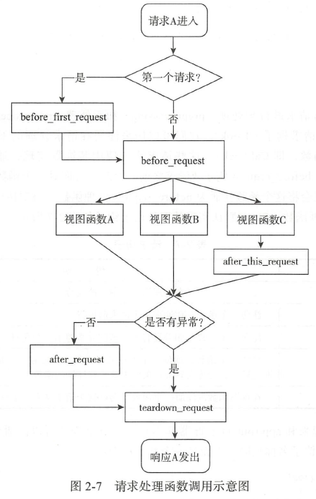
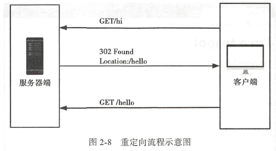

# Flask与HTTP

## 请求与响应


用户访问URL，浏览器生成HTTP请求，发送至Web服务器。

Web服务器接收请求，通过WSGI将HTTP格式的请求数据转换为Flask能够使用Pyhon数据。

Flask根据请求的URL执行对应的视图函数，获取返回值。

返回值经过WSGI转换生成HTTP响应。

HTTP响应通过Web服务器传送至用户浏览器。

浏览器渲染响应中的HTML和CSS，执行JavaScript代码，展现页面给用户。

## HTTP请求

以一个URL为例

http://demo.com/hello?name=Lily

这个URL由以下几个部分组成

| 信息             | 说明                                             |
| ---------------- | ------------------------------------------------ |
| http://          | 协议字符串，指定要使用的协议                     |
| demo.com         | 服务器的地址或域名                               |
| /hello?name=Lily | 要获取的资源路径（path），类似UNIX的文件目录结构 |

> 路径结尾部分以`?`开头，以`&`为分隔的字符串是**查询字符串(query string)**。相当于给URL传参。

### 请求报文

浏览器和服务器交互的数据被称为**报文(message)**，浏览器发送的数据被称为**请求报文(request message)**，服务器返回的数据被称为**响应报文(response message)**


https://www.cnblogs.com/churi/p/3685808.html

请求报文的格式

- 请求行：请求方法 + 空格 + URL + 空格 + 协议版本 + 回车符 + 换行符
- 请求头：由多个字段键值对组成，格式为：字段 + 分号`:` + 值 + 回车换行
- 空行：请求行和请求头之间都一个空行
- 请求数据：

```
GET /buy HTTP/1.0
Host: 127.0.0.1:5000
User-Agent: Mozilla/5.0 (Windows NT 10.0; Win64; x64; rv:95.0) Gecko/20100101 Firefox/95.0
Accept: text/html,application/xhtml+xml,application/xml;q=0.9,image/avif,image/webp,*/*;q=0.8
Accept-Language: zh-CN,zh;q=0.8,zh-TW;q=0.7,zh-HK;q=0.5,en-US;q=0.3,en;q=0.2
Accept-Encoding: gzip, deflate
DNT: 1
Connection: keep-alive
Upgrade-Insecure-Requests: 1
Sec-Fetch-Dest: document
Sec-Fetch-Mode: navigate
Sec-Fetch-Site: none
Sec-Fetch-User: ?1
```

http中可用的首部字段列表：https://www.iana.org/assignments/message-headers/message-headers.xhtml

请求方法的详细列表和说明 https://tools.ietf.org/html/rfc7231

常见的HTTP方法

| 方法 | 说明     | 方法    | 说明           |
| ---- | -------- | ------- | -------------- |
| GET  | 获取资源 | DELETE  | 删除资源       |
| POST | 传输数据 | HEAD    | 获得报文首部   |
| PUT  | 传输文件 | OPTIONS | 询问支持的方法 |

### Requeset对象

Flask也有一个Request对象，可以通过访问这个对象的一些属性获取相关的值

假设请求的URL是：http://127.0.0.1:5000/buy?name=apple

request属性对应的结果

```
request.path: /buy
request.full_path: /buy?name=apple
request.host: 127.0.0.1:5000
request.host_url: http://127.0.0.1:5000/
request.base_url: http://127.0.0.1:5000/buy
request.url: http://127.0.0.1:5000/buy?name=apple
request.url_root: http://127.0.0.1:5000/
```

除此之外，还有许多属性和方法可以获取更多数据

| 属性         | 说明                                                         |
| ------------ | ------------------------------------------------------------ |
| args         | Werkzeug的ImmutableMultiDict对象。存储解析后的查询字符串，可通过字典的方式获取键值。 |
| query_string | 可以获取为解析的原生查询字符串                               |
| blueprint    | 当前蓝本的名称                                               |
| cookies      | 一个包含所有随请求提交的cookies的字典(?)                     |
| data         | 包含字符串形式的请求数据                                     |
| endpoint     | 与当前请求相匹配的端点值                                     |
| files        | Werkzeug 的MultiDict 对象，包含所有上传文件，可以使用字典的形式获取文件。使用的键为文件input 标签中的n ame 属性值，对应的值为Werkzeug 的FileStorage 对象，可以调用save()方法并传入保存路径来保存文件 |
| form         | Werkzeug的ImmutableMultiDict对象。与files类似，包含解析后的表单数据。键是input标签的name属性，值为表单字段值。 |
| values       | Werkzeug的CombinedMultiDict对象，结合了args和form属性的值    |
| headers      | 一个Werkzeug的EnvironHeaders对象，包含首部字段，可以以字典的形式操作 |
| is_json      | 通过MIME类型判断是否为JSON数据，返回布尔值                   |
| json         | 包含解析后的JSON数据，内部调用get_json()，可以通过字典的方式获取键值 |
| method       | 请求的HTTP方法                                               |
| referrer     | 请求发起的源URL，即referer                                   |
| scheme       | 请求的URL模式(http 或 https)                                 |
| user_agent   | 用户代理(user agend, UA)包含了用户的客户端类型，操作系统类型等信息。 |

方法

```python
request.get_data(cache=True, as_text=False, parse_from_data=False)
```

获取消求中的数据， 默认读取为字节字符串（ bytestring ）， 将as _text 设为True则返回值是解码后的unicode字符串

```python
get_json(self, force=False, silent=False, cache=True)
```

作为JSON 解析并返回数据，如果MlME类型不是JSON ，返回None （除非force 设为True ）；解析出错则抛出Werkzeug 提供的Bad Request 异常（ 如果未开启调试模式，则返回400 错误响应， 如果silent 设为True 则返回None; cache 设置是否缓存解析后的JSON 数据

>Werkzeug 的MultiDict 类是字典的子类，它主要实现了同一个键付多个值的机。比如一个文件上传字段可能会接收多个文件。这时就可以通过get list（）方法来获取文件对象列表。而ImmutableMultiDict 类继承了MutliDict 类，但其值不可更改。更多内容可访问Werkzeug 相关数据结构章节http://werkzeug.pocoo.org/docs/latest/datastructures/ 。

### 在flask中处理请求

flask程序实例中存储了一个路由表`app.url_map`如果请求报文中的URL没有匹配的话，会返回404 Not Found

可以使用`flask routes`命令查看程序中定义的所有路由。

````
flask routes
```

```
Endpoint  Methods  Rule
--------  -------  -----------------------
buy       GET      /buy/<goods>
buy       GET      /buy
hello     GET      /hello/<name>
index     GET      /
static    GET      /static/<path:filename>
```

static端点是flask添加的特殊路由，用于访问静态文件。

**设置监听方法**

flask路由装饰器有一个methods参数，默认只有一个GET方法

```python
@app.route('/hello', methods=['GET', 'POST'])
def hello():
    ...
```

如果用错误的方法访问URL会得到一个405 Method Not Allowed响应

**变量转换器**

变量转换器会把传入的参数转换为指定的类型

比如

```python
@app.route('record/<int:year>')
def goback(year):
    print("type(year)", type(year))
    return "go back %s" % (year - 50)
```

> 好处：如果不用转换器，那得自己使用int(year)转换，如果用户输入字符串，那就会报错。
>
> 而使用转换器，用户输入字母，就会直接返回404错误

Flask内置URL变量转换器如下

| 转换器 | 说明                                                         |
| ------ | ------------------------------------------------------------ |
| string | 不包含斜线的字符串(默认值)                                   |
| int    | 整型                                                         |
| float  | 浮点型                                                       |
| path   | 包含斜线的字符串。static路由的URL规则中的filename变量就使用了这个转换器 |
| any    | 匹配一系列给定值中的一个函数(?)                              |
| uuid   | UUID字符串                                                   |

any转换器：相当于单选题，给出几个选项，只能选其中一个，比如

```python
@app.route('/colors/<any(red, green, blue):color')
def three_colors(color):
    return color
```

这样传入的参数只能是`red`、`green`、`blue`的其中一个。

### 请求钩子

有时候需要对请求进行**预处理(preprocessing)**和**后处理(postprocessing)**，可以使用Flask提供的请求**钩子(Hook)**

钩子可以用来注册在请求处理的不同阶段执行的处理函数(或称为回调函数，Callback)。

Flask默认实现的五种请求钩子

| 钩子                      | 说明                                                         |
| ------------------------- | ------------------------------------------------------------ |
| @app.before_first_request | 在处理第一个请求前运行                                       |
| @before_request           | 在处理每个请求前运行                                         |
| @after_request            | 如果没有未处理的异常抛出，会在每个请求结束后运行             |
| @teardown_request         | 即使有未处理的异常抛出，也会在每个请求结束后运行。如果发生异常，会传入异常对象作为参数到注册的函数内 |
| @app.after_this_request   | 在视图函数内注册一个函数，会在这个请求结束后运行             |

例

```python
@app.before_request
def do_somthing():
    pass  # 这里的代码会在每个请求处理前执行
```

请求钩子的常见应用场景

- before_first_request: 运行程序前需要进行一些初始化操作：如创建数据表、添加管理员用户。
- before_request: 比如网站上要记录用户的最后在线时间，可以通过用户最后发送的请求时间来实现。
- after_request: 提交在视图函数中执行的数据库操作，可以在该钩子注册的函数中执行。



## HTTP响应

### 响应报文

```
HTTP/1.0 200 OK
Content-Type: text/html; charset=utf-8
Content-Length: 17
Server: Werkzeug/2.0.2 Python/3.8.12
Date: Sat, 08 Jan 2022 06:45:34 GMT
```

响应报文：

- 报文首部：
  - 状态行：协议 + 状态码 + 原因短语
  - 首部字段：名称:值
- 空行
- 报文主体，如`<h1>hello world!</h1>`

常见HTTP状态码

| 状态码 | 原因短语              | 说明                                                         |
| ------ | --------------------- | ------------------------------------------------------------ |
| 200    | OK                    | 请求被正常处理                                               |
| 201    | Created               | 请求被处理，并创建了一个新资源                               |
| 204    | No Content            | 请求处理成功，但无内容返回                                   |
| 301    | Moved Permanently     | 永久重定向                                                   |
| 302    | Found                 | 临时性重定向                                                 |
| 304    | Not Modified          | 请求的资源未被修改，重定向到缓存的资源                       |
| 400    | Bad Prequest          | 表示请求无效，即请求报文中存在错误                           |
| 401    | Unauthorized          | 类似403，表示请求的资源需要获取授权信息，在浏览器中会弹出认证弹窗 |
| 403    | Forbidden             | 表示请求的资源被服务器拒绝访问                               |
| 404    | Not Found             | 表示服务器上无法找到请求的或URL无效                          |
| 500    | Internal Server Error | 服务器内部发生错误                                           |

响应状态码详细列表：https://tools.ietf.org/html/rfc7231

### 在flask中生成响应

视图函数一般只需要返回响应主体，例如：

```python
@app.route('/')
def index():
    return "<h1>hello world!</h1>"
```

最多可以返回3个元素：响应主体、状态码、首部字段

```python
@app.route('/hello')
def hello():
    ...
    return 'hello', 302, {'Location', 'http://xx.com'}
```

要附加或修改某个首部字段时，可以传入第三个参数。

#### 1. 重定向响应

如果访问URL A 结果却跳到了URL B，这种行为就是重定向（redirect）



重定向的应用场景：登录后下载，登录后查看

Flask提供了`redirect()`函数来生成重定向响应，重定向的目标URL作为第一个参数。

```python
from flask import redirect
...

@app.route('/hello')
def hello():
    return redirect('http://www.baidu.com')
```

如果要重定向到其他视图，可以使用`url_for()`

```python
@app.route('/hi')
def hi():
    return redirect(url_for('hello'))
```

#### 2. 错误响应

```python
from flask import abort
...

@app.route('/404')
def not_found():
    abort(404)
```

> abort()函数前不需要使用return语句。一旦调用`abort()`，其之后的代码都不再执行

### 响应格式

大多数情况下，格式都是HTML。

通过改变Content-Type可以改变数据格式

```
Content-Type: text/html; charset=utf-8
```

> MIME类型(又称为media type或content type)
>
> 是一种用来标识文件类型的机制。与文件扩展名相对应。
>
> 格式为：类型名/子类型名。
>
> - text/html: 就是HTML的MIME类型
> - image/png: 就是png图片的MIME类型
>
> 可以参考：https://www.iana.org/assignments/media-types/media-types.xhtml

可以使用`make_response()`方法生成响应对象，传入响应的主体，然后设置该对象的mimetype属性

```python
from flask import make_reponse

@app.route('/foo')
def foo():
    response = make_reponse('Hello')
    response.mimetype = 'text/plain'
    # 效果相同
    # response.headers['Content-Type']='text/plain; charset=utf-8'
    return response
```

### MIME类型介绍

#### 1. HTML

text/html

```html
<h1>Hello world!</h1>
```

默认的数据类型

#### 2. 纯文本

text/plain

示例

```
Note
to: Peter
from: Jane
heading: Reminder
body: Don't forget the party!
```

如果设置为纯文本，包含HTML标签的文本会原原本本的展示出来

#### 3. XML

application/xml

```xml
<?xml version="1.0" encoding="UTF-8"?>
<note>
	<to>Peter</to>
    <from>Jane</from>
    <heading>Reminder</heading>
    <body>Don't forget the party!</body>
</note>
```

[XML](https://www.w3.org/XML)指Extensible Markup Language(可扩展标记语言)是一种简单灵活的文本格式，被设计用来存储和交换数据。

为了弥补HTML的不足：对于仅仅需要数据的请求来说，HTML提供的信息太多了，且不易重用。

XML一般作为AJAX请求的响应格式，或是Web API的响应格式。

#### 4. JSON

application/json

```json
{
    "note":{
        "to": "Peter",
        "from": "Jane",
        "heading": "Reminder",
        "body": "Don't forget the party!"
    }
}
```

[JSON](http://json.org)是JavaScript Object Notation

又弥补了XML的不足。

flask提供了`jsonify()`函数可以方便地返回JSON响应

常见用法：

- 传入普通参数
- 传入字典

```python
@app.route('/foo')
def foo():
    return jsonify(name='lily', age=18)

@app.route('/foo')
def foo():
    jsonify({'name': 'lily', 'age', 18})

# 默认生成200响应，可以增加返回值以更改响应类型
@app.route('/foo')
def foo():
    jsonify(message='error'), 500
```

