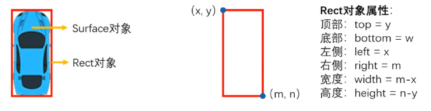

[pygame官方文档](https://www.pygame.org/docs/)

# 初见pygame

以下每个案例都是相互关联的，比如案例2基于案例1，案例3又基于案例2

## 1. 第一个窗口

创建一个窗口，大小是300x300的，默认背景是黑色的。

```python
import pygame
import sys

pygame.init()
# 设置窗体显示大小
screen = pygame.display.set_mode((300, 300))

while True:
    # 刷新屏幕
    pygame.display.update()
    for event in pygame.event.get():
        if event.type == pygame.QUIT:
            pygame.quit()
            # 如果系统在pygame.quit()前终止，IDLE会挂起。所以一般会在最后调用sys.exit()
            sys.exit()  


```

## 2. 设置背景颜色

定义一些颜色，把背景颜色设置为白色

颜色有好几种定义方式，按照自己喜欢的来就ok

有关于颜色，可以查看：

https://www.pygame.org/docs/ref/color.html

```python
# 定义颜色变量
WHITE = pygame.color.Color(255, 255, 255)
BLACK = pygame.color.Color(0, 0, 0, a = 255)
RED = "#FF0000"
GREEN = "0x00ff00"
BLUE = (0, 0, 255)
```

设置标题

```python
pygame.display.set_caption("我的游戏")
```

设置背景颜色为白色

```python
screen = pygame.display.set_mode((300, 300))
screen.fill(WHITE)	
```

综合来就是

```python
import pygame
import sys

# 定义颜色变量
WHITE = pygame.color.Color(255, 255, 255)
BLACK = pygame.color.Color(0, 0, 0, a = 255)
RED = "#FF0000"
GREEN = "0x00ff00"
BLUE = (0, 0, 255)

pygame.init()
# 设置窗体显示大小
screen = pygame.display.set_mode((300, 300))
pygame.display.set_caption("我的游戏")
# 设置背景颜色
screen.fill(WHITE)

while True:
    # 刷新屏幕
    pygame.display.update()
    for event in pygame.event.get():
        if event.type == pygame.QUIT:
            pygame.quit()
            # 如果系统在pygame.quit()前终止，IDLE会挂起。所以一般会在最后调用sys.exit()
            sys.exit()
```

## 3. 画几个图形

https://www.pygame.org/docs/ref/draw.html

while循环内，多了几句绘制图形的语句。

```python
import pygame
import sys

# 定义颜色变量
WHITE = pygame.color.Color(255, 255, 255)
BLACK = pygame.color.Color(0, 0, 0, a = 255)
RED = "#FF0000"
GREEN = "0x00ff00"
BLUE = (0, 0, 255)

pygame.init()
# 设置窗体显示大小
screen = pygame.display.set_mode((300, 300))
pygame.display.set_caption("我的游戏")
# 设置背景颜色
screen.fill(WHITE)

while True:
    pygame.draw.circle(screen, BLACK, (100, 50), 30)
    pygame.draw.circle(screen, BLACK, (200, 50), 30)
    pygame.draw.line(screen, BLUE, (150, 130), (130, 170))
    pygame.draw.line(screen, BLUE, (150, 130), (170, 170))
    pygame.draw.line(screen, 'green', (130, 170), (170, 170))
    pygame.draw.rect(screen, 'red', (100, 200, 100, 50))
    # 刷新屏幕
    pygame.display.update()
    for event in pygame.event.get():
        if event.type == pygame.QUIT:
            pygame.quit()
            # 如果系统在pygame.quit()前终止，IDLE会挂起。所以一般会在最后调用sys.exit()
            sys.exit()


```

## 4. 加载素材

实际上，我们不会自己用pygame绘图，通常是加载已有的素材。
Surface对象，也称为“表面对象”。本质上是在内存中分配一块存放指定尺寸的内存空间，来存放用于显示的图像。可以理解为一个“图层”，即将显示的图片会先放在上面。
Rect对象，就是一个矩形方框。方便我们对于屏幕上的画面进行局部绘制、移动、碰撞检测。  

```python
# 把图片加载到内存，返回一个surface对象
player = pygame.image.load('Player.png')
# 通过surface对象尺寸，获取对应图像的外切矩形对象
player_rect = player.get_rect()
```



矩形对象用于移动和对齐的虚拟属性

```
x,y
top, left, bottom, right
topleft, bottomleft, topright, bottomright
midtop, midleft, midbottom, midright
center, centerx, centery
size, width, height
w,h
```

可以这么设置属性

```
rect1.right = 10
rect2.center = (20, 30)
```

加载背景图片和小车

`bilt`是局部刷新，可以节省一定的计算资源。

```python
import pygame
import sys

pygame.init()
# 设置窗体显示大小
screen = pygame.display.set_mode((400, 600))
pygame.display.set_caption("我的游戏")
# 加载背景
background = pygame.image.load("AnimatedStreet.png")
player = pygame.image.load("Player.png")
x, y = 178, 504

while True:
    # 绘制背景图片和小车
    screen.blit(background, (0, 0))
    screen.blit(player, (x, y))
    # 刷新屏幕
    pygame.display.update()
    for event in pygame.event.get():
        if event.type == pygame.QUIT:
            pygame.quit()
            # 如果系统在pygame.quit()前终止，IDLE会挂起。所以一般会在最后调用sys.exit()
            sys.exit()


```

## 5. 素材的移动

需要设定FPS，每秒刷新的频率

```python
FPS = 30  # 1秒30绘制张图片

clock = pygame.time.Clock()
# 放到主循环
# clock.tick(FPS)
```


```python
import pygame
import sys

pygame.init()
# 设置窗体显示大小
screen = pygame.display.set_mode((400, 600))
pygame.display.set_caption("我的游戏")
# 加载背景
background = pygame.image.load("AnimatedStreet.png")
player = pygame.image.load("Player.png")
x, y = 178, 504
FPS = 30  # 1秒30张图片

clock = pygame.time.Clock()
while True:
    # 绘制背景图片和小车
    y -= 1
    screen.blit(background, (0, 0))
    screen.blit(player, (x, y))
    # 刷新屏幕
    pygame.display.update()
    for event in pygame.event.get():
        if event.type == pygame.QUIT:
            pygame.quit()
            # 如果系统在pygame.quit()前终止，IDLE会挂起。所以一般会在最后调用sys.exit()
            sys.exit()

    clock.tick(FPS)
```

## 6. 对象封装

实际上，用面向对象的方式封装游戏里的对象会让你的代码变得更加清晰。所以这一步主要是把小车player对象封装成一个类，便于管理。

```python
import pygame
import sys

# 设置窗体显示大小
width, height = 400, 600
FPS = 30  # 1秒30张图片


class Player:
    def __init__(self):
        x, y = (width / 2, height / 2)
        self.image = pygame.image.load("Player.png")
        self.rect = self.image.get_rect(center=(x, y))  # 默认是top和left

    def move(self):
        # self.rect.y -= 1
        # self.rect = self.rect.move(0,-1)
        self.rect.move_ip(0, -5)


# 初始化player对象
player = Player()
pygame.init()
screen = pygame.display.set_mode((width, height))
# 加载背景
background = pygame.image.load("AnimatedStreet.png")
clock = pygame.time.Clock()
while True:
    # 绘制背景图片和小车
    screen.blit(background, (0, 0))
    screen.blit(player.image, player.rect)
    player.move()
    # 刷新屏幕
    pygame.display.update()
    for event in pygame.event.get():
        if event.type == pygame.QUIT:
            pygame.quit()
            # 如果系统在pygame.quit()前终止，IDLE会挂起。所以一般会在最后调用sys.exit()
            sys.exit()

    clock.tick(FPS)
```

# 事件处理机制

键盘，鼠标，游戏运行中，均会产生事件

```python
for event in pygame.event.get():
    if event.type == pygame.QUIT:
        pygame.quit()
```

官方文档：https://www.pygame.org/docs/ref/event.html

事件代码实际上是数字：`pygame.QUIT == 256`


| 分类     | 事件            | 产生途径             | 属性                     |
| -------- | --------------- | -------------------- | ------------------------ |
| 系统     | QUIT            | 用户按下关闭按钮     | none                     |
| 系统     | ACTIVEEVENT     | Pygame被激活或者隐藏 | gain, state              |
| 键盘     | KEYDOWN         | 键盘被按下           | unicode, key, mod        |
| 键盘     | KEYUP           | 键盘被放开           | key, mod                 |
| 鼠标     | MOUSEMOTION     | 鼠标移动             | pos, rel, buttons        |
| 鼠标     | MOUSEBUTTONDOWN | 鼠标按下             | pos, button              |
| 鼠标     | MOUSEBUTTONUP   | 鼠标放开             | pos, button              |
| 窗口     | VIDEORESIZE     | 窗口缩放             | size, w, h               |
| 窗口     | VIDEOEXPOSE     | 窗口展现             | none                     |
| 用户定义 | USEREVENT       | 用户自定义事件       | code                     |
| 游戏杆   | JOYAXISMOTION   | 操作轴运动           | instance_id, axis, value |
| 游戏杆   | JOYBALLMOTION   | 操作球运动           | instance_id, ball, rel   |
| 游戏杆   | JOYHATMOTION    | 操作帽运动           | instance_id, hat, value  |
| 游戏杆   | JOYBUTTONUP     | 操作键抬起           | instance_id, button      |
| 游戏杆   | JOYBUTTONDOWN   | 操作键按下           | instance_id, button      |

## 1. 键盘事件

如果不把按键判断代码放在事件队列判断中：

当按住↓键时​小车会一直往下跑。​因为每次循环都在检测按键的状态

```python
for event in pygame.event.get():
    pass

pressed_keys = pygame.key.get_pressed()
if pressed_keys[pygame.K_DOWN]:
    player.rect.move_ip(0, 5)
```

如果放在里面，按住也不会一直往下跑

```python
for event in pygame.event.get():
    pressed_keys = pygame.key.get_pressed()
    if pressed_keys[pygame.K_DOWN]:
        player.rect.move_ip(0, 5)
```

因为这时候只拿到了一次事件，所以小车只会往下移动一次。因为`pygame.event.get()`拿不到任何事件，**按住↓的同时如果用鼠标在屏幕上移动，小车就会继续移动了**。因为get到了事件，进入了循环。

**实际上，这段代码应该放到Player对象中的move()方法内**

同时添加其他的移动方法

```python
class Player:
    def __init__(self):
        x, y = (width / 2, height / 2)
        self.image = pygame.image.load("Player.png")
        self.rect = self.image.get_rect(center=(x, y))  # 默认是top和left

    def move(self):
        pressed_keys = pygame.key.get_pressed()
        if pressed_keys[pygame.K_DOWN]:
            self.rect.move_ip(0, 5)
```

## 2. 鼠标事件

https://www.pygame.org/docs/ref/mouse.html

用鼠标来控制小车的位置

```python
def move(self):
    mouse_x, mouse_y = pygame.mouse.get_pos()
    # player.rect.x = mouse_x
    # player.rect.y = mouse_y
    if self.rect.width/2 <= mouse_x <= width-self.rect.width/2\
    and self.rect.height/2 <= mouse_y <= height-self.rect.height/2:
        player.rect.center = (mouse_x, mouse_y)
```

## 3. 用户事件

- 定义用户事件类型名称和编码
- 定义用户事件触发条件
- 定义用户事件处理过程

比如，限制小车一定要在黄线内运行

事件类型名称和编码

```python
OUT_OF_RANGE = pygame.USEREVENT + 1
```

事件触发

```python
def mouse(self):
    if self.rect.left < 40 or self.rect.right > 360:
        pygame.event.post(pygame.event.Event(OUT_OF_RANGE))
```

事件处理

```python
if event.type == OUT_OF_RANGE:
    print('超过范围了！')
```

# 碰撞检测

https://www.pygame.org/docs/ref/sprite.html

pygame的sprite（精灵）对象封装了对于实体碰撞的检测方法。

要使用spite对象，需要让我们定义的角色继承sprite类。

sprite默认包含image和rect属性。

可以通过图像或图形获取surface对象和rect对象来赋值

```python
player = Player()
enemy = Enemy()

enemies = pygame.sprite.Group()
enemies.add(enemy)

if pygame.sprite.spritecollideany(player, enemies):
    print("撞车啦")
```

碰撞时的可能情况：

- 敌人和玩家都存在
  - `spritecollide(player, enemies, False)`
- 敌人消失
  - `spritecollide(player, enemies, True)`
  - True表示将敌人碰撞到的对象从组中清楚掉
- 敌人和玩家都消失
  - 主动使用`player.kill()`
- 玩家消失
  - 方法一：同上
  - `pygame.sprite.spritecollideany(player, enemies)`

spritecollideany

小车消失了，但是实际还存在于内存中。

证明：

点击鼠标，小车又出现了

```python
if event == pygame.MOUSEBUTTONDOWN:
    if player not in all_sprites:
        all_sprites.add(player)
```

最终代码：

```python
import pygame
import sys

# 设置窗体显示大小
width, height = 400, 600
FPS = 30  # 1秒30张图片


class Player(pygame.sprite.Sprite):
    def __init__(self):
        super().__init__()
        x, y = (width / 2, height / 2)
        self.image = pygame.image.load("Player.png")
        self.rect = self.image.get_rect(center=(x, y))  # 默认是top和left

    def move(self):
        pressed_keys = pygame.key.get_pressed()
        if pressed_keys[pygame.K_DOWN]:
            self.rect.move_ip(0, 5)
        if pressed_keys[pygame.K_UP]:
            self.rect.move_ip(0, -5)
        if pressed_keys[pygame.K_LEFT]:
            self.rect.move_ip(-5, 0)
        if pressed_keys[pygame.K_RIGHT]:
            self.rect.move_ip(5, 0)


class Enemy(pygame.sprite.Sprite):
    def __init__(self):
        super().__init__()
        x, y = (width / 2, height / 2)
        self.image = pygame.image.load("Enemy.png")
        self.rect = self.image.get_rect(center=(width/2, 0))  # 默认是top和left

    def move(self):
        self.rect.move_ip(0, 5)


# 初始化player对象
player = Player()
enemy = Enemy()

# 增加敌人
enemies = pygame.sprite.Group()
enemies.add(enemy)

all_sprites = pygame.sprite.Group()
all_sprites.add(player)
all_sprites.add(enemy)

pygame.init()
screen = pygame.display.set_mode((width, height))
# 加载背景
background = pygame.image.load("AnimatedStreet.png")
clock = pygame.time.Clock()
while True:
    # 绘制背景图片和小车
    screen.blit(background, (0, 0))
    for sprite in all_sprites:
        screen.blit(sprite.image, sprite.rect)
        sprite.move()

    # 刷新屏幕
    pygame.display.update()
    for event in pygame.event.get():
        if event.type == pygame.QUIT:
            pygame.quit()
            # 如果系统在pygame.quit()前终止，IDLE会挂起。所以一般会在最后调用sys.exit()
            sys.exit()
        if event.type == pygame.MOUSEBUTTONDOWN:
            if player not in all_sprites:
                all_sprites.add(player)
    # 碰撞检测
    if pygame.sprite.spritecollide(player, enemies, 0):
        player.kill()
        print("撞车啦")

    clock.tick(FPS)
```

# 字体和音乐

## 1. 字体

定义字体

一定要放到`pygame.init()`之后

```python
pygame.init()
# 设置字体和文字
# C:\Windows\Fonts
font_big = pygame.font.SysFont('STSong', 60)
font_small = pygame.font.SysFont('Verdana', 20)

game_over = font_big.render('游戏结束', True, BLACK)
```

绘制字体，放到主循环内

```python
screen.blit(game_over, (80, 150))
```

## 2. 音乐

https://www.pygame.org/docs/ref/music.html

https://www.pygame.org/docs/ref/mixer.html

```python
#播放背景音乐
pygame.mixer.Sound("background.wav").play(-1) #背景音乐默认执行1遍，参数loop默认为
# 0，-1表示无限循环  
```

 ```python
import time

import pygame
import sys

# 定义颜色
BLACK = (0, 0, 0)
RED = "#FF0000"

# 设置窗体显示大小
width, height = 400, 600
FPS = 30  # 1秒30张图片

# 定义分数
score = 0


class Player(pygame.sprite.Sprite):
    def __init__(self):
        super().__init__()
        x, y = (width / 2, height / 2)
        self.image = pygame.image.load("Player.png")
        self.rect = self.image.get_rect(center=(x, y))  # 默认是top和left

    def move(self):
        pressed_keys = pygame.key.get_pressed()
        if pressed_keys[pygame.K_DOWN]:
            self.rect.move_ip(0, 5)
        if pressed_keys[pygame.K_UP]:
            self.rect.move_ip(0, -5)
        if pressed_keys[pygame.K_LEFT]:
            self.rect.move_ip(-5, 0)
        if pressed_keys[pygame.K_RIGHT]:
            self.rect.move_ip(5, 0)


class Enemy(pygame.sprite.Sprite):
    def __init__(self):
        super().__init__()
        x, y = (width / 2, height / 2)
        self.image = pygame.image.load("Enemy.png")
        self.rect = self.image.get_rect(center=(width/2, 0))  # 默认是top和left

    def move(self):
        self.rect.move_ip(0, 5)
        if self.rect.top > height:
            global score
            score += 1
            self.rect.center = (width/2, 0)

# 初始化player对象
player = Player()
enemy = Enemy()

# 增加敌人
enemies = pygame.sprite.Group()
enemies.add(enemy)

all_sprites = pygame.sprite.Group()
all_sprites.add(player)
all_sprites.add(enemy)

pygame.init()
# 设置字体和文字
# C:\Windows\Fonts
font_big = pygame.font.SysFont('STSong', 60)
font_small = pygame.font.SysFont('Verdana', 20)

game_over = font_big.render('游戏结束', True, BLACK)

# 设置背景音乐
pygame.mixer.Sound('background.wav').play(1)

screen = pygame.display.set_mode((width, height))
# 加载背景
background = pygame.image.load("AnimatedStreet.png")
clock = pygame.time.Clock()
while True:
    # 绘制背景图片和小车
    screen.blit(background, (0, 0))
    scores = font_small.render(str(score), True, BLACK)
    screen.blit(scores, (10, 10))

    for sprite in all_sprites:
        screen.blit(sprite.image, sprite.rect)
        sprite.move()

    # 刷新屏幕
    pygame.display.update()
    for event in pygame.event.get():
        if event.type == pygame.QUIT:
            pygame.quit()
            # 如果系统在pygame.quit()前终止，IDLE会挂起。所以一般会在最后调用sys.exit()
            sys.exit()
        if event.type == pygame.MOUSEBUTTONDOWN:
            if player not in all_sprites:
                all_sprites.add(player)

    # 碰撞检测 撞击后游戏结束
    if pygame.sprite.spritecollide(player, enemies, False):
        pygame.mixer.Sound('crash.wav').play(1)
        player.kill()
        screen.fill(RED)
        screen.blit(game_over, (80, 150))
        pygame.display.update()
        time.sleep(2)
        print("撞车啦")
        pygame.quit()
        # 如果系统在pygame.quit()前终止，IDLE会挂起。所以一般会在最后调用sys.exit()
        sys.exit()

    clock.tick(FPS)
 ```

# 业务逻辑调整

- 角色不能超出边界（修改move()，比较简单，就略了）
- 碰撞画面不真实（缩小rect的范围）
- 难度要增加

缩小rect的范围

```python
class Player(pygame.sprite.Sprite):
    def __init__(self):
        super().__init__()
        x, y = (width / 2, height / 2)
        self.image = pygame.image.load("Player.png")
        self.surf = pygame.Surface((40, 75))
        self.rect = self.surf.get_rect(center=(178, height-21))
```

增加难度

随机敌人出现的位置

```python
class Enemy(pygame.sprite.Sprite):
    def __init__(self):
        super().__init__()
        self.image = pygame.image.load("Enemy.png")

        self.surf = pygame.Surface((42, 75))
        self.rect = self.surf.get_rect(center=(random.randint(22, 378), 0))

    def move(self):
        self.rect.move_ip(0, 5)
        if self.rect.top > height:
            global score
            score += 1
            self.rect.center = (random.randint(22, 378), 0)
```

速度随着时间增加

```python
SPEED_UP = pygame.USEREVENT + 1
pygame.time.set_timer(SPEED_UP, 1000)  # 每1秒加一次速
```

事件处理

```python
if event.type == SPEED_UP:
    SPEED += 3
```

## 打包项目

安装一个python的打包库

```
pip install pyinstaller
```

使用这种方式打包游戏，需要把游戏资源一并复制到生成的dist文件夹内。

```python
pyinstaller -F main.py
```

https://www.iconfont.cn 设置自定义图标

下载并把图片转换成ico格式

复制到项目目录

重新生成

```
pyinstaller -F -w -i car.ico main.py
```

# 代码重构

使用面向对象的思想

常量放在一块，对象放在一块

```python
import time
import random

import pygame
import sys


class Constant:
    SCREEN_WIDTH = 400
    SCREEN_HEIGHT = 600

    # 定义颜色
    BLACK = (0, 0, 0)
    RED = "#FF0000"

    # 设置窗体显示大小
    FPS = 60  # 1秒30张图片

    # 定义分数
    SCORE = 0

    # 初始速度
    SPEED = 5
    SPEED_UP = pygame.USEREVENT + 1  # 速度事件


class Player(pygame.sprite.Sprite):
    def __init__(self):
        super().__init__()
        self.image = pygame.image.load("Player.png")
        self.surf = pygame.Surface((40, 75))
        self.rect = self.surf.get_rect(left=178, bottom=Constant.SCREEN_HEIGHT - 21)

    def move(self):
        pressed_keys = pygame.key.get_pressed()
        if pressed_keys[pygame.K_DOWN] or pressed_keys[pygame.K_s]:
            self.rect.move_ip(0, Constant.SPEED)
        if pressed_keys[pygame.K_UP] or pressed_keys[pygame.K_w]:
            self.rect.move_ip(0, -Constant.SPEED)
        if pressed_keys[pygame.K_LEFT] or pressed_keys[pygame.K_a]:
            self.rect.move_ip(-Constant.SPEED, 0)
        if pressed_keys[pygame.K_RIGHT] or pressed_keys[pygame.K_d]:
            self.rect.move_ip(Constant.SPEED, 0)


class Enemy(pygame.sprite.Sprite):
    def __init__(self):
        super().__init__()
        self.image = pygame.image.load("Enemy.png")

        self.surf = pygame.Surface((42, 75))
        self.rect = self.surf.get_rect(center=(random.randint(22, 378), 0))

    def move(self):
        self.rect.move_ip(0, Constant.SPEED)
        if self.rect.top > Constant.SCREEN_HEIGHT:
            Constant.SCORE += 1
            self.rect.center = (random.randint(22, 378), 0)


class Game:
    def __init__(self):
        # 初始化player对象
        pygame.init()

        # 设置标题
        pygame.display.set_caption('逆行飙车')
        # 设置加速
        pygame.time.set_timer(Constant.SPEED_UP, 1000)  # 每1秒加一次速

        # 设置背景音乐
        pygame.mixer.Sound('background.wav').play(1)

        self.screen = pygame.display.set_mode((Constant.SCREEN_WIDTH,
                                               Constant.SCREEN_HEIGHT))
        # 加载背景
        self.background = pygame.image.load("AnimatedStreet.png")
        self.clock = pygame.time.Clock()

        # 设置字体和文字
        # C:\Windows\Fonts
        self.font_big = pygame.font.SysFont('STSong', 60)
        self.font_small = pygame.font.SysFont('Verdana', 20)
        self.game_over = self.font_big.render('游戏结束', True, Constant.BLACK)

    def run(self):
        player = Player()
        enemy = Enemy()

        # 增加敌人
        enemies = pygame.sprite.Group()
        enemies.add(enemy)

        all_sprites = pygame.sprite.Group()
        all_sprites.add(player)
        all_sprites.add(enemy)

        while True:
            # 绘制背景图片和小车
            self.screen.blit(self.background, (0, 0))
            scores = self.font_small.render(str(Constant.SCORE),
                                            True,
                                            Constant.BLACK)

            self.screen.blit(scores, (10, 10))

            for sprite in all_sprites:
                self.screen.blit(sprite.image, sprite.rect)
                sprite.move()

            # 刷新屏幕
            pygame.display.update()
            for event in pygame.event.get():
                if event.type == pygame.QUIT:
                    pygame.quit()
                    # 如果系统在pygame.quit()前终止，IDLE会挂起。所以一般会在最后调用sys.exit()
                    sys.exit()

                if event.type == Constant.SPEED_UP:
                    Constant.SPEED += 3

            # 碰撞检测 撞击后游戏结束
            if pygame.sprite.spritecollide(player, enemies, False):
                pygame.mixer.Sound('crash.wav').play(1)
                player.kill()
                self.screen.fill(Constant.RED)
                self.screen.blit(self.game_over, (80, 150))
                pygame.display.update()
                time.sleep(2)
                print("撞车啦")
                pygame.quit()
                # 如果系统在pygame.quit()前终止，IDLE会挂起。所以一般会在最后调用sys.exit()
                sys.exit()

            self.clock.tick(Constant.FPS)


if __name__ == '__main__':
    game = Game()
    game.run()
```

# 练习

- 图片更换，场景更换
- 更换游戏玩法，改变游戏体验
- 修改游戏参数，改变游戏难度
- 增加游戏角色，改变趣味性
- 更换音乐，更改音乐风格