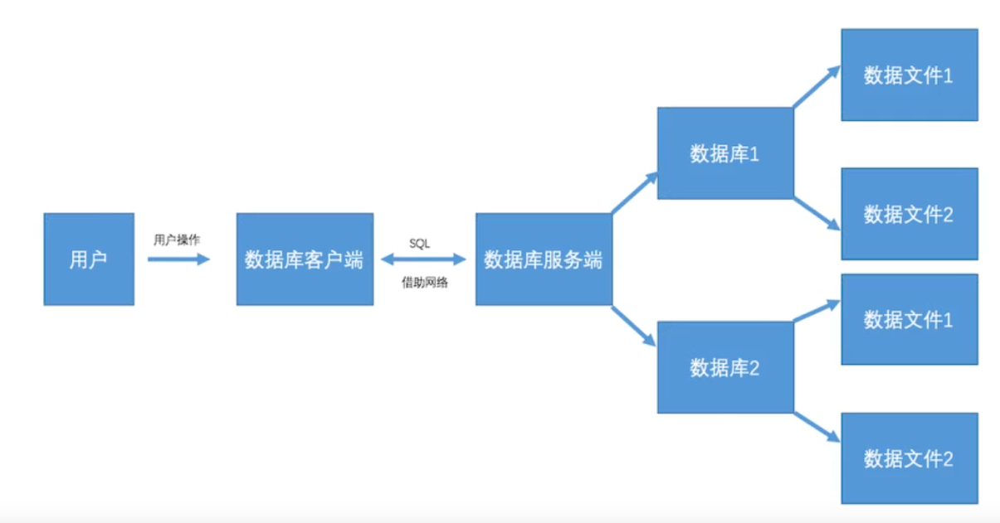
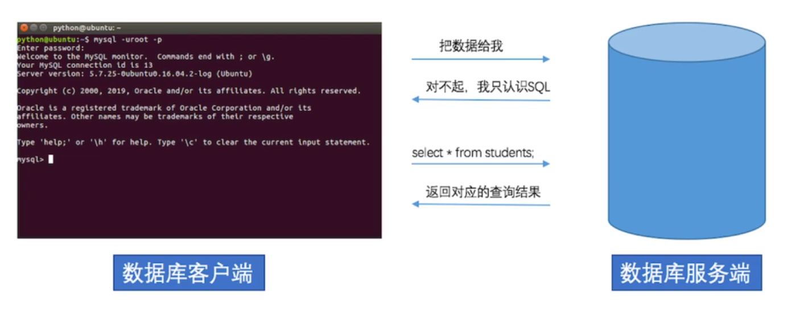

学前需求

- python基础知识
- 多线程编程知识
- 工具：pycharm，Navicat，[MySQL](https://www.mysql.com/)


## 数据库概述

数据库发展历程

| 发展历程       | 说明                                       |
| -------------- | ------------------------------------------ |
| 人工管理       | 用纸带灯进行数据的存储                     |
| 文件系统       | 数据存储在文件中（增删改查略麻烦）         |
| 数据库         | 解决了文件系统的问题（网购高并发应对不来） |
| 高级数据库阶段 | 分布式数据库                               |

数据库分类

| 分类           | 说明                                                         | 常用库                                            |
| -------------- | ------------------------------------------------------------ | ------------------------------------------------- |
| 关系型数据库   | 采用了关系模型来组织数据的数据库；关系模型指的就是二维表格模型。比如学生信息表 | oracle<br>Microsoft SQL Server<br>MySQL<br>SQLite |
| 非关系型数据库 | Not Only SQL强调Key-Value的方式存储数据，有点像python的字典。 | Mongodb<br>redis                                  |


关系型数据库的使用场景

- web网站系统
- 日志记录系统
- 数据仓库系统（大数据）
- 嵌入式系统


总结：

- 数据库发展史：人工->文件->数据库->高级数据库
- 数据库分类：关系型与非关系型
- 关系型数据库的使用场景


## MySQL概述

MySQL是一个关系型数据库管理系统的软件

数据库：存储数据的容器

软件：管理数据库的工具


### 关系型数据库管理系统RDBMS

MySQL是一个关系型数据库管理系统软件，在WEB应用方面，MySQL是最好的RDBMS(Relational Database Management System, 关系型数据库管理系统)应用软件，属于Oracle旗下产品


可以分为

- 关系型数据库服务端软件-Server
- 关系型数据库客户端软件-Client

关系型数据库管理系统流程图




#### 关系型数据库管理系统的通信流程



### SQL介绍

Structured Query Language是结构化查询语言，是一种用来操作RDBMS的数据库的语言，SQL语句是通用的。


### SQL语言的分类

| 简写 | 语义         | 说明                                |
| ---- | ------------ | ----------------------------------- |
| SQL  | 数据查询语言 | select                              |
| DML  | 数据操作语言 | insert，update，delete              |
| DDL  | 数据定义语言 | create，drop                        |
| TPL  | 事务处理语言 | begin transaction，commit，rollback |
| DCL  | 数据控制语言 | grant（分配权限），revoke           |


### MySQL的特点

- 开源免费
- 支持大型数据库
- 使用标准的SQL数据语言形式
- 可以安装在不同的操作系统，并且提供多种编程语言的操作接口。C, C++, Python, Java


### 总结：

- RDBMS关系型数据库管理软件系统
- RDBMS的软件分2个端，服务端和客户端
- MySQL数据库是RDBMS的其中一款软件

## MySQL数据类型

## 常用数据类型

| 数据类型                                   | 说明     |
| ------------------------------------------ | -------- |
| int, bit                                   | 整数     |
| decimal                                    | 小数     |
| varchar(长度可变字符串)<br> char(长度固定) | 字符串   |
| date, time, datetime                       | 日期时间 |
| enum(类别数比较少，比如男/女)              | 枚举类型 |

需要约束数据的录入，比如需要年龄但填入了一个字符串。需要名字，但填入了一句50个字符的话。


### MySQL基本字段约束

这些是基本常用的，后面还有其他的。

| 约束参数    | 说明                               |
| ----------- | ---------------------------------- |
| primary key | 主键约束(比如编号，0,1,2...)       |
| not null    | 非空约束(数据不能为空)             |
| unique      | 唯一约束(身份证，手机号，不能重复) |
| default     | 默认约束(默认值)                   |

## MySQL数据库的安装

### 服务端

```
sudo apt-get install mysql-server
```

### 客户端

```
sudo apt-get install mysql-client
```


windows

https://www.cnblogs.com/wenm1128/p/12786720.html

https://www.bilibili.com/read/cv5652639

Navicat Premium15 安装破解

https://www.bilibili.com/read/cv5803970

https://dev.mysql.com/downloads/mysql/

密码

