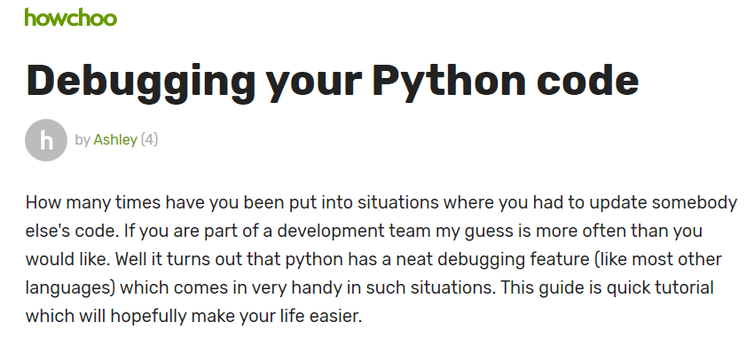
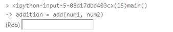
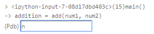
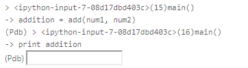
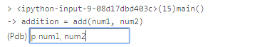
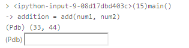
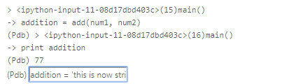
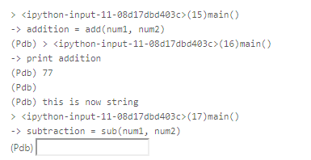

Python自带一个调试器, 在Python 3.7之后甚至成为内置调试器. 这就是PDB. 这是使用Python的用户需要掌握的基本技能. 

下面我们看一下基本演示(GIF循环播放):


对应代码如下, 大家可以运行起来试一下. 


```python
import pdb

class MyScrapy:
    urls = []

    def start_url(self, urls):
        pdb.set_trace()
        for url in urls:
            print(url)
            self.urls.append(url)

    def parse(self):
        pdb.set_trace()
        for url in self.urls:
            result = self.request_something(url)

    def request_something(self, url):
        print('requesting...')
        data = '''<!DOCTYPE html>
<html lang="en">
<head>
    <meta charset="UTF-8">
    <title>Title</title>
</head>
<body>
</body>
</html>'''
        return data


scrapy= MyScrapy()
scrapy.start_url(["http://www.zone7.cn", "http://www.zone7.cn", "http://www.zone7.cn", "http://www.zone7.cn", ])
scrapy.parse()

```

下面是详细使用说明, 主要内容参考 [howchoo](https://howchoo.com/g/zgi2y2iwyze/debugging-your-python-code) 



Python具有一个整洁的调试功能（像大多数其他语言一样），在这种情况下非常方便。本指南是快速教程，希望能让您的生活更轻松

# 1. 一个混乱的程序

为了本教程的目的，让我们考虑下面的简单程序。

该程序采用两个命令行参数并执行加法和减法操作。

（让我们假设用户输入有效值，因此我们不是错误处理）。


```python
import sys

def add(num1=0, num2=0):
    return int(num1) + int(num2)

def sub(num1=0, num2=0):
    return int(num1) - int(num2)

def main():
    #Assuming our inputs are valid numbers
    num1 = 0
    num2 = 2
    
    addition = add(num1, num2)
    print (addition)
    
    subtraction = sub(num1, num2)
    print (subtraction)

if __name__ == '__main__':
    main()
```

    2
    -2


# 2. pdb来了
Python附带了一个名为pdb的有用模块，它基本上是一个交互式源代码调试器。

您需要以下几行来实际使用此模块

```
import pdb
pdb.set_trace()
```


```python
import pdb
import sys

def add(num1=0, num2=0):
    return int(num1) + int(num2)
    
def sub(num1=0, num2=0):
    return int(num1) - int(num2)
    
def main():
    #Assuming our inputs are valid numbers
    num1 = 33
    num2 = 44
    pdb.set_trace() # <-- 这个表示添加断点
    addition = add(num1, num2)
    print (addition)
    subtraction = sub(num1, num2)
    print (subtraction)
    
if __name__ == '__main__':
    main()

```

一旦开始运行, 会出现交互框

如下图所示: 



在这个输入框里敲入命令, 即可开始调试. 

通常这些命令都是一个字母, 因此毋庸担心. 


# 3. 下一行 - > n

在输入框里, 输入n, 可转到下一行



这将执行当前代码行，现在可以执行下一行。



我们可以使用n逐行遍历整个程序，但这不会非常有用。

另外你可能已经注意到pdb实际上没有进入我们的add函数。让我们看看更多选项，使调试更有趣。

注意：
另一个很酷的功能是点击'返回键'执行你以前的命令（在这种情况下只是n）。

# 4. 打印 - > p

让我们再次开始调试我们的程序。（你可以点击c使pdb跳到最后或直到下一个断点。由于我们没有任何程序将完成执行）。

现在，如果我们想知道num1或num2包含什么，我们可以在输入框里输入：
```
p num1
```

如截图所示:



回车




这非常方便查看我们的变量实际存储的值。

现在让我们进入添加功能。

# 5. 动态添加断点 - > b

我们在运行程序之前使用了pdb.set_trace（）来设置断点。

我们通常希望在调试会话开始后在程序的特定位置添加断点。

这个时候可以考虑输入b. 可以亲自试一下. 

# 6. 动态分配变量
知道在调试会话期间可以分配变量以帮助调试也很有用。考虑：



输入后运行



# 7. 退出 - > q
最后，如果你想在任何时候退出，你可以使用q。正在执行的程序被中止。

# 8. 其他

还有一种更好的方式, 叫ipdb. 用法和PDB很相似. 不过返回的输出是彩色的. 
* ENTER (重复上次命令)
* c (继续)
* l (查找当前位于哪里)
* s (进入子程序,如果当前有一个函数调用，那么 s 会进入被调用的函数体)
* n(ext)  让程序运行下一行，如果当前语句有一个函数调用，用 n 是不会进入被调用的函数体中的
* r (运行直到子程序结束)
* !<python 命令>
* h (帮助)
* a(rgs) 打印当前函数的参数
* j(ump) 让程序跳转到指定的行数
* l(ist) 可以列出当前将要运行的代码块
* p(rint) 最有用的命令之一，打印某个变量
* q(uit) 退出调试
* r(eturn) 继续执行，直到函数体返回


```python
#如发现环境中未安装, 可以运行下方代码来安装ipdb

!pip install ipdb -i https://pypi.tuna.tsinghua.edu.cn/simple
```
