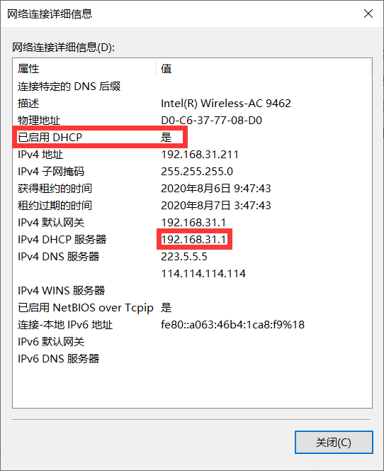

# 学习目标

- 说出网络通信和网络编程的概念
- 说出IP地址和子网掩码的作用
- 说出网络通信的几种方式
- 说出端口号的作用
- 说出什么是socket以及它的作用
- 说出TCP/UDP协议的特点
- 使用socket实现基于UDP的消息发送和接收
- 使用socket实现基于TCP的服务器和客户端通信

# 1. 网络通信概念

网络就是网线把电脑连在一起，大家能互相传文件。


交换机：

- 网吧pc1
- 网吧pc2
- ...

路由器：

- 电脑
- 手机
- pad

网线：有8根线。网络通信中，网线有8根，但是只使用其中四根(1246)。

光纤

ISP：互联网服务运营商 Internet Sevice provider

# 2. IP地址

IP地址要在同一个网段才能通信，进行一个与运输，计算网段。

```
192.168.31.124  # IP地址
255.255.255.0  # 子网掩码

192.168.31.0  # 与运算，这个表示主机位
```

这个网段下，最多能拥有254个主机，0和255被占了，0表示网络位(二进制全0)，255表示广播(二进制全1)，会给所有的主机发信息。

ip地址要和子网掩码互相配合才能判断是否在同一个网段。比如这两个IP地址就不一定不是一个网段。

```
192.168.7.20
192.168.13.18

# 255.255.255.0 不是一个网段
# 255.255.0.0 是一个网段
```

## IP地址的分类

| 类别 | 起始      | 结尾            | 掩码          | 网络数  | 单网络<br />主机数 |
| ---- | --------- | --------------- | ------------- | ------- | ------------------ |
| A    | 1.0.0.1   | 126.255.255.254 | 255.0.0.0     | 126     | 1677214            |
| B    | 128.1.0.1 | 191.255.255.254 | 255.255.0.0   | 16384   | 65534              |
| C    | 192.0.1.1 | 223.255.255.254 | 255.255.255.0 | 2097152 | 254                |
| D    | 保留地址  |                 |               |         |                    |
| E    | 保留用    |                 |               |         |                    |

## 私有地址

只能用于局域网，不允许在公网中使用

```
10.0.0.0 - 10.255.255.255
172.16.0.0 - 172.31.255.255
192.168.0.0 - 192.168.255.255
```

`0.0.0.0`对应于当前主机

`255.255.255.255`是当前子网的广播地址

`127.0.0.1 - 127.255.255.255`用于回路测试，比如用`http://127.0.0.1`就可以测试本机中配置的web服务器。


A类地址: 1.0.0.1 → 126.255.255.254

B类地址: 0.0.0.0 → 126.255.255.254

C类地址: 0.0.0.0 → 126.255.255.254

D类地址: 0.0.0.0 → 126.255.255.254

E类地址: 0.0.0.0 → 126.255.255.254


## 一些名词解释

**DHCP**(Dynamic Host Configuration Protocol)：用于分配IP地址，服务器的地址就是路由器的地址。DHCP就根据路由器的网段来给主机分配IP地址。类似你去餐厅吃饭，服务员给你带到相应的餐桌。

**默认网关**：如果要访问外部的网络，通过路由器向外访问，所以地址是路由器的IP地址。

**DNS**(Domain Name System)：域名+ip地址，这个系统负责根据域名找出该域名对应的IP地址。



# 3. 网络通信方式

**两台电脑**：

单独两台电脑之间通过网线连接就可以直接通信，但是需要提前设置好ip地址以及网络掩码，且要在同一个网段内。

**集线器**:

很多个电脑都连接到一个集线器，构成一个局域网。但缺点是任何一台电脑想跟其他电脑通信时，数据会被发送给所有电脑。

**交换机**：

类似集线器，克服了集线器以广播发送数据的缺点。可以广播也可以不广播。企业中就是用交换机。

**路由器**：

路由器承担了一些交换机的功能，可以负责连接两个局域网。

**复杂的通信过程**：

1.输入网址，解析成ip地址
2.得到ip地址后，浏览器通过三次握手连接服务器。
3.以tcp的方式发送http协议的请求数据给服务器
4.服务器tcp的方式回应http协议的应答数据给浏览器

总结：

- MAC地址：网卡的序列号。
- IP地址：相当于电脑的序列号
- 网络掩码：用于区分ip地址的网络号和主机号
- 默认网关：当需要发送的数据包的目的ip不在本网段时，就会发送给默认的一台电脑，它和外界沟通
- http服务器：提供浏览器能够访问到的数据

# 4. 端口

端口就像一个房子的门，是出入房子的必经之路，如果一个程序要收发网络数据，那就需要端口。在linux系统中，端口有65536个。端口是给程序用的，同一台电脑用pid来区分不同的程序。

常见端口号：0-1023，一般情况下需要有root权限

动态端口号：1024-65535，给自定义的程序使用

# 5. socket

用于不同电脑之间进行通讯。

ip地址+协议+端口号可以标识网络的进程。


socket是进程之间通信的方式，实现了不同主机间的通信。比如qq微信就是用这个的。


python中的socket

```python
import socket
socket.socket(AddressFamily, Type)

```

- AddressFamily: 可以选择AF_INET 用于Internet进程间通信，AF_UNIX用于同一台机器进程间通信。
- Type: 套接字累心，可以是SOCK_STREAM（流式套接字，主要用于TCP协议）SOCK_DGRAM（数据情报套接字，主要用于UDP）


# 6. UDP协议

user datagram protocol 用户数据报协议。通信开始之前，不需要建立相关的链接，只需要发送数据即可，类似于写信。	

## 发送

```python
import socket
s = socket.socket(socket.AF_INET, socket.SOCK_DGRAM)

# 不绑定端口号，发送时的端口号会乱变。
s.bind(('127.0.0.1', 8080))
# 10.13.118.19

# 2. 发送数据
# data: 要发送的数据(二进制)
# address: 发送给谁，参数是一个元祖，元祖有两个参数。(目标ip, 程序端口号)
s.sendto('hello'.encode('utf8'), ('127.0.0.1', 9090))
s.close()

```

## 接收

```python
import socket

s = socket.socket(socket.AF_INET, socket.SOCK_DGRAM)

# 绑定端口号和地址
s.bind(('127.0.0.1', 9090))
content = s.recvfrom(1024)
print(content)
# (b'hello', ('192.168.31.211', 49341))
# (接收到的数据, (发送方ip地址, 端口号))
s.close()

```

先运行下面的接收文件，在运行发送文件，即可收到信息。

## 发送并接收

```python
import socket
s = socket.socket(socket.AF_INET, socket.SOCK_DGRAM)

# 不绑定端口号，发送时的端口号会乱变。
s.bind(('127.0.0.1', 9090))

s.sendto('hello'.encode('utf8'), ('127.0.0.1', 9090))

content = s.recvfrom(1024)
print(content)
s.close()

```

# 7. TCP协议

## 客户端

Transmission Control Protocol

udp没有严格的客户端和服务器的区别，tcp是面向连接的协议，通信之前必须先连接。

```python
import socket
# 基于 TCP 协议的 socket 连接
s = socket.socket(socket.AF_INET, socket.SOCK_STREAM)

# 现在直接使用发送会报错。
# s.sendto('hello'.encode('utf8'), ('192.168.31.211', 9090))

# 必须先和服务器建立连接
s.connect(('192.168.31.211', 9090))

# 发送数据
s.send('hello'.encode('utf8'))

s.close()
```

## 服务端

```python
import socket
# 基于 TCP 协议的 socket 连接
s = socket.socket(socket.AF_INET, socket.SOCK_STREAM)

s.bind(('192.168.31.211', 9090))

# 把 socket 变成一个被动监听的socket
# 128表示队列的长度，假设处理上限是100个，多出来的会被放到队列里
# 超过228个请求，多余的就会显示连接失败。
s.listen(128)

client_socket, client_addr = s.accept()
# client_socket 客户端的的socket连接
# client_addr (ip地址, 端口号)

# tcp结束数据
# 1024指每一次获取数据的大小
data = client_socket.recv(1024)
print(data.decode('utf8'))

s.close()
```

## 文件下载案例

```python
# 文件下载服务器
import socket
import os
server = socket.socket(socket.AF_INET, socket.SOCK_STREAM)
server.bind(('192.168.31.211', 9090))
server.listen(128)

client_socket, client_addr = server.accept()
file_name = client_socket.recv(1024).decode('utf8')

if os.path.isfile(file_name):
    print('读取文件，返回给客户端')
    with open(file_name, 'rb') as f:
        content = f.read()
        client_socket.send(content)
else:
    print('文件不存在')
    
server.close()

```


```python
# 文件下载客户端
import socket
import os
client = socket.socket(socket.AF_INET, socket.SOCK_STREAM)
client.connect(('192.168.31.211', 9090))

file_name = input('请输入您要下载的文件名：').encode('utf8')
client.send(file_name)

with open('demo2', 'wb') as f:
    
    while True:
        content = client.recv(1024)  # 每次只读了1024字节
        
        if not content:
            break
        f.write(content)
client.close()

```

# 8. 多线程

## 多线程聊天

```python
import socket
import threading
import sys

s = socket.socket(socket.AF_INET, socket.SOCK_DGRAM)

s.bind(('192.168.31.211', 8080))

def send_msg():
    while True:
        msg = input('请输入您要发送的内容：')
        s.sendto(msg.encode('utf8'), ('192.168.31.211', 9090))
        if msg == 'exit':
            break
            
def recv_msg():
    # f = open('消息记录.txt', 'w', encoding='utf8')
    while True:
        data, addr = s.recvfrom(1024)
        # print('接收到了{}地址{}端口的消息:{}'.format(addr[0], addr[1], data.decode('utf8')), file=open('消息记录1.txt', 'a', encoding='utf8'))
        print('接收到了{}地址{}端口的消息:{}'.format(addr[0], addr[1], data.decode('utf8'))
        
t1 = threading.Thread(target=send_msg)
t2 = threading.Thread(target=recv_msg)

t1.start()
t2.start()
```


```python
import socket
import threading
import sys

s = socket.socket(socket.AF_INET, socket.SOCK_DGRAM)

s.bind(('192.168.31.211', 9090))

def send_msg():
    while True:
        msg = input('请输入您要发送的内容：')
        s.sendto(msg.encode('utf8'), ('192.168.31.211', 8080))
        if msg == 'exit':
            break
            
def recv_msg():
    # f = open('消息记录.txt', 'w', encoding='utf8')
    while True:
        data, addr = s.recvfrom(1024)
        # print('接收到了{}地址{}端口的消息:{}'.format(
        #        addr[0], addr[1], data.decode('utf8')), file=open('消息记录2.txt', 'a', encoding='utf8'))
        print('接收到了{}地址{}端口的消息:{}'.format(addr[0], addr[1], data.decode('utf8'))
        
t1 = threading.Thread(target=send_msg)
t2 = threading.Thread(target=recv_msg)

t1.start()
t2.start()
```

## 全局变量共享

多个线程可以共享全局变量，但是可能出现**线程安全问题**。

```python
import threading
import time
ticket = 20

def sell_ticket():
    global ticket
    while True:
        if ticket <= 0:
            print('票卖完了，花费{:.2f}s'.format(time.time()-start))
            break
            
        time.sleep(1)
        ticket -= 1
        print('{}卖出一张票，还剩{}张'.format(threading.current_thread().name, ticket))

start = time.time()
for i in range(2):
    t = threading.Thread(target=sell_ticket, name='线程%s'%i)
    t.start()
```

## 线程锁

当多个线程几乎同时修改某一个共享数据的时候，需要进行同步控制。同步就是协同步调，按预定的先后次序运行。线程同步能够保证多个线程安全访问竞争资源，最简单的同步机制是引入互斥锁。

互斥锁为资源引入一个状态：锁定/非锁定

某个线程要更改共享数据时，先将其锁定，此时的资源状态为：**锁定**。其他线程就不能修改；直到该线程释放资源，将资源的状态变成**非锁定**，其他的线程才能再次锁定该资源。互斥锁保证了每次只有一个线程进行写入操作，从而保证了多线程情况下数据的正确性。

```python
import threading
import time
ticket = 20
# 创建一把锁
lock = threading.Lock()

def sell_ticket():
    global ticket
    while True:
        lock.acquire()  # 加同步锁
        if ticket <= 0:
            print('票卖完了，花费{:.2f}s'.format(time.time()-start))
            lock.release()
            break
            
        time.sleep(1)
        ticket -= 1
        print('{}卖出一张票，还剩{}张'.format(threading.current_thread().name, ticket))
        lock.release()
start = time.time()
for i in range(2):
    t = threading.Thread(target=sell_ticket, name='线程%s'%(i+1))
    t.start()
```

## 线程间通信

线程之间有时候要通信，操作系统提供了很多机制来实现进程间的通信，其中使用最多的是队列Queue

Queue是一个先进先出的数据结构。

​	`queue.Queue.get()`是一个阻塞的方法。队列里没数据了，执行`get()`的线程就会被阻塞

```python
import threading
import queue
import time
def producer():
    for i in range(5):
        time.sleep(1)
        pro = threading.current_thread().name
        bread = '面包{}'.format(i)
        print('{}生产{}'.format(pro, bread))
        q.put((pro, bread))  # 把面包加入面包队列
    
def consumer():
    while True:
        time.sleep(0.3)
        buyer = threading.current_thread().name
        pro, bread = q.get()
        print('{}购买了{}生产的{}'.format(buyer, pro, bread))

q = queue.Queue()  # 创建一个队列对象
for i in range(3):
    p = threading.Thread(target=producer, name='p%s'%(i+1))
    p.start()
for i in range(3):
    c = threading.Thread(target=consumer, name='c%s'%(i+1))
    c.start()

```

# 9. 多进程

程序：例如demo.py，是一个静态的

进程：一个程序运行起来后，代码+用到的资源称之为进程，是操作系统分配资源的基本单位，不仅可以通过线程完成多任务，进程也可以。

工作中，任务数往往大于CPU核心数，即一定有一些任务在执行，另外一些任务在等待cpu，因此导致不同的状态：

- 就绪态：运行的条件已经满足，正在等待cpu执行
- 执行态：cpu正在执行其通能
- 等待态：等待某些条件满足，例如一个程序sleep了，此时处于等待态。

## 创建进程

```python
import multiprocessing

# os.getpid()  # 打印当前进程
```

## 进程和线程的区别

### 功能

- 进程：一台电脑上多个qq
- 线程：一个qq多个聊天窗

### 定义：

- 进程是系统资源分配和调度的最小单位
- 线程是进程的一个实体，是CPU调度和分配的基本单位，是比进程更小的能独立运行的基本单位。线程自己基本上不拥有任何系统资源，只拥有一点在运行中必不可少的资源。但是它可以与同属一个进程的其他线程共享进程拥有的全部资源（同一个进程间的线程可以共享全局变量。）

### 区别：

- 一个程序至少有一个进程，一个进程至少有一个线程
- 线程的划分尺度小于进程，使得多线程程序的并发性高
- 进程在执行过程中拥有独立的内存单元，多个线程共享内存，从而极大提高了程序的执行效率
- 线程不能独立执行，必须依存于进程
- 可以将进程理解为工厂中的一条流水线，线程是流水线上的工人。

### 优缺点

- 线程开销小，但不利于资源的管理和保护，进程则相反。

## 进程间通信

和线程的区别在于需要传参数

```python
import multiprocessing
# import queue  # 多进程不能用这个
import time
import os

def producer(q):
    for i in range(5):
        time.sleep(1)
        pro = os.getpid()
        bread = '面包{}'.format(i)
        print('pid{}生产{}'.format(pro, bread))
        q.put((pro, bread))  # 把面包加入面包队列
    
def consumer(q):
    while True:
        time.sleep(0.3)
        buyer = os.getpid()
        pro, bread = q.get()
        print('{}购买了{}生产的{}'.format(buyer, pro, bread))

if __name__ == '__main__':
    q = multiprocessing.Queue()  # 创建一个队列对象
    for i in range(3):
        p = multiprocessing.Process(target=producer, name='p%s'%(i+1), args=(q, ))
        p.start()
    for i in range(3):
        c = multiprocessing.Process(target=consumer, name='c%s'%(i+1), args=(q, ))
        c.start()

```

## 队列的使用

```python
import queue
import multiprocessing
# 
#q1 = queue.Queue()  # 线程通信
# q2 = multiprocessing.Queue()  # 进程通信

def get():
    time.sleep(3)
    d = q.get()
    print('拿出了%d' %d)
if __name__ == '__main__':
    q = multiprocessing.Queue(2)
    p = multiprocessing.Process(target=get)
    q.put(0)
    q.put(1)
    # print(q.full())  # 是否放满
    
    q.put(2)  # 放满了，程序会被阻塞。
```

`put(obj, block=True, timeout=None)`

block 表示如果队列放满了，就等待

timeout表示放满了以后，超时等待多久以后程序报错。单位是s

`put_nowait()`等价于`q.put(data, block=False)`


`get(block=True, timeout=None)`也会阻塞，拿完了就要等待

`get_nowait() `等价于`get(block=False)`

## 进程池

当需要创建的子进程数量不多时，可以直接利用multiprocessing中的Process动态生成多个进程，但如果是成百上千个目标，手动创建进程的工作量巨大，此时可以用到Pool方法。

初始化Pool时，可以指定一个最大进程数，当有新的请求提交到Pool时，如果池还没满，就会创建一个新的进程来执行该请求；否则请求会被等待，直到池中有某个进程结束，才会用之前的进程执行新的任务。

```python
from multiprocessing import Pool
import os, time, random

def worker(msg):
    start = time.time()
    print('{}开始执行，进程号为{}'.format(msg, os.getpid()))
    time.sleep(random.random() * 2)
    print(msg, '执行完毕， 耗时%.2fs' % (time.time() - start))
    
if __name__ == '__main__':
    pool = Pool(3)
    for i in range(10):
        pool.apply_async(worker, (i, ))
    pool.close()
    pool.join()
```

- `apply_async(func[, args[, kwds]])`：使用非阻塞方式调用func（并行执行，堵塞方式必须等待上一个进程退出才能执行下一个进程）
- close() 关闭pool使其不再接受新任务
- terminate() 不管任务是否完成，立即停止
- join() 主进程阻塞，等待子进程的退出，必须在close或terminate之后使用

## 进程池中的Queue

要使用multiprocessing.Manager().Queue()

## join方法的使用

主要是为了避免直接执行了主进程剩余的代码。

线程和进程都有这个方法

```python
import time
import multiprocessing, threading
x = 10
def test(a, b):
    time.sleep(1)
    global x
    x = a + b
    
t = threading.Thread(target=test, args=(1, 1))
t.start()
print(x)  # 10 线程还在计算x的值，但是主线程已经pirnt(x)了

t.join()  # 让主线程等待子线程的运行
print(x)  # 2
```

