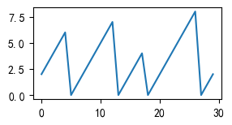

比如这种

```python
import pandas as pd

s = pd.Series([
    2, 3, 4, 5, 6, 
    0, 1, 2, 3, 4, 
    5, 6, 7, 0, 1, 
    2, 3, 4, 0, 1, 
    2, 3, 4, 5, 6, 
    7, 8, 0, 1, 2])

plt.figure(dpi=100)
ax = s.plot(figsize=(3, 1.5))
```



根据数据切分这几段

```python
s1 = s.diff().fillna(1)
s2 = np.where(s1 > 0, 0, 1).cumsum()
df = pd.DataFrame([s, s1, s2]).T

# 绘图
fig, ax = plt.subplots(figsize=(5, 2), dpi=100)
line1, = ax.plot(df[0], '-ob', ms=4)
ax2 = ax.twinx()
line2, = ax2.plot(df[2], "or", mfc='w')
ax.legend([line1, line2], ["line", "turn"])
```


这样就将每一段上升的数据切分成了一段一段的。

想要统计各自每段的最大值，或者增量也很轻松

> 最大值不一定是增量，因为比如这段数据的头部，数据是从2开始增加的。

与ChatGPT拉拉扯扯以后，得到了一个优化后的代码

```python
(s.diff() < 0).cumsum()
```

这个直接就是之前的`s2`

