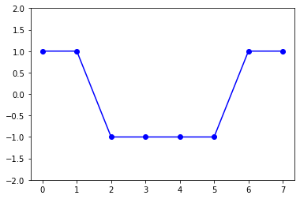
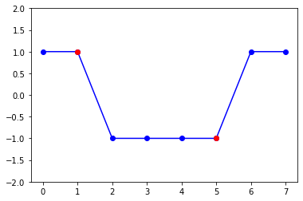

# 求过零点

```python
import matplotlib.pyplot as plt
import numpy as np
x = np.array(range(len(x)))
y = np.array([1, 1, -1, -1, -1, -1, 1, 1])
plt.plot(x, y, '-ob')
plt.ylim(-2, 2)
```



计算过零点

```python
zero_idx = np.argwhere((y[1:] * y[:-1]) < 0).ravel()
zero_x = x[zero_idx]
zero_y = y[zero_idx]

plt.plot(x, y, '-ob')
plt.plot(zero_x, zero_y, 'or')
plt.ylim(-2, 2)
```



`zero_x`就是所有的过零点的x坐标。

这种方式计算出的过零点表示该点的下一个点符号发生变化。