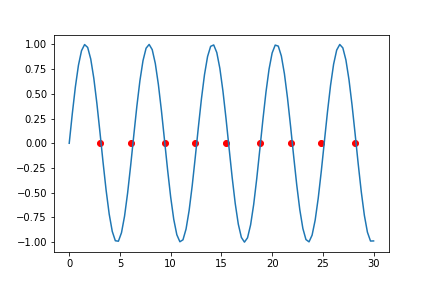

以sin函数为例

```python
import matplotlib.pyplot as plt
import numpy as np
x = np.linspace(0, 30, 100)
y = np.sin(x)
plt.plot(x, y)
```


计算过零点

```python
zero_idx = np.argwhere((y[1:] * y[:-1]) < 0).ravel()
zero_x = x[zero_idx]

plt.plot(x, y)
plt.scatter(zero_x, np.zeros_like(zero_x), color='r')
```



`zero_x`就是所有的过零点的x坐标。