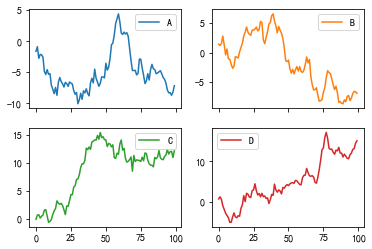

# pandas plot基本用法

参考：https://blog.csdn.net/weixin_45698637/article/details/122788909

## 分组绘图

分组折线图

```python
df = pd.DataFrame(np.random.randn(100, 4), columns=list("ABCD"))
df = df.cumsum()
df.plot(subplots=True, layout=(2, 2))
```

