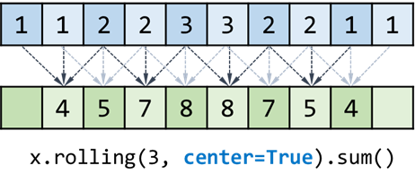

# pandas时间序列

官方文档

https://pandas.pydata.org/docs/user_guide/timeseries.html#


时间序列的解析

[pandas.to_datetime](https://pandas.pydata.org/docs/reference/api/pandas.to_datetime.html?highlight=to_datetime#pandas.to_datetime)

时间列构建

[pandas.date_range](https://pandas.pydata.org/docs/reference/api/pandas.date_range.html?highlight=date_range#pandas.date_range)

常见的时序处理函数

[DataFrame.resample](https://pandas.pydata.org/docs/reference/api/pandas.DataFrame.resample.html?highlight=resample#pandas.DataFrame.resample)


pandas包括4个时间相关的概念:

1. Date times（日期时间）: 具有时区支持的特定日期和时间。类似于python标准库中的`datetime.datetime`
2. Time deltas: 绝对时间，类似于python标准库中的`datetime.timedelta`
3. Time spans: 由时间点及其相关频率定义的时间跨度。
4. Date offsets: 一种与日历运算有关的相对时长。 Similar to `dateutil.relativedelta.relativedelta` from the `dateutil` package.


| Concept      | Scalar Class | Array Class      | pandas Data Type                         | Primary Creation Method             |
| ------------ | ------------ | ---------------- | ---------------------------------------- | ----------------------------------- |
| Date times   | `Timestamp`  | `DatetimeIndex`  | `datetime64[ns]` or `datetime64[ns, tz]` | `to_datetime` or `date_range`       |
| Time deltas  | `Timedelta`  | `TimedeltaIndex` | `timedelta64[ns]`                        | `to_timedelta` or `timedelta_range` |
| Time spans   | `Period`     | `PeriodIndex`    | `period[freq]`                           | `Period` or `period_range`          |
| Date offsets | `DateOffset` | `None`           | `None`                                   | `DateOffset`                        |

## pd.date_range

参数：

- start：起始时间点，必须要有
- end：终止时间点，可以没有
- periods：int，100就表示一共产生100个时间节点
- freq：时间间隔频率

```python
import pandas as pd
pd.date_range(start='2020-01-01', end='2021-01-01', periods=5)
```

```
DatetimeIndex(['2020-01-01 00:00:00', '2020-04-01 12:00:00',
               '2020-07-02 00:00:00', '2020-10-01 12:00:00',
               '2021-01-01 00:00:00'],
              dtype='datetime64[ns]', freq=None)
```


```python
dti = pd.date_range("2018-01-01", periods=3, freq="H")
dti
```

```
DatetimeIndex(['2018-01-01 00:00:00', '2018-01-01 01:00:00',
               '2018-01-01 02:00:00'],
              dtype='datetime64[ns]', freq='H')
```

利用时区信息操纵和转换日期时间

```python
dti = dti.tz_localize("UTC")
dti
```

```
DatetimeIndex(['2018-01-01 00:00:00+00:00', '2018-01-01 01:00:00+00:00',
               '2018-01-01 02:00:00+00:00'],
              dtype='datetime64[ns, UTC]', freq='H')
```


```python
dti.tz_convert("Asia/Shanghai")
```

```
DatetimeIndex(['2018-01-01 08:00:00+08:00', '2018-01-01 09:00:00+08:00',
               '2018-01-01 10:00:00+08:00'],
              dtype='datetime64[ns, Asia/Shanghai]', freq='H')
```


## resample


各种采样频率的写法，貌似是大小写均可

更多频率的写法参考[here](https://pandas.pydata.org/docs/user_guide/timeseries.html#timeseries-offset-aliases)

| 写法 | 说明 |
| ---- | ---- |
| S    | 秒   |
| T    | 分钟 |
| H    | 小时 |
| D    | 天   |
| W    | 周   |
| M    | 月   |
| A    | 年   |
|      |      |
|      |      |

## rolling()

[`pandas.Series.rolling`](https://pandas.pydata.org/docs/reference/api/pandas.Series.rolling.html)

滑动窗口计算，对窗口大小为3的滑动窗口求和，就是用包括自身在内的前3个数据进行求和运算，例如对索引为6的数，就是用索引为4、5、6的数求和。rolling支持求最大最小值，均值方差等常用统计量。

使用举例：

```python
import pandas as pd
x = pd.Series([1, 1, 2, 2, 3, 3, 2, 2, 1, 1])
x.rolling(3).sum()
```

```
0    NaN
1    NaN
2    4.0
3    5.0
4    7.0
5    8.0
6    8.0
7    7.0
8    5.0
9    4.0
dtype: float64
```


center参数，对于索引为6的数据，求窗口大小为3的滑动窗口求和。就是把索引为5、6、7的数求和。如果窗口大小为4，就是把索引为4、5、6、7的数进行求和。

公式化：设索引为idx，窗口大小为window，索引列表就为：`range(idx - window // 2, idx + (window + 1) // 2)`

```
idx, window,     
6,      3   -> range(6 - 3//2, 6 + 4//2) -> range(5, 8)
6,      4   -> range(6 - 4//2, 6 + 5//2) -> range(4, 8)
6,      5   -> range(6 - 5//2, 6 + 6//2) -> range(4, 9)
6,      6   -> range(6 - 6//2, 6 + 7//2) -> range(3, 9)
```


```python
x = pd.Series([1, 1, 2, 2, 3, 3, 2, 2, 1, 1])
x.rolling(3, center=True).sum()
```

```
0    NaN
1    4.0
2    5.0
3    7.0
4    8.0
5    8.0
6    7.0
7    5.0
8    4.0
9    NaN
dtype: float64
```


