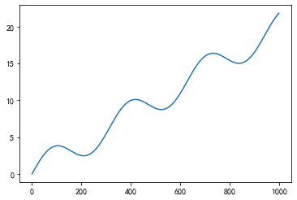
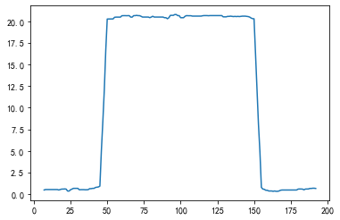

# 滤波与插值

参考资料：

- [线性插值法](https://www.pianshen.com/article/27961737027/)
- [插值函数interpolate](https://blog.csdn.net/weixin_43887421/article/details/112508666)

分析中会遇到很多传感器采集的时序数据，有时候会存在扰动，导致传感器检测值出现毛刺。这时候想平滑曲线就可以采用滤波技术。在我看来，采用pandas做滤波可以分解为两个操作：把毛刺数据置为None，用插值函数interpolate插值。

模拟生成一个时序数据：

```python
import numpy as np
import pandas as pd
import matplotlib.pyplot as plt
x = np.linspace(0, 20, 1000)
y = pd.Series(x + np.sin(x)*2)
plt.plot(y)
```


模拟添加传感器误差

```python
np.random.seed(2021)
error_index = np.random.choice(np.arange(1000), 50, replace=False)
error = np.random.normal(0, 5, 50)
y[error_index] += error
plt.plot(y)
```


滤波

```python
# 过滤掉一阶差分大于90%分位数的数据
max_diff = abs(y.diff()).quantile(.9)
y[abs(y.diff()) > max_diff] = None

# 线性插值
new_y = y.interpolate()
new_y.plot()
```



# 异常检测

但是遇到连续的异常，该方法就失效了

```python
import numpy as np
import matplotlib.pyplot as plt
x = np.random.random(200)
x[:50] += 50
x[50:100] += -1 * np.arange(50) + 50
x[150:155] += 40
x = pd.Series(x)
x.plot()
```


观察该曲线可以发现

其附近的值小于5，只有异常区间大于20。

此处也可以采用`median()`

```python
x[(x - x.rolling(10, center=True).min()) > 5]=None
x.plot()
```

## level shift anomaly detect

先求滑动均值或中位数，然后对求出来的滑动均值求一阶差分，就能得到异常值。

优点：专门用来寻找阶跃区间。

缺点：可能会忽视掉毛刺数据。

构建数据

```python

x = np.random.random(200)
x[50:150] += 20
x[45:50] += 20 * np.arange(5) / 5
x[150:155] += - 20 * np.arange(5) / 5 + 20

x = pd.Series(x)
x.plot()
```


求滑动窗口中位数，可以看到数据被平滑了。

```python
x1 = x.rolling(15, center=True).median()
x1.plot()
```



求滑动窗口中位数的一阶差分，其中蓝色线会有比较明显的突起，求这个突起发生的时间范围即可确定升/降区间

```python
x2 = x1.diff()
x2.plot(label='滑动窗口一阶差分')
plt.axvspan(x2[x2>0.5].index[0], x2[x2>0.5].index[-1], color='r', alpha=.3)
plt.axvspan(x2[x2<-0.5].index[0], x2[x2<-0.5].index[-1], color='r', alpha=.3, label='升/降区间')
x.plot(label='原始数据')
plt.legend()
```


