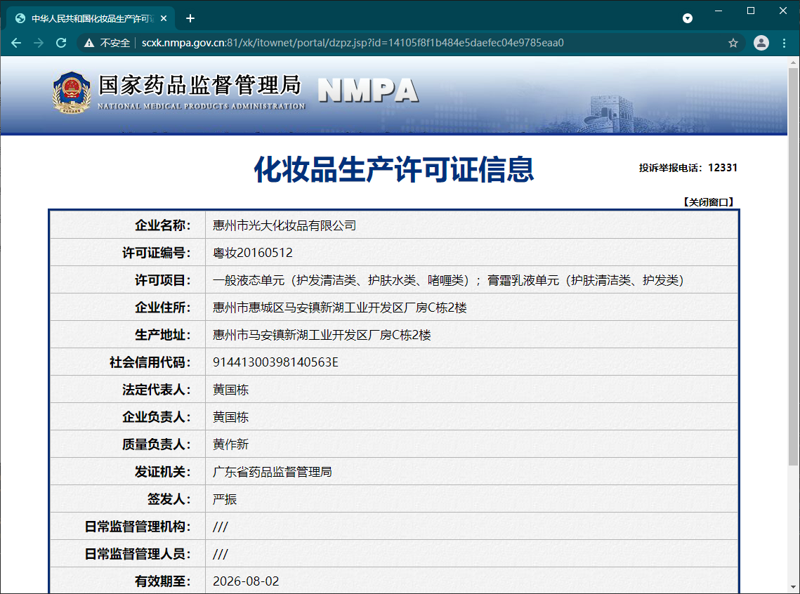

https://www.bilibili.com/video/BV1Yh411o7Sz

有趣简单的网站：http://wttr.in/beijing

通过linux系统获取 http的结果

```
http -v http://wttr.in/beijing
```


requests模块

python中原生的一款基于网络请求的模块，功能非常强大，简单便捷，效率极高。

作用：模拟浏览器发请求

如何使用：

- 指定url
- 发起请求
- 获取响应数据
- 持久化存储

## 第一个爬虫程序

```python
import requests


if __name__ == "__main__":
    # step1: 指定url
    url = "https://www.sogou.com/"
    # step2: 发起请求
    resp = requests.get(url=url)
    # step3: 获取响应数据
    text = resp.text
    # step4: 持久化存储
    with open("sogou.html", mode="w", encoding="utf8") as f:
        f.write(text)
    
```


- 简易网页采集器：爬取搜狗指定词条对应的搜索结果页面
- 百度翻译：手动获取翻译结果
- 豆瓣电影分类排行榜
- 肯德基餐厅查询
- 国家药品监督管理总局相关数据 http://scxk.nmpa.gov.cn:81/xk/

## 网页采集器

实现的功能：

- 指定搜狗搜索的关键词，保存该关键词搜索结果的页面。
- 利用`request.get()`的参数`params`传入要搜索的关键词
- 利用`request.get()`的参数`headers`伪造User-Agent

> 为什么需要伪造user-agent，**身份标识**。
>
> 如果网站检测到请求的载体身份为某一款浏览器，说明该请求是一个正常的请求。
>
> 否则可能会被网站拦截请求，导致爬虫无法获得想要的结果


```python
import requests

if __name__ == "__main__":
    # UA伪装
    headers = {
        "User-Agent": "Mozilla/5.0 (Windows NT 10.0; Win64; x64) AppleWebKit/537.36 (KHTML, like Gecko) Chrome/90.0.4430.93 Safari/537.36"
    }
    
    # 结尾的 '?' 可以保留可以删除
    url = "https://www.sogou.com/web?"
    
    # 处理url携带的参数：封装到字典中
    query = "apple
    params = {
        "query": query
    }
    # 相当于对 https://www.sogou.com/web?query=apple 发起请求
    resp = requests.get(url, params=params, headers=headers)
    
    text = resp.text
    
    # 持久化保存
    file_name = query + ".html"
    with open(file_name, 'w', encoding='utf8') as f:
        f.write(text)
    print("save %s successful" % file_name)
```

## 百度翻译

百度翻译api的使用，主要用来了解如何使用requests发送post请求。并获得json格式的返回结果。

- 了解`request.post()`的使用
- 了解其常见参数
- 了解如何获取返回的json信息

## 豆瓣电影的爬取

20210508有效

https://movie.douban.com/tag/#/?sort=U&range=0,10&tags=%E5%96%9C%E5%89%A7

在这个页面中，当滑动到页面最下方的时候，有一个加载更多按钮。

点击这个按钮，会发送一个ajax get请求。

请求url: https://movie.douban.com/j/new_search_subjects

请求参数：

```
sort: U
range: 0,10
tags: 
start: 40
genres: 喜剧
```

稍稍修改一下网页采集器的代码：

```python
import requests
import json

if __name__ == "__main__":
    headers = {
        "User-Agent": "Mozilla/5.0 (Windows NT 10.0; Win64; x64) AppleWebKit/537.36 (KHTML, like Gecko) Chrome/90.0.4430.93 Safari/537.36"
    }

    # 结尾的 '?' 可以保留可以删除
    url = "https://movie.douban.com/j/new_search_subjects?"

    # 处理url携带的参数：封装到字典中
    params = {
        "sort": "U",
        "range": "0,10",
        "tags": "",
        "start": "40",
        "genres": "喜剧"
    }
    resp = requests.get(url, params=params, headers=headers)
    data = resp.json()

    # 持久化保存
    file_name = "douban.json"

    with open(file_name, 'w', encoding='utf8') as f:
        json.dump(data, f)
    print("save %s successful" % file_name)
```

## 肯德基餐厅查询

20210528

肯德基官网的最底部点击”餐厅查询“就是该链接：http://www.kfc.com.cn/kfccda/storelist/index.aspx

通过搜索餐厅关键字，查到ajax post请求

url：http://www.kfc.com.cn/kfccda/ashx/GetStoreList.ashx?op=keyword

请求表单数据：

```
cname: 南京
pid: 
keyword: 新街口
pageIndex: 1
pageSize: 10
```

- cname：可以省略也可以填具体的城市名。
- keyword：填写查询的关键词，省略则报错。如果按城市查询，需要把url的`op=keyword`改成`op=cname`此时可以省略keyword参数

注意：

可以看出，post请求携带的数据是form data，此时使用`request.post()`发起模拟请求时，要使用data参数来传入form data数据（之前使用json参数报错了）

```python
import requests
import json

if __name__ == "__main__":
    headers = {
        "User-Agent": "Mozilla/5.0 (Windows NT 10.0; Win64; x64) AppleWebKit/537.36 (KHTML, like Gecko) Chrome/90.0.4430.93 Safari/537.36"
    }

    url = "http://www.kfc.com.cn/kfccda/ashx/GetStoreList.ashx?op=keyword"

    # 处理url携带的参数：封装到字典中
    form_data = {
        "cname": "南京",
        "pid": "",
        "keyword": "玄武湖",
        "pageIndex": 1,
        "pageSize": 10
    }

    resp = requests.post(url, data=form_data, headers=headers)
    data = resp.json()

    # 持久化保存
    file_name = "kfc.json"

    with open(file_name, 'w', encoding='utf8') as f:
        json.dump(data, f)
    print("save %s successful" % file_name)
```

## 药监总局

20210528

http://scxk.nmpa.gov.cn:81/xk/

爬取化妆品生产许可证相关数据


可以看到，有很多企业的数据，点击企业名称，可以查看详情信息。



通过抓包工具，发现首页的ajax请求url

url: http://scxk.nmpa.gov.cn:81/xk/itownet/portalAction.do?method=getXkzsList

表单数据：

```
on: true
page: 1
pageSize: 15
productName: 
conditionType: 1
applyname: 
applysn: 
```

主要修改page即可

响应数据：json

包含了一个页面多个证书的发放信息。

```json
{
  "filesize": "",
  "keyword": "",
  "list": [
    {
      "ID": "28cd89a6481d43439780babd562e720f",
      "EPS_NAME": "广州微肽生物科技有限公司",
      "PRODUCT_SN": "粤妆20160036",
      "XK_COMPLETE_DATE": {
        "date": 25,
        "day": 0,
        "hours": 0,
        "minutes": 0,
        "month": 3,
        "nanos": 0,
        "seconds": 0,
        "time": 1619280000000,
        "timezoneOffset": -480,
        "year": 121
      },
      "XK_DATE": "2024-07-03",
      "QF_MANAGER_NAME": "广东省药品监督管理局",
      "BUSINESS_LICENSE_NUMBER": "91440111MA59AKEA48",
      "XC_DATE": "2021-04-25",
      "NUM_": 91
    },
    ...
```

观察到有一列ID，且详情页中的url

http://scxk.nmpa.gov.cn:81/xk/itownet/portal/dzpz.jsp?id=28cd89a6481d43439780babd562e720f

正好和这个ID对应

进去企业证书详细信息页面，查看XHR，可以看到下面这个ajax请求：

url：http://scxk.nmpa.gov.cn:81/xk/itownet/portalAction.do?method=getXkzsById

form data：

```
id: 28cd89a6481d43439780babd562e720f
```

响应：

```json
{
  "businessLicenseNumber": "91440111MA59AKEA48",
  "businessPerson": "彭华容",
  "certStr": "一般液态单元（护发清洁类、护肤水类、啫喱类）；膏霜乳液单元（护肤清洁类、护发类）",
  "cityCode": "",
  "countyCode": "",
  "creatUser": "",
  "createTime": "",
  "endTime": "",
  "epsAddress": "广州市白云区白云湖街大朗北路77号B栋五楼、C栋一、二、三、四、五楼（自主申报）",
  "epsName": "广州微肽生物科技有限公司",
  "epsProductAddress": "广州市白云区白云湖街大朗北路77号B栋五楼、C栋一、三、四、五楼",
  "id": "",
  "isimport": "Y",
  "legalPerson": "彭华容",
  "offDate": "",
  "offReason": "",
  "parentid": "",
  "preid": "",
  "processid": "",
  "productSn": "粤妆20160036",
  "provinceCode": "",
  "qfDate": "",
  "qfManagerName": "广东省药品监督管理局",
  "qualityPerson": "卢小明",
  "rcManagerDepartName": "白云区局白云湖食品药品监督管理所",
  "rcManagerUser": "阮家兴、陈昕锋",
  "startTime": "",
  "warehouseAddress": "",
  "xkDate": "2024-07-03",
  "xkDateStr": "2021-04-25",
  "xkName": "严振",
  "xkProject": "",
  "xkRemark": "无",
  "xkType": "206"
}
```

整理一下流程：

- 从首页获取整个页面的所有ID值
- 通过传入不同的ID值一个一个进入单独的页面，获取数据


```python
import requests
import json
import time

# 首页 ajax 请求
# http://scxk.nmpa.gov.cn:81/xk/itownet/portalAction.do?method=getXkzsList

# 详细信息页 ajax 请求
# http://scxk.nmpa.gov.cn:81/xk/itownet/portalAction.do?method=getXkzsById
headers = {
    "User-Agent": "Mozilla/5.0 (Windows NT 10.0; Win64; x64) AppleWebKit/537.36 (KHTML, like Gecko) Chrome/90.0.4430.93 Safari/537.36"
}


def get_one_page_ids(page=1):
    """ 批量获取不同企业的id值 """
    url = "http://scxk.nmpa.gov.cn:81/xk/itownet/portalAction.do?method=getXkzsList"

    #
    data = {
        "on": True,
        "page": int(page),
        "pageSize": 15,
        "productName": "",
        "conditionType": 1,
        "applyname": "",
        "applysn": ""
    }

    json_data = requests.post(url, data=data, headers=headers).json()

    # 存储企业的id
    ids = [item["ID"] for item in json_data["list"]]

    return ids


def get_detail(id_):
    """
    通过id获取一家企业的详细信息
    :param id_:
    :return:
    """
    url = "http://scxk.nmpa.gov.cn:81/xk/itownet/portalAction.do?method=getXkzsById"
    data = {
        "id": id_
    }

    return requests.post(url, data=data, headers=headers).json()


if __name__ == "__main__":

    ids = []
    metadata = []
    # 爬取前5页的企业ids
    for i in range(2):
        new_ids = get_one_page_ids(i + 1)
        ids.extend(new_ids)

    # 获取企业的详细信息
    num_ids = len(ids)
    for i, id_ in enumerate(ids):

        json_data = get_detail(id_)
        name = json_data["epsName"]
        print(f"成功获取 {name} 的信息 ({i+1}/{num_ids})")

        metadata.append(get_detail(id_))
        time.sleep(0.5)

    # 持久化存储
    file_name = "药监局.json"
    with open(file_name, mode="w", encoding="utf8") as f:
        json.dump(metadata, f)

```


## 经验总结

如何确定ajax请求：

点击页面的某些部位，如果没有刷新整个网页，那可能就是ajax请求。

如何找到ajax请求：

通过F12抓包工具，查看network -> XHR，一个一个观察即可。

使用requests库的基本流程：

- 设定url
- 设定user agent
- 设定`requests.get()`或`requests.post()`的参数：
  - 如果是form data，则传入data参数
  - 如果是json数据，则传入json参数
  - 如果是query参数，则传入params参数