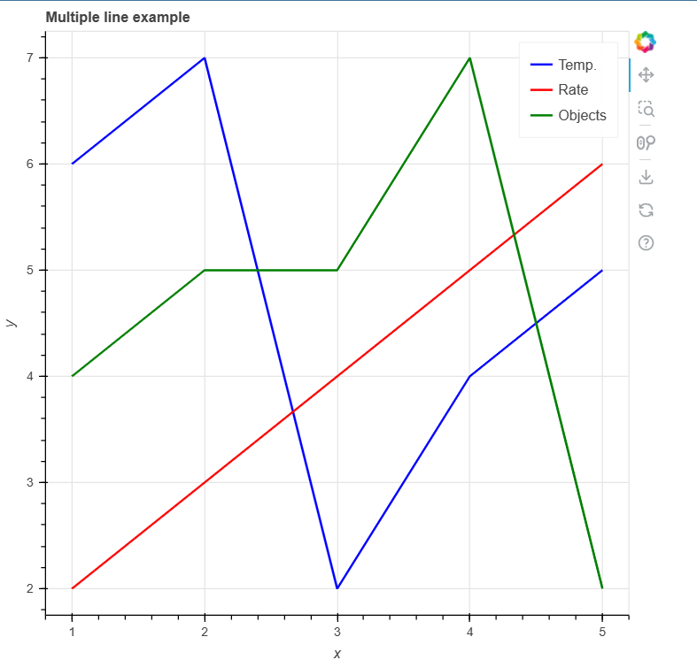
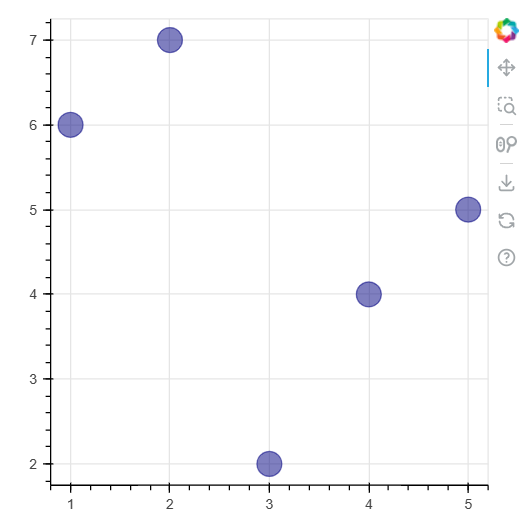
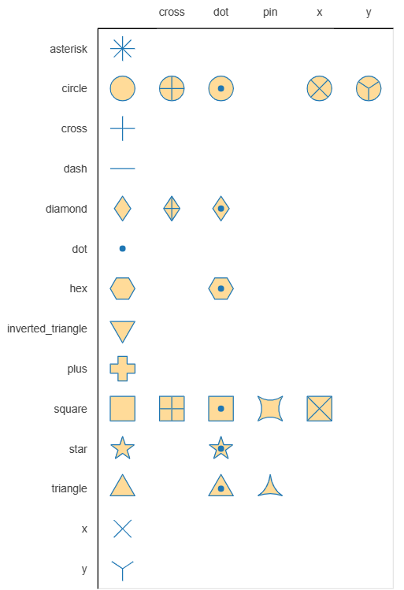
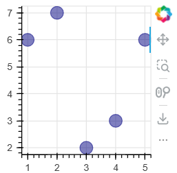
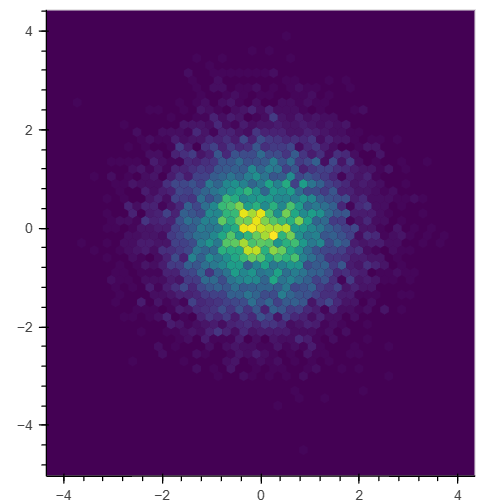
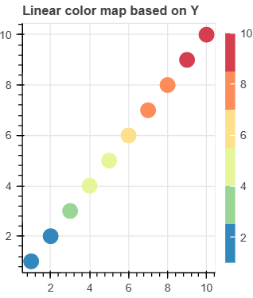
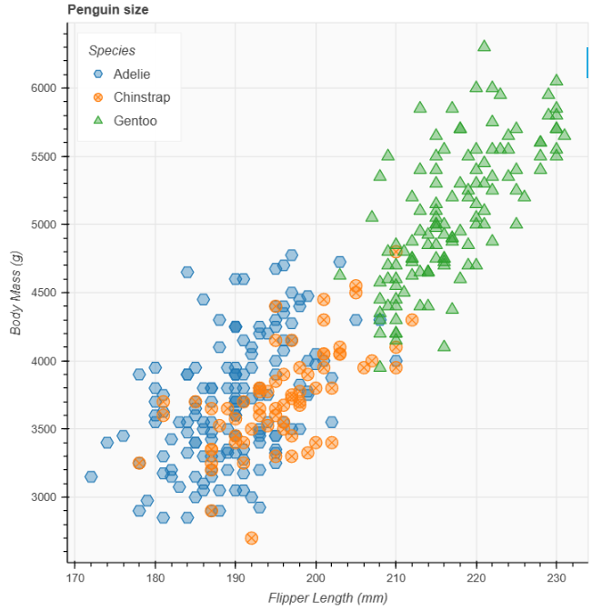
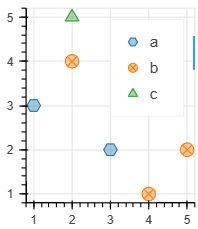
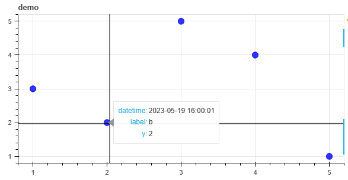

官网🌏：[Bokeh documentation — Bokeh 3.1.1 Documentation](https://docs.bokeh.org/en/latest/index.html)

入门指南📕：[First steps 1: Creating a line chart — Bokeh 3.1.1 Documentation](https://docs.bokeh.org/en/latest/docs/first_steps/first_steps_1.html)

# 安装

```
pip install bokeh
```


## 第一幅图

创建`demo.py` 填入以下内容

```python
from bokeh.plotting import figure, show

# prepare some data
x = [1, 2, 3, 4, 5]
y1 = [6, 7, 2, 4, 5]
y2 = [2, 3, 4, 5, 6]
y3 = [4, 5, 5, 7, 2]

# create a new plot with a title and axis labels
p = figure(title="Multiple line example", x_axis_label="x", y_axis_label="y")

# add multiple renderers
p.line(x, y1, legend_label="Temp.", color="blue", line_width=2)
p.line(x, y2, legend_label="Rate", color="red", line_width=2)
p.line(x, y3, legend_label="Objects", color="green", line_width=2)

# show the results
show(p)
```

运行

```
python demo.py
```

会生成一个`demo.html`



## 在notebook中使用

只需要加入下面的代码即可

```python
from bokeh.plotting import output_notebook
output_notebook()
```

## 导包常用

正常情况下

```python
from bokeh.models import ColumnDataSource
from bokeh.plotting import figure, show

# 颜色映射
from bokeh.transform import linear_cmap

```


notebook下，加入

```python
from bokeh.plotting import output_notebook
output_notebook()
```


# 基本图表的绘制

## 散点图

### 基本散点图

[Scatter plots — Bokeh 3.1.1 Documentation](https://docs.bokeh.org/en/latest/docs/user_guide/basic/scatters.html)

```python
from bokeh.models import ColumnDataSource
from bokeh.plotting import figure, show, output_notebook
output_notebook()
# create a Python dict as the basis of your ColumnDataSource
data = {'x_values': [1, 2, 3, 4, 5],
        'y_values': [6, 7, 2, 3, 6]}

# create a ColumnDataSource by passing the dict
source = ColumnDataSource(data=data)

# create a plot using the ColumnDataSource's two columns
p = figure(width=200, height=200)
p.circle(x='x_values', y='y_values', source=source, size=15, color="navy", alpha=0.5)
show(p)
```



### 散点样式

选择不同风格的散点

```python
p.circle()  # 圆形
p.square()  # 正方形
```

可以参考这个图



用下划线连接两种风格，比如想创建圆里有个十字

```python
p.circle_cross()
```

## 折线图

[Lines and curves — Bokeh 3.1.1 Documentation](https://docs.bokeh.org/en/latest/docs/user_guide/basic/lines.html)

可以绘制

- 简单折线图
- 阶梯线图
- 多折线图
- 带缺失值的折线图
- 堆积折线图（Stacked lines）
- 与散点图结合绘图
- 特殊的图形
  - 线段 segment()，各个独立的线段，传入线段的起始点和结束点
  - 射线 ray()，传入射线的起始点、角度、长度
  - 圆弧 arc()，传入圆弧的圆心、半径、开始角度、结束角度

> **glyph** 是 Bokeh 中的一个术语，表示绘图中的基本几何图形元素。它们用于绘制不同类型的图形，如线段、射线、弧线等。


# 数据源

[Data sources — Bokeh 3.1.1 Documentation](https://docs.bokeh.org/en/latest/docs/user_guide/basic/data.html)

## 数据源的基本用法

如何创建一个数据源？

使用字典，字典的键就是列名。

如何使用数据源？

绘图的时候传入source参数即可。

```python
from bokeh.models import ColumnDataSource
from bokeh.plotting import figure, show, output_notebook
output_notebook()
# create a Python dict as the basis of your ColumnDataSource
data = {'x_values': [1, 2, 3, 4, 5],
        'y_values': [6, 7, 2, 3, 6]}

# create a ColumnDataSource by passing the dict
source = ColumnDataSource(data=data)

# create a plot using the ColumnDataSource's two columns
p = figure()
p.circle(x='x_values', y='y_values', source=source, size=20, color="navy", alpha=0.5)
show(p)
```



查看列数据源的数据

```python
x_values = source.data['x_values']
y_values = source.data['y_values']

print(x_values)  # 打印x_values列的数据
print(y_values)  # 打印y_values列的数据

```


## 修改数据源

### 增加一列

```python
new_sequence = [8, 1, 4, 7, 3]
source.data["new_column"] = new_sequence
```

### 替换所有数据

```python
source.data = new_dict
```

> 替换列数据源的全部内容也是更新其列长度的唯一方法。以更改任何列长度的方式更新数据时，必须通过传递新字典同时更新所有列。

## 使用pandas创建数据源

```python
source = ColumnDataSource(df)
```

多级索引的情况：

```python
df = pd.DataFrame({('a', 'b'): {('A', 'B'): 1, ('A', 'C'): 2},
                   ('b', 'a'): {('A', 'C'): 7, ('A', 'B'): 8},
                   ('b', 'b'): {('A', 'D'): 9, ('A', 'B'): 10}})
cds = ColumnDataSource(df)
cds.data
```

```
{'index': array([('A', 'B'), ('A', 'C'), ('A', 'D')], dtype=object),
 'a_b': array([ 1.,  2., nan]),
 'b_a': array([ 8.,  7., nan]),
 'b_b': array([10., nan,  9.])}
```

使用pandas groupby

```python
group = df.groupby(('colA', 'ColB'))
source = ColumnDataSource(group)
```

例如：

```python
df = pd.DataFrame({
    'year': [2000, 2000, 2010, 2010],
    'gold': [153, 221, 325, 124]
})
g = df.groupby('year')

cds = ColumnDataSource(g)
cds.data
```

```
{'year': array([2000, 2010], dtype=int64),
 'gold_count': array([2., 2.]),
 'gold_mean': array([187. , 224.5]),
 'gold_std': array([ 48.08326112, 142.12846302]),
 'gold_min': array([153., 124.]),
 'gold_25%': array([170.  , 174.25]),
 'gold_50%': array([187. , 224.5]),
 'gold_75%': array([204.  , 274.75]),
 'gold_max': array([221., 325.])}
```

相当于把`g.describe()`传给数据源了。

## 给数据源添加数据

```python
source = ColumnDataSource(data=dict(foo=[], bar=[]))

# has new, identical-length updates for all columns in source
new_data = {
    'foo' : [10, 20],
    'bar' : [100, 200],
}

source.stream(new_data)
source.data
```

```
{'foo': [10, 20], 'bar': [100, 200]}
```

增加新的数据

```python

# has new, identical-length updates for all columns in source
new_data = {
    'foo' : [30],
    'bar' : [300],
}
source.stream(new_data)
source.data
```

```
{'foo': [10, 20, 30], 'bar': [100, 200, 300]}
```

使用参数rollover，如果长度超过rollover，就会把数据开头的部分删掉

```python

# has new, identical-length updates for all columns in source
new_data = {
    'foo' : [40, 50],
    'bar' : [400, 500],
}
source.stream(new_data, rollover=4)
source.data
```

```
{'foo': [20, 30, 40, 50], 'bar': [200, 300, 400, 500]}
```

## 替换ColumnDataSource中的数据

 ColumnDataSource的patch方法用于更新数据源中的数据片段。

使用patch()方法，Bokeh只会将新数据发送到浏览器，而不是整个数据集。

```python
s = slice(100)
new_x = source.data['x'][s] + np.random.uniform(-0.1, 0.1, size=100)
new_y = source.data['y'][s] + np.random.uniform(-0.2, 0.2, size=100)
source.patch({ 'x' : [(s, new_x)], 'y' : [(s, new_y)] })
```

完整案例：[examples/server/app/patch_app.py](https://github.com/bokeh/bokeh/tree/3.1.1/examples/server/app/patch_app.py)

> slice()，这还是我第一次见到的应用

```python
a = [1, 2, 3, 4, 5, 6, 7]
print(a[slice(3)])  # 等效 a[:3]
print(a[slice(2, 4)])  # 等效 a[2:4]
print(a[slice(-2, None)])  # 等效 a[-2:]
```

## 数据转换

到目前为止，您已经将数据添加到ColumnDataSource中以控制Bokeh绘图。然而，您也可以直接在浏览器中执行一些数据操作。

例如，在浏览器中动态计算颜色映射可以减少Python代码的数量。如果颜色映射所需的计算直接在浏览器中进行，您还需要发送较少的数据。

本节提供了可用的不同转换对象的概述。

客户端颜色映射 通过颜色映射，您可以将一系列数据中的值编码为特定颜色。

Bokeh提供了三个函数，可在浏览器中直接执行颜色映射：

linear_cmap()函数用于线性颜色映射

log_cmap()函数用于对数颜色映射

eqhist_cmap()函数用于均衡化直方图颜色映射

这三个函数的操作方式类似，并接受以下参数：

包含要映射颜色的数据的ColumnDataSource列的名称

调色板（可以是Bokeh预定义调色板之一，也可以是自定义颜色列表）

颜色映射范围的最小值和最大值。

颜色映射函数将数据源中的数值从最小值映射到最大值之间的调色板颜色。

例如，使用范围为[0, 99]和颜色['red'，'green'，'blue']的linear_cmap()函数，将产生以下数值到颜色的映射：

```python
      x < 0  : 'red'     # values < low are clamped
 0 >= x < 33 : 'red'
33 >= x < 66 : 'green'
66 >= x < 99 : 'blue'
99 >= x      : 'blue'    # values > high are clamped
```

例如：

```python
fill_color=linear_cmap('counts', 'Viridis256', min=0, max=10)
```

颜色映射代码案例

```python
from numpy.random import standard_normal

from bokeh.plotting import figure, show
from bokeh.transform import linear_cmap
from bokeh.util.hex import hexbin

x = standard_normal(10000)
y = standard_normal(10000)

bins = hexbin(x, y, 0.1)

p = figure(tools="", match_aspect=True, background_fill_color='#440154', width=400, height=400)
p.grid.visible = False

p.hex_tile(q="q", r="r", size=0.1, line_color=None, source=bins,
           fill_color=linear_cmap('counts', 'Viridis256', 0, max(bins.counts)))

show(p)
```



mapper函数返回的dataspec包含了bokeh.transform。您可以访问这些数据，以在不同的上下文中使用mapper函数的结果。例如，要创建一个ColorBar

```python
from bokeh.models import ColumnDataSource
from bokeh.plotting import figure, show
from bokeh.transform import linear_cmap

x = list(range(1, 11))
y = list(range(1, 11))

source = ColumnDataSource(dict(x=x,y=y))

p = figure(width=300, height=300, title="Linear color map based on Y")

# use the field name of the column source
cmap = linear_cmap(field_name='y', palette="Spectral6", low=min(y), high=max(y))

r = p.scatter(x='x', y='y', color=cmap, size=15, source=source)

# create a color bar from the scatter glyph renderer
color_bar = r.construct_color_bar(width=10)

p.add_layout(color_bar, 'right')

show(p)
```




> 在这段代码中，"dataspec" 是指从`linear_cmap()`函数返回的数据规范（dataspec）。数据规范是一种Bokeh中的对象，它包含了关于数据的元信息和变换的定义。在这个例子中，`linear_cmap()`函数返回的数据规范用于指定散点图的颜色映射。

### 自动映射散点图

当使用分类数据时，可以自动为数据中的每个类别使用不同的标记。使用factor_mark()函数可以自动为不同的类别分配不同的标记：

```python
from bokeh.plotting import figure, show
from bokeh.sampledata.penguins import data
from bokeh.transform import factor_cmap, factor_mark

SPECIES = sorted(data.species.unique())
MARKERS = ['hex', 'circle_x', 'triangle']

p = figure(title = "Penguin size", background_fill_color="#fafafa")
p.xaxis.axis_label = 'Flipper Length (mm)'
p.yaxis.axis_label = 'Body Mass (g)'

p.scatter("flipper_length_mm", "body_mass_g", source=data,
          legend_group="species", fill_alpha=0.4, size=12,
          marker=factor_mark('species', MARKERS, SPECIES),
          color=factor_cmap('species', 'Category10_3', SPECIES))

p.legend.location = "top_left"
p.legend.title = "Species"

show(p)
```



丐版

```python
data = {
    "school": ["a", "a", "b", "b", "b", "c"],
    "x": [1, 3, 4, 2, 5, 2],
    "y": [3, 2, 1, 4, 2, 5],
}
SPECIES = sorted(set(data["school"]))
MARKERS = ['hex', 'circle_x', 'triangle']

p = figure(width=200, height=200)
p.scatter("x", "y", source=data,
          legend_group="school", fill_alpha=0.4, size=12,
          marker=factor_mark('school', MARKERS, SPECIES),
          color=factor_cmap('school', 'Category10_3', SPECIES))

show(p)
```



# 案例

## 悬浮提示

鼠标移动到散点图上的点能够显示相关信息

```python
from bokeh.models import ColumnDataSource, HoverTool
from bokeh.plotting import figure, show, output_notebook

data = {
    "x": [1, 2, 3, 4, 5],
    "y": [3, 2, 5, 4, 1],
    "label": ["a", "b", "c", "d", "e"],
    "datetime": [
        "2023-05-19 16:00:00", 
        "2023-05-19 16:00:01", 
        "2023-05-19 16:00:02", 
        "2023-05-19 16:00:03", 
        "2023-05-19 16:00:04"
    ]
}
source = ColumnDataSource(data)

output_notebook()
tools = ["pan", "box_zoom", "lasso_select", "reset","save","crosshair"]

tooltip = [("datetime", '@datetime{%Y-%m-%d %H:%M:%S}'), ("label","@label"), ("y", "@y")]
formatters = {'@datetime': 'datetime'}
hover = HoverTool(tooltips=tooltip, formatters=formatters)

p = figure(width=600, height=300, title="demo", tools=tools)
p.circle(x="x", y="y", source=source, color="blue", size=10, alpha=0.8)
p.add_tools(hover)
show(p)


```



## 颜色

[bokeh.palettes — Bokeh 3.1.1 Documentation](https://docs.bokeh.org/en/latest/docs/reference/palettes.html#module-bokeh.palettes)


使用颜色

```python
from bokeh.transform import linear_cmap
linear_cmap('value', "Blues9", low=color_max, high=color_min)
```


## 相关系数图

```python

from bokeh.models import ColumnDataSource
from bokeh.transform import linear_cmap
from bokeh.plotting import figure, show, output_notebook
import pandas as pd
import numpy as np
output_notebook()

def heatmap(df_corr, color_min=-1, color_max=1):
    # 创建绘图所需的数据源
    columns = df_corr.columns.tolist()
    df = df_corr.stack().reset_index(name="value").round(2)
    
    # 如果数值超过75%，就把字体颜色标为白色
    font_color_switch = color_min + (color_max - color_min) * 0.75
    df["font_color"] = df['value'].apply(lambda x: 'white' if x > font_color_switch else 'black')
    
    source = ColumnDataSource(df)
    
    # 创建绘图对象
    p = figure(x_range=columns, y_range=columns, width=200, height=200,
            title='', toolbar_location=None, tools='')


    # 绘制热图
    p.rect(x='level_0', y='level_1', width=1, height=1, source=source,
        fill_color=linear_cmap('value', "Blues9", low=color_max, high=color_min), line_color="black", line_width=1)


    # 添加相关性数值
    
    p.text(x='level_0', y='level_1', text='value', text_font_size='10pt',
           text_color="font_color", text_baseline='middle', text_align='center',
           text_font_style="bold",
           source=source)


    # 设置坐标轴标签
    p.xaxis.axis_label = '指标'
    p.yaxis.axis_label = '指标'
    p.outline_line_color = 'black'  # 设置图像的边框线颜色为黑色
    p.outline_line_width = 3  # 设置图像的边框线粗细为2个像素


    # 将 x 轴标签显示为竖直方向
    p.xaxis.major_label_orientation = "vertical"
    
    return p
```

案例

```python
df_corr = pd.DataFrame(np.random.randn(3, 3), columns=list("abc"), index=list("abc"))
p = corr_plot(df_corr)
show(p)
```

## 坐标轴范围一致

```python
import numpy as np
from bokeh.models import Range1d
from bokeh.plotting import figure, show

# 生成示例数据
x = np.random.normal(0, 1, 1000)
y = np.random.normal(0, 1, 1000)

# 计算 x 和 y 数据的百分位数
x_min, x_max = np.percentile(x, [1, 99])
y_min, y_max = np.percentile(y, [1, 99])

# 创建 Bokeh 图形对象
p = figure()

# 绘制散点图
p.circle(x, y)

# 设置 x 轴和 y 轴范围为相同的范围
p.x_range = p.y_range = Range1d(min(x_min, y_min), max(x_max, y_max))

# 显示图形
show(p)

```

# bokeh布局

品字形

```python
from bokeh.layouts import gridplot, layout
from bokeh.plotting import figure, show
from bokeh.plotting import output_notebook
output_notebook()

# 创建第一个图形
p1 = figure(width=400, height=400, title='Plot 1')
p1.circle([1,2,3,4,5], [6,7,2,4,5], size=10, color='navy', alpha=0.5)

# 创建第二个图形
p2 = figure(width=400, height=400, title='Plot 2')
p2.triangle([1,2,3,4,5], [6,7,2,4,5], size=10, color='firebrick', alpha=0.5)

# 创建第三个图形
p3 = figure(width=800, height=400, title='Plot 3')
p3.square([1,2,3,4,5], [6,7,2,4,5], size=10, color='olive', alpha=0.5)

# 使用gridplot布局工具创建布局
# layout = gridplot([[p1, p2], [p3, None]], sizing_mode="stretch_width", toolbar_location=None)
lay = layout([
    [p1, p2],
    [p3],
])
# 显示布局
show(lay)
```

网格布局

两个是有区别的

```python
from bokeh.layouts import gridplot, layout
from bokeh.plotting import figure, show
from bokeh.plotting import output_notebook
output_notebook()

# 创建第一个图形
p1 = figure(width=400, height=400, title='Plot 1')
p1.circle([1,2,3,4,5], [6,7,2,4,5], size=10, color='navy', alpha=0.5)

# 创建第二个图形
p2 = figure(width=400, height=400, title='Plot 2')
p2.triangle([1,2,3,4,5], [6,7,2,4,5], size=10, color='firebrick', alpha=0.5)

# 创建第三个图形
p3 = figure(width=800, height=400, title='Plot 3')
p3.square([1,2,3,4,5], [6,7,2,4,5], size=10, color='olive', alpha=0.5)

# 使用gridplot布局工具创建布局
# layout = gridplot([[p1, p2], [p3, None]], sizing_mode="stretch_width", toolbar_location=None)
lay = gridplot([
    [p1, p2],
    [p3],
])
# 显示布局
show(lay)
```

