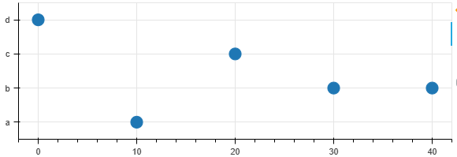
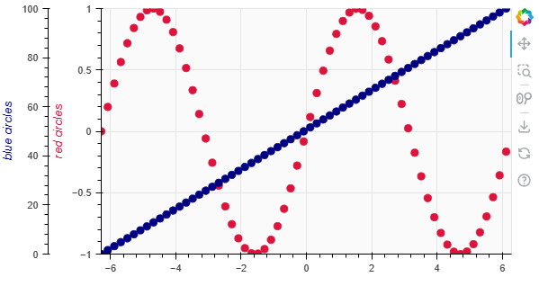
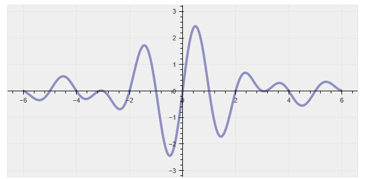

# Ranges and axes

[Ranges and axes — Bokeh 3.1.1 Documentation](https://docs.bokeh.org/en/latest/docs/user_guide/basic/axes.html)

### 设置坐标轴范围

```python
from bokeh.models import Range1d
from bokeh.plotting import figure

p = figure(width=300, height=300, x_range=(0, 20))
p.x_range = Range1d(0, 100)
```

### 设置坐标轴移动边界

设置移动边界，这样平移或者缩放的范围就被限定了

```python
p.y_range = Range1d(0, 15, bounds=(0, None))
```


### 类别型轴

如果使用类别型的轴，需要在创建图像之前指定类别字符串列表。

```python
from bokeh.plotting import figure, show

factors = ["a", "b", "c", "d"]
p = figure(height=200, y_range=factors)

x = [10, 30, 20, 0, 40]
y = ["a", "b", "c", "d", "b"]
p.circle(x, y, size=15)
show(p)
```



这里创建图时给y_range赋值，我理解是指定各个y标签排列的顺序。因此factors中的每个元素应该只出现一次。

```python
factors = ["a", "b", "c", "d"]
p = figure(height=200, y_range=factors)
```


### 日期时间轴

创建一个x轴是日期时间类型的图像

```python
# create a new plot with a datetime axis type
p = figure(width=800, height=250, x_axis_type="datetime")
```

完整示例代码

```python
import pandas as pd

from bokeh.plotting import figure, show
from bokeh.sampledata.stocks import AAPL

df = pd.DataFrame(AAPL)
df['date'] = pd.to_datetime(df['date'])

# create a new plot with a datetime axis type
p = figure(width=800, height=250, x_axis_type="datetime")

p.line(df['date'], df['close'], color='navy', alpha=0.5)

show(p)
```

### 对数轴

设置方法

```python
p = figure(width=400, height=400, y_axis_type="log")
```

案例

```python
from bokeh.plotting import figure, show

x = [0.1, 0.5, 1.0, 1.5, 2.0, 2.5, 3.0]
y = [10**xx for xx in x]

# create a new plot with a log axis type
p = figure(width=400, height=400, y_axis_type="log")

p.line(x, y, line_width=2)
p.circle(x, y, fill_color="white", size=8)

show(p)
```

### 双轴

类似于matplotlib的`twinx()`和`twiny()`

创建新的坐标轴范围

```python
p.extra_y_ranges['foo'] = Range1d(0, 100)
```

按照新坐标轴范围绘图

```python
p.scatter(x, y2, color="navy", size=8, y_range_name="foo")
```

创建新的坐标轴

```python
ax2 = LinearAxis(y_range_name="foo", axis_label="blue circles")
ax2.axis_label_text_color ="navy"
p.add_layout(ax2, 'left')
```

完整案例

```python
from bokeh.models import LinearAxis, Range1d
from bokeh.plotting import figure, show
import numpy as np

# 准备数据
x = np.arange(-2*np.pi, 2*np.pi, 0.2)
y = np.sin(x)
y2 = np.linspace(0, 100, len(x))

# 创建图像并设置图像范围
p = figure(width=600, height=300, x_range=(-2*np.pi, 2*np.pi), y_range=(-1, 1))
p.background_fill_color = "#fafafa"

p.circle(x, y, color="crimson", size=8)
p.yaxis.axis_label = "red circles"
p.yaxis.axis_label_text_color ="crimson"

p.extra_y_ranges['foo'] = Range1d(0, 100)
p.scatter(x, y2, color="navy", size=8, y_range_name="foo")

ax2 = LinearAxis(y_range_name="foo", axis_label="blue circles")
ax2.axis_label_text_color ="navy"
p.add_layout(ax2, 'left')

show(p)
```



## 指定坐标轴位置

比如可以将坐标轴设置成常见的，在原点的坐标轴

```python
p.xaxis.fixed_location = 0
p.yaxis.fixed_location = 0
```

案例

```python
import numpy as np

from bokeh.plotting import figure, show

x = np.linspace(-6, 6, 500)
y = 8*np.sin(x)*np.sinc(x)

p = figure(width=800, height=300, title="", tools="",
           toolbar_location=None, match_aspect=True)

p.line(x, y, color="navy", alpha=0.4, line_width=4)
p.background_fill_color = "#efefef"
p.xaxis.fixed_location = 0
p.yaxis.fixed_location = 0

show(p)
```

