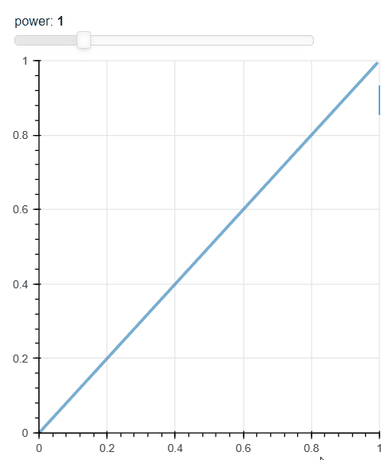

滑条案例

```python
from bokeh.layouts import column
from bokeh.models import ColumnDataSource, CustomJS, Slider
from bokeh.plotting import figure, show

x = [x*0.005 for x in range(0, 200)]
y = x

source = ColumnDataSource(data=dict(x=x, y=y))

plot = figure(width=400, height=400, x_range=(0, 1), y_range=(0, 1))

plot.line('x', 'y', source=source, line_width=3, line_alpha=0.6)

callback = CustomJS(args=dict(source=source), code="""
    const f = cb_obj.value
    const x = source.data.x
    const y = Array.from(x, (x) => Math.pow(x, f))
    source.data = { x, y }
""")

slider = Slider(start=0.1, end=4, value=1, step=.1, title="power")
slider.js_on_change('value', callback)

layout = column(slider, plot)

show(layout)
```




有时候，希望绘图的时候有一些按钮，可以切换图像。

现在有这样的数据

```python
import pandas as pd

df = pd.DataFrame({
    "x": [0, 1, 2, 0, 1, 2, 0, 1, 2],
    "y": [1, 3, 5, 2, 6, 4, 9, 7, 3],
    "kind": ["a", "a", "a", "b", "b", "b", "c", "c", "c"]
})
```


我希望使用bokeh绘制一个关于x，y的散点图，同时有个下拉框，可以选择kind是 a还是b或c。

每次这个散点图只展示一种类型的数据。