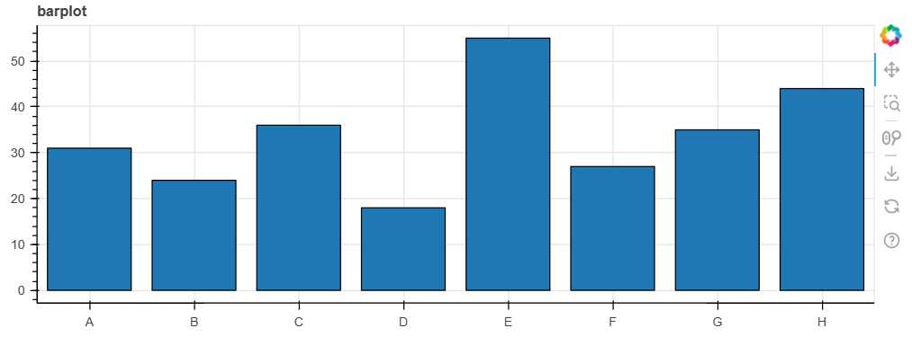
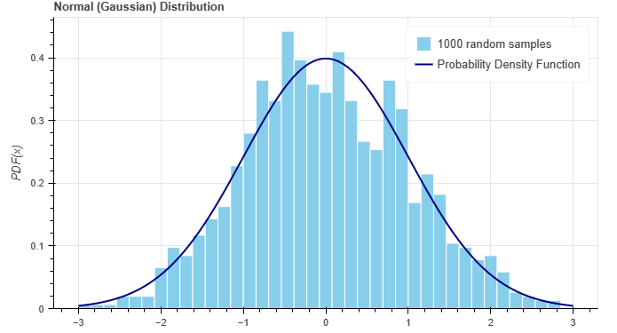
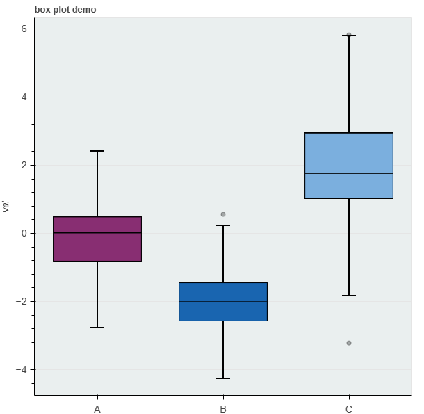
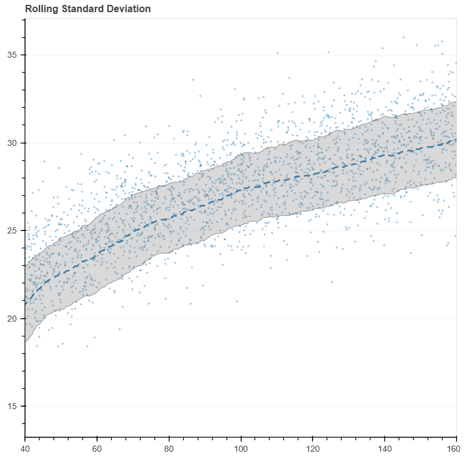

# 常用图表

[Statistical plots — Bokeh 3.1.1 Documentation](https://docs.bokeh.org/en/latest/docs/user_guide/topics/stats.html)

## 柱状图

```python
    from bokeh.models import ColumnDataSource
    from bokeh.plotting import figure

    # 准备数据
    y = [31, 24, 36, 18, 55, 27, 35, 44]
    x = ['A', 'B', 'C', 'D', 'E', 'F', 'G', 'H']

    source = ColumnDataSource({'x': x, 'y': y})
    # 绘制图形
    p = figure(width=800, height=300, title="barplot", x_range=x)
    p.vbar(x='x', top='y', width=0.8, source=source, line_color="black")
    show(p)
```



函数化

```python
from bokeh.models import ColumnDataSource, HoverTool

def bar_plot(x, y, width=400, height=300, title="barplot", xlabel="", ylabel=""):
    source = ColumnDataSource({'x': x, 'y': y})
    p = figure(width=width, height=height, title=title, x_range=x)
    p.vbar(x='x', top='y', width=0.8, source=source, line_color='black')
    # 设置y轴范围
    p.y_range.start = 0
    
    # 设置x,y轴标签
    p.xaxis.axis_label = xlabel
    p.yaxis.axis_label = ylabel
    
    # 悬浮显示值
    tooltip = [("x","@x"), ("y", "@y")]
    hover = HoverTool(tooltips=tooltip)
    p.add_tools(hover)
    return p
```

加入互动元素

```python
from bokeh.models import ColumnDataSource, HoverTool

tooltip = [("x","@x"), ("y", "@y")]
hover = HoverTool(tooltips=tooltip)
p.add_tools(hover)
```

添加标签

```python
from bokeh.models import LabelSet

# 创建一个标签集，指定x和y坐标，文本和数据源
labels = LabelSet(x='x', y='y', text='y', level='glyph', y_offset=5, source=source)
p.add_layout(labels)
```


## 直方图


```python
import numpy as np

from bokeh.plotting import figure, show

# 创建一个随机数生成器
rng = np.random.default_rng()
x = rng.normal(loc=0, scale=1, size=1000)

# 用numpy创建直方图所需数据
bins = np.linspace(-3, 3, 40)
hist, edges = np.histogram(x, density=True, bins=bins)

# 概率密度函数Probability Density Function
x = np.linspace(-3.0, 3.0, 100)
pdf = np.exp(-0.5*x**2) / np.sqrt(2.0*np.pi)

# 创建bokeh图
p = figure(width=670, height=400, toolbar_location=None,
           title="Normal (Gaussian) Distribution")

# 绘制直方图
p.quad(top=hist, bottom=0, left=edges[:-1], right=edges[1:],
         fill_color="skyblue", line_color="white",
         legend_label="1000 random samples")

# 绘制概率密度图
p.line(x, pdf, line_width=2, line_color="navy",
       legend_label="Probability Density Function")

p.y_range.start = 0
p.xaxis.axis_label = "x"
p.yaxis.axis_label = "PDF(x)"

show(p)
```



转换为函数

只画直方图，不画概率密度

```python
def histplot(y, title="", xlabel="", width=400, height=400):
    # 只绘 5% - 95% 分位数区间的数据的直方图
    xmin, xmax = np.percentile(y, [5, 95])
    bins = np.linspace(xmin, xmax, 50)
    hist, edges = np.histogram(y, density=False, bins=bins)

    # 创建bokeh图
    p = figure(
        width=width,
        height=height,
        # toolbar_location=None,
        title=title,
        tools="pan,box_zoom,wheel_zoom,save,reset",
    )

    # 绘制直方图
    p.quad(
        top=hist,
        bottom=0,
        left=edges[:-1],
        right=edges[1:],
        fill_color="skyblue",
        line_color="white",
        legend_label="样本分布",
    )
    p.y_range.start = 0
    p.xaxis.axis_label = xlabel
    p.yaxis.axis_label = ""
    p.toolbar.logo = None  # 去除 bokeh的logo
    return p
```


## 箱线图

原理

```
     Q1-1.5IQR   Q1   median  Q3   Q3+1.5IQR
                  |-----:-----|
  o      |--------|     :     |--------|    o  o
                  |-----:-----|
flier             <----------->            fliers
                       IQR
```

需要计算箱线图统计量


案例

```python
import numpy as np
import pandas as pd

from bokeh.models import ColumnDataSource, Whisker
from bokeh.plotting import figure, show
from bokeh.transform import factor_cmap

# 计算绘制箱线图所需的统计量
def compute_boxplot_stats(df, group_col="kind", val_col="val"):
    stat = df.groupby("kind")["val"].quantile([0.25, 0.5, 0.75])
    stat = stat.unstack().reset_index()
    stat.columns = ["kind", "q1", "med", "q3"]
    iqr = stat.q3 - stat.q1
    stat["upper"] = stat.q3 + 1.5 * iqr
    stat["lower"] = stat.q1 - 1.5 * iqr
    return stat


# 构建基础数据
d1 = pd.DataFrame({"val": np.random.normal(0, 1, 100), "kind": "A"})
d2 = pd.DataFrame({"val": np.random.normal(-2, 0.75, 100), "kind": "B"})
d3 = pd.DataFrame({"val": np.random.normal(2, 1.5, 100), "kind": "C"})
df = pd.concat([d1, d2, d3]).reset_index(drop=True)

# 计算统计量
stat = compute_boxplot_stats(df)
df = pd.merge(df, stat, on="kind", how="left")

# 构建数据集
source = ColumnDataSource(stat)
kinds = df.kind.unique()

# 构建图像
p = figure(x_range=kinds, tools="", toolbar_location=None,
           title="box plot demo",
           background_fill_color="#eaefef", y_axis_label="val")

# outlier range
whisker = Whisker(base="kind", upper="upper", lower="lower", source=source)
whisker.upper_head.size = whisker.lower_head.size = 20
p.add_layout(whisker)

# quantile boxes
cmap = factor_cmap("kind", "TolRainbow7", kinds)
p.vbar("kind", 0.7, "med", "q3", source=source, color=cmap, line_color="black")
p.vbar("kind", 0.7, "q1", "med", source=source, color=cmap, line_color="black")

# outliers
outliers = df[~df["val"].between(df.lower, df.upper)]
p.scatter("kind", "val", source=outliers, size=6, color="black", alpha=0.3)

# 为了完整显示
p.scatter("kind", "upper", source=source, alpha=0)
p.scatter("kind", "lower", source=source, alpha=0)

p.xgrid.grid_line_color = None
p.axis.major_label_text_font_size="14px"
p.axis.axis_label_text_font_size="12px"

show(p)
```



如果希望鼠标移动上去可以看到提示，修改一下

```python
tools = ["pan"]
tooltip = [("q1","@q1"), ("q3", "@q3")]
hover = HoverTool(tooltips=tooltip)

# 构建图像
p = figure(x_range=kinds, tools=tools, toolbar_location=None,
           title="box plot demo",
           background_fill_color="#eaefef", y_axis_label="val")
p.add_tools(hover)
```

## 散点图

### 简单散点图

```python
import numpy as np
from bokeh.models import ColumnDataSource
from bokeh.plotting import figure, show, output_notebook

# 模拟的数据
x = np.linspace(0, 10, 100)
y = 0.5 * x + np.random.uniform(-1, 1, 100)

# 拟合结果
coefficients = np.polyfit(x, y, 1)

# 获取拟合的直线的斜率和截距
slope = coefficients[0]
intercept = coefficients[1]

# 线性拟合结果
y_pred = slope * x + intercept

# 绘图
source = ColumnDataSource({"x": x, "y": y, "y_pred": y_pred})

p = figure(width=400, height=400)
p.circle('x', 'y', source=source)
p.line('x', 'y_pred', line_width=2, color="red", source=source)

show(p)
```


绘制一个散点图，用于对比两个值

鼠标放在散点上可以显示值，散点用“△”和“○”进行区分。

### 颜色区分


### 形状区分

### 颜色渐变


### 交互的散点图

可以选择x，或 y

```python
from bokeh.models import Select, ColumnDataSource
from bokeh.plotting import figure
from bokeh.layouts import column
from bokeh.io import curdoc
import pandas as pd
import numpy as np
# 假设你的DataFrame是df，并且它有5个特征 A, B, C, D, E
# df = pd.DataFrame(...)  # 您的原始DataFrame
df = pd.DataFrame(np.random.randn(10, 5), columns=list("ABCDE"))

source = ColumnDataSource(data=df)

# 创建初始散点图（这里假设初始状态为 A-B）
p = figure(plot_width=400, plot_height=400)
p.circle('A', 'B', source=source)

# 创建一个选择器，初始选项为 'A-B'，选项为你的所有可能的特征组合
select = Select(title='Feature', value='A-B', options=['A-B', 'C-D', 'A-C', 'A-D', 'A-E', 'B-C', 'B-D', 'B-E', 'C-E', 'D-E'])

# 定义一个回调函数，当选择器的值发生改变时，更新散点图的数据
def update(attr, old, new):
    x, y = select.value.split('-')
    p.xaxis.axis_label = x
    p.yaxis.axis_label = y
    p.renderers[0].glyph.x = x
    p.renderers[0].glyph.y = y

# 当选择器的值发生改变时，调用回调函数
select.on_change('value', update)

# 将散点图和选择器组合在一起并显示
layout = column(select, p)
curdoc().add_root(layout)

```


js回调

```python
from bokeh.models import Select, ColumnDataSource, CustomJS
from bokeh.plotting import output_notebook
output_notebook()
from bokeh.plotting import figure
from bokeh.layouts import column
from bokeh.io import curdoc
import pandas as pd
import numpy as np
# 假设你的DataFrame是df，并且它有5个特征 A, B, C, D, E
# df = pd.DataFrame(...)  # 您的原始DataFrame
df = pd.DataFrame(np.random.randn(10, 5), columns=list("ABCDE"))
cols = df.columns
source = ColumnDataSource(data=df)

# 创建初始散点图（这里假设初始状态为 A-B）
p = figure(width=400, height=400)
circles = p.circle('A', 'B', source=source)


# 创建两个选择器，用于选择散点图的x和y
select_x = Select(title='x', value=cols[0], options=cols.tolist())
select_y = Select(title='y', value=cols[1], options=cols.tolist())

# 当选择器的值发生改变时，调用回调函数
# select.on_change('value', update)
callback_x = CustomJS(args=dict(circles=circles, source=source, select=select_x), code="""
    var f = select.value;
    circles.glyph.x.field = f;
    source.change.emit();
""")
callback_y = CustomJS(args=dict(circles=circles, source=source, select=select_y), code="""
    var f = select.value;
    circles.glyph.y.field = f;
    source.change.emit();
""")

select_x.js_on_change('value', callback_x)
select_y.js_on_change('value', callback_y)
# 将散点图和选择器组合在一起并显示
layout = column(select_x, select_y, p)
curdoc().add_root(layout)
show(layout)
```

## band 图

[band — Bokeh 3.1.1 Documentation](https://docs.bokeh.org/en/latest/docs/examples/basic/annotations/band.html)

```python
import numpy as np
import pandas as pd

from bokeh.models import Band, ColumnDataSource
from bokeh.plotting import figure, show

# Create some random data
x = np.random.random(2500) * 140 +20
y = np.random.normal(size=2500) * 2 + 6 * np.log(x)

df = pd.DataFrame(data=dict(x=x, y=y)).sort_values(by="x")

df2 = df.y.rolling(window=300).agg({"y_mean": np.mean, "y_std": np.std})

df = pd.concat([df, df2], axis=1)
df["lower"] = df.y_mean - df.y_std
df["upper"] = df.y_mean + df.y_std

source = ColumnDataSource(df.reset_index())

p = figure(tools="", toolbar_location=None, x_range=(40, 160))
p.title.text = "Rolling Standard Deviation"
p.xgrid.grid_line_color=None
p.ygrid.grid_line_alpha=0.5

p.scatter(x="x", y="y", marker="dot", size=10, alpha=0.4, source=source)

p.line("x", "y_mean", line_dash=(10, 7), line_width=2, source=source)

band = Band(base="x", lower="lower", upper="upper", source=source,
            fill_alpha=0.3, fill_color="gray", line_color="black")
p.add_layout(band)

show(p)
```



## 残差百分比累积图

```python
import numpy as np
from bokeh.plotting import figure, show

x = np.random.normal()
```

## 聚类结果可视化

[transform_markers — Bokeh 3.2.0 Documentation](https://docs.bokeh.org/en/latest/docs/examples/basic/data/transform_markers.html)

```python
import matplotlib.pyplot as plt
from sklearn.datasets import make_blobs

from bokeh.plotting import figure, show
from bokeh.transform import factor_cmap

# 创建数据集
# X为样本特征，Y为样本簇类别， 共1000个样本，每个样本4个特征，共4个簇，
# 簇中心在[-1,-1], [0,0],[1,1], [2,2]， 簇方差分别为[0.4, 0.2, 0.2, 0.2]
X, y = make_blobs(
    n_samples=1000, 
    n_features=2, 
    centers=[[-1, -1], [1, -1], [0, 1]],
    cluster_std=[0.5, 0.3, 0.2],
    random_state=2022,
)

df = pd.DataFrame(X, columns=["x1", "x2"])
df["y"] = y.astype(str)

p = figure(title = "scatter plot", width=300, height=300)

data_source = ColumnDataSource(df)
p.scatter("x1", "x2", source=data_source,
          legend_group="y", fill_alpha=0.4, size=6,
          color=factor_cmap('y', 'Category10_3',df.y.unique())
          )

# p.y_range = Range1d(-5, 5)
p.legend.location = "top_left"
p.legend.title = "y"

show(p)

```

## 加入hover tool互动元素

```python
from bokeh.models import ColumnDataSource, HoverTool

tooltip = [("x","@x"), ("y", "@y")]
hover = HoverTool(tooltips=tooltip)
p.add_tools(hover)
```

### 如果使用中文

```python
tooltip = [("位置","@{位置}"), ("值", "@{值}")]
```

### 如果要保留N位有效数字

```python
tooltip = [("位置","@{位置}{0.0000}"), ("值", "@{值}{0.0000}")]
```

### 多元素分别配置hover tool

核心代码

```python
r1 = p.circle(...)
r2 = p.circle(...)

hover1 = HoverTool(renderers=[r1], tooltips=tooltip1)
hover2 = HoverTool(renderers=[r2], tooltips=tooltip2)
```


需要为每一个数据源分别设置一个HoverTool。这是因为每一个HoverTool只能与一个数据源关联。你可以通过设置`renderers`属性来实现。

```python
from bokeh.models import ColumnDataSource, HoverTool
from bokeh.plotting import figure, show
import pandas as pd
import numpy as np

df1 = pd.DataFrame(np.random.normal(size=(4, 2)), columns=["a", "b"])
df2 = pd.DataFrame(np.random.normal(size=(3, 2)), columns=["c", "d"])
source1 = ColumnDataSource(data=df1)
source2 = ColumnDataSource(data=df2)

p = figure(width=400, height=400)

r1 = p.circle(x='a', y='b', source=source1, size=5, color="blue", alpha=1)
r2 = p.circle(x='c', y='d', source=source2, size=10, color="red", alpha=1)

tooltip1 = [("a","@a"), ("b", "@b")]
tooltip2 = [("c","@c"), ("d", "@d")]

hover1 = HoverTool(renderers=[r1], tooltips=tooltip1)
hover2 = HoverTool(renderers=[r2], tooltips=tooltip2)

p.add_tools(hover1, hover2)

show(p)

```

