## 各种图表的作用

小提琴图violinplot

是箱线图和密度图的结合


尖峰栅格图eventplot

在给定位置绘制长度相同的平行线。这种图形通常在神经科学中用于表示神经事件，通常称为尖峰栅格（`spike raster`）、点栅格（ `dot raster`）或栅格图（`raster plot`）。也可用于显示多组离散事件的时间或位置。

但是，在您希望显示多组离散事件的时间或位置的任何情况下，它都非常有用，例如每个月的每一天人们到达企业的时间或去年每年的飓风日期世纪。

横轴是时间，纵轴一个月的30天

是不是与箱线图有点相似？


barbs

绘制风向观测图


hexbin

在Hexbin散点图中，我们将数据表示在六边形箱的顶部。 每个箱显示点的密度。 仓的颜色饱和度根据密度而有所不同。 数据点由六角形区域中的点表示。 垃圾箱默认情况下以白色边框彼此连接。 与Hexbin散点图相比，我们可以使用此图表轻松识别数据模式。 

普通的散点图：密密麻麻都是点，不方便观察哪里聚集的点多哪里聚集的点比较少。

Hexbin散点图：用六边形箱框住一个又一个数据，可以用颜色深浅表示箱子框住点的数量，比如颜色越深表示箱子框住的数据越多。


## 箱线图

### 原理


下四分位：q1

上四分位：q3

四分位距：IQR = q3 - q1

上限 top = q3 + 1.5 × IQR

下限bottom = q1 - 1.5 × IQR

但是上下限不能超过数据本身的维度

计算各项参数并绘图：

```python
import numpy as np
import matplotlib.pyplot as plt
np.random.seed(2021)

x = np.random.randn(100)
q1 = np.quantile(x, .25)  # 下四分位
q3 = np.quantile(x, .75)  # 上四分位
iqr = q3 - q1  # 四分位距
top = q3 + 1.5 * iqr  # 上线
bottom = q1 - 1.5 * iqr  # 下限

print('q1: %.4f' % q1)
print('q3: %.4f' % q3)
print('iqr: %.4f' % iqr)
print('top: %.4f' % top, 'max x: %.4f' % max(x))
print('bottom: %.4f' % bottom, 'min x: %.4f' % min(x))

plt.boxplot(x)
plt.show()
```

```
q1: -0.6497
q3: 0.8051
iqr: 1.4548
top: 2.9873 max x: 3.6387
bottom: -2.8319 min x: -2.7935
```


### 同时绘制多个箱线图

```python
import numpy as np
import matplotlib.pyplot as plt
np.random.seed(2021)
data = [np.random.normal(0, std, 100) for std in range(1, 5)]
plt.boxplot(data)
plt.show()
```


### 盒子样式调整

```python
import numpy as np
import matplotlib.pyplot as plt
np.random.seed(2021)
data = [np.random.normal(0, std, 100) for std in range(1, 5)]

fig, ax = plt.subplots()
boxprops = {'color':'k','facecolor':'lightgreen'}
medianprops = {'color': 'k'}
ax.boxplot(data, patch_artist = True, boxprops=boxprops, medianprops=medianprops)
plt.show()
```


### 分别设置不同的样式

```python
import numpy as np
import matplotlib.pyplot as plt
np.random.seed(2021)
data = [np.random.normal(0, std, 100) for std in range(1, 5)]

fig, ax = plt.subplots()

colors = ['r', 'g', 'b', 'y']
parts = ax.boxplot(data, patch_artist=True)
for i, p in enumerate(parts['boxes']):
    p.set_color(colors[i])
    p.set_facecolor(colors[i])

for i, p in enumerate(parts['whiskers']):
    p.set_color(colors[i//2])
    
for i, p in enumerate(parts['caps']):
    p.set_color(colors[i//2])
    
for i, p in enumerate(parts['medians']):
    p.set_color(colors[i])

plt.show()
```


### 同时绘制多个箱线图2

具体参考文档

http://seaborn.pydata.org/generated/seaborn.boxplot.html?highlight=boxplot#seaborn.boxplot

```python
import seaborn as sns
sns.set_theme(style="ticks", palette="pastel")
# Load the example tips dataset
tips = sns.load_dataset("tips")

# Draw a nested boxplot to show bills by day and time
sns.boxplot(x="day", y="total_bill", hue="smoker", palette=["m", "g"],
            data=tips)
sns.despine(offset=10, trim=True)
```


## 小提琴图

是箱线图和密度图的结合

### 单个小提琴图

```python
import numpy as np
import matplotlib.pyplot as plt

fig, ax = plt.subplots()
ax.violinplot(np.random.randn(100), positions=[3])
plt.show()
```

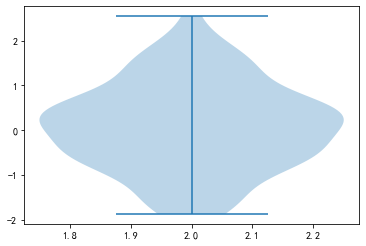

### 多个小提琴图

要画多个小提琴，就要用列表包含要绘制的数据

positions传入x轴坐标

```python
import numpy as np
import matplotlib.pyplot as plt

fig, ax = plt.subplots()
data = [np.random.normal(0, std, 100) for std in range(1, 5)]
positions = range(4)
ax.violinplot(data, positions=positions)
plt.show()
```

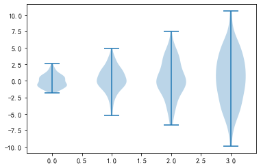

### 设置风格

```python
import numpy as np
import matplotlib.pyplot as plt

# 设置小提琴图的图形风格
def set_violin_style(parts, facecolors, linecolors):
    for i, patch in enumerate(parts['bodies']):
        patch.set_facecolor(facecolors[i])
        patch.set_edgecolor(linecolors[i])
        patch.set_alpha(1)
        
    parts['cmaxes'].set_color(linecolors)
    parts['cmins'].set_color(linecolors)
    parts['cbars'].set_color(linecolors)
np.random.seed(2021)
fig, ax = plt.subplots()
data = [np.random.normal(0, std, 100) for std in range(1, 5)]
positions = range(4)
parts = ax.violinplot(data, positions=positions)

facecolors = ['lightblue', 'lightgreen', 'lightyellow', 'violet']
linecolors = ['blue', 'green', 'gold', 'purple']
set_violin_style(parts, facecolors, linecolors)
plt.show()
```

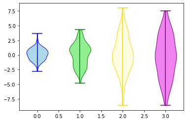

## 直方图

[matplotlib.axes.Axes.hist](https://matplotlib.org/stable/api/_as_gen/matplotlib.axes.Axes.hist.html?highlight=hist#matplotlib.axes.Axes.hist)


### 一维数据绘图

```python
import matplotlib.pyplot as plt
import numpy as np

np.random.seed(2021)
x = np.random.normal(size=(2000))

fig, ax = plt.subplots()

ax.hist(x)  # 绘制直方图

plt.savefig("直方图1.png")
plt.show()
```


### 二维数据绘图

- 1.改成了两列数据
- 2.增加了图例

```python
import matplotlib.pyplot as plt
import numpy as np

np.random.seed(2021)
# 1. 改成两列数据
x = np.random.normal(size=(2000, 2))

fig, ax = plt.subplots()

# 2. 增加图例
ax.hist(x, label=["1st", "2nd"])  # 绘制直方图
ax.legend()

plt.savefig("直方图2.png")
plt.show()
```


### 堆叠的直方图

```python
import matplotlib.pyplot as plt
import numpy as np

np.random.seed(2021)
x = np.random.normal(size=(2000, 2))

fig, ax = plt.subplots()

# 堆叠的直方图
ax.hist(x, label=["1st", "2nd"], 
        stacked=True,  # 堆叠
        color=["b", "g"],  # 设置颜色
        alpha=0.5)  # 设置透明度
ax.legend()

plt.savefig("直方图3.png")
plt.show()
```


### 直方图的参数

| 参数            | 说明                                                         |
| --------------- | ------------------------------------------------------------ |
| x               | 列表对象，ndarray对象，输入数据                              |
| **bins**        | 默认为10，箱子数量，也可以传入列表。                         |
| range           | 数据组的上下界                                               |
| **density**     | 直方图下面积变为1                                            |
| weights         | 与x形状相同的权重数组                                        |
| **cumulative**  | bool 或 -1，默认为False。每个柱子往后累加，会使得直方图的最后一个柱子高度为1。 |
| **bottom**      | array-like，scarlar，None。默认无，可以给每个柱子添加一个偏移量。（堆叠hist可以用） |
| histtype        | 直方图类型，不关键                                           |
| align           | 对齐方式：left mid right。默认为mid                          |
| **orientation** | 直方图的方向：vertical, horizontal，默认为垂直的vertical。   |
| rwidth          | 柱子的相对宽度，会自动计算，不用管                           |
| log             | bool，默认False，如果为True直方图轴将设置为对数刻度。        |
| **label**       | string or list，给数据柱子打上标签                           |
| **color**       | Color or 颜色序列                                            |
| stacked         | bool，默认False。如果为True，则多个数据堆叠在一起。如果为False，则多个数据并排排列（如果histtype为“bar”），如果histtype为“step”，则多个数据堆叠在一起 |

详细解释：

**bins**

如果传入列表，表示人为划分好的箱子，比如`bins=[1, 2, 3, 4]`就把数据划分为[1, 2)、[2, 3)、[3, 4]

**density**

直方图的纵轴变成概率密度分布？将直方图的柱状面积变成1，假设各个箱子中包含的数据由 counts 给出，直方图的范围由bins给出。

假设：

```python
import numpy as np
counts = np.array([20, 15, 30])
bins = np.array([1, 2, 3, 4])
density = counts / (sum(counts) * np.diff(bins))
# array([0.30769231, 0.23076923, 0.46153846])
```

**histype**

要绘制的直方图的类型，一般不用管，默认为bar。随便测试了下，好像就step起作用。

- “bar”是一种传统的条形直方图。如果给出了多个数据，则条并排排列。
- “barstacked”是一种条形直方图，其中多个数据相互叠加。
- “step”生成默认未填充的线形图。
- “stepfilled”生成一个默认填充的线型图。

### 直方图的返回值

- counts：各个箱子的统计值，以array的方式存储
- bins：分出来的箱子的范围，len(bins) = len(counts) + 1
- 直方图对象？`<BarContainer object of 10 artists>`

## 柱状图

https://matplotlib.org/stable/gallery/lines_bars_and_markers/horizontal_barchart_distribution.html#sphx-glr-gallery-lines-bars-and-markers-horizontal-barchart-distribution-py

https://matplotlib.org/stable/api/_as_gen/matplotlib.axes.Axes.bar.html#matplotlib.axes.Axes.bar

sns

```python
import numpy as np
import matplotlib.pyplot as plt
import seaborn as sns

sns.set_theme(style="whitegrid")

x = [0, 1, 2, 3, 4, 5, 6 ,7, 8, 9]
y = [975, 786, 421, 75, 64, 57, 42, 32, 28, 14]
tips = sns.load_dataset("tips")
ax = sns.barplot(x, y,
                 palette="Blues_d")
plt.show()
```

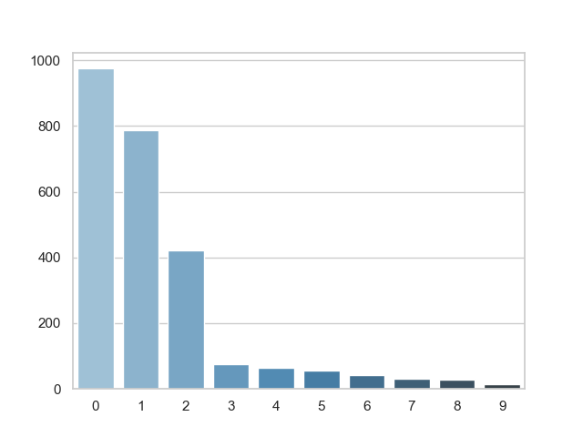

matplotlib

### 垂直柱状图

```python
import matplotlib.pyplot as plt
import numpy as np

# 准备数据
x = ['A', 'B', 'C', 'D', 'E', 'F', 'G', 'H']
y = [31, 24, 36, 18, 55, 27, 35, 44]

# 绘制图形
fig, ax = plt.subplots()
rects = ax.bar(x, y)

# 添加标签和标题
ax.set_xlabel('Category')
ax.set_ylabel('Value')
ax.set_title('Vertical Bar Chart')

# 显示数值标签
ax.bar_label(rects, padding=3)
# for rect in rects:
#     height = rect.get_height()
#     ax.annotate('{}'.format(height),
#                 xy=(rect.get_x() + rect.get_width() / 2, height),
#                 xytext=(0, 3),  # 3 points vertical offset
#                 textcoords="offset points",
#                 ha='center', va='bottom')

# 显示图形
plt.show()

```

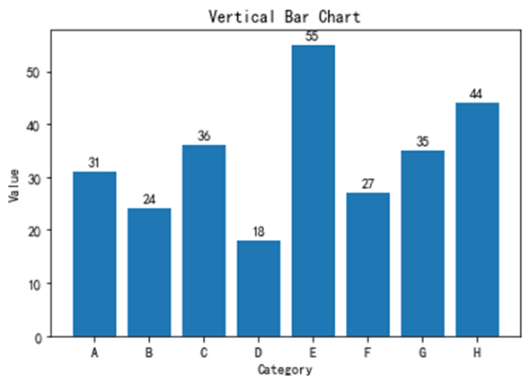

### 水平柱状图

```python
import matplotlib.pyplot as plt
import numpy as np

# 准备数据
y = ['A', 'B', 'C', 'D', 'E', 'F', 'G', 'H']
x = [31, 24, 36, 18, 55, 27, 35, 44]

# 绘制图形
fig, ax = plt.subplots()
rects = ax.barh(y, x)

# 添加标签和标题
ax.set_xlabel('Value')
ax.set_ylabel('Category')
ax.set_title('Horizontal Bar Chart')
plt.bar_label(rects, padding=3)

# 显示图形
plt.show()
```

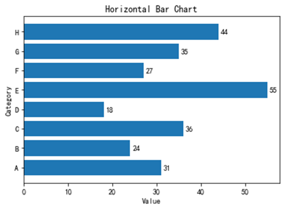

### 堆积柱状图

```python
import matplotlib.pyplot as plt
import numpy as np

fig, ax = plt.subplots(figsize=(3, 4))
x = np.array([0, 1, 2])
y1 = np.array([1, 2, 3])
y2 = np.array([3, 2, 1])
y3 = np.array([1, 1, 1])

ax.bar(x, y1)
ax.bar(x, y2, bottom=y1, color='c')
ax.bar(x, y3, bottom=y1+y2, color='lightblue')
# ax.savefig('堆积柱状图.png')
plt.show()
```


### 并列柱状图

参数：

- labels，list，标签
- data，arraylike，比如二维列表
- colormap，配色

```python
import matplotlib.pyplot as plt
import numpy as np

# 简单版
labels = ['A', 'B', 'C', 'D']
y1 = np.array([3, 7, 9, 2])
y2 = np.array([6, 4, 5, 8])

x = np.arange(len(labels))
fig, ax = plt.subplots(figsize=(3, 2))
width = 0.35  # 柱子宽度

rects1 = ax.bar(x - width/2, y1, width, label='y1', color="deepskyblue", edgecolor='k')
rects2 = ax.bar(x + width/2, y2, width, label='y2', color="lightcoral", edgecolor='k')

ax.set_xticks(x)
ax.set_xticklabels(labels)
ax.legend()

# 添加数据标签
ax.bar_label(rects1, padding=3)
ax.bar_label(rects2, padding=3)
# plt.savefig(r'.\images\并列柱状图1.png')

plt.show()
```

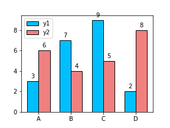

函数封装

```python
import numpy as np
import  matplotlib.colors as c

def barplot(labels, data, colors, gap=0.2):
    # 验证数据准确性
    nlabel = len(labels)
    nbar = data.shape[0]
    assert nlabel == data.shape[1]

    # 设定配色
    if colors is not None:
        assert nbar <= len(colors)
        cmap = c.ListedColormap(colors, N=nbar)
    else:
        cmap = plt.get_cmap("Spectral", lut=nbar)

    align = 'edge' if nbar % 2 == 0 else 'center'

    # 用于绘图的计算参数
    # 计算柱子宽度
    width = (1 - gap) / len(data)
    x = np.array(range(nlabel))

    start = (-nbar + 1) // 2

    fig, ax = plt.subplots()
    ax.grid(axis='y')

    for i, xd in enumerate(range(start, start + nbar)):
        print(xd)
        ax.bar(x + xd * width, data[i], width=width, align=align, color=cmap(i), edgecolor='k', zorder=10)

    ax.spines['top'].set_visible(False)
    ax.spines['right'].set_visible(False)
    ax.set_xticks(x)
    ax.set_xticklabels(labels)
```

```python
np.random.seed(2026)
# 输入参数
labels = ['A', 'B', 'C', 'D']
data = np.random.uniform(0.2, 0.6, size=(4, len(labels)), random_state=2023)
colors = ['#4e62ab', '#469eb4', '#87cfa4', '#f5fbb1']
gap = 0.2  # 两堆柱状图的间隔
barplot(labels, data, colors, gap=0.2)
```


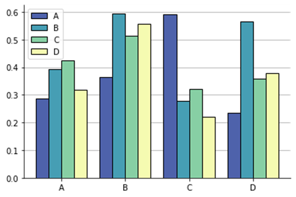

并列柱状图的核心在于分配每个柱子的位置。

以及对齐方式，

### 相关性柱状图

相关性一般是0~1之间的数值，通常需要进行某指标与其他指标的相关性柱状图绘图

```python
import matplotlib.pyplot as plt
import pandas as pd
import numpy as np

# 生成数据
np.random.seed(2023)
y = np.random.uniform(-1, 1, 10)
y = np.sort(y)[::-1]
x = list("abcdefghij")

# 绘图
fig, ax = plt.subplots(figsize=(6, 2), dpi=100)

ax.bar(x, y)
ax.set_ylim(-1, 1)
ax.set_yticks(np.arange(-1, 1.1, 0.5))
plt.show()
```


加入颜色渐变效果并显示标签，代码如下

```python
import matplotlib.pyplot as plt
import pandas as pd
import numpy as np

# 生成数据
np.random.seed(2023)
y = np.random.uniform(-1, 1, 10)
y = np.sort(y)[::-1]
x = list("abcdefghij")

fig, ax = plt.subplots(figsize=(6, 2), dpi=100)

# 使用coolwarm配色方案为柱状图添加渐变色
cm = plt.cm.coolwarm
colors = cm((y + 1) / 2)  # 将y的值从[-1, 1]映射到[0, 1]以适配颜色映射
rects = ax.bar(x, y, color=colors)

plt.bar_label(rects, fmt="%.2g")
# ax.bar(x, y)
ax.set_ylim(-1.2, 1.2)
ax.set_yticks(np.arange(-1, 1.1, 0.5))
plt.show()
```

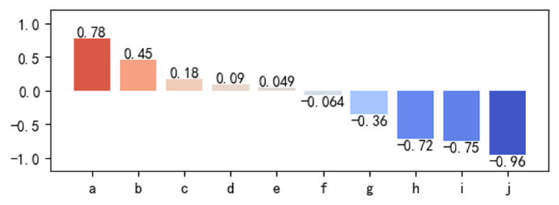

核心代码

```python
# 使用coolwarm配色方案为柱状图添加渐变色
cm = plt.cm.coolwarm
colors = cm((y + 1) / 2)  # 将y的值从[-1, 1]映射到[0, 1]以适配颜色映射
rects = ax.bar(x, y, color=colors)

plt.bar_label(rects, fmt="%.2g")
```

函数化

```python
import matplotlib.pyplot as plt
import pandas as pd
import numpy as np


def corr_bar(x, y, ax=None):
    if ax is None:
	    fig, ax = plt.subplots(figsize=(3, 4), dpi=100)

    # 使用coolwarm配色方案为柱状图添加渐变色
    cm = plt.cm.coolwarm
    colors = cm((y + 1) / 2)  # 将y的值从[-1, 1]映射到[0, 1]以适配颜色映射
    rects = ax.bar(x, y, color=colors, lw=1, ec="k")

    plt.bar_label(rects, fmt="%.2g")
    # ax.bar(x, y)
    ax.set_ylim(-1.2, 1.2)
    ax.set_yticks(np.arange(-1, 1.1, 0.5))
    return ax

# 生成数据
np.random.seed(2023)
y = np.random.uniform(-1, 1, 10)
y = np.sort(y)[::-1]
x = list("abcdefghij")
corr_bar(x, y)
plt.show()
```

有时候会遇到希望x标签与刻度线左对齐的情况

```python
for label in ax.get_xticklabels():
    label.set_horizontalalignment('left')
```

### 相关性柱状图垂直版

```python
def corr_barh(x, y, ax=None):
    if ax is None:
	    fig, ax = plt.subplots(figsize=(3, 4), dpi=100)

    # 使用coolwarm配色方案为柱状图添加渐变色
    cm = plt.cm.coolwarm
    colors = cm((y + 1) / 2)  # 将y的值从[-1, 1]映射到[0, 1]以适配颜色映射
    rects = ax.barh(x, y, color=colors, lw=1, ec="k")

    plt.bar_label(rects, fmt="%.2g")
    # ax.bar(x, y)
    ax.set_xlim(-1.3, 1.3)
    ax.set_xticks(np.arange(-1, 1.1, 0.5))
    return ax

# 生成数据
np.random.seed(2023)
y = np.random.uniform(-1, 1, 10)
y = np.sort(y)
x = list("abcdefghij")
corr_bar(x, y)
plt.show()
```

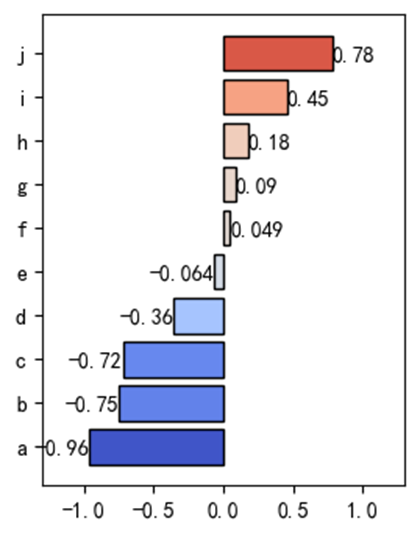

### 设置边框

设置边框颜色 加入参数`edgecolor='black'`

设置边框宽度 加入参数`linewidth=2`

### 设置花纹

https://matplotlib.org/stable/gallery/shapes_and_collections/hatch_demo.html#sphx-glr-gallery-shapes-and-collections-hatch-demo-py

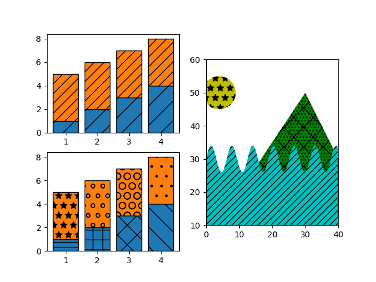

## 区域绘制

```python
import matplotlib.pyplot as plt

fig, ax = plt.subplots()
ax.broken_barh([(2, 3), (6, 1)], (2, 3), facecolors=["tab:blue", "tab:red"])
ax.set_ylim(0, 7)
ax.grid()
plt.show()
```


## 极坐标图

极坐标图中，x就变成了角度`angle`，y变成了半径`radii`。

根据角度和半径就能确定一个点的位置。

其中`angle`用弧度制表示，数字1

> **弧度制**是一种角度量度系统，一个角度的弧度大小等于其所对应圆的弧长除以其半径。弧度制的单位为弧度（rad）。
>
> 弧度制的主要用途是在数学和物理学中计算圆的周长、面积和体积等相关量。在三角学和微积分中，弧度制被广泛地应用，因为它具有很多便捷的性质，如相邻角的弧度之和等于其所对应圆的弧度，以及正弦、余弦和正切函数等的定义式可以更加简洁和通用。
>
> 弧度制的另一个重要用途是解决单位转换问题。在物理学中，许多物理量的单位都包含角度，例如角速度、角加速度等。使用弧度制可以将这些量转换为没有角度单位的标量量，从而简化计算和比较不同物理量之间的关系。
>
> 总之，弧度制是一种十分实用的角度量度系统，可以使得数学和物理学中的计算更加简洁和方便，并且有助于解决单位转换问题。
>
> 半径r=3，角度为a = 60°的圆弧弧长怎么算
>
> arc_length = r * a * np.pi / 180 


```python
import matplotlib.pyplot as plt
import numpy as np

angle = np.linspace(0, np.pi, 4)
radii = np.ones_like(angle)

fig, ax = plt.subplots(subplot_kw=dict(projection='polar'))
ax.plot(angle, radii, '-ro')
```

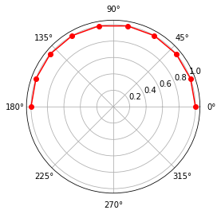

```python
print(angle)
```

```
[0.         0.34906585 0.6981317  1.04719755 1.3962634  1.74532925
 2.0943951  2.44346095 2.7925268  3.14159265]
```


### 螺旋线图

```python
import numpy as np
import matplotlib.pyplot as plt


r = np.arange(0, 10, 0.01)
theta = 2 * np.pi * r

fig, ax = plt.subplots(subplot_kw={'projection': 'polar'})
ax.plot(theta, r, lw=2, color='lightblue')
ax.set_rmax(2.6)

# ax.set_rticks([0.5, 1, 1.5, 2])  # Less radial ticks
#ax.set_rlabel_position(-22.5)  # Move radial labels away from plotted line

ax.set_rticks([])
ax.set_xticks([])
ax.spines[:].set_visible(None)
# ax.grid(True)
# ax.set_title("A line plot on a polar axis", va='bottom')
plt.show()
```


### 雷达图

```python
import matplotlib.pyplot as plt
def get_star_plot_ax(ymax=100):
    ax = plt.subplot(projection='polar')
    ax.spines[:].set_visible(False)
    ax.set_yticks([])
    # 五星图
    x = np.array([.1, 0.5, .9, 1.3, 1.7, .1]) * np.pi
    ax.set_xticks(x)
    ax.set_ylim((0, ymax))
    ax.plot(x, [ymax] * 6, c='lightgrey')
    ax.plot(x, [ymax*0.6] * 6, c='lightgrey')
    ax.plot(x, [ymax*0.2] * 6, c='lightgrey')
    for i in x:
        ax.axvline(i, c='lightgrey')
    ax.tick_params(pad=20)
    return ax

def starplot(ax, y, xlabels, color='b'):
    assert len(y) == len(xlabels)
    
    x = ax.get_xticks()
    y = y + [y[0]]
    xlabels = xlabels + [xlabels[0]]
    
    line = ax.plot(x, y, color=color)
    ax.fill(x, y, alpha=.1, color=color)
    ax.set_xticklabels(xlabels, fontsize=15)
    ax.tick_params(pad=20)
    return line[0]
```

### 五星图

```python
# 构建好得分和标签即可绘图
y = [90, 95, 88, 89, 97]
labels = ['语文', '数学', '英语', '物理', '化学']
xlabels = [lb + '\n%s' % score for lb, score in zip(labels, y)]

ax = get_star_plot_ax()
starplot(ax, y, xlabels)
```

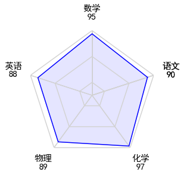

### 六星图

```python
y = [90, 95, 88, 89, 97, 76]
labels = ['语文', '数学', '英语', '物理', '化学', '生物']
xlabels = [lb + '\n%s' % score for lb, score in zip(labels, y)]

ax = get_star_plot_ax(num_lines=6)
starplot(ax, y, xlabels)
```

### 插值画圆

```python
import numpy as np
import matplotlib.pyplot as plt

def get_circle(diameters, intersect=False):
    """根据直径获取一个圆"""
    angles = np.linspace(0, 2 * np.pi, num=len(diameters) + 1, endpoint=True)
    radii = np.array(diameters) / 2
    radii = np.concatenate([radii, [radii[0]]])
    if intersect:
        all_angles = []
        all_radii = []
        for i in range(len(radii) - 1):
            interp_angles = np.linspace(angles[i], angles[i + 1], num=11)
            interp_radii = np.linspace(radii[i], radii[i + 1], num=11)
            all_angles.append(interp_angles)
            all_radii.append(interp_radii)

        all_angles = np.concatenate(all_angles)
        all_radii = np.concatenate(all_radii)
        return all_angles, all_radii
    return angles, radii

diameters = [8.7, 8.4, 6.5, 7.1, 8, 5.2]
angles1, radii1 = get_circle(diameters)
angles2, radii2 = get_circle(diameters, intersect=True)
ax = plt.subplot(projection='polar')
ax.plot(angles1, radii1, 'ro', linewidth=3)
ax.plot(angles2, radii2, ':b', linewidth=2)
ax.set_ylim(0, 5)
plt.show()
```

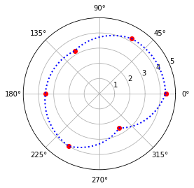


## 填充图

[matplotlib.axes.Axes.fill_between](https://matplotlib.org/stable/api/_as_gen/matplotlib.axes.Axes.fill_between.html#matplotlib.axes.Axes.fill_between)

### 基本用法

填充两曲线之前的部分

```python
fig, ax = plt.subplots()
x = np.linspace(0, 10, 100)
y1 = np.sin(x)+1
y2 = np.sin(x*0.9)
ax.plot(x, y1, c='k')
ax.plot(x, y2, c='k')
ax.fill_between(x, y1, y2, color='yellow', alpha=.5)
```


### where参数

where参数可以只填充满足条件的部分，而不是全部填充

例如下面的例子对y1>1的部分填充淡黄色，y1<1的部分填充淡绿色

```python
fig, ax = plt.subplots()
x = np.linspace(0, 10, 100)
y1 = np.sin(x)+1
y2 = np.sin(x*0.9)
ax.plot(x, y1, c='k')
ax.plot(x, y2, c='k')
ax.fill_between(x, y1, y2, where=(y1>1), color='yellow', alpha=.5)
ax.fill_between(x, y1, y2, where=(y1<1), color='lightgreen', alpha=.5)
```


### step参数

当要填充阶梯图的时候使用这个参数

如果要绘制外边框，`step`参数要和`ax.step()`的`where`参数一致

```python
fig, ax = plt.subplots()
x = np.linspace(0, 10, 20)
y1 = np.sin(x)
ax.step(x, y1, where='pre', c='k')
ax.fill_between(x, y1, 0, color='yellow', alpha=.5, step='pre')
```


### interpolate参数

在使用where参数时，如果不加这个参数，填充可能会存在缺口

```python
# 不使用interpolate参数
fig, ax = plt.subplots()
x = np.linspace(0, 10, 10)
y1 = np.sin(x) * x
ax.plot(x, y1, c='k')
ax.fill_between(x, y1, 0, where=y1>0, color='yellow', alpha=.5)
ax.fill_between(x, y1, 0, where=y1<0, color='lightgreen', alpha=.5)
```

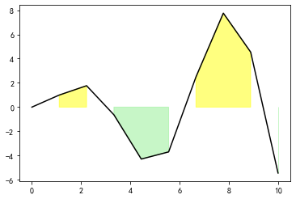

加上这个参数以后，空白部分也会被填充

```python
fig, ax = plt.subplots()
x = np.linspace(0, 10, 10)
y1 = np.sin(x) * x
ax.plot(x, y1, c='k')
ax.fill_between(x, y1, 0, where=y1>0, color='yellow', alpha=.5, interpolate=True)
ax.fill_between(x, y1, 0, where=y1<0, color='lightgreen', alpha=.5, interpolate=True)
```


### fill_between

```python
import matplotlib.pyplot as plt
import numpy as np

def normal(x):
    return 1 / np.sqrt(2 * np.pi) * np.e ** (-x ** 2 / 2)

x = np.linspace(-2, 2, 40)
y = normal(x)
bottom = x * 0

left_x = np.linspace(-5, -2, 30)
left_y = normal(left_x)
left_bottom = left_x * 0

right_x = np.linspace(2, 5, 30)
right_y = normal(right_x)
right_bottom = right_x * 0

fig, ax = plt.subplots(figsize=(6, 3))
ax.plot(x, y, color='black')
ax.plot(left_x, left_y, color='black')
ax.plot(right_x, right_y, color='black')

ax.fill_between(x, y, bottom, where=(y > bottom), facecolor='red', alpha=0.3)
ax.fill_between(left_x, left_y, left_bottom, where=(left_y > left_bottom), facecolor='blue', alpha=0.3)
ax.fill_between(right_x, right_y, right_bottom, where=(right_y > right_bottom), facecolor='blue', alpha=0.3)
ax.vlines([-2, 2], -0.1, max(y), linestyles='--', color='red', alpha=0.5)

plt.show()
plt.savefig('正态分布.png')
```


## Stem Plot

```python
import matplotlib.pyplot as plt
import numpy as np

x = [1, 2, 3, 4, 5]
y = [1, 2, 3, 4, 5]

plt.stem(x, y)
plt.show()
```

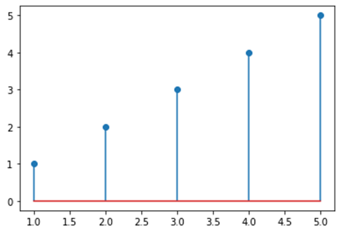

## 其他

### 方波

https://www.moonapi.com/news/13804.html

```python
t = np.linspace(0, 10, 1000)
plt.plot(t, signal.square(2 * np.pi * 5 * t))
```

### 画矩形框

```python
import numpy as np
import matplotlib.pyplot as plt

fig, ax = plt.subplots()
x = np.linspace(0, 20, 1000)
y = np.sin(x)
rect = plt.Rectangle((.25, .25), .5, .5, transform=ax.transAxes, ec='r', fc='None')
ax.add_patch(rect)
plt.plot(x, y)
```

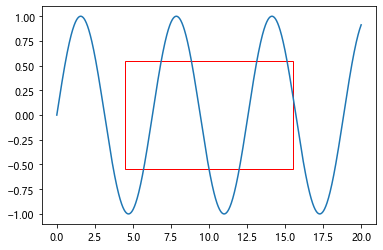

```python
rect = plt.Rectangle(
    xy=(1, -0.5),  # 左下角坐标
    width=5,  # 宽
    height=1,  # 高
)
```

### 跨行列子图

https://matplotlib.org/stable/gallery/userdemo/demo_gridspec01.html#sphx-glr-gallery-userdemo-demo-gridspec01-py

```python
    fig = plt.figure()
    ax1 = plt.subplot2grid((3, 3), (0, 0), colspan=3)
    ax2 = plt.subplot2grid((3, 3), (1, 0), colspan=2)
    ax3 = plt.subplot2grid((3, 3), (1, 2), rowspan=2)
    ax4 = plt.subplot2grid((3, 3), (2, 0))
    ax5 = plt.subplot2grid((3, 3), (2, 1))
```


[Using Gridspec to make multi-column/row subplot layouts — Matplotlib 3.7.2 documentation](https://matplotlib.org/stable/gallery/subplots_axes_and_figures/gridspec_multicolumn.html#sphx-glr-gallery-subplots-axes-and-figures-gridspec-multicolumn-py)

```python
fig = plt.figure(layout="constrained")

gs = GridSpec(3, 3, figure=fig)
ax1 = fig.add_subplot(gs[0, :])
# identical to ax1 = plt.subplot(gs.new_subplotspec((0, 0), colspan=3))
ax2 = fig.add_subplot(gs[1, :-1])
ax3 = fig.add_subplot(gs[1:, -1])
ax4 = fig.add_subplot(gs[-1, 0])
ax5 = fig.add_subplot(gs[-1, -2])
```


### 时间轴

主要是`matplotlib.dates`

- 还有`ax.xaxis.set_major_locator(mdates.DayLocator(interval=1))`
- `ax.xaxis.set_major_formatter(mdates.DateFormatter('%m-%d %H:00'))`


```python
import datetime
import matplotlib.pyplot as plt
import matplotlib.dates as mdates
import numpy as np

fig, ax = plt.subplots(constrained_layout=True, figsize=(8, 3), dpi=150)
xlim = (np.datetime64('2021-02-03 00:00'), np.datetime64('2021-02-06 12:00'))
ax.set_xlim(xlim)
ax.xaxis.set_minor_locator(mdates.HourLocator(interval=6))
ax.xaxis.set_minor_formatter(mdates.DateFormatter('%H:00'))

ax.xaxis.set_major_locator(mdates.DayLocator(interval=1))
ax.xaxis.set_major_formatter(mdates.DateFormatter('%m-%d %H:00'))
for label in ax.get_xminorticklabels():
    label.set_rotation(45)
    label.set_horizontalalignment('center')
    
# ax.xaxis.set_minor_formatter(mdates.(interval=6))
for label in ax.get_xticklabels():
    label.set_rotation(45)
    label.set_horizontalalignment('center')


ax.hlines([1, 1], 
          [np.datetime64('2021-02-04 07:54'), np.datetime64('2021-02-04 19:54')], 
          [np.datetime64('2021-02-04 12:24'), np.datetime64('2021-02-05 02:24')])
ax.set_title('Default Date Formatter')
plt.show()
```


简单的实例

```python
import numpy as np
import matplotlib.pyplot as plt
import matplotlib.dates as mdates

start_time = '2021-06-23 00:00:00'
end_time = '2021-06-25 22:00:00'
fig, ax = plt.subplots(figsize=(9, 3))
xlim = (np.datetime64(start_time), np.datetime64(end_time))
ax.set_xlim(xlim)
ax.xaxis.set_major_locator(mdates.DayLocator(interval=1))
ax.xaxis.set_minor_locator(mdates.HourLocator(range(0, 25, 6)))

ax.xaxis.set_major_formatter(mdates.DateFormatter('%m-%d'))
ax.xaxis.set_minor_formatter(mdates.DateFormatter('%H:%M'))

ax.hlines(y=0, xmin=np.datetime64('2021-06-23 12:10:00'), xmax=np.datetime64('2021-06-24 20:45:00'))
```

- `matplotlib.dates.DayLocator()`

这个函数分别设置了主副刻度线。

locator是刻度位置的具体间隔设定

formatter是刻度显示字符串的格式化


示例2：

```python
import matplotlib.dates as mdates
import matplotlib.pyplot as plt
import pandas as pd
import numpy as np

fig, ax = plt.subplots(figsize=(6, 2), dpi=100)

xlim = (pd.to_datetime('2021-06-24 07:00:00'), pd.to_datetime('2021-06-25 13:00:00'))
# xlim = (np.datetime64('2021-06-24 07:00:00'), np.datetime64('2021-06-25 13:00:00'))
ax.set_xlim(xlim)

# 主刻度线1天1格
# 副刻度线1天4格
ax.xaxis.set_major_locator(mdates.DayLocator(interval=1))
ax.xaxis.set_minor_locator(mdates.HourLocator(range(0, 24, 6)))

# 主副刻度线格式
ax.xaxis.set_major_formatter(mdates.DateFormatter('%m-%d %H:%M'))
ax.xaxis.set_minor_formatter(mdates.DateFormatter('%H:%M'))

ax.axvspan(pd.to_datetime('2021-06-24 18:00:00'), pd.to_datetime('2021-06-25 06:00:00'), color='orange', alpha=.5)
```


### 带箭头时间轴

https://matplotlib.org/stable/api/_as_gen/matplotlib.axes.Axes.boxplot.html

```python
import matplotlib.pyplot as plt
import numpy as np

fig, ax = plt.subplots()

height = [1, 1, 2, 2]
start = np.array([0.2, 1.2, 0.4, 1.6])
end = start + np.random.uniform(0.2, 1, 4)
idxs = ['apple', 'banana', 'cat', 'dog']

# 颜色设置
cmap = plt.get_cmap('Paired')
color = [cmap(i) for i in height]

# 起始圆点
ax.scatter(start, height, marker='o', color=color, facecolor='w', zorder=2)

# 结尾箭头
ax.scatter(end, height, marker='>', color=color, facecolor=color, zorder=2)

# 时间线
ax.hlines(height, start, end, color=color, zorder=1)

# 标注
for i, idx in enumerate(idxs):
    ax.text((start[i] + end[i]) / 2, height[i] + 0.05, idx, ha='center', va='bottom')

ax.set_ylim((0, 3))
ax.set_yticks([1, 2])
ax.set_yticklabels(['fruit', 'animal'])
plt.show()
```


### 圆弧

https://matplotlib.org/stable/api/_as_gen/matplotlib.patches.Arc.html#matplotlib.patches.Arc

https://stackoverflow.com/questions/30642391/how-to-draw-a-filled-arc-in-matplotlib

参数

| 参数             | 类型             | 说明                                                         |
| ---------------- | ---------------- | ------------------------------------------------------------ |
| `xy`             | `(float, float)` | 椭圆的圆心                                                   |
| `width`          | `float`          | 椭圆横向长度                                                 |
| `height`         | `float`          | 椭圆纵向长度                                                 |
| `angle`          | `float`          | 椭圆选择的角度（逆时针）角度制                               |
| `theta1, theta2` | `float`          | 0~360。要绘制圆弧曲线的范围，这个数值是相对于`angle`的。如果`angle`等于30，theta1=30, theta2=60,那就会绘制60°~90°的圆弧。 |
|                  |                  |                                                              |


```python
import matplotlib.patches as mpatches
import matplotlib.pyplot as plt

fig, ax = plt.subplots(1, 1)

pac = mpatches.Arc([0, -2.5], 5, 5, angle=0, theta1=45, theta2=135)
ax.add_patch(pac)

ax.axis([-2, 2, -2, 2])
ax.set_aspect("equal")
fig.canvas.draw()
```

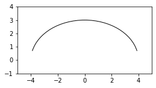

给圆弧填充颜色

```python
import matplotlib.patches as mpatches
import matplotlib.pyplot as plt

fig, ax = plt.subplots(1, 1, figsize=(4, 4))

pac = mpatches.Arc([0, 0], 8, 6, angle=0, theta1=10, theta2=170, hatch = '......')
ax.add_patch(pac)
pac.set_color('blue')
pac.set_alpha(.4)
ax.axis([-5, 5, -1, 4])
ax.set_aspect("equal")
fig.canvas.draw()
```

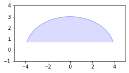

### 正态分布偏度峰度


峰度

```python
import matplotlib.pyplot as plt
import numpy as np
fig, ax = plt.subplots(dpi=100)

mu = 0
sigma = 1
x = np.linspace(-4 * sigma, 4 * sigma, 200)
y = 1 / (np.sqrt(2 * np.pi) * sigma) * np.exp ** (- (x - mu) ** 2 / (2 * sigma ** 2))

ax.plot(x, y)
```

偏态分布曲线

```python
import matplotlib.pyplot as plt
import numpy as np
from scipy.stats import norm, skewnorm
plt.figure(figsize=(4.5, 3), dpi=100)
# 生成数据
x = np.linspace(-3, 3, 1000)

# 绘制正偏态分布曲线
plt.plot(x, skewnorm.pdf(x, 1), label='负偏态', lw=2)

# 绘制负偏态分布曲线
plt.plot(x, skewnorm.pdf(x, -1), label='正偏态', lw=2)

# 绘制正态分布曲线
plt.plot(x, norm.pdf(x), label='正态', lw=2)

# 添加图例和标题
plt.legend()
plt.title('偏态对比')

# 显示图形
plt.show()

```

过程图

```python
fig, axes = plt.subplots(1, 2, figsize=(10, 3), dpi=100, sharey=False,)
fig.subplots_adjust(wspace=0)

ax = axes[0]
ax.set_yticks([])
ax.set_xticks([])
ax.spines['top'].set_visible(False)
ax.spines['left'].set_visible(False)

x = np.linspace(-4, 4)
y = get_norm(x, sigma=.8) * 2
x += 1.3

ax.set_ylim(y.min(), 1.2)
ax.plot(x, y,color='k')
ax.bar([8], 1, width=1.5, edgecolor="k", facecolor='g')
ax.set_xlim(-5, 12)
# 
ax.fill_between(x, y, 0, where=x < -2,color='red', alpha=.5)
ax.fill_between(x, y, 0, where=x > -2,color='g', alpha=.5)

ax.axvline(-2, 0,0.5, c='r', lw=2)
ax.axvline(5, 0,0.5, c='r', lw=2)
ax.text(-2, 0.65, "$LSL$", ha='center')
ax.text(5, 0.65, "$USL$", ha='center')

ax = axes[1]
ax.set_xticks([])
ax.set_yticks([])
t = ax.set_title("$Cpk$")
t.set_x(0)
ax.spines['top'].set_visible(False)
ax.spines['right'].set_visible(False)
ax.set_yticks([0.2, 0.4, 0.6, 0.8, 1])
ax.tick_params(direction="inout", length =12)

ax.set_ylim(0, 1.2)

ax.set_xlim(-12, 5)
ax.bar([-8], 1, width=1.5, edgecolor="k", facecolor='g')

ax.axvline(2, 0,0.5, c='r', lw=2)
ax.axvline(-5, 0,0.5, c='r', lw=2)
ax.text(2, 0.65, "$LSL$", ha='center')
ax.text(-5, 0.65, "$USL$", ha='center')

x = np.linspace(-4, 4)
y = get_norm(x, sigma=.8) * 2
x -= 1.3
ax.plot(x, y,color='k')
ax.fill_between(x, y, 0, where=x < 2,color='g', alpha=.5)
ax.fill_between(x, y, 0, where=x > 2,color='r')

```

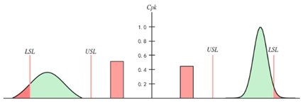

### 区域绘图

```python
import matplotlib.pyplot as plt
import numpy as np
plt.rcParams['mathtext.fontset'] = 'stix'

x = [0, 1, 2, 3, 4, 5, 6, 7, 8, 9]
y = [-30, 30, 28, 32, 30, -31, -28, -30, -30, 30]

x2 = [0, 9]
y2 = [-30, 30]
fig, ax = plt.subplots(figsize=(4, 2), dpi=100)

ax.vlines(x[1:5], ymin=0, ymax=y[1:5], color='cornflowerblue', ls='--')
ax.vlines(x[5:9], ymin=y[5:9], ymax=0, color='cornflowerblue', ls='--')

ax.fill_between(x[:6], y[:6], 0, where=np.array(y[:6])>0, interpolate=True, color='b', alpha=.1)
ax.fill_between(x[4:], y[4:], 0, where=np.array(y[4:])<0, interpolate=True, color='g', alpha=.1)

ax.plot(x, y, color='cornflowerblue', marker='o', mfc='w', mew=2)
ax.plot(x2, y2, color='salmon', ls='', marker='o', mfc='w', mew=2)
ax.axhline(ls=':', color='grey')
ax.set_ylim(-45, 45)
ax.set_yticks([-30, 0, 30])
for i, (xx, yy) in enumerate(zip(x, y)):
    d = 1 if yy > 0 else -1
    va = 'bottom' if yy > 0 else 'top'
    ax.text(xx, yy + 2 * d, f"$p_{i}$", va=va, fontsize=12)
```

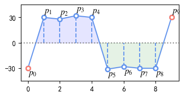

## 标记线

```python
import matplotlib.pyplot as plt


def plot_line(ax, p1, p2, text=""):
    # 设置两个点的坐标，例如 (x1, y1) 和 (x2, y2)
    x1, y1 = p1
    x2, y2 = p2
    ax.plot([x1, x2], [y1, y2], color='k')

    # 添加两个小竖线
    line_length = 0.2  # 设置小竖线的长度
    
    arrowprops = dict(arrowstyle='-', color='black')
    ax.annotate('', (x1, y1 - line_length / 2), (x1, y1 + line_length / 2), arrowprops=arrowprops)
    ax.annotate('', (x2, y2 - line_length / 2), (x2, y2 + line_length / 2), arrowprops=arrowprops)
    
    tx = (x1 + x2) / 2
    ty = (y1 + y2) / 2
        
    ax.text((x1 + x2)/2, (y1 + y2)/2, text, va="bottom", ha="center")
```

```python
fig, ax = plt.subplots()
ax.set_ylim(0, 1)
ax.set_xlim(0, 1)
plot_line(ax, [0.2, 0.5], [0.8, 0.5], text="text")
```

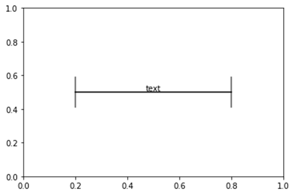

### 简化版

[Angle annotations on bracket arrows — Matplotlib 3.7.1 documentation](https://matplotlib.org/stable/gallery/text_labels_and_annotations/angles_on_bracket_arrows.html#sphx-glr-gallery-text-labels-and-annotations-angles-on-bracket-arrows-py)

```python
import matplotlib.pyplot as plt
from matplotlib.patches import FancyArrowPatch
fig, ax = plt.subplots()

arrow_centers = ((0.2, .5), (0.8, .5))
bracket = FancyArrowPatch(
    *arrow_centers, 
    arrowstyle="|-|",
    mutation_scale=6
)
ax.add_patch(bracket)
plt.show()
```

## imshow


范围的映射

用`ax.imshow`的`extent`参数。

```python
fig, ax = plt.subplots()
ax.imshow(z, extent=[1, 258, 50, 500])
ax.axis('auto')
```


imshow倒转y轴

https://stackoverflow.com/questions/14320159/matplotlib-imshow-data-rotated

设置imshow的属性`origin='lower'`

## 混淆矩阵

```python
from sklearn.metrics import confusion_matrix
import matplotlib.pyplot as plt
import seaborn as sns

# 假设y_true和y_pred如下：
y_true = [0, 0, 0, 0, 0, 1, 1, 1, 1, 1, 2, 2, 2, 2, 2]
y_pred = [0, 0, 0, 0, 1, 1, 1, 2, 1, 1, 0, 1, 2, 2, 2]
labels = ["apple", "banana", "pear"]
# 使用sklearn.metrics.confusion_matrix生成混淆矩阵
cm = confusion_matrix(y_true, y_pred)
fig, ax = plt.subplots()
# 或者使用seaborn.heatmap进行可视化
sns.heatmap(cm, annot=True, cmap='Blues', square=True, linewidths=0.5, linecolor='white', ax=ax)
ax.set_xticklabels(labels)
plt.xlabel('Predicted Labels')
plt.ylabel('True Labels')
plt.show()
```

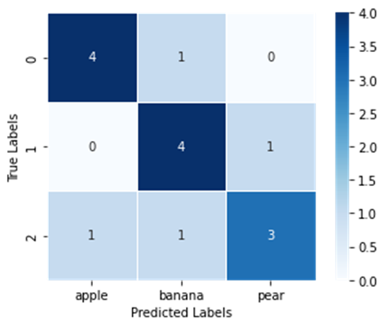

## 表格

https://matplotlib.org/stable/api/table_api.html#matplotlib.table.Table

```python
import numpy as np
import matplotlib.pyplot as plt

nrow = 3  # 设定行数
ncol = 4 # 设定列数

data = np.random.randint(0, 99, (nrow, ncol))

fig, ax = plt.subplots(dpi=100, figsize=(1, 2))
ax.set_axis_off()  # 关闭图像

table = ax.table(
    cellColours=[['lightblue', 'lightgreen', 'pink', 'yellow'],
                 ['lightblue', 'lightgreen', 'pink', 'yellow'],
                 ['lightblue', 'lightgreen', 'pink', 'yellow']],
    cellText=data,
    cellLoc='center',  # 设置单元格对齐方式
    loc='center',  # 设置表格的位置
)

table.scale(2, 2)  # 放缩 x, y
plt.show()
```

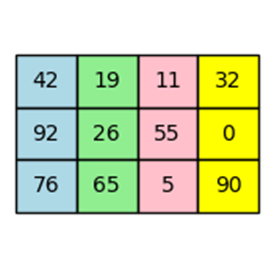

选取特定的单元格

```python
# 选取第0行第2列的单元格
cell = table[0, 2]
```

单元格也可以设置颜色

```python
table[0, 2].set_facecolor('pink')
```

## 绘制矩形

```python
import matplotlib.pyplot as plt
import matplotlib.patches as patches

# 创建一个Figure对象和一个Axes对象
fig, ax = plt.subplots()

# 创建一个Rectangle对象，设置位置、宽度和高度以及颜色
rect = patches.Rectangle((0.25, 0.25), 0.5, 0.5, facecolor=(123/255, 223/255, 102/255))

# 将Rectangle对象添加到Axes对象中
ax.add_patch(rect)

# 设置坐标轴范围
ax.set_xlim(0, 1)
ax.set_ylim(0, 1)

# 显示图形
plt.show()

```

## 误差线图

```python
import numpy as np
import matplotlib.pyplot as plt

# example data
x = np.array([0.5, 1.0, 1.5, 2.0])
y = np.exp(-x)
yerr = [[0.1, 0.2, 0.3, 0.4], [0.2, 0.1 ,0.1 ,0.2]]

fig, ax = plt.subplots(figsize=(4, 3))
ax.errorbar(x, y, yerr=yerr, fmt="ob:", capsize=4)
ax.set_title('Errorbar upper and lower limits')
plt.show()
```

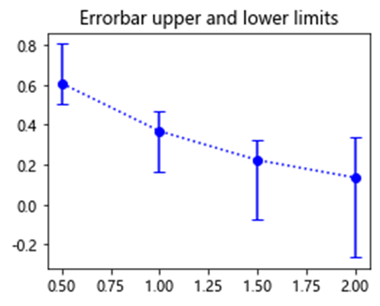
