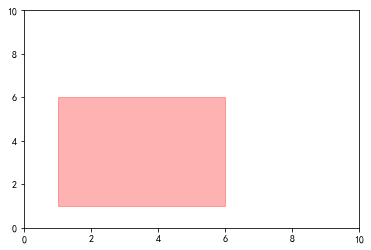

### Bbox的作用

https://matplotlib.org/stable/api/transforms_api.html#matplotlib.transforms.Bbox

`matplotlib.transforms.Bbox`是Matplotlib中的一个类，它表示图形对象的边界框。它是一个四元组，用于表示左下角和右上角的坐标，并用于在图形的空间内定位和对齐元素。

主要作用：

- 计算图形的空间大小和位置
- 计算图形的交集、并集、包含等关系
- 在图形空间中的定位和对齐

使用方法：

首先，需要实例化一个`Bbox`对象：

```python
from matplotlib.transforms import Bbox

bbox = Bbox([[xmin, ymin], [xmax, ymax]])

```

其中`xmin`、`ymin`、`xmax`、`ymax`分别表示左下角和右上角的坐标。

然后，可以使用以下方法来操作`Bbox`对象：

- `translate`：移动边界框
- `scale`：缩放边界框
- `union`：计算两个边界框的并集
- `intersection`：计算两个边界框的交集
- `contains`：判断一个边界框是否完全包含另一个边界框

另外，还可以使用`Bbox`对象来定位和对齐图形：

```python
from matplotlib.patches import Rectangle
import matplotlib.pyplot as plt

fig, ax = plt.subplots()
x, y = 1, 1
width, height = 5, 5
rect = Rectangle((x, y), width, height, transform=ax.transData, color='r', alpha=.3)
ax.add_patch(rect)
ax.set_ylim(0, 10)
ax.set_xlim(0, 10)
```


```python
from matplotlib.patches import Rectangle
import matplotlib.pyplot as plt

fig, ax = plt.subplots()
x, y = 0.1, 0.1
width, height = 0.5, 0.5
rect = Rectangle((x, y), width, height, transform=ax.transAxes, color='r', alpha=.3)
ax.add_patch(rect)
ax.set_ylim(0, 10)
ax.set_xlim(0, 10)
```



```python
import matplotlib.pyplot as plt
import matplotlib.transforms as transforms

fig, ax = plt.subplots()

bbox = transforms.Bbox([[0.25, 0.25], [0.75, 0.75]])

ax.annotate("Text", xy=(0.5, 0.5), xycoords='data', 
            bbox=bbox, textcoords='data')

plt.show()
```


### transform


transform的作用就是把数据点映射到像素点上。

```python
import numpy as np
import matplotlib.pyplot as plt

fig, ax = plt.subplots(figsize=(3,3))
ax.plot(range(5))
plt.show()

print('像素边界:', ax.bbox.bounds)
print('数据点映射:', ax.transData.transform((2, 2)))
print('坐标轴映射:', ax.transAxes.transform((0.5, 0.5)))
```

通过transform，使得绘制的图像自动适配

```python
import numpy as np
import matplotlib.pyplot as plt
from matplotlib.transforms import BboxTransform, Bbox


fig, ax = plt.subplots(figsize=(7,8))
ax.imshow(np.random.randn(30, 50), extent=(0, 1000, -2, 3))
ax.axis('auto')
transform = BboxTransform(
    Bbox.from_extents(0, 0, 2, 2), 
    ax.bbox,
)
rect = plt.Rectangle((0.5, 0.5), 1, 1, ec='r', fc='None', transform=transform)
ax.add_patch(rect)
plt.show()
```

获取逆变换的transform

```python
transData_r = ax.transData.inverted()
# 输入像素点，转换为数据
transData_r.transform([100, 100])
```

### 像素点转为数值

```python
import numpy as np
import matplotlib.pyplot as plt
from matplotlib.transforms import BboxTransform, Bbox


def plot(rects):
    # 采样率是
    # 10000
    fig, ax = plt.subplots(figsize=(3, 3))
    # 0-150通道 10秒
    ax.imshow(np.random.randn(976, 140), extent=(0, 140, 10, 0))
    ax.axis('auto')
    transform = BboxTransform(
        Bbox.from_extents(0, 976, 140, 0), 
        ax.bbox,
    )
    for left, bottom, width, height in rects:
        print(left, bottom, width, height)
        rect = plt.Rectangle((left, bottom), width, height, ec='r', fc='None', transform=transform)
        ax.add_patch(rect)
    plt.show()
    return ax, transform
```

```python
# 异常检测结果

# 帧起始和结束
frame_start = 200
frame_end = 500
channel_start = 100
channel_end = 120

frame_diff = frame_end - frame_start
channel_diff = channel_end - channel_start

rects = [(channel_start, frame_end, channel_diff, frame_diff)]
ax, transform = plot(rects)
transform_r = transform.inverted()
```

```python
# 中间过程会得到这个矩形框的具体像素位置
left, bottom = transform.transform([channel_start, frame_end])
right, top = transform.transform([channel_end, frame_start])

width = right - left
height = top - bottom
print(left, right, bottom, top)
print(width, height)
```

```python
# 左 下 右 上
print('ax.bbox.bounds:', ax.bbox.bounds)
print('自定义:', Bbox.from_extents(0, 10000, 140, 0).bounds)
```

```python
# 最终要根据这个框的像素位置还原到时间点。时间: 0-100000, 通道: 0-140
# 小的数向下取整，大的数向上取整
transform2 = BboxTransform(
    ax.bbox,
    Bbox.from_extents(0, 100000, 140, 0), 
)
```

```python
channel_start, point_start = transform2.transform([left, top])
channel_end, point_end = transform2.transform([right, bottom])
print(channel_start, channel_end, point_start, point_end)
```

