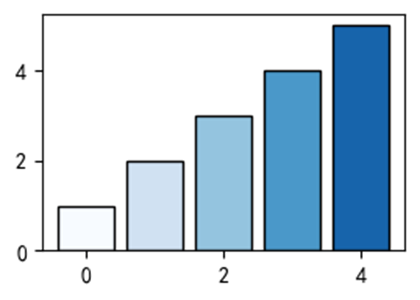
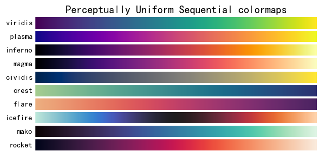
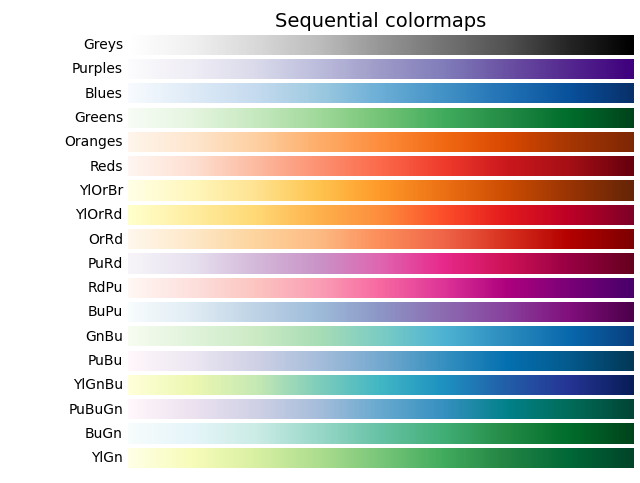
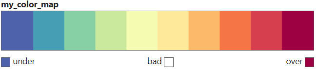

好看的color配色

[不会配色？看这里~SCI论文插图经典配色实例第12期 - 知乎 (zhihu.com)](https://zhuanlan.zhihu.com/p/612574781)

```python
import matplotlib.pyplot as plt
import matplotlib.colors as mcolors

# 定义颜色
colors = [(78/255, 98/255, 171/255), (70/255, 158/255, 180/255), (135/255, 207/255, 164/255),
          (203/255, 233/255, 157/255), (245/255, 251/255, 177/255), (254/255, 232/255, 154/255),
          (253/255, 185/255, 106/255), (245/255, 117/255, 71/255), (214/255, 64/255, 78/255),
          (158/255, 1/255, 66/255)]

# 创建图形
fig, ax = plt.subplots()

# 创建矩形
rect_width = 0.8
rect_height = 1
rect_gap = 0.2
x_pos = 0
for color in colors:
    rect = plt.Rectangle((x_pos, 0), rect_width, rect_height, color=color)
    ax.add_patch(rect)
    x_pos += rect_width + rect_gap

# 设置坐标轴范围和标签
ax.set_xlim([0, x_pos - rect_gap])
ax.set_ylim([0 - 0.2, rect_height + 0.2])
ax.set_xticks([])
ax.set_yticks([])

plt.show()

```

![img](data:image/png;base64,iVBORw0KGgoAAAANSUhEUgAAAWAAAADrCAYAAABXYUzjAAAAOXRFWHRTb2Z0d2FyZQBNYXRwbG90bGliIHZlcnNpb24zLjYuMywgaHR0cHM6Ly9tYXRwbG90bGliLm9yZy/P9b71AAAACXBIWXMAAAsTAAALEwEAmpwYAAAFD0lEQVR4nO3YP2teZRyA4edNQ5r+JYEGcTKTk4NDPoCLOImgDhYEB2d3JwcnNwc/QUGIg7qLix8gAQcnJ4uTVGj9V2tJe5xt375poDm3tNc1Ps+B34/zkptwFtM0DQDmt1YvAPCsEmCAiAADRAQYICLAABEBBoisn+ThK1euTLu7u6e0CsDT6fDw8NdpmnYePD9RgHd3d8fBwcGT2wrgGbBYLK4vO/cJAiAiwAARAQaICDBARIABIgIMEBFggIgAA0QEGCAiwAARAQaICDBARIABIgIMEBFggIgAA0QEGCAiwAARAQaICDBARIABIgIMEBFggIgAA0QEGCAiwAARAQaICDBARIABIusnefinn38bb7z/5Wnt8h9bl8+Oa5++vvTunf1vx807d2fZY3tzY3xx9dWld5/98NX46+jOLHtcWN8cH7z01tK772/sj6Pp71n2GGOM9cW58fLO1YfObx99M8b4Z7Y9xjg7zq+/tvRmuvH5GPdneidr58Zi592lV/e/+3CMu3/Ms8fGpbH2yidLr25/fHWMP2/Os8fF7XH+o/2lVz+++d64d/PWLGuc2d4aL359bend/vNvjzu/zPQ+VjjRf8BH9+6f1h4PufX7o/+Q54rvcbPmiu9xs+aM7+p5c8b3mHlzxfe4WXPF97hZc8X3mFlzxfe4Wf+H+I7hEwRARoABIgIMEBFggIgAA0QEGCAiwAARAQaICDBARIABIgIMEBFggIgAA0QEGCAiwAARAQaICDBARIABIgIMEBFggIgAA0QEGCAiwAARAQaICDBARIABIgIMEBFggIgAA0QEGCAiwAARAQaICDBARIABIgIMEBFggIgAA0QEGCAiwAARAQaICDBARIABIgIMEBFggIgAA0QEGCAiwAARAQaICDBARIABIgIMEBFggIgAA0QEGCAiwAARAQaICDBARIABIgIMEBFggIgAA0QEGCAiwAARAQaICDBARIABIgIMEBFggIgAA0QEGCAiwAARAQaICDBARIABIgIMEBFggIgAA0QEGCAiwAARAQaICDBARIABIgIMEBFggIgAA0QEGCAiwAARAQaICDBARIABIgIMEBFggIgAA0QEGCAiwAARAQaICDBARIABIgIMEBFggIgAA0QEGCAiwAARAQaICDBARIABIgIMEBFggIgAA0QEGCAiwAARAQaICDBARIABIgIMEBFggIgAA0QEGCAiwAARAQaICDBARIABIgIMEBFggIgAA0QEGCAiwAARAQaICDBARIABIgIMEBFggIgAA0QEGCAiwAARAQaICDBARIABIgIMEBFggIgAA0QEGCAiwAARAQaICDBARIABIgIMEBFggIgAA0QEGCAiwAARAQaICDBA5EQBXj8zX6+3Lp995N325sZse6yadWF9c7Y9Vs1aX5ybbY/V8x79m52OFfPWZnwnq2ZtXJpvj1WzLm7Pt8eKWWe2t2ZbY9WszedmfB8rLKZpeuyH9/b2poODg1NcB+Dps1gsDqdp2nvw3CcIgIgAA0QEGCAiwAARAQaICDBARIABIgIMEBFggIgAA0QEGCAiwAARAQaICDBARIABIgIMEBFggIgAA0QEGCAiwAARAQaICDBARIABIgIMEBFggIgAA0QEGCAiwAARAQaILKZpevyHF4sbY4zrp7cOwFPphWmadh48PFGAAXhyfIIAiAgwQESAASICDBARYICIAANEBBggIsAAEQEGiPwLWUuKDZAKZ0IAAAAASUVORK5CYII=)

获取cmap

```python
cmap = plt.get_cmap("Spectral", lut=10)
cmap
```

柱子越高，颜色越深

```python
import matplotlib.pyplot as plt
import matplotlib.colors as mcolors

data = [1, 2, 3, 4, 5]

fig, ax = plt.subplots(figsize=(3, 2), dpi=100)

colors = plt.get_cmap("Blues")
bars = ax.bar(range(len(data)), data)

for i, bar in enumerate(bars):
    bar.set_color(colors(i / len(data)))
    bar.set_edgecolor('k')

plt.show()
```




# 单色


# 渐变色






# 代码

[Colormap reference — Matplotlib 3.7.1 documentation](https://matplotlib.org/stable/gallery/color/colormap_reference.html)

```python

cmaps = [('Perceptually Uniform Sequential', [
            'viridis', 'plasma', 'inferno', 'magma', 'cividis', 'crest',
            'flare', 'icefire', 'mako', 'rocket']),
         ('Sequential', [
            'Greys', 'Purples', 'Blues', 'Greens', 'Oranges', 'Reds',
            'YlOrBr', 'YlOrRd', 'OrRd', 'PuRd', 'RdPu', 'BuPu',
            'GnBu', 'PuBu', 'YlGnBu', 'PuBuGn', 'BuGn', 'YlGn']),
         ('Sequential (2)', [
            'binary', 'gist_yarg', 'gist_gray', 'gray', 'bone', 'pink',
            'spring', 'summer', 'autumn', 'winter', 'cool', 'Wistia',
            'hot', 'afmhot', 'gist_heat', 'copper']),
         ('Diverging', [
            'PiYG', 'PRGn', 'BrBG', 'PuOr', 'RdGy', 'RdBu', 'RdYlBu', 
            'RdYlGn', 'Spectral', 'coolwarm', 'bwr', 'seismic', 'vlag']),
         ('Cyclic', ['twilight', 'twilight_shifted', 'hsv']),
         ('Qualitative', [
            'Pastel1', 'Pastel2', 'Paired', 'Accent',
            'Dark2', 'Set1', 'Set2', 'Set3',
            'tab10', 'tab20', 'tab20b', 'tab20c']),
         ('Miscellaneous', [
            'flag', 'prism', 'ocean', 'gist_earth', 'terrain', 'gist_stern',
            'gnuplot', 'gnuplot2', 'CMRmap', 'cubehelix', 'brg',
            'gist_rainbow', 'rainbow', 'jet', 'turbo', 'nipy_spectral',
            'gist_ncar'])]

gradient = np.linspace(0, 1, 256)
gradient = np.vstack((gradient, gradient))


def plot_color_gradients(cmap_category, cmap_list):
    # Create figure and adjust figure height to number of colormaps
    nrows = len(cmap_list)
    figh = 0.35 + 0.15 + (nrows + (nrows-1)*0.1)*0.22
    fig, axs = plt.subplots(nrows=nrows, figsize=(6.4, figh), dpi=110)
    fig.subplots_adjust(top=1-.35/figh, bottom=.15/figh, left=0.2, right=0.99)

    axs[0].set_title(cmap_category + ' colormaps', fontsize=14)

    for ax, name in zip(axs, cmap_list):
        ax.imshow(gradient, aspect='auto', cmap=plt.get_cmap(name))
        ax.text(-.01, .5, name, va='center', ha='right', fontsize=10,
                transform=ax.transAxes)

    # Turn off *all* ticks & spines, not just the ones with colormaps.
    for ax in axs:
        ax.set_axis_off()


for cmap_category, cmap_list in cmaps:
    plot_color_gradients(cmap_category, cmap_list)

plt.show()
```

# 自定义离散cmap

```python
from matplotlib import colors as c
cmap = c.ListedColormap(['lightblue','w'])
```

例如，论文经典配色

```python
from matplotlib import colors as c
colors = [
    '#4e62ab', '#469eb4', '#87cfa4', '#cbe99d', '#f5fbb1', 
    '#fee89a', '#fdb96a', '#f57547', '#d6404e', '#9e0142']

cmap = c.ListedColormap(colors, name="my_color_map", N=10)
cmap
```



# 配色

[跟顶刊学配色！SCI论文插图经典配色实例第1期 - 知乎 (zhihu.com)](https://zhuanlan.zhihu.com/p/593320758)

[审美积累~SCI论文插图经典配色实例第2期 - 知乎 (zhihu.com)](https://zhuanlan.zhihu.com/p/594161488)

[跟着顶刊学配色！SCI论文插图经典配色实例第3期 - 知乎 (zhihu.com)](https://zhuanlan.zhihu.com/p/594927077)

[不会配色？看这里~SCI论文插图经典配色实例第4期 - 知乎 (zhihu.com)](https://zhuanlan.zhihu.com/p/596176944)

[论文配色还能这样？SCI论文插图经典配色实例第5期 - 知乎 (zhihu.com)](https://zhuanlan.zhihu.com/p/596724941)

[不会配色？跟顶刊学习~SCI论文插图经典配色实例第6期 - 知乎 (zhihu.com)](https://zhuanlan.zhihu.com/p/597892222)

[跟顶刊学配色~SCI论文插图经典配色实例第7期 - 知乎 (zhihu.com)](https://zhuanlan.zhihu.com/p/599589346)

[不会配色看这里~SCI论文插图经典配色实例第8期 - 知乎 (zhihu.com)](https://zhuanlan.zhihu.com/p/602135863)

[用这套配色拿下审稿专家！SCI论文插图经典配色实例第9期 - 知乎 (zhihu.com)](https://zhuanlan.zhihu.com/p/607356250)

[纯蓝清冷配色~SCI论文插图经典配色实例第10期 - 知乎 (zhihu.com)](https://zhuanlan.zhihu.com/p/609301843)

[橙色活力配色~SCI论文插图经典配色实例第11期 - 知乎 (zhihu.com)](https://zhuanlan.zhihu.com/p/611114599)

[不会配色？看这里~SCI论文插图经典配色实例第12期 - 知乎 (zhihu.com)](https://zhuanlan.zhihu.com/p/612574781)

[不会配色看这里！SCI论文插图经典配色实例第13期 - 知乎 (zhihu.com)](https://zhuanlan.zhihu.com/p/615171651)
