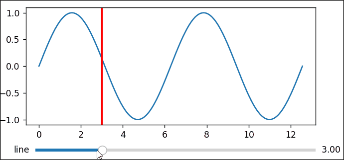

[toc]


## 通过滑条控制纵向直线的移动




```python
# %matplotlib notebook
import numpy as np
import matplotlib.pyplot as plt
from matplotlib.widgets import Slider


# 设置初始参数
xmin = 0
xmax = 2 * np.pi * 2
xinit = 3
t = np.linspace(0, xmax, 1000)

# 创建图像
fig, ax = plt.subplots()
ax.plot(t, np.sin(t))

# 绘制纵向的参考
line = ax.axvline(xinit, lw=2, color="r")

# 将主图像的下方给滑条留出空间
fig.subplots_adjust(left=0.25, bottom=0.25)

# 在图像下方绘制纵向的滑条
ax_slider = fig.add_axes([0.25, 0.1, 0.65, 0.03])
line_slider = Slider(
    ax=ax_slider,
    label="line position",
    valmin=0,
    valmax=xmax,
    valinit=xinit,
    valstep=np.arange(0, 12, 0.5),
)


# 当滑条移动时调用下方的函数
def update(val):
    line.set_xdata(line_slider.val)
    fig.canvas.draw_idle()


# 为滑条注册更新函数
line_slider.on_changed(update)

plt.show()
```

## 点击按钮切换上下切换图片

```python
import numpy as np
import matplotlib.pyplot as plt
from matplotlib.widgets import Button


fig, ax = plt.subplots()
def get_data():
    return np.random.randn(1000, 80)

plt.subplots_adjust(bottom=0.2)
im = ax.imshow(get_data())
ax.axis('auto')

class Index:
    def next(self, event):
        data = get_data()
        im.set_data(data)
        plt.draw()

    def prev(self, event):
        data = get_data()
        im.set_data(data)
        plt.draw()

callback = Index()
axprev = plt.axes([0.7, 0.05, 0.1, 0.075])
axnext = plt.axes([0.81, 0.05, 0.1, 0.075])
bnext = Button(axnext, 'Next')
bnext.on_clicked(callback.next)
bprev = Button(axprev, 'Previous')
bprev.on_clicked(callback.prev)

plt.show()
```

