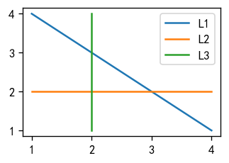
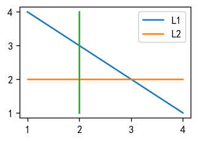
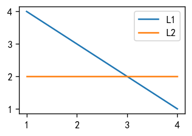
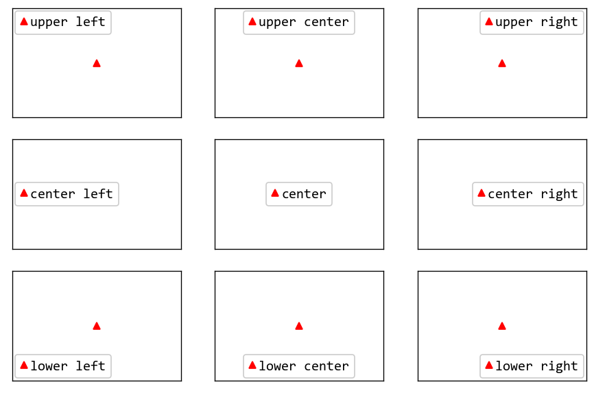
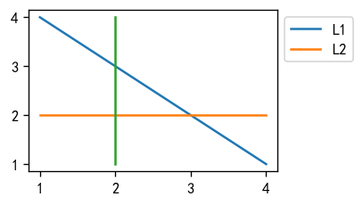
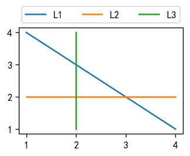
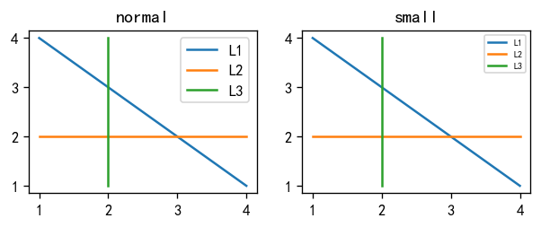

# matplotlib图例的调整

https://matplotlib.org/stable/api/_as_gen/matplotlib.axes.Axes.legend.html#matplotlib.axes.Axes.legend

## 基本使用

### 最简单的使用方法

直接使用`ax.legend()`绘制

需要在`ax.plot()`中定义`label`参数来指定图例说明文字

```python
import matplotlib.pyplot as plt

fig, ax = plt.subplots(figsize=(3, 2), dpi=120)
ax.plot([1, 4], [4, 1], label='L1')
ax.plot([1, 4], [2, 2], label='L2')
ax.plot([2, 2], [1, 4], label='L3')

ax.legend()
plt.show()
```



### 不想绘制某些线条

如果不传入`label`参数，就不会绘制对应的图例

```python
import matplotlib.pyplot as plt

fig, ax = plt.subplots(figsize=(3, 2), dpi=120)
line1, = ax.plot([1, 4], [4, 1], label='L1')
line2, = ax.plot([1, 4], [2, 2], label='L2')
line3, = ax.plot([2, 2], [1, 4])

ax.legend()
plt.show()
```



### 参数handles和labels

使用`ax.lenged(handles, labels)`传入`handles`和`labels`来定制图例

与上面方法的区别是：

- 需要手动传入通过获取`ax.plot()`返回的对象
- 需要手动定义`ax.legend()`的`labels`参数来设置图例的文字说明
- 不需要在`ax.plot()`中传入`label`参数
- 自定义化程度更高

```python
import matplotlib.pyplot as plt

fig, ax = plt.subplots(figsize=(3, 2), dpi=120)
line1, = ax.plot([1, 4], [4, 1])
line2, = ax.plot([1, 4], [2, 2])

ax.legend([line1, line2], ['L1', 'L2'])
plt.show()
```



> 有时候，如果要生成双y轴的图片，就会用到这种方法来生成图例。

## 图例位置调整

### 基本调整

通过参数`loc`可以手动调整图例的位置

```python
fig, axes = plt.subplots(figsize=(9, 6), dpi=120, nrows=3, ncols=3)
for i, v in enumerate(['upper', 'center', 'lower']):
    for j, h in enumerate(['left', 'center', 'right']):
        if v == 'center' and h == 'center':
            loc = 'center'
        else:
            loc = f'{v} {h}'
        ax = axes[i][j]
        ax.plot(1, 1, '^r', label=loc)
        ax.legend(loc=loc, handlelength=0.5, handletextpad=.2, 
                  borderaxespad=.2, prop=dict(family='consolas', size=12), 
                  framealpha=1)
        
        ax.set_xticks([])
        ax.set_yticks([])
```



loc的具体参数如下

```
===============   =============
Location String   Location Code
===============   =============
'best'            0
'upper right'     1
'upper left'      2
'lower left'      3
'lower right'     4
'right'           5
'center left'     6
'center right'    7
'lower center'    8
'upper center'    9
'center'          10
===============   =============
```

### 图例放到图像外面

```python
import matplotlib.pyplot as plt

fig, ax = plt.subplots(figsize=(3, 2), dpi=120)
line1, = ax.plot([1, 4], [4, 1], label='L1')
line2, = ax.plot([1, 4], [2, 2], label='L2')
line3, = ax.plot([2, 2], [1, 4])

ax.legend(loc="upper left", bbox_to_anchor=(1, 1))
plt.show()
```



`bbox_to_anchor`这个参数相当于给图例一个锚点。

`(1, 1)`就表示这个锚点在图片的右上角。两个参数的取值范围都是从0到1，第一个元素表示x轴的位置，数字越大越靠右。第二个元素表示y轴位置，数字越大越靠上。

### 图例变成多列

通过调整`ncol`参数

```python
import matplotlib.pyplot as plt

fig, ax = plt.subplots(figsize=(3, 2), dpi=120)
line1, = ax.plot([1, 4], [4, 1], label='L1')
line2, = ax.plot([1, 4], [2, 2], label='L2')
line3, = ax.plot([2, 2], [1, 4], label='L3')

ax.legend(loc="lower center", ncol=3, bbox_to_anchor=(0.5, 1))
plt.show()
```



### 缩小图例

最简单的方法就是减小图例的字体大小(`fontsize`)

```python
import matplotlib.pyplot as plt

fig, axes = plt.subplots(figsize=(6, 2), dpi=120, ncols=2)
ax = axes[0]
ax.set_title('normal')
ax.plot([1, 4], [4, 1], label='L1')
ax.plot([1, 4], [2, 2], label='L2')
ax.plot([2, 2], [1, 4], label='L3')
ax.legend()

ax = axes[1]
ax.set_title('small')
ax.plot([1, 4], [4, 1], label='L1')
ax.plot([1, 4], [2, 2], label='L2')
ax.plot([2, 2], [1, 4], label='L3')
ax.legend(fontsize=6)
```



其次是减小图例的各种边距：

- :star:**borderpad**：默认0.4，图例边框的内边距
- :star:**labelspacing**：默认0.5，图例之间的间隔
- :star:**handlelength**：默认2，图例元素的长度
- **handleheight**：默认0.7，图例元素的高度
- **handletextpad**：默认0.8，图例元素与图例文字的间隔
- **borderaxespad**：默认0.5，图例边框外边距
- **columnspacing**：默认2，图例列之间的间隔

一般调小上面星星标出来的参数即可

```python
import matplotlib.pyplot as plt

fig, axes = plt.subplots(figsize=(6, 2), dpi=120, ncols=2)
ax = axes[0]
ax.set_title('normal')
ax.plot([1, 4], [4, 1], label='L1')
ax.plot([1, 4], [2, 2], label='L2')
ax.plot([2, 2], [1, 4], label='L3')
ax.legend()

ax = axes[1]
ax.set_title('small')
ax.plot([1, 4], [4, 1], label='L1')
ax.plot([1, 4], [2, 2], label='L2')
ax.plot([2, 2], [1, 4], label='L3')
ax.legend(borderpad=0.1, labelspacing=0.1, handlelength=0.5)
```


## 图例设置字体

可以通过传入`prop`参数来设置字体，`prop`是一个关于字体设置的字典

该字典	具体的设置项可以参考：https://www.freedesktop.org/software/fontconfig/fontconfig-user.html

常用的如下：

```
Property        Type    Description
--------------------------------------------------------------
family          String  字体
size			Int     字体大小
style           String  字体风格  normal, italic, oblique
weight          Int     字体粗细  Light, medium, demibold, bold or black
```


```python
import matplotlib.pyplot as plt

fig, ax = plt.subplots(figsize=(3, 2), dpi=120)
ax.plot([1, 4], [4, 1], label='Line1')
ax.plot([1, 4], [2, 2], label='Line2')
ax.plot([2, 2], [1, 4], label='Line3')

ax.legend(prop=dict(family='Times New Roman', style='italic', weight="bold"))
```


