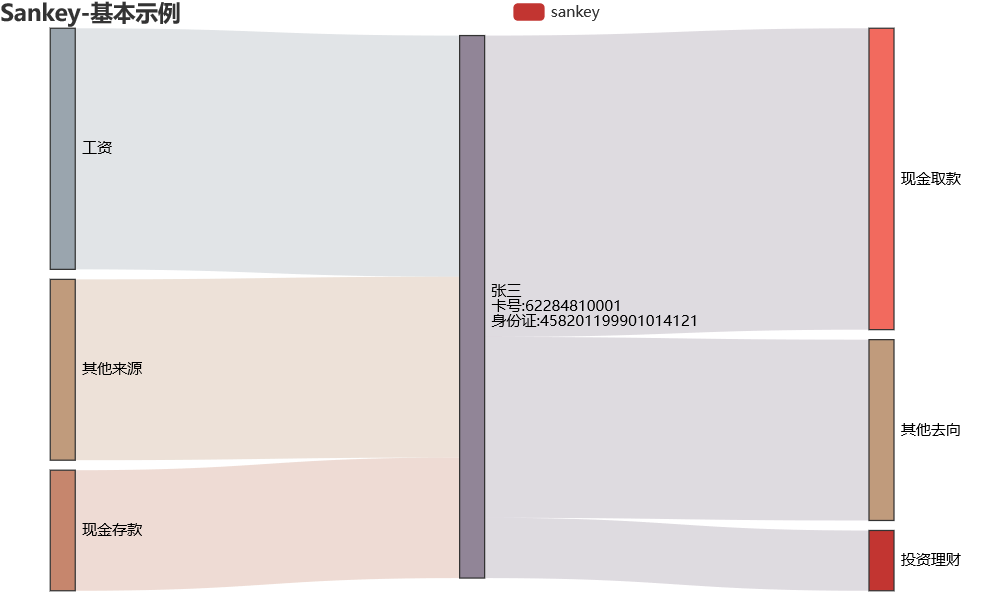

```python
from pyecharts import options as opts
from pyecharts.charts import Sankey

name = '张三\n卡号:62284810001\n身份证:458201199901014121'
nodes = [
    # 资金流入
    {"name": "收款卡"},
    {"name": "玩家"},
    {"name": "其他来源"},
    
    # 本卡
    {"name": name},
    # 资金流向
    {"name": "投资理财"},
    {"name": "现金交易"},
    {"name": "其他去向"},
]

links = [
    # 流入
    {"source": "收款卡", "target": name, "value": 10},
    {"source": "玩家", "target": name, "value": 20},
    {"source": "其他来源", "target": name, "value": 15},
    # 流出
    {"source": name, "target": "投资理财", "value": 5},
    {"source": name, "target": "现金交易", "value": 25},
    {"source": name, "target": "其他去向", "value": 15},
]

c = (
    Sankey()
    .add(
        "sankey",
        nodes,
        links,
        linestyle_opt=opts.LineStyleOpts(opacity=0.3, curve=0.5, color="source"),
        label_opts=opts.LabelOpts(position="right"),
    )
    .set_global_opts(title_opts=opts.TitleOpts(title="Sankey-基本示例"))
    .render("sankey_base.html")
)
```

