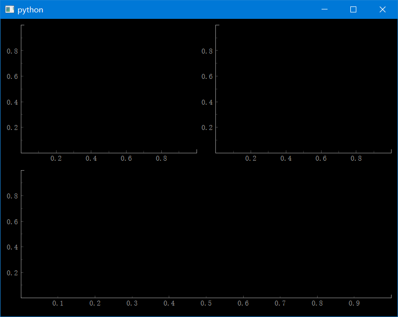
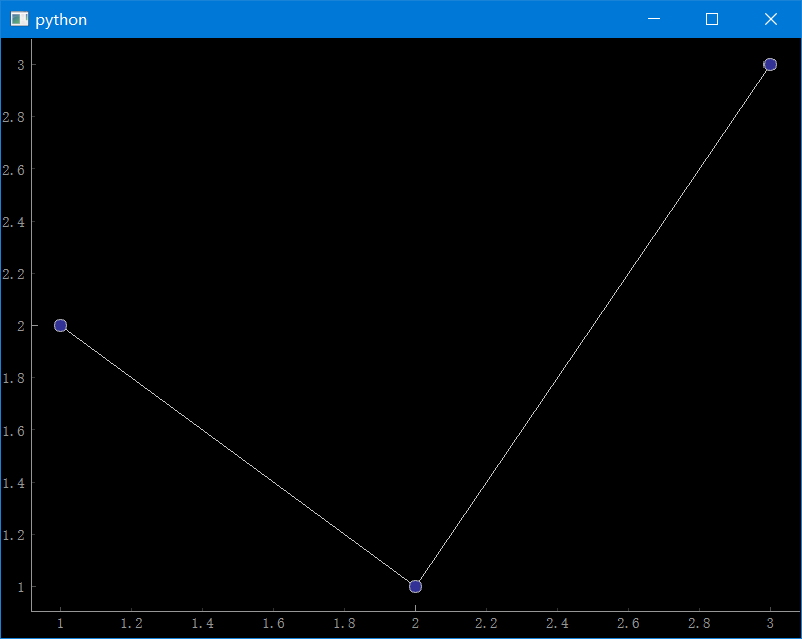

# pyqtgraph类的架构

核心知识点：

- QtGUI由QWidget组成
- 一个名为QGraphicsView的特殊小部件用于显示复杂的图形
- QGraphicsItems定义QGraphics视图中显示的对象。

[


pyqtgraph类的架构可以参考[Plotting in pyqtgraph](https://pyqtgraph.readthedocs.io/en/latest/getting_started/plotting.html)

简单的说，在绘图时主要关注 **GraphicsLayoutWidget** 和 **PlotWidget** ，它们都属于 QWidget 的子类。可以把它们当成PyQt里的一个小部件，可以嵌入到PyQt内。

主要区别在于：

- **GraphicsLayoutWidget** 用于绘制多子图的情况，它包含多个 **PlotItem**。
- **PlotWidget** 用于绘制单图的情况，它只包含一个 **PlotItem**。
- **PlotItem**，可以理解为一张图，它包含坐标轴、标题、**ViewBox** 等内容。

### 多子图示例

基本参数

```python
addPlot(item, row=None, col=None, rowspan=1, colspan=1)
```

绘图

```python
import pyqtgraph as pg

w = pg.GraphicsLayoutWidget()
p1 = w.addPlot(row=0, col=0)
p2 = w.addPlot(row=0, col=1)
p3 = w.addPlot(row=1, col=0, colspan=2)
w.show()

if __name__ == "__main__":
    pg.exec()
```



目前，想调整子图横向的绘图比例并没有一个官方提供的合适的方法。以下是一个方案

```python
w = pg.GraphicsLayoutWidget()

# 添加几个空Label填充空间
w.addLabel("", 0, 0)
w.addLabel("", 0, 1)
w.addLabel("", 0, 2)
p1 = w.addPlot(row=1, col=0, colspan=2)
p2 = w.addPlot(row=1, col=2)
p3 = w.addPlot(row=2, col=0, colspan=3)
w.show()
```

### 单图示例

```python
import pyqtgraph as pg
app = pg.mkQApp()
w = pg.PlotWidget()
line = w.plot([1, 2, 3], [2, 1, 3], symbol="o")
w.show()

if __name__ == "__main__":
    pg.exec()
```



### 直接使用pg.plot()

这会直接创建一个`PlotWidget`

```python
import pyqtgraph as pg
 
pw = pg.plot([1, 2, 3], [2, 1, 3], symbol="o")
if __name__ == "__main__":
    pg.exec()
```


### 封装为类

同样也是个人习惯

多子图

```python
import pyqtgraph as pg

class MyGraphLayoutWidget(pg.GraphicsLayoutWidget):
    def __init__(self):
        super().__init__()
        p1 = self.addPlot(row=0, col=0)
        p2 = self.addPlot(row=0, col=1)
        p3 = self.addPlot(row=1, col=0, colspan=2)
        self.show()

if __name__ == "__main__":
    app = pg.mkQApp("example")
    win = MyGraphLayoutWidget()
    pg.exec()
```

单子图

```python
import pyqtgraph as pg

class MyPlotWidget(pg.PlotWidget):
    def __init__(self):
        super().__init__()
        curve = self.plot([1, 2, 3], [2, 1, 3], symbol="o")
        self.show()

if __name__ == "__main__":
    app = pg.mkQApp("example")
    pw = MyPlotWidget()
    pg.exec()
```


### 变量名的约定

这是我的个人总结

```python
win = pg.GraphicsLayoutWidget()  # GraphicsLayoutWidget
p1 = win.addPlot()  # PlotItem
curve = p1.plot()  # PlotDataItem

pw = pg.PlotWidget()  # PlotWidget
curve = pw.plot()  # PlotDataItem

vb = p.getViewBox()  # ViewBox

lr = pg.LinearRegionItem()  # LinearRegionItem
line = pg.InfiniteLine(angle=90, movable=True)  # InfiniteLine
```


### 绘图的基本方法

| 方法                                                         | 说明                           | 返回                                                         |
| ------------------------------------------------------------ | ------------------------------ | ------------------------------------------------------------ |
| [`pyqtgraph.plot()`](https://pyqtgraph.readthedocs.io/en/latest/api_reference/functions.html#pyqtgraph.plot) | 创建一个显示数据的新绘图窗口   | [`PlotWidget`](https://pyqtgraph.readthedocs.io/en/latest/api_reference/widgets/plotwidget.html#pyqtgraph.PlotWidget) |
| [`PlotItem.plot()`](https://pyqtgraph.readthedocs.io/en/latest/api_reference/graphicsItems/plotitem.html#pyqtgraph.PlotItem.plot) | 将一组新数据添加到现有绘图组件 | PlotDataItem                                                 |
| PlotWidget.plot()                                            | 调用 `PlotItem.plot`           | PlotDataItem                                                 |
| [`GraphicsLayout.addPlot()`](https://pyqtgraph.readthedocs.io/en/latest/api_reference/graphicsItems/graphicslayout.html#pyqtgraph.GraphicsLayout.addPlot) | 将新绘图添加到绘图网格         | PlotItem                                                     |

以上方法参数相同，用于调整绘图显示效果。

- **x**: 可选的X轴数据。如果未指定，将自动生成一系列整数。
- **y**: Y轴数据。
- **pen**: 用于绘制绘图线的画笔，或None以禁用线条。
- **symbol**: 用于每个点的符号形状的字符串。
- **symbolPen**: 用于绘制符号轮廓的画笔。
- **symbolBrush**: 用于填充符号的画刷。
- **fillLevel**: 填充绘图曲线下方到这个Y值的区域。
- **brush**: 用于填充曲线下方的画刷。


PyQtGraph主要基于Qt的GraphicsView框架。


**QGraphicsItem 的子类**（包含其他 QGraphicsItem 对象，必须从 GraphicsView 中查看）

- [`PlotItem`](https://pyqtgraph.readthedocs.io/en/latest/api_reference/graphicsItems/plotitem.html#pyqtgraph.PlotItem) 包含一个用于显示数据的ViewBox以及用于显示轴和标题的 AxisItems和标签。这是一个QGraphicsItem子类，因此只能在GraphicsView中使用。
- [`GraphicsLayout`](https://pyqtgraph.readthedocs.io/en/latest/api_reference/graphicsItems/graphicslayout.html#pyqtgraph.GraphicsLayout) QGraphicsItem 子类，显示项目网格。用于同时显示多个PlotItems 。
- [`ViewBox`](https://pyqtgraph.readthedocs.io/en/latest/api_reference/graphicsItems/viewbox.html#pyqtgraph.ViewBox) ：用于显示数据的 QGraphicsItem 子类。用户可以使用鼠标缩放/平移 ViewBox 的内容。通常，所有 PlotData/PlotCurve/ScatterPlotItems 都从 ViewBox 中显示。
- [`AxisItem`](https://pyqtgraph.readthedocs.io/en/latest/api_reference/graphicsItems/axisitem.html#pyqtgraph.AxisItem)：显示轴值、刻度和标签。最常与 PlotItem 一起使用。

**QWidget的子类**（可以嵌入在PyQt GUI中）

- [`PlotWidget`](https://pyqtgraph.readthedocs.io/en/latest/api_reference/widgets/plotwidget.html#pyqtgraph.PlotWidget) ：GraphicsView 的子类，显示单个PlotItem。PlotItem 提供的大多数方法 PlotWidget 都可以用。
- [`GraphicsLayoutWidget`](https://pyqtgraph.readthedocs.io/en/latest/api_reference/widgets/graphicslayoutwidget.html#pyqtgraph.GraphicsLayoutWidget) ：QWidget子类显示单个[`GraphicsLayout`](https://pyqtgraph.readthedocs.io/en/latest/api_reference/graphicsItems/graphicslayout.html#pyqtgraph.GraphicsLayout)。 `GraphicsLayout` 提供的大多数方法GraphicsLayoutWidget也可以用。

具体类之间的关系可以参考：[UML class diagram — pyqtgraph 0.13.4.dev0 documentation](https://pyqtgraph.readthedocs.io/en/latest/api_reference/uml_overview.html#uml-diagram)

`PlotWidget`与`PlotItem`的联系

**包含关系**: 一个`PlotWidget`实际上包含一个`PlotItem`。这意味着每个`PlotWidget`都有一个与之关联的`PlotItem`。

**方法传递**: `PlotWidget`的大多数方法实际上是直接传递给其内部的`PlotItem`的。

**示例**

如果只需要一个简单的绘图：

```python
import pyqtgraph as pg

w = pg.PlotWidget()
w.plot([1, 2, 3], [1, 2, 3])
```

如果需要更复杂的布局：

```python
import pyqtgraph as pg

layout = pg.GraphicsLayout()
plot1 = layout.addPlot()
plot1.plot([1, 2, 3], [1, 2, 3])
```

### ViewBox

> 在 pyqtgraph 中，`ViewBox` 是一个非常关键的组件，它是一个特殊的 `QGraphicsItem` 子类，用于显示和管理绘图区域内的数据。简而言之，`ViewBox` 是实际绘图内容（如曲线、散点等）的容器。

获取ViewBox的方式

```python
viewBox = plot_item.getViewBox()
```


### pg.plot与 pg.PlotWidget的区别

在 pyqtgraph 中，`pg.plot()` 和 `pg.PlotWidget()` 都用于创建绘图，但它们的用途和上下文略有不同。

**pg.plot()**

1. **简便性**: `pg.plot()` 是一个快捷函数，用于快速创建一个新的绘图窗口，并立即显示数据。
2. **返回值**: 它返回一个 `PlotWidget` 对象。
3. **用途**: 通常用于快速可视化数据，而不需要进一步自定义或嵌入到更复杂的应用程序中。

```python
w = pg.plot([1, 2, 3], [1, 2, 3])
```

**pg.PlotWidget()**

1. **灵活性**: `pg.PlotWidget()` 创建一个新的 `PlotWidget` 对象，但不会立即显示它。这使你可以更灵活地自定义绘图或将其嵌入到更复杂的 Qt 应用程序中。
2. **返回值**: 它也返回一个 `PlotWidget` 对象。
3. **用途**: 通常用于更复杂的应用程序，其中你可能需要更多的控制权或需要将绘图嵌入到其他 Qt 组件中。

```python
w = pg.PlotWidget()
w.plot([1, 2, 3], [1, 2, 3])
```

**区别**

1. **自动显示**: `pg.plot()` 会立即创建并显示一个新的绘图窗口，而 `pg.PlotWidget()` 只是创建一个 `PlotWidget` 对象。
2. **用途**: `pg.plot()` 更适用于快速可视化，而 `pg.PlotWidget()` 更适用于需要更多自定义或嵌入到复杂应用程序中的场景。

**结论**

从功能上看，两者都返回一个 `PlotWidget` 对象，并允许你进行绘图。主要的区别在于它们的用途和上下文：`pg.plot()` 是用于快速可视化的，而 `pg.PlotWidget()` 提供了更多的灵活性。


> 💡 GraphicsLayout与GraphicsLayoutWidget的区别
>
> - `GraphicsLayoutWidget` 包含了 `GraphicsLayout``
> - ``GraphicsLayoutWidget` 是一个 `QWidget`。
> - `GraphicsLayoutWidget` 更适用于常规的 Qt 应用程序。

